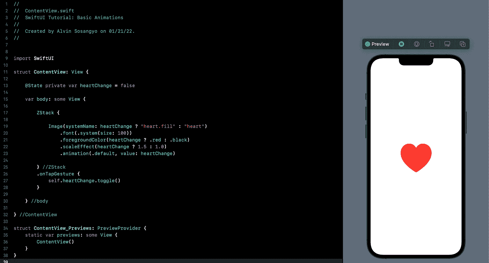
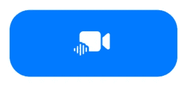

# SwiftUI 教程:基本动画

> 原文：<https://betterprogramming.pub/swiftui-tutorial-basic-animations-edb78c97eb01>

## 理解隐式和显式动画



图一。

SwiftUI 通过自动制作任何将要发生的过渡动画来处理制作效果的所有复杂性。编写复杂代码来制作简单的动画过渡的日子已经过去了。框架自带足够的内置效果，可以执行不同的动画。

在本教程中，我们将通过理解如何使用隐式和显式来涵盖 SwiftUI 动画的基础。但是在做任何事情之前，请确保您有一个用于本教程的打开项目。

# 隐式动画

使用名为`animation()` *的修改器。*通过将修改器附加到所需的视图，SwiftUI 将根据指定的动画类型自动渲染动画。

让我们创建一个在社交媒体上广泛使用的心型动画。这里发生的情况是，当点击心脏时，心脏会变红，并且变大。首先从系统图像创建一个心脏。

```
struct ContentView: View {

    @State private var heartChange = false

    var body: some View {

        ZStack {

            Image(systemName: heartChange ? "heart.fill" : "heart")
                .font(.system(size: 100))
                .foregroundColor(heartChange ? .red : .black)
                .scaleEffect(heartChange ? 1.5 : 1.0)

        } //ZStack
        .onTapGesture {
            self.heartChange.toggle()
        }

    } //body

} //ContentView
```

这段代码中有两个部分需要讨论。首先是状态变量，它应该从 false 变为 true，反之亦然。然后`.onTapGesture`(这就是为什么我们有 ZStack)将负责使用`toggle()`改变状态。

如果您运行该应用程序，点击心脏将改变对象的颜色和大小。但是对象到另一种形式的转换是没有动画的。因为有一件重要的事情我们还没有包含在这段代码中。这就是处理效果的动画修改器。在`scaleEffect`下面添加这个修饰符:

```
.animation(.default, value: heartChange)
```

再次运行应用程序，反复点击心脏。你会注意到过渡现在有效果了，这意味着动画开始工作了。

我在 [GitHub](https://github.com/athurion/SwiftUI-Tutorial-Basic-Animations/blob/main/ContentViewImplicitAnimation.swift) 上传了完整的源代码。

# 明确的动画

工作方式不同，使用`withAnimation()`函数代替修改器。它的作用是根据状态变化控制动画。

让我们为之前的例子创建一个明确的动画版本。像这样修改现有代码:

```
struct ContentView: View {

    @State private var heartChange = false

    var body: some View {

        ZStack {

            Image(systemName: heartChange ? "heart.fill" : "heart")
                .font(.system(size: 100))
                .foregroundColor(heartChange ? .red : .black)
                .scaleEffect(heartChange ? 1.5 : 1.0)

        } //ZStack
        .onTapGesture {
            withAnimation(.default) {
                self.heartChange.toggle()
            }
        }

    } //body

} //ContentView
```

`withAnimation()`是在`.onTapGesture` *内部触发的功能。*运行应用程序将提供完全相同的结果。

# 改变速度

虽然 SwiftUI 中的动画渲染是自动的，但这并不意味着您不能定义动画的持续时间和延迟。在我们的隐式和显式示例中，我们只使用这样设置的`.default`:慢速开始(`easeIn`)、加速、慢速结束(`easeOut`)。

我们可以用下面的修饰符来指定持续时间。更换即可。默认为以下之一:

```
.easeIn(duration: //seconds) //Setup the duration of start slow
.easeOut(duration: //seconds) //Setup the duration of ends slow
.easeInOut(duration: //seconds) //Setup the duration of both 
```

例如，我们想将`easeInOut`调整为 1 秒(默认为 0.35 秒左右)。

```
struct ContentView: View {

    @State private var heartChange = false

    var body: some View {

        ZStack {

            Image(systemName: heartChange ? "heart.fill" : "heart")
                .font(.system(size: 100))
                .foregroundColor(heartChange ? .red : .black)
                .scaleEffect(heartChange ? 1.5 : 1.0)
                .animation(.easeInOut(duration: 1), value: heartChange)

        } //ZStack
        .onTapGesture {
            self.heartChange.toggle()
        }

    } //body

} //ContentView
```

理解这个例子也可以应用于显式动画是很重要的。当您运行应用程序时，您会注意到动画花费了更长的时间。

# 常用效果

为了方便起见，我将在显式动画中执行所有示例。明确地说，这也适用于隐式动画。

让我们从快速放大然后反弹的动画开始。它叫做`spring`。

```
withAnimation(.spring(response: 0.2, dampingFraction: 0.2, blendDuration: 0.2)) {
    self.heartChange.toggle()
}
```

*   `response` —弹簧刚度的持续时间。
*   `dampingFraction` —拖动量。
*   `blendDuration` —以秒为单位的变化持续时间。

还有另一个版本叫做`interpolatingSpring`。这个有更明显的弹跳效果。

```
withAnimation(.interpolatingSpring(mass: 1, stiffness: 40, damping: 1, initialVelocity: 1)) {
    self.heartChange.toggle()
}
```

*   `mass` —字面意思是附在弹簧上的质量。
*   `stiffness` —字面意思是刚度。
*   `damping` —它将如何克服阻力。
*   `initialVelocity` —动画开始时的起始速度。

`linear`动画的工作原理类似于`.default`。但是你可以调整动画的持续时间。

```
withAnimation(.linear(duration: 1)) {
    self.heartChange.toggle()
}
```

通过添加`repeatCount` 修改器并指定动画将重复的次数，可以使动画重复多次。

```
withAnimation(.linear(duration: 1).repeatCount(5)) {
    self.heartChange.toggle()
}}
```

或者您可以使用`repeatForever`让它无限循环:

```
withAnimation(.linear(duration: 1).repeatForever()) {
    self.heartChange.toggle()
}}
```

# 转换用户界面

我不想在没有做出能为你下一个 app 所用的东西的情况下结束这个教程。

我们将创建一个按钮和背景，它将从以下内容进行转换:



图二。默认按钮设计

变成这样:


图 3。按压后的按钮设计

当再次按下时，反之亦然。不仅如此。但是按钮按下后也会有闪烁的背景。事不宜迟，我们开始吧。

我们需要两个变量。第一个处理按钮的状态，第二个处理闪烁的背景状态。将这些变量写入`ContentView`:

```
@State private var isRecording = false
@State private var darkBackground = false
```

在主体内部，我们将创建一个嵌入 ZStack 的按钮。将这段代码写在 body 变量中。

```
ZStack {

    Color(darkBackground ? UIColor.black : UIColor.white)
        .ignoresSafeArea(.all)

    Button(action: {

    }) {
        Image(systemName: "video.and.waveform.fill")
            .frame(
                width: isRecording ? 100 : 300,
                height: 100
            )
            .padding()
            .font(.system(size: 50))
            .foregroundColor(.white)
            .background(isRecording ? .red : .blue)
            .cornerRadius(isRecording ? .infinity : 40)
    } //Button

} //ZStack
```

以下是按下按钮时会改变的修饰符:

*   `ZStack`颜色——默认为白色，将变为黑色。`darkBackground`将会处理好这个状态。
*   `frame`宽度——默认情况下按钮很长，按下后会变小。
*   `background` —按钮的背景色为蓝色，按下后变为红色。
*   `cornerRadius` —默认为 40，按下会变成圆形。我使用了`.infinity` 来制作按钮圆形，不管框架大小如何。

除了`ZStack`颜色，其余修改器都是用`isRecording`状态处理的。

是时候附上动画了。在按钮操作下编写以下代码:

```
withAnimation(.spring()) {
    self.isRecording.toggle()
}
withAnimation(.linear.repeatCount(6)) {
    self.darkBackground.toggle()
}
```

注意，这里有两个独立的`withAnimation`。这是因为我们需要执行两种不同的动画:变换按钮(`isRecording`)和闪烁背景(`darkBackground`)。这就是我们为此创建两个独立变量的原因。

运行应用程序并尝试按下按钮。现在，每次按下按钮时，按钮都会变形，同时背景会闪烁几秒钟。对自己出色完成的工作给予鼓励。

该实践的源代码可在 [GitHub](https://github.com/athurion/SwiftUI-Tutorial-Basic-Animations/blob/main/ContentViewTransformingUI.swift) 中获得。

愿法典与你同在。