# SwiftUI 教程:使用堆栈— VStack、HStack 和 ZStack

> 原文：<https://betterprogramming.pub/swiftui-tutorial-working-with-stacks-vstack-hstack-and-zstack-2b0070be18d7>

## 一个好的用户界面需要有组织的视图布局

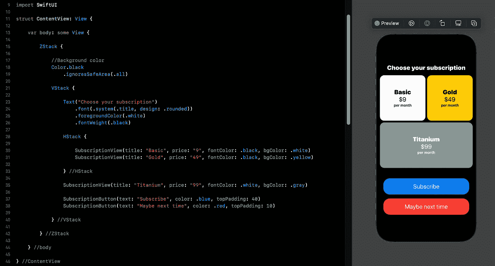

图一。

在 SwiftUI 中使用堆栈可以让您轻松布局应用程序，构建复杂的用户界面。这类似于 UIKit 中的堆栈视图，但没有构建适合所有屏幕大小的应用程序的自动布局的复杂性。SwiftUI 通过简化堆栈上的一切，消除了 UIKit 复杂的自动布局。

您可以使用和组合 3 种不同类型的 SwiftUI 堆栈。根据您希望如何设计应用程序的用户界面，以下是选项:

*   `ZStack`
*   `HStack`
*   `VStack`

在本教程中，您将了解不同堆栈的工作原理。我们还将创建一个复杂的用户界面，如图 1 所示。

在我们继续下一步之前，创建一个新项目或打开一个用于练习的现有项目。如果你需要一步一步的过程来做这件事，请遵循这个[指南](https://blog.devgenius.io/introduction-to-swiftui-creating-new-project-9adc502e1804)。

# ZStack

`ZStack`将视图组织在彼此之上。这对于创建重叠内容非常有用，例如将文本放在图像的顶部，如下所示:

```
import SwiftUI

struct ContentView: View {

    var body: some View {

        ZStack {

            Image(systemName: "globe.europe.africa")
                .font(.system(size: 300))

            Text("Africa")
                .font(.system(size: 25))

        }

    }

}
```

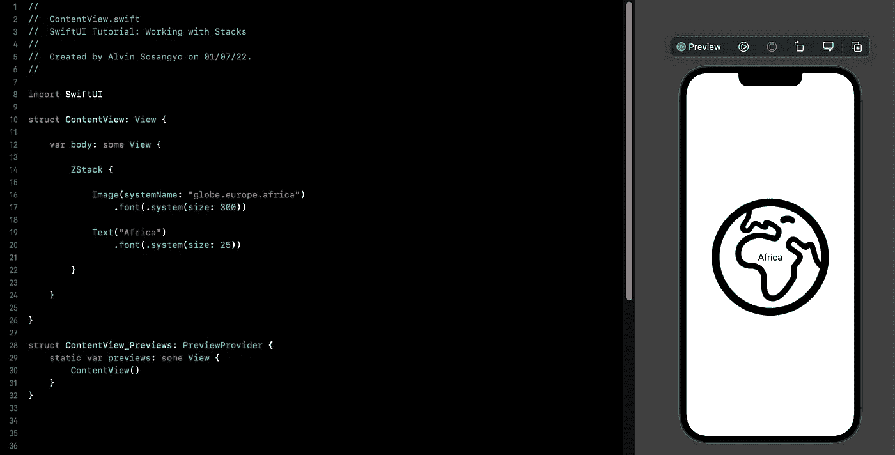

图二。使用 ZStack 进行布局

# HStack

这用于水平组织视图。这里有一个简单的例子来说明它是如何工作的:

```
import SwiftUI

struct ContentView: View {

    var body: some View {

        HStack {

            Button(action: {
                print("Left button is pressed")
            }) {
                Text("Left Button")
                    .padding()
                    .font(.body)
                    .foregroundColor(.white)
                    .background(Color.blue)
            }

            Button(action: {
                print("Right button is pressed")
            }) {
                Text("Right Button")
                    .padding()
                    .font(.body)
                    .foregroundColor(.white)
                    .background(Color.blue)
            }

        }

    }

}
```

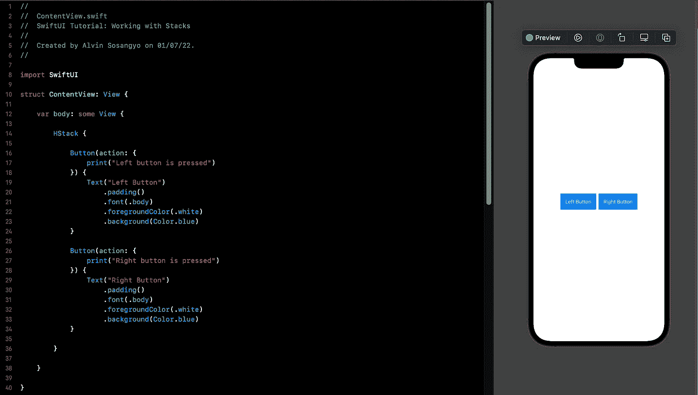

图 3。使用 HStack 进行布局

# VStack

`VStack`垂直组织视图。这里有一个简单的例子来说明它是如何工作的:

```
import SwiftUI

struct ContentView: View {

    var body: some View {

        VStack {

            Text("Press the button below")
                .font(.system(size: 25))

            Button(action: {
                print("Button is pressed")
            }) {
                Text("Press me")
                    .padding()
                    .font(.body)
                    .foregroundColor(.white)
                    .background(Color.blue)
            }

        }

    }

}
```

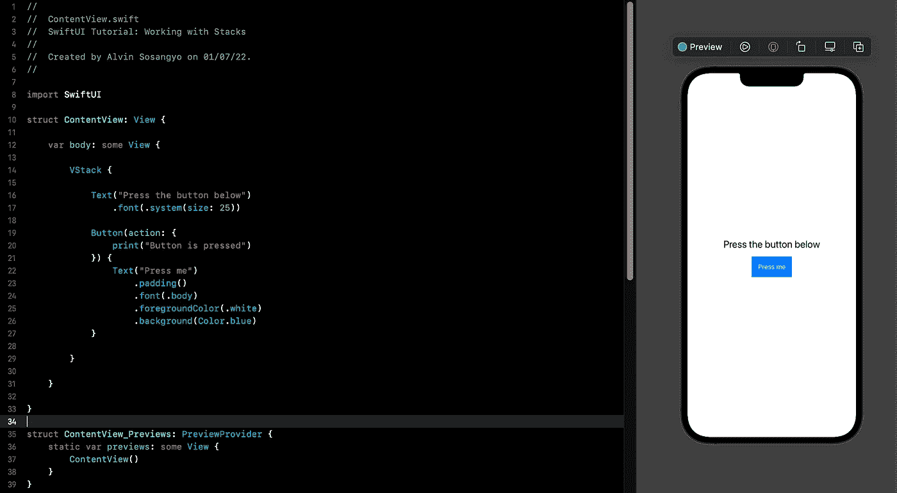

图 4。使用 VStack 进行布局

# 间隔

如果你需要更多的呼吸空间，你可以调整视图之间的空间。以下示例显示了如何操作:

```
VStack(spacing: 50) {

    Text("Press the button below")
        .font(.system(size: 25))

    Button(action: {
        print("Button is pressed")
    }) {
        Text("Press me")
            .padding()
            .font(.body)
            .foregroundColor(.white)
            .background(Color.blue)
    }

}
```

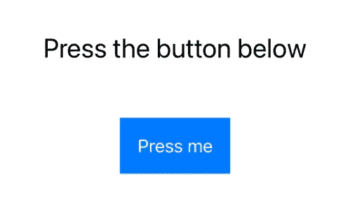

图 5。在视图之间增加更多空间

**注意:**上述语法也适用于`ZStack`和`HStack`。

# 对齐

如果您不希望堆栈像这样位于中心，您可以控制堆栈的对齐方式:

```
import SwiftUI

struct ContentView: View {

    var body: some View {

        VStack(alignment: .leading) {

            Text("Press the button below")
                .font(.system(size: 25))

            Button(action: {
                print("Button is pressed")
            }) {
                Text("Press me")
                    .padding()
                    .font(.body)
                    .foregroundColor(.white)
                    .background(Color.blue)
            }

        }

    }

}
```

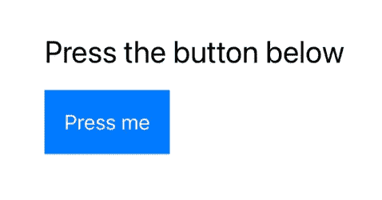

图 6。更改视图的对齐方式

是的，你可以把所有的修饰符放在一个参数中，就像这样:

```
HStack(alignment: .top, spacing: 50)
```

# 嵌套堆栈

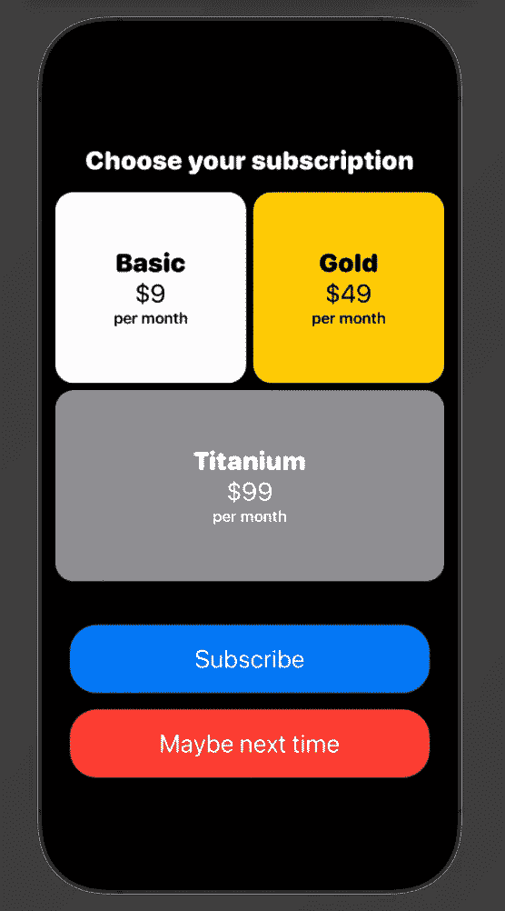

图 7。

在教程的这一部分，我们将创建一个类似上面所示的用户界面(图 7)。

**注意:**为了更好的可读性，我在这个例子中插入了注释。我还使用了多个 SwiftUI `[Text](https://blog.devgenius.io/swiftui-tutorial-working-with-text-15de81494a07)`和`[Button](https://blog.devgenius.io/swiftui-tutorial-working-with-buttons-ee3fdcfb8337)`修饰符。

在不使你的大脑不堪重负的情况下，最好的方法是将用户界面分解成小的部分。

从设置应用程序的背景颜色开始，我们将初始堆栈设置为`ZStack`，并将其颜色转换为黑色。

```
struct ContentView: View {

    var body: some View {

        ZStack {

            //Background color
            Color.black
                .ignoresSafeArea(.all)

        } //ZStack

    } //body

} //ContentView
```

分析 UI，注意视图通常是垂直组织的。所以让我们在背景色之后的`ZStack`里面创建一个`VStack`。

```
ZStack {

    //Background color
    Color.black
        .ignoresSafeArea(.all)

    VStack {

    } //VStack

} //ZStack
```

现在我们可以从顶部开始添加内容。最上面的是“选择你的订阅”标签。

```
ZStack {

    //Background color
    Color.black
        .ignoresSafeArea(.all)

    VStack {
        Text("Choose your subscription")
            .font(.system(.title, design: .rounded))
            .foregroundColor(.white)
            .fontWeight(.black)

    } //VStack

} //ZStack
```

应用程序在画布上应该是这样的。

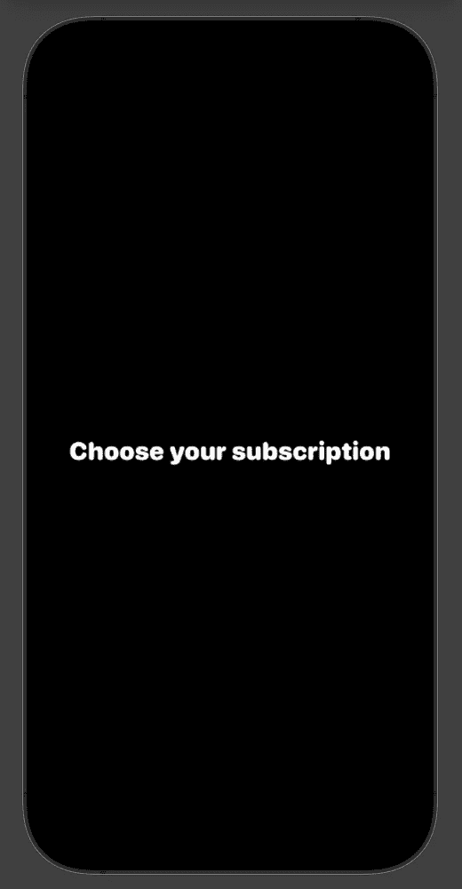

图 8。

在“Choose your subscription”标签下是两个并排排列的视图，如下面的图 9 所示。这可以通过在一个`VStack`中嵌套一个`HStack`来实现。


图 9。

```
ZStack {

    //Background color
    Color.black
        .ignoresSafeArea(.all)

    VStack {
        Text("Choose your subscription")
            .font(.system(.title, design: .rounded))
            .foregroundColor(.white)
            .fontWeight(.black)

        HStack {

        } //HStack
    } //VStack

} //ZStack
```

现在将下面的代码放在`HStack`中:

```
VStack {
    Text("Basic")
        .font(.system(.title, design: .rounded))
        .foregroundColor(.black)
        .fontWeight(.black)
    Text("$9")
        .font(.system(.title, design: .rounded))
        .foregroundColor(.black)
    Text("per month")
        .font(.headline)
        .foregroundColor(.black)
} //VStack
.frame(maxWidth: .infinity, minHeight: 150)
.padding(30)
.background(.white)
.cornerRadius(20)

VStack {
    Text("Gold")
        .font(.system(.title, design: .rounded))
        .foregroundColor(.black)
        .fontWeight(.black)
    Text("$49")
        .font(.system(.title, design: .rounded))
        .foregroundColor(.black)
    Text("per month")
        .font(.headline)
        .foregroundColor(.black)
} //VStack
.frame(maxWidth: .infinity, minHeight: 150)
.padding(30)
.background(.yellow)
.cornerRadius(20)
```

# 提取视图

尽管上面的代码有效，但这不是最佳实践，因为我们做了大量的代码重复。这使得整个程序效率低下。

为了消除代码重复，我们将把它们提取到一个单独的结构中。按住 command 键，然后点击`VStack`。将出现一个上下文菜单，显示所有可用选项。选择*提取子视图*。下面的图 10 显示了如何执行这个动作。

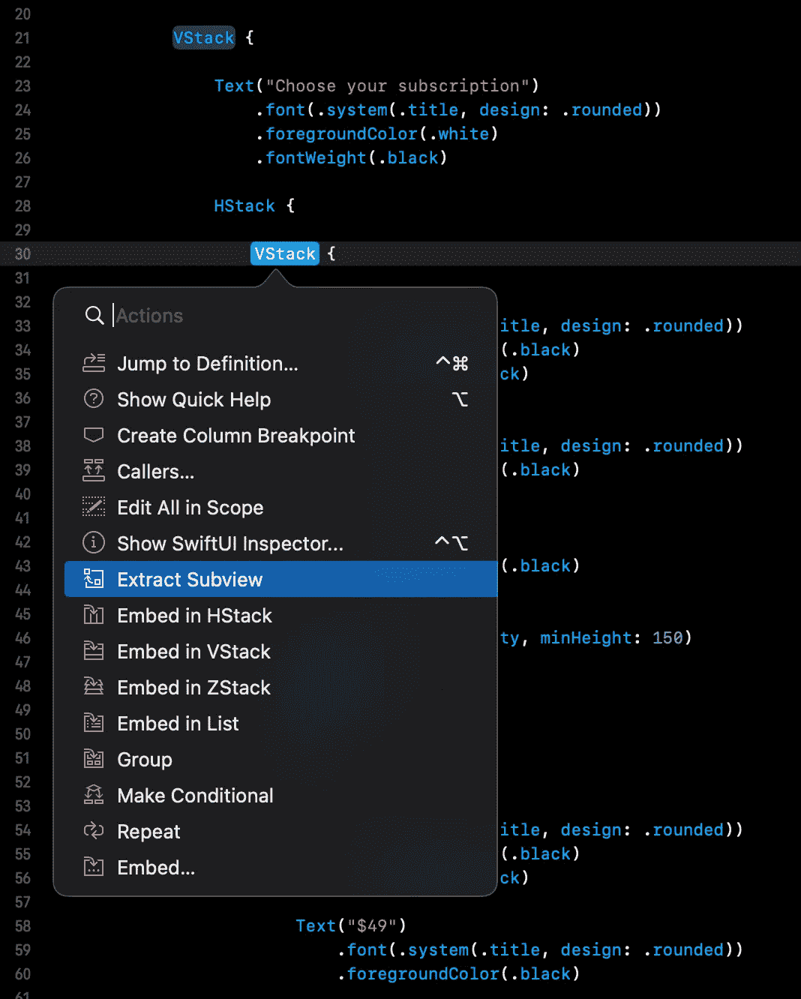

图 10。提取子视图

Xcode 将创建一个单独的结构，包含提取视图的代码。

名称`ExtractedView()` 过于笼统，当我们添加更多提取的结构时，可能会引起一些混乱。

所以我们把它改名为`SubscriptionView()`。另一件要做的重要事情是去掉另一个`Gold`的`VStack`标签。它应该是这样的:

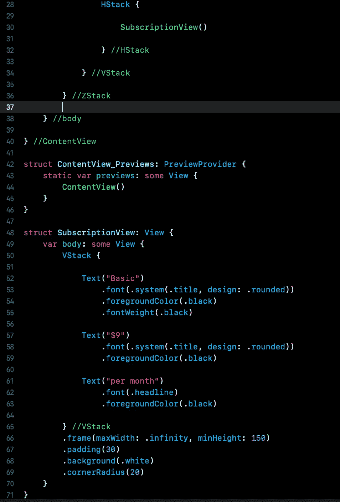

图 11。更改子视图的名称

我们需要做的下一件事是使`SubscriptionView()` 可定制，以便我们可以为其他订阅重用该对象。这就是我们需要在结构中使用变量的地方。

将`SubscriptionView()`结构下的代码更新为:

```
struct SubscriptionView: View {

    var title: String
    var price: String
    var fontColor: Color
    var bgColor: Color

    var body: some View {
        VStack {

            Text(title)
                .font(.system(.title, design: .rounded))
                .foregroundColor(fontColor)
                .fontWeight(.black)

            Text("$\(price)")
                .font(.system(.title, design: .rounded))
                .foregroundColor(fontColor)

            Text("per month")
                .font(.headline)
                .foregroundColor(fontColor)

        } //VStack
        .frame(maxWidth: .infinity, minHeight: 150)
        .padding(30)
        .background(bgColor)
        .cornerRadius(20)
    }

}
```

现在，会出现一个错误，因为您需要填写`ContentView()`下的一些参数。

这意味着该结构现在是可自定义的。所以，编辑成这样:

```
HStack {
    SubscriptionView(title: "Basic", price: "9", fontColor: .black, bgColor: .white)

    SubscriptionView(title: "Gold", price: "49", fontColor: .black, bgColor: .yellow)

} //HStack
```

你的`ContentView()`现在应该是这样的:

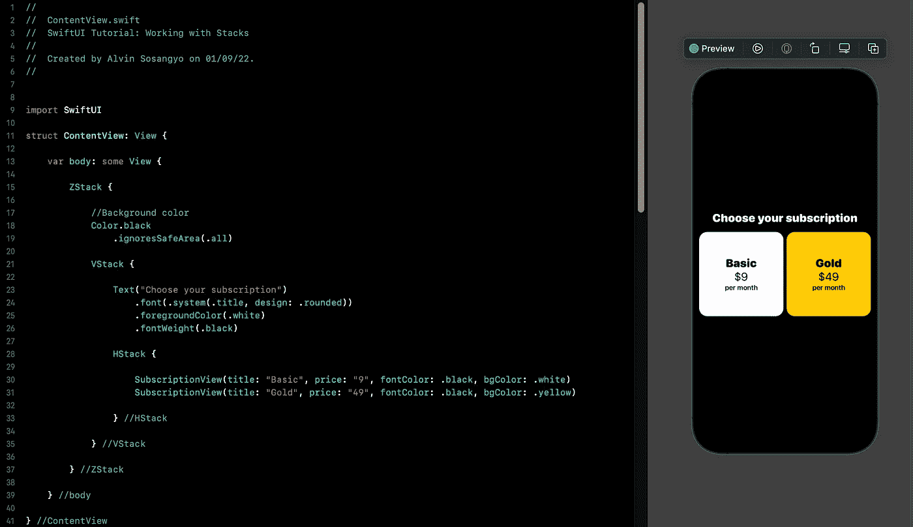

图 12。填充订阅视图()

处理下一个 SwiftUI 视图现在变得更加容易和高效，因为我们已经为它创建了一个现成的对象。在`HStack`下面添加以下代码，并确保它不在其中:

```
SubscriptionView(title: "Titanium", price: "99", fontColor: .white, bgColor: .gray)
```

代码应该如下所示:

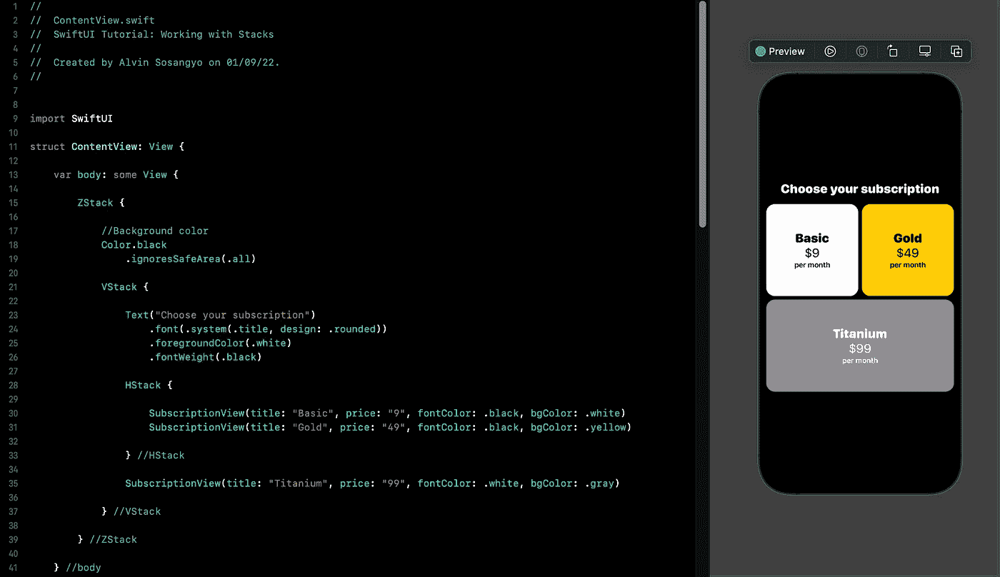

图 13。为 titanium 添加订阅视图。

我们需要添加的最后一个对象是按钮。因为我们要添加两个看起来一样的按钮。

让我们为它创建一个单独的结构。在`SubscriptionView()`下面添加以下代码:

```
struct SubscriptionButton: View {

    var text: String
    var color: Color
    var topPadding: CGFloat
    var action: () -> Void

    var body: some View {
        Button(action: action) {
            Text(text)
                .padding()
                .font(.title)
                .foregroundColor(.white)
                .frame(maxWidth: .infinity, maxHeight: 75)
                .background(color)
                .cornerRadius(30)
                .shadow(radius: 40)
        }
        .padding(.top, topPadding)
        .padding(.horizontal)
    }
}
```

上面的代码允许我们轻松地创建多个具有相同布局的按钮。

是时候敲定`ContentView()` struct 的代码了。

```
struct ContentView: View {

    var body: some View {

        ZStack {

            //Background color
            Color.black
                .ignoresSafeArea(.all)

            VStack {

                Text("Choose your subscription")
                    .font(.system(.title, design: .rounded))
                    .foregroundColor(.white)
                    .fontWeight(.black)

                HStack {

                    SubscriptionView(title: "Basic", price: "9", fontColor: .black, bgColor: .white)
                    SubscriptionView(title: "Gold", price: "49", fontColor: .black, bgColor: .yellow)

                } //HStack

                SubscriptionView(title: "Titanium", price: "99", fontColor: .white, bgColor: .gray)

                SubscriptionButton(text: "Subscribe", color: .blue, topPadding: 40, action: {
                    //Execute subscribe code
                })

                SubscriptionButton(text: "Maybe next time", color: .red, topPadding: 10, action: {
                    //Execute exit code
                })

            } //VStack

        } //ZStack

    } //body

} //ContentView
```

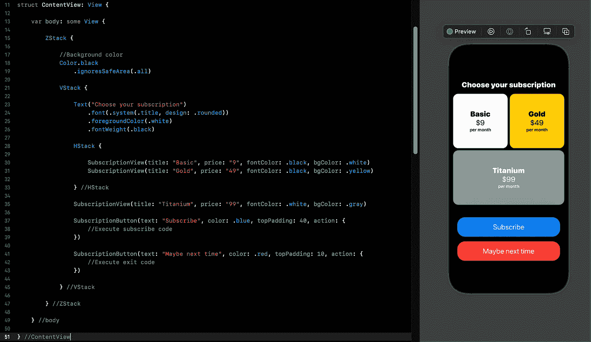

图 14。ContentView()源代码

我们结束了。对自己出色完成的工作给予鼓励。

我为这个项目的全部源代码添加了一个 GitHub 链接:

[](https://github.com/athurion/SwiftUI-Tutorial-Working-with-Stacks---VStack-HStack-and-ZStack) [## GitHub-athurion/swift ui-Tutorial-使用-Stacks-v stack-h stack-and-z stack

### 此时您不能执行该操作。您已使用另一个标签页或窗口登录。您已在另一个选项卡中注销，或者…

github.com](https://github.com/athurion/SwiftUI-Tutorial-Working-with-Stacks---VStack-HStack-and-ZStack) 

# 好处:嵌入堆栈

如果您有一个需要嵌套或设置在另一个堆栈中的 existingSwiftUI 堆栈，您不需要重写或复制并粘贴代码。你需要的只是这个叫做`embed`的快捷键。

假设您希望下面的代码在 ZStack 中。

```
struct ContentView: View {

    var body: some View {

        VStack {

            Text("Choose your subscription")
                .font(.system(.title, design: .rounded))
                .fontWeight(.black)

        }

    }

}
```

按住 command 键然后点按`VStack`。将出现一个上下文菜单，显示所有可用选项。对于这个例子，我们希望它在`ZStack`下。所以选择嵌入 ZStack。下面的图 15 显示了如何执行这个动作。

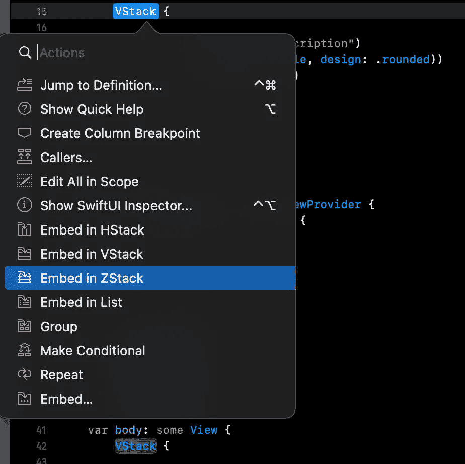

图 15。嵌入 ZStack

现在，代码将如下所示:

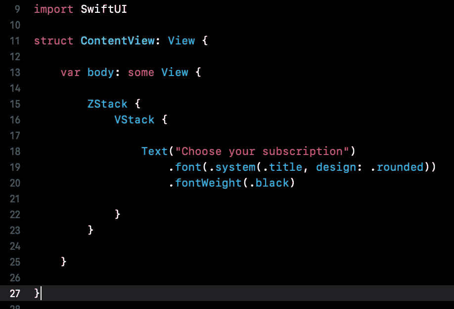

图 16。嵌入 ZStack

就是这样。在我们的下一个教程中，我们将讨论 SwiftUI 中的 [List 和 ForEach](https://arc-sosangyo.medium.com/swiftui-tutorial-working-with-list-using-foreach-a4b7451fbcf0) 。

愿法典与你同在。