# SwiftUI 中有哪些关键的 UI 元素？

> 原文：<https://betterprogramming.pub/swiftui-ui-elements-f170bec11871>

## 让我们来看看文本、图像、HStack、VStack 等等

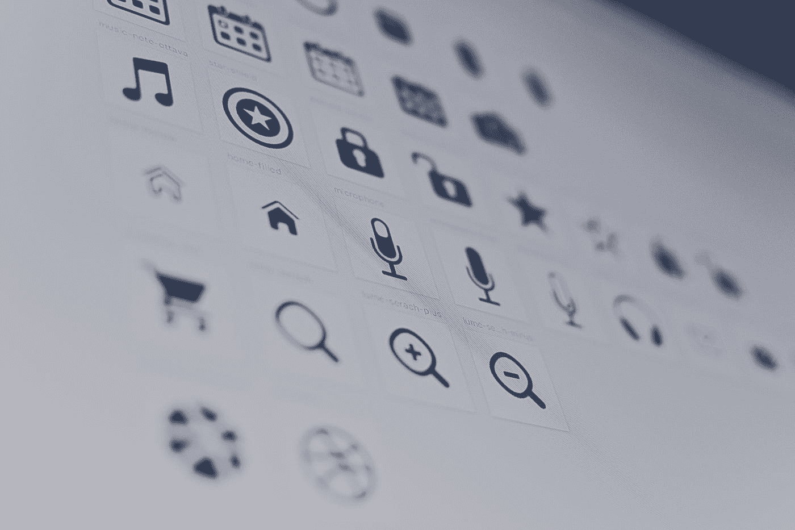

照片由 [Harpal Singh](https://unsplash.com/@aquatium?utm_source=medium&utm_medium=referral) 在 [Unsplash](https://unsplash.com?utm_source=medium&utm_medium=referral) 上拍摄

SwiftUI 提供了许多 UI 元素，这些元素以前在 UIKit 中也是可用的。然而，在 SwiftUI 中，它们有不同的实现和不同的名称。比如`UITableView`已经换成了`List`,`UILabel`已经被`Text`接手。这样的例子不胜枚举。

我们将浏览日常开发中最有可能使用的方法。在本文中，我们将讨论 SwiftUI 提供的以下 UI 元素及其实现:

*   `Text`
*   `Image`
*   `HStack`
*   `VStack`
*   `List`

# 文本

SwiftUI 中的`UILabel`已被`Text`取代。无论何时你想使用标签，你都可以使用`Text(“Hello World!”)`。下面是 SwiftUI 应用程序中`Text`的实际实现。

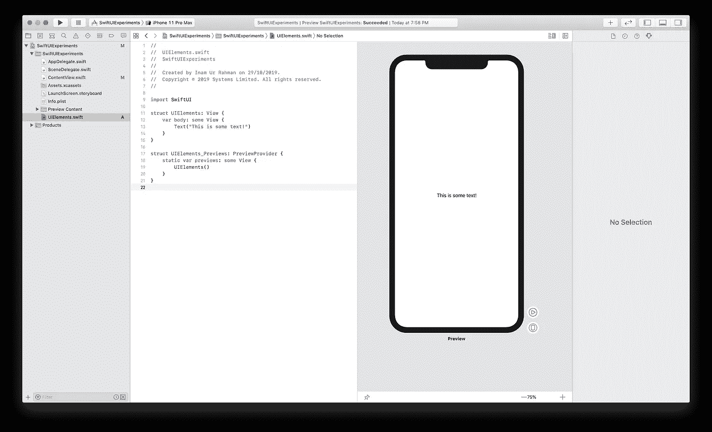

# 图像

SwiftUI 中的`Image`容器可以使用一行代码来添加，即`Image(systemName: “”)`。

**注意:**你在这里看到的这个以`systemName`为参数的构造函数是新引入的，目的是让用户访问系统提供的各种各样的内置图像。

# **HStack**

你猜对了:`HStack`是 SwiftUI 中的横向堆栈。该元素充当其他元素的容器，这些元素可以彼此并排水平堆叠。让我们来看看这个元素的作用。

我想要一个图像放在我的文本旁边。我需要做的就是将`Image`和`Text`合并到一个`HStack`闭包中，如下所示:

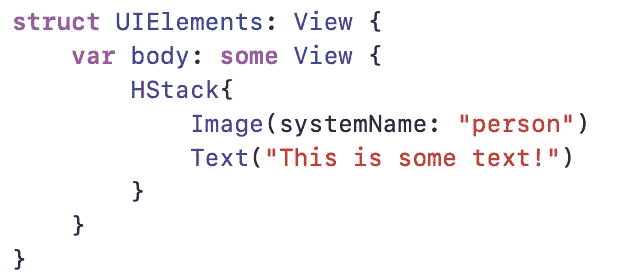

上述代码将产生以下输出:

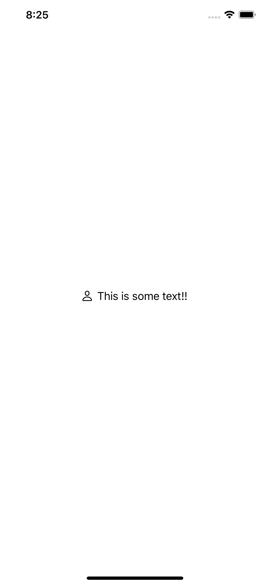

# VStack

`VStack`或垂直堆叠，是一个允许视图垂直堆叠的容器。其用法类似于`HStack`。

让我们使用我们在`HStack` 中使用的相同视图，并使用`VStack`对其进行一点增强。假设我们想在标题下方添加一个副标题，并希望我们的视图如下所示:

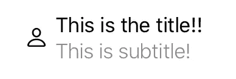

绞尽脑汁:我们能做些什么来达到预期的产出？你们大多数人一定猜对了。我们将把我们的标签放在一个`VStack`中，然后将`Image`和`VStack`嵌入到一个`HStack`中。

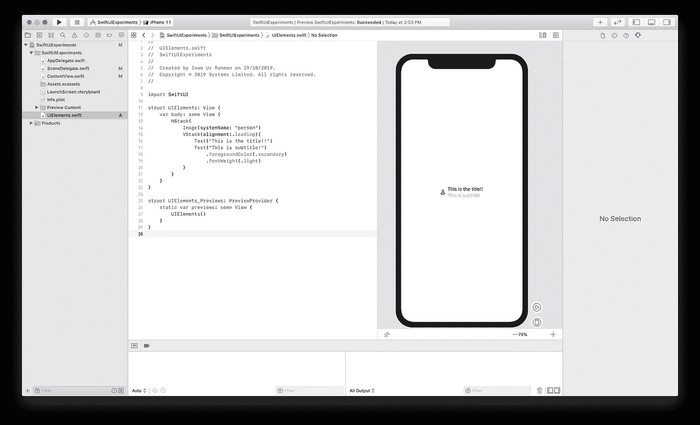

# 目录

我们将继续我们的视图，我们假设我们需要这个视图以列表的形式基于我们的数据源重复，就像 UIKit 中的表视图一样。为此，我们将使用`List`。

但在此之前，让我教你 SwiftUI 提供的另一个惊人的特性:提取视图。为此，按住键盘上的 Command 键，并在您想要提取的视图的开始处单击(在我们的例子中，它是`HStack`)。选择“提取子视图”Xcode 将负责剩下的工作，并为其生成一个单独的视图，您可以在以后方便的时候对其进行重命名。在我们的例子中，我们将其重命名为`ContactCellView`。

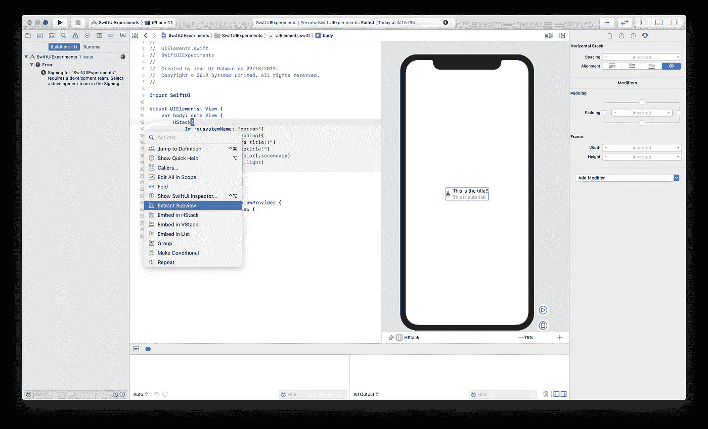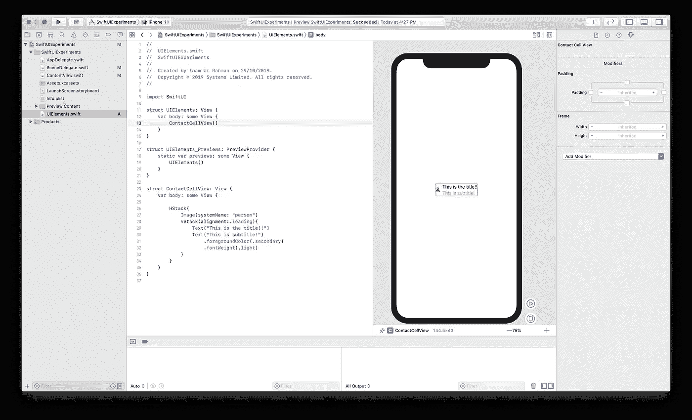

好了，现在回到`List`。

由于我们的视图现在有了一个名字`ContactCellView`，我们想以表格的形式重复`ContactCellView`五次。我们可以手动操作，也可以点击操作。我们将首先手动操作。

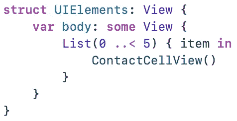

我们需要做的就是用迭代范围初始化列表，这样我们就可以指定我们希望它重复一个视图的次数。

在闭包内部，我们除了调用`ContactCellView`的初始化器之外什么也不做——这就是它的全部内容。

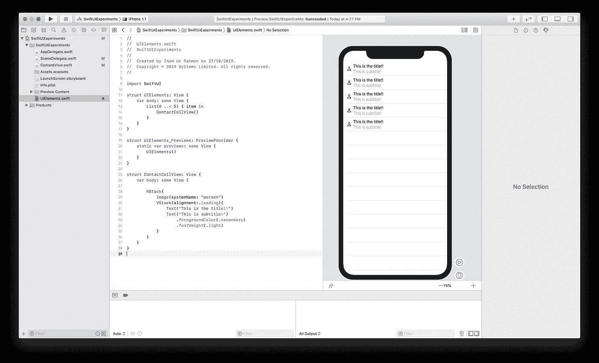

在列表中嵌入视图的一个快速方法是输入视图的初始化器，按住命令按钮，然后点击视图的初始化器。

然后点击“嵌入列表”，如下所示。

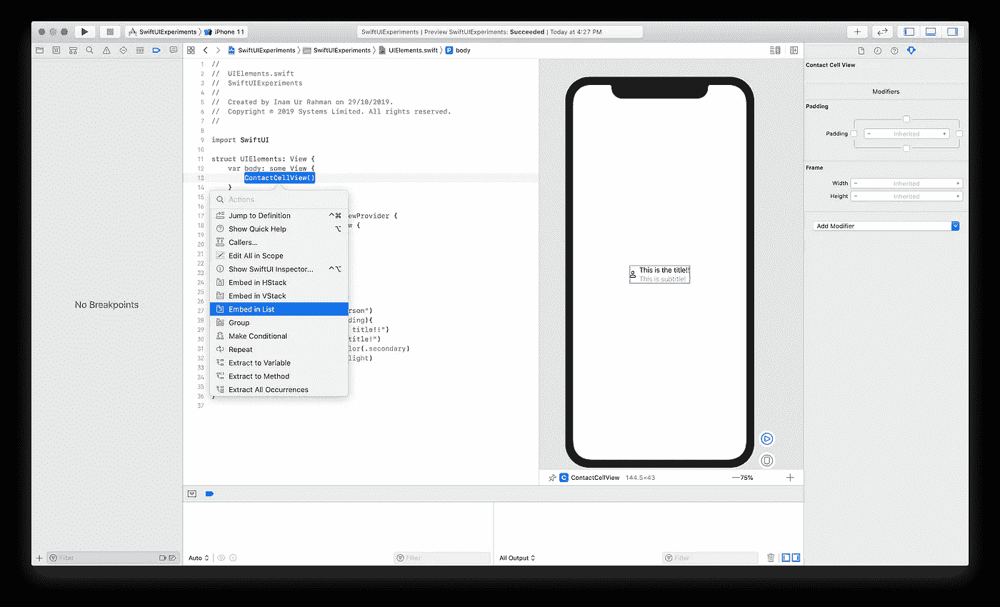

# 结论

在我的 SwiftUI 文章的第二部分中，我试图向您展示一些最常用的 UI 元素。但这并不是结束——在接下来的文章中，我将向您解释 SwiftUI 更高级的主题(例如，数据传播、导航和在 SwiftUI 中实现 MVVM)。

祝阅读愉快，敬请期待更多内容。