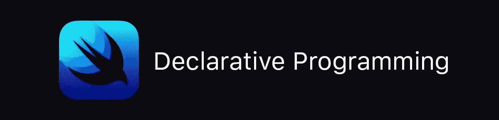

# SwiftUI:理解声明式编程

> 原文：<https://betterprogramming.pub/swiftui-understanding-declarative-programming-aaf05b2383bd>



## 被声明式编程搞糊涂了？别担心，这不难理解。

据苹果公司称，SwiftUI 是一个令人惊叹的声明式编程框架，用于在 iOS 和其他苹果平台上构建用户界面。盒子上是这么写的。

但是“声明性”是什么意思呢？

好吧，我们可以从辩论声明式编程与命令式编程开始，但这只是进一步的争论，因为我们现在需要定义术语“命令式”。

相反，我更喜欢简单地替换我原来句子中的一个词。

SwiftUI 是一个惊人的*功能*编程环境，用于构建用户界面。

所以让我们看看这个定义，看看它会把我们带到哪里。

# 函数式编程

有些人看到“函数式编程”这几个字就开始担心。

这主要是因为太多的函数式程序员开始抛出像*纯函数*这样的短语或者像*单子*和 *lambdas* 这样的术语，然后开始在白板上描述这一切背后的数学…这时你的眼睛开始变得呆滞，你开始寻找最近的出口。

别担心，我们不会在这里这么做。

毕竟我们已经知道什么是功能了。函数基本上是封装的代码块，接受值并返回结果。完成了。

在 SwiftUI 中，这些函数返回定义我们的用户界面的片段和部分。或者换句话说，我们使用那些函数来*声明*我们的接口。

开始有意义了吗？

# 视图

在 SwiftUI 中，构成我们界面的大部分部分被称为视图。有文字吗？这是一个观点。一个图像？另一种观点。是列表吗？你猜对了。这是一个视图列表。

但是不像 UIKit 严重超载的 Objective-C 调度 UI 视图，SwiftUI 视图实际上只是一些小信息，当它们组合在一起时，*描述了我们的界面。*

我们如何将它们结合在一起？

# Win 的嵌套函数

函数式编程的另一个方面是，我们通常将函数嵌套在函数中。我们在 SwiftUI 中也是这样做的。

先别走！

这可能看起来很奇怪，但是如果你停下来考虑一下，你已经习惯于用这些术语思考了。我们的 UINavigationController 包含一个 UITableView，其列表包含 UITableViewCells，后者可能包含包含 UILabels 和 UIButtons 的 UIStackViews。

一个界面元素包含其他元素，其他元素包含其他元素，直到瞧！我们已经描述了我们的界面，这是下一个屏幕，我们在这里做同样的事情。

在下面的 SwiftUI 示例中，视图主体返回的接口归结为一个包含列表的 NavigationView，其元素是 HStack 视图，后者又包含一个图像和一些文本。

语法可能看起来有点奇怪，但 Swift 5.1 中的一些新功能支持这一点。

嘣。我们刚刚用 15 行代码声明了我们的第一个全功能 SwiftUI 接口。

# 修饰语

“坚持住，老兄！”你说。“没那么快。如果我希望我的文本是红色的怎么办？我需要一个标题，而不是正文，还有……”

明白了。您想要修改默认的外观。

那么我们该怎么做呢？

修饰符。

是的，是我安排的。但这是苹果公司使用的术语，也很合适，所以我们将坚持使用它。

从概念的角度来看，修饰符是一个视图上的操作符，它返回另一个视图。可以无限修改(或者直到内存用完😉).

从实践的角度来看，你所做的一切都是使用 SwiftUI 的视图和操作符来描述 SwiftUI 的界面，用几乎*完全*相同的术语来描述另一个开发者的界面。

“我希望我的免责声明文本在那里，使用脚注字体和大小，并使其成为次要颜色，以便它在黑暗模式下工作。”

这是一个有两个修饰符的界面元素。

```
Text("Your mileage my vary.")
    .font(.footnote)
    .foregroundColor(.secondary)
```

向 SwiftUI 描述上面的接口，它会完成剩下的工作，根据字体大小和应用程序运行的设备，用适当的填充和间距来布局文本。

它会自动处理动态文本和可访问性字体大小。它会自动交换颜色，使其在亮暗模式下看起来都正确。它支持国际化和文本方向。

简而言之，它尽最大努力管理繁琐的小细节，并在你界面的每一个元素和部分上做到这一点。这让开发人员可以专注于应用程序的功能、业务逻辑和数据。

说到这个…

# 我们的数据呢？

大多数应用都是关于数据的。有时数据内置于应用程序中，如我们上面的免责声明示例所示，但通常情况下，我们的数据来自外部来源、数据库、API，有时甚至来自直接输入应用程序的信息。

当我们在 SwiftUI 中定义一个用户界面元素时，我们也告诉该元素在哪里可以找到它需要的数据。有时这些信息是静态的，就像上面显示的文本视图中的字符串。

有时这些信息是由我们的数据驱动的。在下面的例子中，我们修改了我们的列表视图，当它在应用程序的其他地方初始化时，使用传递给它的数据。

要列出的第一个参数告诉它在哪里可以找到数据。

List 将从数组中取出每个元素，并将其传递给闭包，闭包又用它来构建并返回显示该元素的视图。

所有这些都不需要数据源或代理。上面的代码可以是你的应用程序中一个完整的工作屏幕。

# 动态数据

有时我们的信息是动态的，会发生变化，我们的界面也应该相应地调整。

上面的实现实际上与第一个相同，但是有一个主要的区别，那就是将`@Binding`属性包装器添加到我们的列表和标题变量中。

*Binding* 告诉 SwiftUI 监视列表数组的变化。如果它的所有者更新了数组的内容，他们会通知我们，我们的列表视图会自动更新和呈现。

您应该注意到 List 是一个非常聪明的小视图。如果列表的所有者插入一个项目并删除另一个项目，在了解到列表发生变化时，将扫描更新的列表，将其与以前的列表进行比较，然后为您生成正确的插入和删除动画。

另外，请注意，我们现在也在导航栏中传递我们想要的标题。title 变量也是绑定的，所以无论何时数据发生变化，我们的标题栏都会自动更新。

绑定只是在 SwiftUI 中管理和维护应用程序的*状态*的方法之一。对所有这些的全面讨论超出了本文的范围，所以请继续关注。

# 环境

应该提到的另一个方面是*的环境*。

在 SwiftUI 中，*环境*是一组全局变量，用于描述应用程序运行的环境。比如我们是处于光明模式还是黑暗模式？目前的垂直尺寸等级是多少？横向？

可以查询这些变量来确定设备和应用程序的当前状态，以便您可以在正确的时间做正确的事情。

您还可以将您自己的信息添加到环境中，并在以后的视图层次结构中访问它。

```
@EnvironmentObject var settings: UserSettings
@Environment(\.colorScheme) var colorScheme: ColorScheme
```

同样，这有点超出了本文的范围，但是您需要知道它就在那里。

# 在后台

所以，你*声明*你的接口，你将 SwiftUI 指向你的数据…swift ui 完成剩下的工作。

每个视图、其修改器的状态、其数据以及环境的当前状态被组合起来，并积极地缩减为一组布局和渲染命令。然后将结果呈现给用户。

然后 SwiftUI 等待数据的更改。如果出现这种情况，SwiftUI 会遍历受影响的视图并构建一个新的布局树，将发现的任何更改与当前树进行比较，然后呈现视图中需要更新的部分。

这使得 SwiftUI 比 UIKit 快得惊人。其实大部分的视图和动画渲染都是直接用 Metal 完成的。

# 动画？

是的，在 SwiftUI 中制作动画很容易。事实上，确定视图状态转换可能需要什么动画被直接构建到树比较过程中。

一些动画，像列表插入和删除以及那些与视图修改器状态改变有关的动画，被直接构建到系统中。

如果需要的话，可以对它们进行修改和定制。

# 完成块

原来如此。希望你现在明白了苹果所说的 SwiftUI 是一个新的、*声明性的*编程框架，用于在 iOS 和其他苹果平台上构建用户界面的意思。

而且这个*惊人的*修饰词【原文如此】是当之无愧的。

一如既往，请在下面留下任何问题或评论，我将尽我所能回答它们，无论是直接回答还是在以后的文章中回答。

SwiftUI 系列继续推出:

*   [SwiftUI:深度导航视图](https://medium.com/@michaellong/swiftui-deep-inside-navigationview-4d25d57a236c)
*   [swift ui 组合的最佳实践](https://medium.com/better-programming/best-practices-in-swiftui-composition-282b02772a24)
*   [swift ui](https://medium.com/swlh/deep-inside-views-state-and-performance-in-swiftui-d23a3a44b79)的深度观点、状态和表现