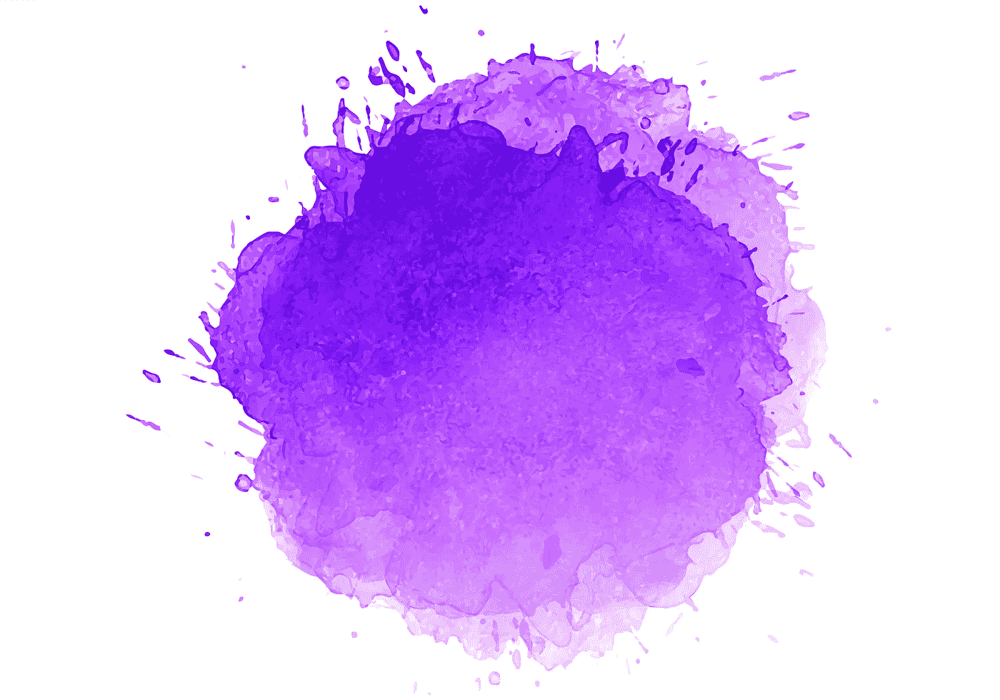
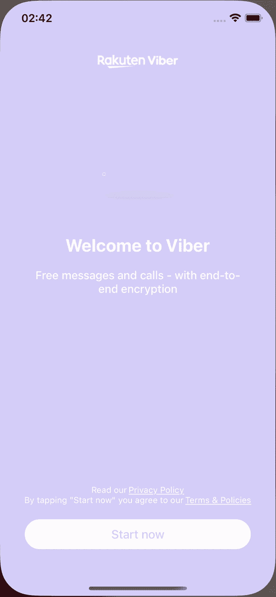

# 用 SwiftUI 中的动画构建一个 Viber 闪屏

> 原文：<https://betterprogramming.pub/swiftui-viber-splash-screen-with-animations-feec3adb4481>

## 创作精彩的动画

在这篇短文中，我们将构建一个类似 Viber 的闪屏，带有一个 Viber 标志的简单动画。

下面先睹为快，看看最终输出:

现在让我们开始吧。

屏幕的设计非常简单，如下图所示。它由一个图标、一些文本和一个按钮组成，就像大多数登录屏幕一样。

最重要的是动画。

我们需要把这个动画分成几个部分。正如我们在最终结果中看到的(在本教程的末尾)，我们需要 5 个移动部件。

第一部分是需要静态的 Viber 标志的基础图像。

接下来，我们有 5 个正在移动的部分，标志圈、标志手机和三条曲线。所有这些图像被组合成`ZStack`。

对于这些图像中的每一个，我们将应用带有偏移移动的缩放和`easeIn`动画。唯一的区别是每个图像的动画持续时间和动画的延迟。延迟将适用于电话标志和三个移动的曲线，因为圆形标志是第一个图像，我们是动画。

最后的结果是:

就这样，希望你喜欢这个简短的教程，并期待更多的内容。

与往常一样，代码可以在 GitHub 存储库中找到:

 [## GitHub-kenagt/VibesSplashScreenIOS:viber 的闪屏。

### 此时您不能执行该操作。您已使用另一个标签页或窗口登录。您已在另一个选项卡中注销，或者…

github.com](https://github.com/kenagt/VibesSplashScreenIOS)