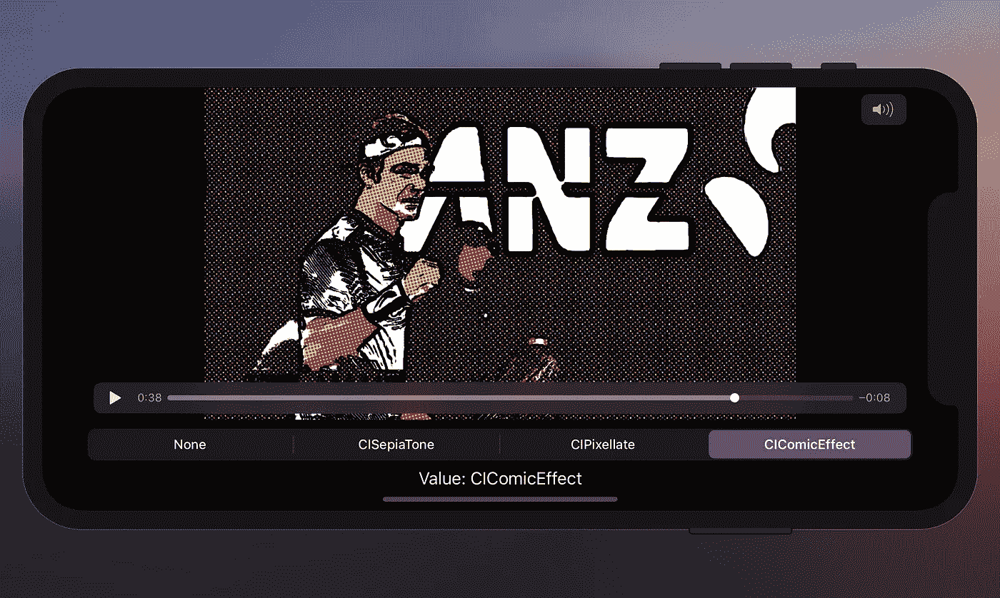
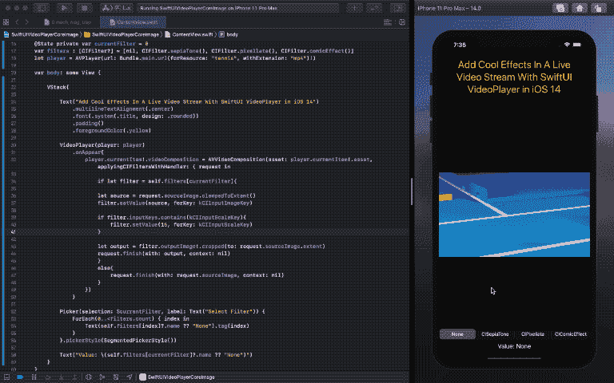

# 如何在 SwiftUI VideoPlayer 中添加核心图像滤镜

> 原文：<https://betterprogramming.pub/swiftui-video-player-real-time-processing-with-core-image-ef0688745c57>

## 纯 SwiftUI 视频播放器应用程序中的实时图像处理。



图片来源:作者

iOS 14 中的 SwiftUI 引入了播放电影文件的原生支持。新的`VideoPlayer`控件允许你从 URL 或本地资源播放电影文件。

你需要做的就是`import AVKit`并传递`AVPlayer`的实例，如下所示:

```
VideoPlayer(player: AVPlayer(url: enter_url_here)
```

`VideoPlayer`在设备上运行良好，但可能会导致模拟器出现问题，尤其是从 web URL 加载时。

您还可以在视频播放器上添加自定义叠加 SwiftUI 视图。在撰写本文时，不可能摆脱默认的回放控制。

值得注意的是，YouTube 的网址在`AVPlayer`无法使用，因为它们完全是电影文件。

`VideoPlayer`打开了在纯 SwiftUI 应用中进行视频处理的大门。这意味着你可以用不到 50 行代码编写一个智能的基于人工智能的视频播放器。

在接下来的章节中，我们将看到如何对`VideoPlayer`应用过滤器，并将实现一组核心图像过滤器来实时运行电影文件。

# 如何在 SwiftUI VideoPlayer 中访问视频帧

从 AV 播放器获取视频帧的最常见方式是使用`AVPlayerItemVideoOutput`。为此，我们通常会使用`CADisplayLink`计时器在特定时间间隔后获取帧。

但是`CADisplayLink`在 SwiftUI 中不支持原生监听器。如果没有 UIKit，监听变化的选择器就无法工作。

因此，我们会选择另一个选项，即`AVVideoComposition`。

`AVVideoComposition`包含每帧的像素缓冲区。通过在`AVPlayerItem`属性上设置它，我们可以检索帧并应用`CIFilter`给视频一个完全不同的外观。

# 在 SwiftUI 中对视频流应用 CIFilter

让我们创建一个新的 SwiftUI 项目，并向其中添加以下内容:

上面的代码中主要发生了两件事:

*   `AVPlayerItem`包含`videoComposition`属性，我们将在其上设置`AVVideoComposition`的实例。在`AVVideoComposition`内部，我们传递类型为`AVAsset`的`media`属性。
*   `applyingCIFiltersWithHandler`是对每一帧进行图像处理的地方。我们正在设置将`sourceImage`传递到当前选择的`CIFilter`(从`SegmentedControl`中选择)。

我们在一个本地视频上运行了上面的应用程序，用四个`CIFilters`得到了下面的结果:



您可以添加更多滤镜，并设置滑块控制以使用不同的强度。添加远程视频 URL 几乎与使用本地视频 URL 一样流畅(如果网络连接良好)。

# 结论

SwiftUI 应用程序的完整源代码可以在 [GitHub 资源库](https://github.com/anupamchugh/iOS14-Resources/tree/master/SwiftUIVideoPlayerCoreImage)中找到。

SwiftUI `VideoPlayer`开启了许多惊人效果的大门，比如应用风格转移。

这一次到此为止。感谢阅读。