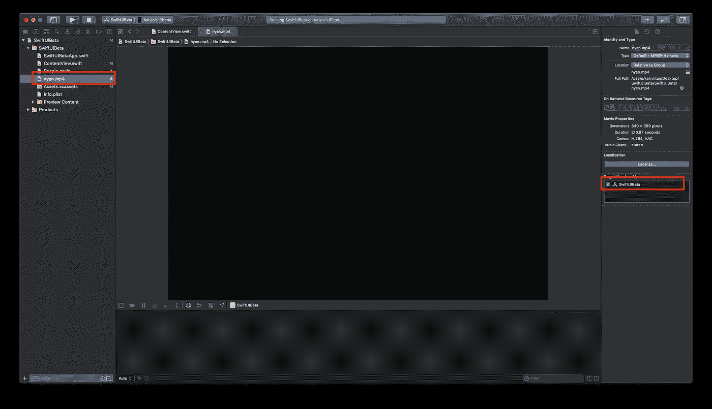
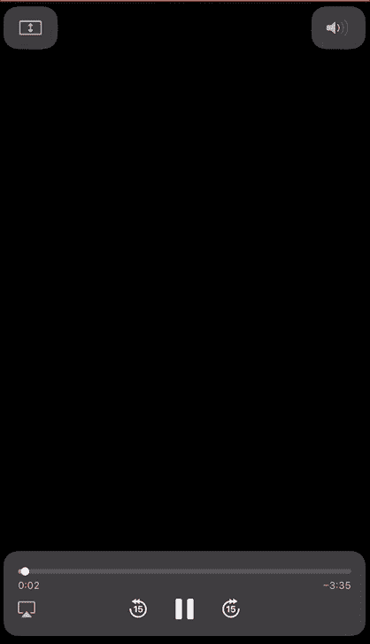
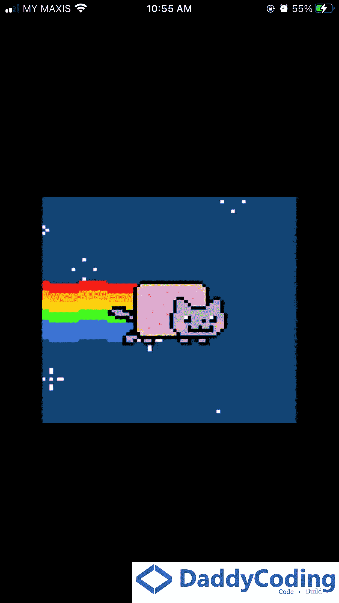

# SwiftUI:视频播放器

> 原文：<https://betterprogramming.pub/swiftui-videoplayer-cddfa1ee1601>

## 在 WWDC 2020 上，苹果推出了一个可以播放本地视频或来自 URL 的视频的视图


由[托马斯·威廉](https://unsplash.com/@thomasw?utm_source=medium&utm_medium=referral)在 [Unsplash](https://unsplash.com?utm_source=medium&utm_medium=referral) 上拍摄的照片。

*免责声明:您将无法使用 YouTube 上的视频。*

> *“显示来自播放器对象的视频内容以及系统提供的回放控件的视图。”—苹果开发者*

# 先决条件

要学习本教程，您需要了解以下方面的一些基本知识:

*   迅速发生的
*   至少 Xcode 12+

*注意:这只支持 iOS 14+。*

# 开始使用 VideoPlayer

首先，您需要导入所需的模块:

```
import AVKit
```

为了便于说明，我将从 YouTube 上下载 [Nyan Cat 视频](https://www.youtube.com/watch?v=QH2-TGUlwu4&t=4s)，其扩展名为 mp4。该文件将被放置在项目中，如下所示。请确保已选择目标，否则你的应用将会崩溃:



请仅在您的设备上测试。在模拟器上测试是行不通的。

通过使用下面的代码，您现在可以在 SwiftUI 中创建一个`VideoPlayer`:

```
VideoPlayer(player: AVPlayer(url: Bundle.main.url(forResource: "nyan", withExtension: "mp4")!))
```

你可以看看这个很酷的结果，我们快进快退 15 秒，拖动进度指示器，全屏显示。



除了使用本地文件，你当然可以选择 URL。请注意，YouTube 链接在这里不起作用。

可以用 m3u8 文件。实现如下。使用强制展开时，请确保该文件确实存在。大多数时候强行解包并不是一个好的做法。

```
VideoPlayer(player: AVPlayer(url: URL(string: "https://bitdash-a.akamaihd.net/content/sintel/hls/playlist.m3u8")!))
```

你可以在你的视频上做的一件很酷的事情就是添加一个覆盖图！这主要是用来描绘你的标志。

在这里，您将描绘自己的徽标，它将出现在右下角:



稍微调整一下，您可以使用`topLeading`将您的徽标移动到左上角:

```
frame(maxWidth: .infinity, maxHeight: .infinity, alignment: .topLeading)
```


感谢阅读！