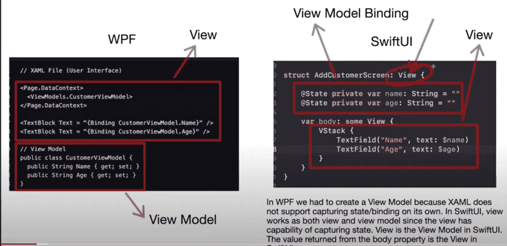
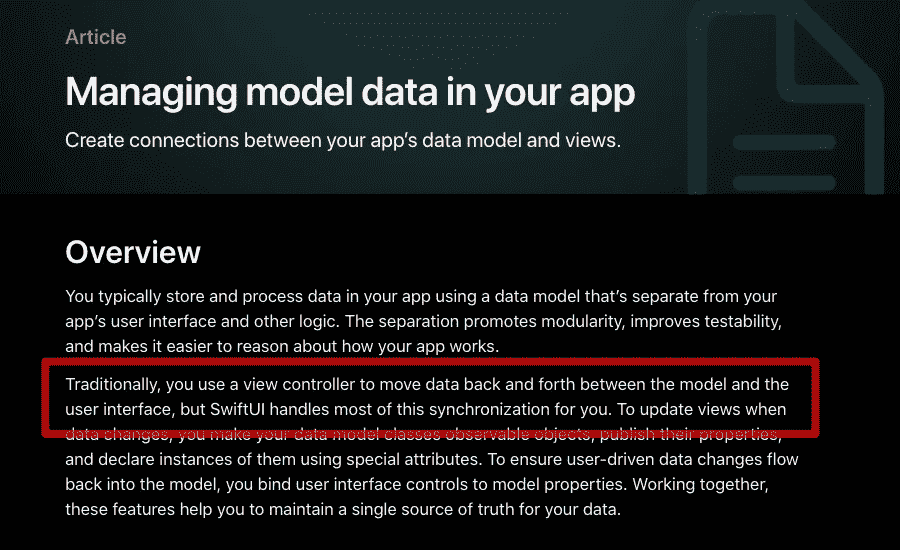

# SwiftUI 视图也是一个视图模型

> 原文：<https://betterprogramming.pub/swiftui-view-is-also-a-view-model-7b434316b5fa>

## 与 WPF 框架的比较

[Lili Popper](https://unsplash.com/@lili_popper?utm_source=unsplash&utm_medium=referral&utm_content=creditCopyText) 在 [Unsplash](https://unsplash.com/s/photos/path?utm_source=unsplash&utm_medium=referral&utm_content=creditCopyText) 上拍摄的照片

在这篇文章中，我将介绍 SwiftUI 视图不仅是一个视图，还是一个视图模型。我们将它与 WPF 框架进行比较，看看 SwiftUI 如何在视图中内置对 ViewModel 的支持。这意味着在大多数情况下，您不需要为每个屏幕创建一个额外的视图模型层。

# Windows 演示基础

很久以前，当我还是一名. NET 开发人员时，在一个遥远的星系中，我参与了几个 WPF (Windows 演示基础)项目。WPF 用于构建 Windows 应用程序，它是 Windows 窗体的继承者。

WPF 使用 XAML (UI 语言)来构建应用程序的用户界面。XAML 看起来类似于 HTML 和 XML，但也能够引用 C#甚至 VB.NET 文件中的类。绑定内置于 XAML 文件中，这意味着 XAML 的文本框可以绑定到 C#视图模型。当用户在文本框中键入文本时，它会自动填充视图模型的属性。

XAML 用户界面代码的实现如下所示:

文本框包含`BindingContext`，它定义了绑定的上下文。文本框绑定被设置为`CustomerViewModel`。TextBox 的 Text 属性绑定到`CustomerViewModel`的 Name 属性。

`CustomerViewModel`如下图所示:

> 以上代码用于演示目的。但是工作的 XAML 和 C#代码与上面提到的非常相似。

现在，当用户在 XAML 声明的文本框中键入内容时，由于 XAML 的绑定特性，CustomerViewModel `Name`属性会自动填充。现在，让我们在 SwiftUI 应用程序中实现相同的场景。

在 SwiftUI 中，实现非常简单，如下所示:

我们不需要像`CustomerViewModel`这样单独的视图模型来绑定 TextField 的值。SwiftUI 视图已经支持数据绑定特性，如`@State`、`@Binding`等。这意味着 SwiftUI 视图不仅是一个视图，还是一个视图模型。尽管您可以以视图模型的形式添加另一个抽象层，但在大多数情况下并不需要。

下面是 WPF 和 SwiftUI 的对比:

基本的客户端验证，如必填和匹配字段，可以在您的视图中执行。对于更复杂的客户端验证，我建议实现某种类型的`RulesEngine.`

使用这种体系结构，视图充当视图和视图模型。该模型成为业务层(特别是对于没有服务器组件的应用程序)。这意味着如果您创建一个`NetworkService`，它可以直接从视图中被调用，这也是一个视图模型。我个人创建一个聚合根模型对象，然后从那里调用 web 服务层。这允许我在我的聚合根模型或者它托管的模型中处理业务逻辑。下面你可以找到来自苹果[文章](https://developer.apple.com/documentation/swiftui/managing-model-data-in-your-app)的截图，也证实了在构建 SwiftUI 应用时，大多数场景下不需要视图模型。这是因为数据绑定特性被嵌入到视图中，而视图也是一个视图模型。

即使你阅读苹果文档或观看 WWDC 视频，你也永远不会听到 MVVM 这个术语，或者你永远不会看到苹果工程师使用另一个抽象层。他们通常会实现 StoreManagers 或 StoreService，然后直接从视图(ViewModel)中调用它，并填充全局状态，这样他们就可以维护单一的真实来源。

说了这么多，还是有一些情况需要更扁平的模型。一个很好的例子是，如果你使用 MKLocalSearch，它会返回`MKPlacemark`。您可能希望向视图公开一个更精简的对象，而不是`MKPlacemark`实例。

我在 ViewModel 中遇到的最大问题之一是跟踪`EnvironmentObject`的变化。是的，您可以将`EnvironmentObject`传递给 ViewModel，或者您可以使用依赖注入框架来注入它，但是为什么要让事情变得如此复杂呢？为什么不在视图(ViewModel)中使用`EnvironmentObject`,就像它应该被使用的那样？

> 没有一种架构能满足所有需求。下次编写 SwiftUI 应用程序时，考虑一下为每个屏幕添加一个 ViewModel。它会给你带来好处还是会成为你申请的障碍。

# 资源

1.  [我错了！MVVM 不是构建 SwiftUI 应用的好选择](https://azamsharp.com/2022/07/17/2022-swiftui-and-mvvm.html)
2.  [停止在 SwiftUI 中使用 MVVM](https://youtu.be/LVx93PfGjdo)
3.  [使用状态模式(不使用 MVVM)在 SwiftUI 中使用 JSON API](https://youtu.be/YOCZuZz4vAw)
4.  [客户端服务器 SwiftUI App 使用状态模式](https://youtu.be/j2x7GylAnmE)