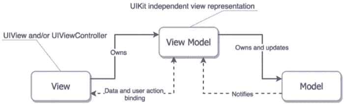

# 在 SwiftUI 中使用视图模型协议？你做错了。

> 原文：<https://betterprogramming.pub/swiftui-view-models-are-not-protocols-8c415c0325b1>

## SwiftUI、MVVM 和面向协议的编程是一个完美的组合…如果做得正确的话。找出方法。


在 [Unsplash](https://unsplash.com?utm_source=medium&utm_medium=referral) 上[提尔·XC](https://unsplash.com/@xc_teer?utm_source=medium&utm_medium=referral)的照片

最常用的 iOS 应用架构之一是 MVVM:模型视图视图-模型。

毫无疑问，正如你所知，在 UIKit 中进行经典的 MVC(模型视图控制器)开发时，MVVM 被提议对抗“大规模”视图控制器的趋势。基本思想是将业务逻辑——视图模型——从视图出口和视图和视图控制器中的其他“连接”中分离出来。



来自 [SwiftUI 微服务](/swiftui-microservices-c7002228710)

在此之前，开发人员倾向于将所有的逻辑和用户事件处理，甚至大量的 API 请求代码转储到负责给定屏幕的唯一视图控制器中。在视图控制器和视图模型之间划分职责，至少可以将各自的规模缩小一半。

虽然这不是一个无关紧要的好处，但是将业务逻辑移动到它自己的实体中意味着我们现在可以*模仿*并且*测试*那个逻辑。进入视图控制器并试图弄清楚该控制器的标签和字段以及其他用户界面元素的当前状态是一件非常、非常、非常麻烦的事情。

但是相比之下，测试一个视图模型的值要容易得多。

# SwiftUI 和可观察对象

SwiftUI 在创建`ObservableObject`的概念时鼓励了类似的架构模型。

一个`ObservableObject`是一个实体，它存在于——并且持久存在于——视图之外，并且跨越视图更新，以便为那个视图(或者多个视图)维护某种类型的状态。

当该状态改变或被更新时，依赖于该状态的任何视图都被重建并检查改变，这又会导致 UI 的某个部分(或全部)被刷新。

一个`ObservableObject`在用作`EnvironmentObject`时可能跨越多个视图，在这种情况下，我们可能会认为它更像是某种服务。(*详见* [*SwiftUI 微服务*](/swiftui-microservices-c7002228710) *)关于这个*。)

但是当它的存在主要是为了驱动一个*单一*视图的状态和行为时，那么我们又回到了把它看作一个视图模型(大写)，而架构又一次成为了 MVVM。

*注意，根据定义，视图模型将紧密耦合到它所驱动的视图。它们基本上是同一枚硬币的两面。*

# 账户列表

考虑以下 SwiftUI 视图模型，该模型用于显示简单的帐户列表:

```
class AccountListViewModel: ObservableObject { @Published var accounts: [AccountListModel]?
    @Published var footnote: String?
    @Published var empty: String?
    @Published var error: String? func load() {
      // something happens here
    }
}
```

我们的帐户列表屏幕可以显示帐户列表和相应的脚注，或者如果没有可用的帐户，它可以显示一条消息，或者如果尝试加载帐户列表失败，它可以显示一条错误消息。

所以想想吧。调用`load()`可以触发一组变量变化，其中大多数是互斥的。

*这里只需注意，我可能会在现实生活中使用稍微不同的方法，但这个例子很好地说明了我们的一些问题，所以让我们开始吧。*

# 装，装，装…

让我们更深入一点，看看我们的 load 函数的一个简单实现。现在，我们还将忽略这个函数本质上可能是异步的这一事实，只关注内部逻辑流。

```
func load() {
    if let (accounts, footnote) = API.shared.loadAccounts() {
        if accounts.isEmpty {
            empty = "No accounts"
        } else {
            self.accounts = accounts.map {
                AccountListModel($0)
            }
            self.footnote = footnote
        }
    } else {
        error = "Unable to load accounts"
    }
}
```

我们调用 API 来加载我们的帐户和相关的脚注。如果这个函数返回零，我们就有一个错误。如果我们的帐户列表是空的，我们希望我们的用户也知道。否则，我们保存我们的列表，将每个帐户转换成一个`AccountListModel`，我们也保存我们的脚注。

如您所见，即使构建一个相对简单的状态集也会开始涉及一些半复杂的逻辑。

那么我们如何确保逻辑是正确的呢？做些测试！

# 测试

这里有一个成功加载几个账户的快乐路径的基本测试。

```
private let vm = AccountListViewModel()class MVVM_POPTests: XCTestCase {
    func testAccountsLoaded() throws {
        vm.load()     
        XCTAssert(vm.accounts?.count == 2)
        XCTAssertNotNil(vm.footnote)
        XCTAssertNil(vm.empty)
        XCTAssertNil(vm.error)
    }
}
```

所以我们检查是否有账户，是否有脚注，是否没有空的或错误的信息。酷毙了。

但问题来了。通过使用一个共享的 singleton 作为我们的 API，我们的 load 函数也与那个 API 紧密耦合。

那么我们如何给它一组不同的数据来玩呢？就此而言，它是在与我们实际的、实时的 API 对话，所以我们怎么知道我们在现实生活中会有多少个帐户呢？事实上，每次我们增加或减少帐户时，这个测试都会失败。

显然，我们需要将视图模型从 API 中分离出来，但是如何分离呢？

# 帐户加载协议

嗯，这是 Swift，这篇文章是关于如何使用 MVVM 协议…所以让我们定义一个加载帐户数据的协议，并使我们现有的 API 符合该协议。

```
protocol AccountLoading {
    func loadAccounts() -> ([Account], String)?
}extension API: AccountLoading {}
```

然后我们将修改我们的视图模型，如下所示。

```
class AccountListViewModel {
    ...
    var loader: AccountLoading = API.shared
    func load() {
        if let (accounts, footnote) = loader.loadAccounts() {
            ...
        } else {
            ...
        }
    }
}
```

我们添加了一个`loader`变量，它期望一个`AccountLoading`的实例，但是默认为我们的标准共享 API。

在现实生活中，我可能会使用依赖注入和[解析器](https://github.com/hmlongco/Resolver)并使其成为私有属性，但在这里，我们将使其成为普通的公共属性，这样我们就可以从我们的测试套件中访问它。

最后，请注意我们的 load 函数现在是如何调用协议的某个实例来获取数据的。

有了我们的协议，让我们用它来修复我们的第一个测试。

```
private let vm = AccountListViewModel()struct MockTwoAccounts: AccountLoading {
    func loadAccounts() -> ([Account], String)? {
        return ([Account(), Account()], "A footnote")
    }
}class MVVM_POPTests: XCTestCase {
    func testAccountsLoaded() throws {
        vm.loader = MockTwoAccounts()
        vm.load()
        XCTAssert(vm.accounts?.count == 2)
        XCTAssertNotNil(vm.footnote)
        XCTAssertNil(vm.empty)
        XCTAssertNil(vm.error)
    }
}
```

我们用一个协议处理程序的实例替换我们的 API 调用，该实例实际上返回两个模拟帐户。运行它和 BING！有用！我们有我们的模拟账户和相关的脚注。

再加一个吧。

```
struct MockNoAccounts: AccountLoading {
    func loadAccounts() -> ([Account], String)? {
        return ([], "A footnote")
    }
} class MVVM_POPTests: XCTestCase {
    ...
    func testNoAccountsLoaded() throws {
        vm.loader = MockNoAccounts()
        vm.load()
        XCTAssertNil(vm.accounts)
        XCTAssertNil(vm.footnote)
        XCTAssertNotNil(vm.empty)
        XCTAssertNil(vm.error)
    }
    ...
}
```

这里我们的模拟只是返回一个空的帐户列表。现在，当我们调用 load 时，我们可以检查以确保我们的逻辑部分是正确的，并且我们的模型现在准确地反映了我们的空状态。

对于我们最后的测试，我们可以制作一个`MockAccountError`版本，其中`loadAccounts()`只返回 nil，并使用它来确保我们为错误处理状态生成正确的结果。

# 我们在测试，我们在测试…

一切都很好。因此，当我们满怀期望地运行我们完整的`AccountListViewModel`测试套件时，我们发现……**一个错误**。发生了什么事？

事实证明，当我们运行所有的测试并调试结果时，我们会发现我们的加载函数没有正确地清除之前的状态。

当我加载一个零账户列表时，我得到了预期的空消息。

但是如果我在那之后加载了我的账户，我得到了账户和一个脚注…而我仍然有我之前的空消息。如果我之前犯了错误，同样的事情也会发生。旧的值会一直存在，无法通过我的帐户加载或空测试。

这正好表明，即使在相对简单的代码中，也可能隐藏着非常严重的错误。我要补充的是，如果没有这些测试，我们可能直到很久以后才发现这个错误。

显然，我们需要一些函数来重置我们的状态。

```
class AccountListViewModel: ObservableObject { ...    func load() {
        reset()
        if let accounts = loader.loadAccounts() {
            ...
        } else {
            ...
        }
    }

    func reset() {
        accounts = nil
        footnote = nil
        empty = nil
        error = nil
    }
}
```

*请注意，这是让 Xcode 以随机顺序运行测试的一个非常好的理由，因为在一个序列中没有错误的运行可能会在另一个序列中触发错误。*

# SwiftUI 和模拟数据

我们可以(也应该)在应用程序中定义这些模拟，并在我们想要在 SwiftUI 中进行预览时使用它们。为了说明这一点，现在让我们制作一个简单的占位符`AccountListView`。

```
struct AccountListView: View { @StateObject var viewModel = AccountListViewModel() var body: some View {
        Text("Will show accounts here...")
    }
}
```

请注意，我们的产品`AccountListView`使用了一个默认为我们的标准`AccountListViewModel`的状态对象，这反过来默认使用我们的标准，产品 API。

但是有了这些，我们现在可以创建一组覆盖`AccountListView.viewModel`的预览，并使用它们来查看我们的视图如何显示来自我们的快乐路径的数据，当它为空时，以及当我们有错误时。

```
struct AccountListView_Previews: PreviewProvider {
  static var previews: some View {
    Group {
      let vm2 = AccountListViewModel(loader: MockTwoAccounts())
      AccountListView(viewModel: vm2)

      let vm0 = AccountListViewModel(loader: MockNoAccounts())
      AccountListView(viewModel: vm0)

      let vme = AccountListViewModel(loader: MockAccountsError())
      AccountListView(viewModel: vme)
    }
  }
}
```

有了我们的预览，我们就可以确保每个状态在我们编写代码的时候都像它应该的那样出现。

# 愚蠢的观点

视图模型应该包含视图的所有业务逻辑、计算、数据操作和数据格式的*。为什么？因为一旦有了它，所有这些东西都可以被彻底测试和验证。*

我知道我在这里重复我自己，但是我有一个观点。你看，上面不太明显的推论是，我们希望相关的视图尽可能的*愚蠢*。

只有这样，我们才能有相对较高的信心，如果我们的视图模型是正确的，那么我们的视图就是正确的。

让我们来看一个实际的视图。

```
struct AccountListView: View { @StateObject var viewModel = AccountListViewModel() var body: some View {
        if let accounts = viewModel.showAccounts {
            List {
                ForEach(accounts, id: \.id) { account in
                    AccountListCellView(account: account)
                }
                if let footnote = viewModel.footnote {
                    Text(footnote)
                        .font(.footnote)
                }
            }
        } else if let empty = viewModel.empty {
            Text(empty)
                .foregroundColor(.gray)
        } else if let error = viewModel.error {
            Text(error)
                .foregroundColor(.red)
        } else {
            ProgressView()
                .onAppear {
                    viewModel.load()
                }
        }
    }
}
```

虽然看起来这个视图有很多逻辑，但是仔细观察你会发现这个视图只是简单地做了视图模型告诉它做的事情。

如果我们有客户，给他们看看。如果我们有空账户信息，显示出来；否则显示错误消息(如果有)。如果我们还没有任何这些东西，展示一个 spinner，调用 load，然后去获取它们。

该视图的行为完全由视图模型驱动。

这是在做 MVVM 时要正确对待的最重要的概念之一，所以我要再重复一次:在 MVVM，视图或视图控制器希望尽可能的愚蠢。

因为在视图模型中*而不是*的视图或视图控制器中做出的每一个决定或计算或操作都是你只能*假设*是正确的。你知道他们怎么说那些自以为是的人。

只要记住，如果你不能测试它，你就不能证明它。

# UIKit

在 UIKit 中使用`UIViewControllers`也是一样。与视图控制器管理的视图相似的视图模型中的一部分代码绑定数据可能看起来像…

```
...
messageLabel.text = viewModel.emptyMessage
messageLabel.hidden = viewModel.emptyMessage == nil
...
```

在 MVVM 中，视图控制器的角色是将数据从视图模型传递到视图，如果需要，当用户点击按钮或在文本字段中键入内容时，通过调用适当的方法来触发视图模型的变化。

视图模型更新状态并触发刷新，这再次导致视图控制器从视图模型复制该状态并将其应用到用户界面。

换句话说，视图控制器的存在只是为了将东西从 A 点传递到 b 点。

*必须编写我们自己的视图绑定代码是 SwiftUI 代码比 UIKit 代码更干净、更精简(更不容易出错)的原因之一。*

# 视图模型不是协议

在经典的面向对象编程中，通常会区分*是*的对象和*包含*的对象。(是 A 对有 A)。

在上面的例子中，我们的视图模型有一个实现帐户提供者协议的对象实例。

通过交换我们的数据提供者，我们可以为我们的视图模型提供不同的数据，并观察它如何响应。这反过来又让我们练习和测试更多我们将在生产中实际使用的代码。

如果视图模型本身实现了某种协议，允许它被换出(是 A)，那么我们就失去了这些好处。考虑:

```
protocol AccountListViewModeling: ObservableObject { var accounts: [AccountListModel]? { get }
    var footnote: String? { get }
    var empty: String? { get }
    var error: String? { get } func load()
}
```

该协议基于我们更新的视图模型。现在让我们做一个模拟。

```
class FakeEmptyAccountListViewModel: AccountListViewModeling { var accounts: [AccountListModel]?
    var footnote: String?
    var empty: String?
    var error: String? func load() {
        empty = "Nothing to see here."
    }
}
```

这个版本只是在调用 load 时设置空变量。所以，是的，我可以设置一个预览，我给我的帐户列表视图的实例上面的假视图模型…但目的是什么？

是的，我可以这样做…但这不会告诉我一件单独的事情，当 *it* 看到一组空的帐户时，我的*生产* *视图模型*将如何表现。或者是个错误。甚至是账户列表。

我们的模拟预览在 Xcode 中看起来是正确的，但是我们无法知道当它实际上使用我们跳过的代码运行时，我们的视图会如何表现。

不要交换您的视图模型。交换出它们所依赖的数据(或数据提供者)。

# 查看合成

SwiftUI 强烈鼓励的一件事是视图组合——由其他视图组成的视图组成的视图。我们上面的表现很好，但我认为我们可以做得更好。

我们当前的视图处理帐户列表本身的加载、错误状态和显示。如果我们打破它呢？考虑一下。

```
struct AccountListLoadingView: View { @StateObject var viewModel = AccountListLoadingViewModel() var body: some View {
        if let accounts = viewModel.accounts,
           let footnote = viewModel.footnote {
            AccountListView(accounts: accounts, footnote: footnote)
        } else if let empty = viewModel.empty {
            MessageView(message: empty, color: .gray)
        } else if let error = viewModel.error {
            MessageView(message: error, color: .red)
        } else {
            ProgressView()
                .onAppear {
                    viewModel.load()
                }
        }
    }
}
```

现在我们的`AccountListLoadingView`处理分支逻辑…就这样。这使得我们的列表视图变得非常简单。

```
struct AccountListView: View {
    let accounts: [AccountListModel]
    let footnote: String
    var body: some View {
        List {
            ForEach(accounts, id: \.id) { account in
                AccountListCellView(account: account)
            }
            Text(footnote)
                .font(.footnote)
        }
    }
}
```

将我们的视图分割成更小的视图，让每个视图专注于自己的职责范围，这反过来使每个视图更容易理解和推理。我们的新装载视图现在更容易浏览，我们的新`AccountListView`非常干净，甚至*都不需要*视图模型。

这完全没问题。如果需要的话，MVVM 是一个可以使用的工具。

# 重组

我之前提到过，在现实世界中，我可能会以不同的方式处理这个问题，所以让我们来看看这个问题。

这是我们新的装载视图:

```
struct AccountListLoadingView: View { @StateObject var viewModel = AccountListLoadingViewModel() var body: some View {
        switch viewModel.state { case .loaded(let accounts, let footnote):
            AccountListView(accounts: accounts, footnote: footnote) case .empty(let message):
            MessageView(message: message, color: .gray) case .error(let message):
            MessageView(message: message, color: .red) case .loading:
            ProgressView()
                .onAppear {
                    viewModel.load()
                }
        }
    }
}
```

我们的视图模型的整个输出现在是一个枚举的状态，从每个状态获得的相关值被传递给它自己的视图。

我们早期的许多测试只是为了确保我们的视图模型中没有冲突的值(状态)。现在我们已经完全消除了这个问题。视图模型*让*处于这些可能状态中的一种——且只有一种。

这意味着视图本身只能处于其中一种状态。

这是新的视图模型。

```
class AccountListLoadingViewModel: ObservableObject {

    enum State {
        case loading
        case loaded([Account], String)
        case empty(String)
        case error(String)
    }

    @Published var state: State = .loading

    var loader: AccountLoading

    init(loader: AccountLoading = API.shared) {
        self.loader = loader
    }

    func load() {
        if let (accounts, footnote) = loader.loadAccounts() {
            if accounts.isEmpty {
                state = .empty("No accounts")
            } else {
                state = .loaded(accounts, footnote)
            }
        } else {
            state = .error("Unable to load accounts")
        }
    }
}
```

请注意，我们不再需要将所有内容重置为零，因为我们的模型只有一个定义好的状态。事实上，一个架构上的改变*消除了一整类潜在的错误*。

就此而言，它还消除了对大量*测试*的需要，因为许多测试只是为了确保我们没有冲突的内部状态值。

我们可能会编写一些测试，只是为了确保我们看到预期的空状态和错误状态，但仅此而已。我们变革的又一次胜利。

最后，作为加载过程的一部分，我们还消除了将每个帐户映射到一个`AccountListModel`的做法。如果需要，可以在单个细胞水平上进行处理。

此外，*可能会对大型列表的性能产生重大影响，最好在其他地方处理。*

# 完成块

人们可以写一整本关于 MVVM 的书，但是在这里我只想演示为什么视图模型应该*而不是*作为协议来实现。

是的，基于协议的视图模型可以使预览更容易使用，但是我们需要记住我们的目标不是创建*预览*，而是创建在任何和所有条件下都能正确运行的工作、功能*应用*。

为此，我们要尽可能多地测试和使用我们的产品代码，即使是做一些简单的预览。

事实上，从某种角度来看，人们甚至可以认为我们编写的每一个预览都是另一种类型的单元测试。

测试的最终结果本质上是简单直观的，我们可以*看到*是正确的。

下次见。

注意，这是我继续 [SwiftUI 系列](https://michaellong.medium.com/the-swiftui-series-abc180690a9d)的另一篇文章。请随意查看。