# 视图和控件

> 原文：<https://betterprogramming.pub/swiftui-views-and-controls-the-swift-2-documentation-youve-been-waiting-for-dfa32cba24f3>

## 您期待已久的完整 SwiftUI 2 文档

## 针对 iOS 14、iPadOS 14、WatchOS 7 和 MacOS Big Sur 进行了更新


来自 [Pixabay](https://pixabay.com/?utm_source=link-attribution&utm_medium=referral&utm_campaign=image&utm_content=3084706) 的 [Albrecht Fietz](https://pixabay.com/users/fietzfotos-6795508/?utm_source=link-attribution&utm_medium=referral&utm_campaign=image&utm_content=3084706) 的一些视图和控件的照片

在 2020 年初，我写了一篇名为[的长文，这是你一直在等待的完整 SwiftUI 文档](https://medium.com/better-programming/the-complete-swiftui-documentation-youve-been-waiting-for-fdfe7241add9)。

这是我分享我在试图填补苹果公司提供的不充分文档所留下的空白时所学到的东西的方式。虽然我的帖子似乎帮助了很多人，但我也是晚了半年才写的。

现在苹果 2020 开发者大会已经结束，SwiftUI 被赋予了一些新的功能，所以希望这次更新能让我的文档比以往任何时候都更有帮助。

这将作为一个系列发布，每个帖子一章。

这些章节的名称与苹果 SwiftUI 文档中的章节名称相对应。

如果你担心的是这个问题，我可以保证没有一个会像这个一样长。

*   **视图和控件**
*   应用程序结构和行为
*   [查看布局和演示文稿](https://medium.com/better-programming/view-layout-and-presentation-in-swiftui-705b7d81f03)
*   绘画和动画
*   框架集成
*   状态和数据流
*   手势
*   试映

如果你发现任何错误或你认为我应该更详细介绍的主题，我鼓励你在下面的回复中或在我的 Twitter 个人资料上联系我。

```
[**The View Protocol**](#d1ca)[**@ViewBuilder**](#b8ad)[**New and Updated Views**](#6dd3)[ColorPicker (NEW in 2.0)](#cbc2)
[SpriteView (NEW in 2.0)](#f14e)
[TextEditor (NEW in 2.0)](#9a99)
[SignInWithAppleButton (NEW in 2.0)](#6f4b)
[ProgressView (NEW in 2.0)](#be5d)
[GaugeView (NEW in 2.0)](#4b62)
[Label (NEW in 2.0)](#c0e9)
[Link (NEW in 2.0)](#f1be)
[Menu (NEW in 2.0)](#29e5)
[MenuButton (Deprecated in 2.0)](#6b9b)
[Text (Updated in 2.0)](#ab2f)
[Image (Updated in 2.0)](#fd7f)
[Button (Updated in 2.0)](#4777)
[PasteButton (Updated in 2.0)](#ec57)
[Toggle (Updated in 2.0)](#e003)
[DatePicker (Updated in 2.0)](#9756)[**New and Updated View Modifiers**](#6299)[.matchedGeometryEffect (NEW in 2.0)](#7abe)
[.help (NEW in 2.0)](#7260)
[.accessibility(inputLabels:) (NEW in 2.0)](#5f0d)
[.accessibility(selectionIdentifier:) (Deprecated in 2.0)](#5c8f)
[.scaleEffect (Updated in 2.0)](#6d05)
[.imageScale (NEW in 2.0)](#dd49)
[.accentColor (Updated in 2.0)](#0437)
[.preferredColorScheme (Updated in 2.0)](#81c1)
[.textContentType (NEW in 2.0)](#b1dd)
[.listItemTint (NEW in 2.0)](#bad9)
[.listRowPlatterColor (Deprecated in 2.0)](#b512)
[.onLongPressGesture (Updated in 2.0)](#e007)
[.onOpenURL (NEW in 2.0)](#08ac)
[.onPasteCommand (NEW in 2.0)](#280a)
[.onDrag and .onDrop (Updated in 2.0)](#1470)
[.onChange (NEW in 2.0)](#b6af)
[.keyboardShortcut (NEW in 2.0)](#5b40)
[.focusedValue and @FocusedBinding (NEW in 2.0)](#1f71)
[.prefersDefaultFocus and .focusScope (NEW in 2.0)](#a82b)
[.fullScreenCover (NEW in 2.0)](#08cf)
[.defaultAppStorage (NEW in 2.0)](#b221)
[.appStoreOverlay (NEW in 2.0)](#faa0)
[.toolbar (NEW in 2.0)](#afd7)[.previewContext (NEW in 2.0)](#4d25)
.[userActivity, .onContinueUserActivity (NEW in 2.0)](#1a89)[.tabItem (Updated in 2.0)](#062a)
[.contextMenu (Updated in 2.0)](#fbb3)
[.navigationTitle and .navigationSubtitle (NEW in 2.0)](#db72)[.navigationViewStyle (Updated in 2.0)](#d253)
[.navigationBarTitle (Deprecated in 2.0)](#2177)
[.navigationBarItems (Deprecated in 2.0)](#3065)[**Styles on iOS, iPadOS, Mac Catalyst and tvOS (NEW in 2.0)**](#83f1)[**Styles Only on macOS (NEW in 2.0)**](#1b48)[**Next Steps**](#cc13)
```

# 查看协议

如果您还不知道，SwiftUI 使用`View`协议来创建可重用的界面元素。视图是值类型，这意味着它们使用一个`Struct`而不是一个`Class`定义。

这实际上意味着什么呢？

结构不允许继承。尽管你的结构符合`View`协议，但是它们并没有继承苹果提供的一个叫做`View`的基类。

这使得它与`[UIView](https://developer.apple.com/documentation/uikit/uiview)`不同，UIKit 中的几乎所有东西都继承自`[UIView](https://developer.apple.com/documentation/uikit/uiview)`。一个`UIView`如果不被分配一个框架并作为一个`UIViewController`子类的子视图被添加，基本上是看不到的。

如果你创建一个新的 Xcode 项目，它使用 SwiftUI 而不是 Storyboard 作为其用户界面的基础，你会自动得到一个 SwiftUI `View`的例子，叫做`ContentView`。

您会注意到在`ContentView`结构中，有一个名为 body 的变量。这是`View`协议的唯一要求，它使用了对于 Swift 5.1 来说全新的`some`关键字。

你可以依靠一个[堆栈溢出线程](https://stackoverflow.com/questions/56433665/what-is-the-some-keyword-in-swiftui)来解释这个关键字的意思，比我更好:

> 你可以把它看作是一个“反向”通用占位符。与调用者满足的常规泛型占位符不同……不透明结果类型是实现满足的隐式泛型占位符……从中得出的主要结论是，返回`*some P*`的函数是一个返回符合`*P*`的特定单一具体类型的值的函数。

# @ViewBuilder

这是一种函数生成器，允许您从多个视图中构造一个视图。如果你在你的视图体上添加这个属性，用 cmd 键点击它，然后选择跳转到定义，你会看到很多有趣的东西。也许最重要的部分是:

```
public static func buildBlock<C0, C1, C2, C3, C4, C5, C6, C7, C8, C9>(_ c0: C0, _ c1: C1, _ c2: C2, _ c3: C3, _ c4: C4, _ c5: C5, _ c6: C6, _ c7: C7, _ c8: C8, _ c9: C9) -> TupleView<(C0, C1, C2, C3, C4, C5, C6, C7, C8, C9)> where C0 : View, C1 : View, C2 : View, C3 : View, C4 : View, C5 : View, C6 : View, C7 : View, C8 : View, C9 : View
```

这是当您将十个视图放入一个`VStack`中以垂直布局时运行的函数。事实上，没有一个构建块可以包含 11 个视图，这就是你不能无限期地向`VStack`添加子元素的原因。在本文档的视图布局和表示章节中会有更多的内容，但是我提到它是有特殊原因的。

**在 Xcode 12 中，body 属性假设为** `**@ViewBuilder**` **。**

为什么这很重要？现在你可以直接在你的身体属性中放置多达十个视图作为孩子。以前，这只能通过将您的视图放在一个`Group`中来实现，这是一种获得`@ViewBuilder`的好处而没有`VStack`、`HStack`或`ZStack`的布局含义的方法。在 SwiftUI 的新版本中，这不再是必要的，因此`Group`的使用将变得更加小众。

你可能仍然应该把你的视图放在一个`VStack`或者`HStack`中，因为当你使用它的时候，把它们直接放在一个 body 属性中是不明确的。

# 视图修改器

在我们深入研究 2020 年的新视图之前，让我们复习一下什么是视图修改器。它们将在新视图旁边显示，所以等到以后再解释它们是什么是没有意义的。

符合 ViewModifier 协议的结构可以修改所有视图。该协议只需要一个名为 body (content: Content)的函数来返回一个通用视图。因为不能直接创建视图，所以我们传递给 ViewModifier 的类型是未知的，直到调用该修饰符。内容充当该具体类型的代理。与任何视图的主体一样，返回类型是从实现中推断出来的。

让我们来看一个自定义修改器的例子，这样您就可以看到在这些修改器的表面下发生了什么:

如您所见，添加`.modifier(YourModifier())`来调用 ViewModifier 是可能的，但是使用`View`扩展并给出一个干净的调用点更有意义。

第一种方法`blue(_:)`，本质上做`.modifier(YourModifier())`做的事情。通过构造`ModifiedContent`，我们以一个应用了修饰符的`View`结束。但是我们可以通过调用我们的`View`上的实例方法`.modifier(YourModifier())`来获得相同的结果，从而使这变得不那么复杂。

第二个方法，`b(_:)`，消除了每次我们需要时调用`.modifier(YourModifier())`的需要。这是标准修饰符的样子，它减少了我们的`View`中的代码量。

显然`b(_:)`对于一个属性、方法或者`ViewModifier`来说是一个非常糟糕的名字，但是我让标识符逐渐变短以表明哪一个是最简单的。

首先，我们将看到 2020 年所有全新的视图，然后是今年更新的 2019 年视图。

然后，我们将在最后看到哪些视图修改器是新的或更新的。

# 2.0 中的新功能:颜色选择器

从来没有为 iOS 开发者提供颜色选择器。我以前使用过第三方的，但是依赖性导致依赖其他开发人员来确保与所有未来项目和部署目标的兼容性。在 WWDC 之前的最后几周，我终于决定在 SwiftUI 中创建我能想到的每一种颜色选择器控件。这将允许我从这些控件的快速包中[创建颜色选择器，并为任何项目制作颜色选择器。](https://github.com/sturdysturge/SwiftUIColourPickerMaker)

然后 WWDC 出现了，现在我们有了 iOS 14 的 ColorPicker。这个新的控件看起来非常强大，并且有一些功能，比如可以让你从任何地方选择颜色的滴管。你甚至可以使用滴管从颜色选择器的用户界面中选择颜色，所以很明显这是一个强大的新功能，我们可以免费获得。但据我所知，新的颜色选择器有一套非常严格的控制，不能改变。除非官方文档还没有更新，否则似乎没有办法改变 ColorPicker 所提供的功能，比如将其限制为只有一个画布、一个调色板或滑块。

相反，这三个选项由用户使用分段选取器来选择。

为了获得一些有用的截图和动画 gif，看看 ColorPicker 在你的应用中会是什么样子，请查看[使用带有 SwiftUI](https://medium.com/swlh/using-a-colorpicker-with-swiftui-affc9e8e6093) 的 ColorPicker。

# 2.0 中的新功能:SpriteView

SpriteKit 是苹果制作 2D 游戏的框架。精灵是用来代表玩家、敌人和投射物等的小位图。因为在一个游戏中，你可能会在屏幕上同时出现很多精灵，所以使用那些考虑到性能的工具是有意义的。现在可以创建一个 SwiftUI 视图来显示来自 SpriteKit 的`SKScene`,允许你创建一个游戏，然后把这个游戏放到任何你想放 SwiftUI 视图的地方。

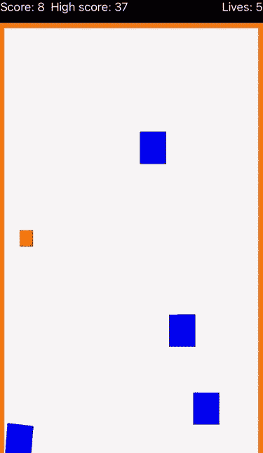

在我的例子中，我有一个简单的方形精灵，它向来自右边的敌人发射射弹。如果他们一直向左，你就失去了一条命。如果你拿下其中一个，你的分数就会增加。

让我们先来看看 SwiftUI，它需要一个稍后我们将创建的 SpriteKit 场景。

我们有一个名为`GameModel`的`ObservableObject`来存储我们的数据，还有一个显示我们游戏的`ContentView`结构。在一个`VStack`的顶部，我们正在显示`HUDView`，它告诉我们当前的分数是多少，我们有多少条生命，以及之前记录的最高分数是多少。当我们的生命耗尽时，重启按钮就会出现。这只是改变了`GameModel`对象中的一个`@Published` 属性，我们正在用`ContentView`中新的`.onChange`修改器观察这个属性。

本质上，我们是说当`restartGame`为真时，我们想给我们的`GameScene`发送一条消息，它应该从开始就解除暂停并重新加载游戏。

高分是使用`@AppStorage`属性包装器记录的，它以一种方便的方式将数据保存到`UserDefaults`。我将在本文档的另一章中提供更多关于新属性包装器的信息，但重要的是，使用此包装器的属性会被永久保存，并且可以在下次加载应用程序时轻松调用。当玩家失去生命时，还有一个游戏结束状态，需要玩家点击重启按钮才能再次开始游戏。这将重置分数，移除敌人，并像游戏开始时一样重新开始繁殖敌人。

以下是 SpriteKit 代码:

不要太担心游戏的逻辑，因为这是一个用 Swift 编写的 SpriteKit 游戏。如果你不太了解 SpriteKit，很明显我也不了解，有很多教程可以帮助你入门。

关于`SpriteView`需要知道的重要一点是，它让你可以轻松地将 2D 游戏嵌入到 SwiftUI 中。

# 2.0 中的新功能:文本编辑器

在 WWDC 2020 之前，我们只能用`TextField`或`SecureTextField`在 iOS 中处理文本编辑。这些基本上是相同的文本字段，只有`SecureTextField`会像任何密码字段一样，通过用黑色圆圈替换字符来掩盖您正在键入的内容。这些文本字段之间的重要相似之处在于它们只允许单行。这意味着多行编辑的唯一选择是使用`UIViewRepresentable`从 UIKit 转换`UITextView`:

这相对复杂，但也允许更多的属性。`UITextView`允许对`dataDetectorTypes`进行更改，这将从键入的文本创建可点击的 URL。使用`clearsOnInsertion`可以用新文本替换当前文本，并且我们可以通过调用`scrollRangeToVisible`滚动到指定的字符串可见。有关更多信息，请查看 [UITextView 文档](https://developer.apple.com/documentation/uikit/uitextview)。

虽然我们无法访问这些属性，但新的`TextEditor`是对`TextField`的重大升级。

我们现在可以创建一条多线`TextEditor`，就像创建一条单线`TextField`一样简单。

凡是能适用于`Text`的，都可以适用于`TextEditor`。当我尝试使用[新的动态类型语法](https://www.hackingwithswift.com/quick-start/swiftui/how-to-use-dynamic-type-with-a-custom-font)和自定义字体时，文本似乎没有根据`TextStyle`进行缩放。这可能是第一个测试版的一个错误，或者是我做的方式有问题。无论哪种方式，我对 TextEditor 的功能所能做的最好的例子就是允许用一个`Stepper`来改变字体大小，用一个`Picker`来改变字体粗细。一个`ColorPicker`可用于选择前景(字体)颜色，但要注意背景目前似乎不起作用。

`TextEditor`似乎有一个`systemBackground` 颜色的不透明背景，给它添加一个背景只是在它后面放一个背景。

您的背景将完全不可见。

有一个变通办法，这可能是我们目前能做的全部:

不过，TextEditor 确实支持边框，如下图所示。

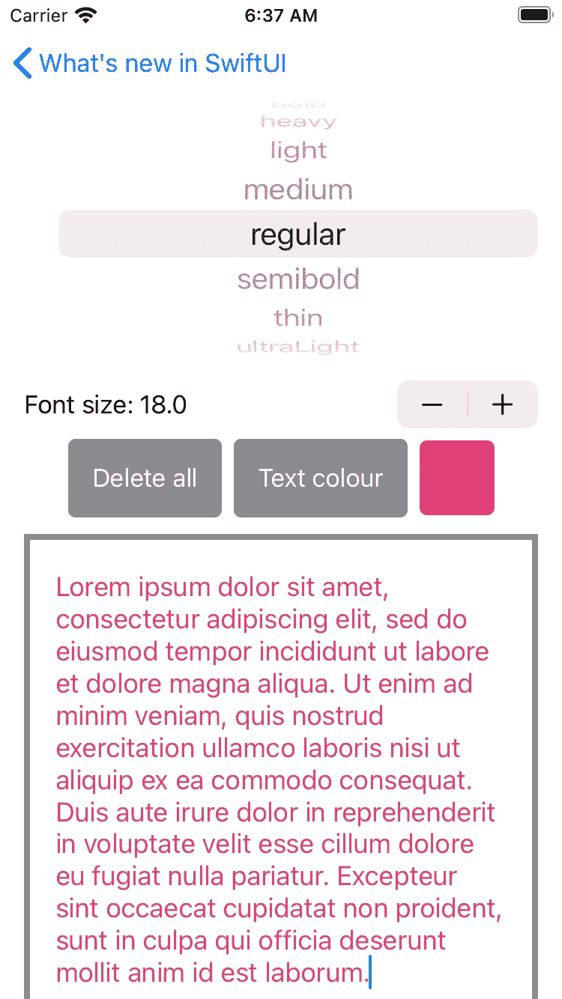

# 2.0 中的新功能:SignInWithAppleButton

在 iOS 13 中引入了登录苹果，作为一种无需提供电子邮件和密码即可安全登录应用程序的方式。使用 Apple 登录使用生物特征来鉴定您是 Apple ID 的所有者，然后向应用程序发送自动生成的转发地址和密码。

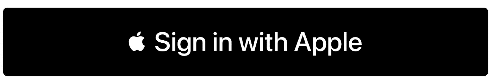

这个新按钮简化了在你的应用中使用苹果登录的过程

以下示例以约束允许的最大尺寸显示`SignInWthAppleButton`(宽度≤ 375)。你没听错:这个观点是有约束的。看起来苹果只是把现有的[包装成了`UIViewRepresentable`中的 ASAuthorizationAppleIDButton](https://developer.apple.com/documentation/authenticationservices/asauthorizationappleidbutton)，这正是我们去年让按钮进入 SwiftUI 所需要做的。但是如果你看到在 iOS 13 中[实现苹果登录需要哪些步骤，我们就免去了在协调器中设置委托协议的额外任务。](https://medium.com/better-programming/swiftui-sign-in-with-apple-c1e70ccb2a71)

我的版本借鉴了苹果的例子，将认证结果输出到应用程序中的`Text`并打印出来。第一次尝试时，您可能会注意到登录按钮没有任何作用；这当然是我的经历。

第二次点击应该会显示预期的输出。

# 进度视图(2.0 中的新功能)

[UIActivityIndicatorView](https://developer.apple.com/documentation/uikit/uiactivityindicatorview)是一个 UIKit 控件，允许您显示不确定加载状态的微调器。如果不将它包装在 UIViewRepresentable 中，我们无法直接使用它，但是现在我们有了一个等效的！构造不带任何参数的 ProgressView 会导致它显示一个微调器，但向它传递一个进度值会允许它显示为一个水平进度条。

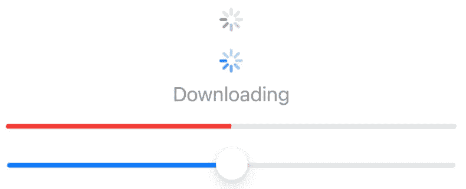

进度条形式类似于 [UIProgressView](https://developer.apple.com/documentation/uikit/uiprogressview) ，在加载网页时经常与`WKWebView`结合使用。

您可能会注意到，中间的例子有一个名称、一个值和一个总参数。通常这将导致`ProgressView`显示为一个水平进度条，就像下面的例子。然而，你会注意到我已经应用了`.progressViewStyle`修改器，将它传递给`CircularProgressViewStyle`，使其具有与默认`accentColor`相匹配的色调。结果不是一个进度条，而是一个蓝色的圆形微调器。

这说明了一个事实，即当应用一个样式时,“下载”标签被保留，而`ProgressView`必须变成圆形，这抵消了自动行为。

# 仪表视图(2.0 中的新功能)

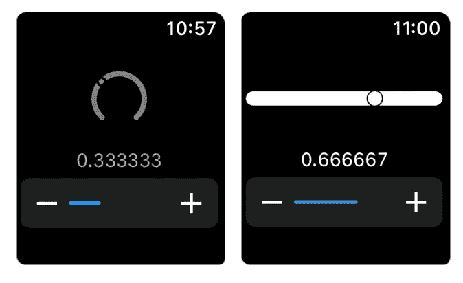

`GaugeView`是唯一一款专属于 WatchOS 7 的新`View`。这是一个相对简单的指示器，用于显示数值在标尺上的位置。在我下面的例子中，我还添加了一个`Slider`，用于改变`Gauge`显示的值。这看起来有点奇怪，因为滑块实际上在它自己的蓝色条上显示当前值。设计仪表的样式非常困难。默认的仪表样式，也称为`LinearGaugeStyle`，使用`Color.primary`作为其前景色，使用`.foregroundColor`或`.accentColor`修饰符不会改变这一点。同样的，`CircularGaugeStyle`用的是`Color.gray`，这个不能改。

指示仪表上当前值的拇指或圆圈看起来像一个面具，至少在`LinearGaugeStyle`的情况下是这样。添加`.background(Color.blue)`改变圆的颜色。

# 标签(2.0 中的新功能)

这是一个相对简单的方法，将苹果现在更大的免费图标的 SF 符号集合中的一个符号与一些提供更大上下文的文本相结合。在我的例子中，我用一个`HStack`来比较一个`Label`和等价的。在第一个 Xcode 12 测试版中有一个错误，导致了`Label`的`Image`与文本不对齐，但现在这个错误已经被修复了。`.labelStyle`有两个选项，一个只显示`Text`，一个只显示`Image`。

# 链接(2.0 中的新功能)

我一直认为在 iOS 应用中不能使用超链接有点可惜。当然，您可以创建一个带有蓝色文本的按钮来打开一个 URL，但是这需要的代码比您每次想写的代码都要多。在这个例子中，我使用的是方便的初始化器`Button`，它只接受一个标题字符串(或本地化的字符串密钥)，因为这是我能得到的最小的原始形式的代码。

在 iOS 14 中，我们现在有了`Link`，它替我们做了上面`Button`的动作部分。我不喜欢[苹果的文档](https://developer.apple.com/documentation/swiftui/link)用“！”不安全地打开一个网址运算符，因为这是一种极其糟糕的做法，我很惊讶他们会在代码示例中鼓励这种做法。当然，他们可能知道这个特定的网址已经成功创建，因为他们链接到了 example.com/TOS.html，这是一个由 IANA 互联网号码分配机构所有的网站，它将网址转换成 IP 地址。

但是，如果你把 URL 字符串的有效性留给你的人类确定性，你迟早会犯错误。

任何应用程序在不安全地打开一个可选的时候意外地发现零，都会立即崩溃。

这就是为什么我上面的例子比苹果的例子多花了几行，但它做得很安全。在 SwiftUI 的第一个版本中，由于缺少可选绑定(`if let`或`guard let`)，这个例子受到了阻碍，因为我只能将我的 URL 与 nil 进行比较，以确保它存在。当这种比较确认 URL 不为空时，这仍然不意味着我可以在`Button`中使用它而不用先打开它。这就是为什么在`Button`动作中有一个稍微令人困惑的额外步骤，它可选地绑定 URL 以确保它不为零。

我本可以将`assertionFailure`放在 else 语句中的`Button`动作中的`if let`之后，但是为了与我的`Link`示例保持一致，我想添加`EmptyView`。不需要包含`EmptyView`的 else 语句，因为当 if 条件为假时，`ViewBuilder`闭包的唯一占用者周围的任何 if 语句都将返回`EmptyView`。但是我想明确地说明如果我们的 URL 为零会发生什么。用户将什么也看不到，但是在调试模式下将为开发人员触发一个断言。

这将使我们意识到 URL 是空的，但不会导致最终用户崩溃。

现在 SwiftUI 支持 if let，我可以直接创建像 URL 这样的属性，并创建使用这些数据的视图。和以前一样，只有在可以创建 URL 时才会显示链接，但是我们不需要进行多次检查来确保这一点。

# 菜单(2.0 中的新功能)

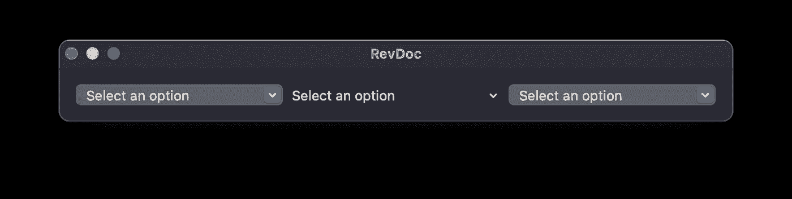

默认样式是 BorderedButtonMenuStyle

`MenuButton`已被`Menu`取代。最初的是一个下拉菜单，替换的并没有太大的不同。新名字增加的主要内容是清晰，因为我们正在谈论一个菜单和里面的项目，所以称它为按钮没有多大意义。`Menu`有几种不同的款式可供选择。默认样式是`BorderedButtonMenuStyle`，这就是为什么右边的`DefaultButtonMenuStyle`看起来一样，而中间的`BorderlessButtonMenuStyle`看起来不一样。

除了新的样式之外，它删除了任何关于它是一个“下拉”菜单的事实，唯一的变化是`MenuButton`被称为`Menu`并且`.menuButtonStyle`修饰符现在被称为`.menuStyle`。

在第一个测试版中`Menu`只在 macOS 上可用，就像它取代的控件一样。

不过 [beta 3 也在 iOS 上增加了对菜单的支持](https://medium.com/@luca.jon/swiftui-contextmenu-and-menu-for-ios-e01f90e525f6)。

# MenuButton(在 2.0 中已弃用)

参见上面的`Menu`，它取代了`MenuButton`，但具有许多相同的功能。

# 文本(在 2.0 中更新)

文本可能是创建视图最简单的构件。在大多数情况下，您将传递一个`String`来创建它，这将是它显示的内容。该文档的原始版本包含了创建它的所有其他方法，包括从本地化、ObservableObjects 和子字符串。这些可以在这个例子的底部找到，但我们在 2020 年也有许多新的初始化器，它们包括在这个例子的顶部。

第一个非常令人兴奋，因为它可以接受任何通用对象和从`Formatter`继承的任何类。这可以是 Apple 提供的任何一种`Formatter`类型，或者，在我的例子中，是您专门为自己的自定义类型创建的`Formatter`。我不太确定`Formatter`是如何实现的，所以我只是随意地将该对象绑定到我的自定义类的一个实例，并在所有其他情况下返回 nil。

注意，带有`LocalizedStringKey`、`tableName`、`bundle`和`comment`的文件需要一个使用`.strings`文件扩展名的单独文件。正如在[苹果关于这个初始化器](https://developer.apple.com/documentation/swiftui/text/3065754-init)的文档中提到的，唯一需要的参数是键的字符串。我给出了一个详细的例子，主要是为了让您了解这些其他参数需要什么。

`tableName`的默认值是`Localizable`，这是字符串文件的标准名称。我特意将我的命名为`Local`,以说明为什么我需要这个参数。默认情况下，这个包是主包，所以在这种情况下传递`Bundle.main`是多余的。注释应该给出上下文信息，但是在这个例子中，我只给了它字符串`Comment`。

`Text`现在可以使用插值包含一个`Image`，或者表示一个`Date`。新增三种字体:`caption2`、`title2`和`title3`。这些都是作为 [UIFont](https://developer.apple.com/documentation/uikit/uifont/textstyle) 的一部分提供的，所以它们出现在 SwiftUI 上也就不足为奇了。新的修饰符允许您选择文本是大写还是小写，以及是使用等宽还是衬线设计。

我还没有包括使用动态类型的新方法，使您的自定义字体像系统样式一样容易访问。为此，我将使用 Swift 的动态类型指南链接到 [Hacking，因为我只会重复那里说过的话。](https://www.hackingwithswift.com/quick-start/swiftui/how-to-use-dynamic-type-with-a-custom-font)

# 图像(在 2.0 中更新)

SF Symbols 2 支持在 Mac 应用程序中使用。试图使用`Image(systemNamed:)`在 Xcode 11 中使用 SF 符号会导致错误“外来参数标签‘system named:‘in call’”。这意味着你不能在任何本地 Mac 应用程序中使用 SF 符号，甚至不能在 Catalyst 应用程序中使用，因为 macOS 无法显示它们。据推测，在 macOS Catalina 上运行的 SF Symbols Mac 应用程序使用 PNG 作为符号的缩略图，因为它们不可能一直使用`Image(systemNamed:)`。

无论如何，从 Xcode 12 和 macOS 11 Big Sur 开始，你将不会收到那些警告，并且可以在原生 macOS 和 Mac Catalyst 应用中使用`Image(systemNamed:)`。

# 按钮(在 2.0 中更新)

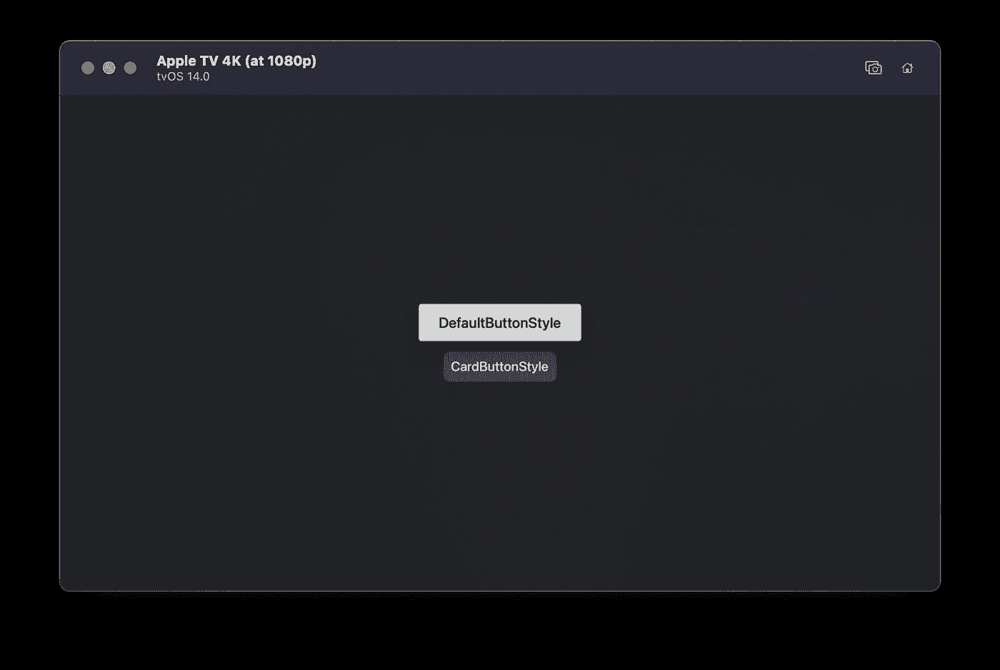

现在 tvOS 上有一个`CardButtonStyle`选项，它制作了一个较小的按钮，颜色不太明显。上面的例子显示了一个没有任何风格的`Button`，所以它采用了`DefaultButtonStyle`，所以你可以看到不同之处。新的`Button`更加微妙，可以用于不太重要的选项，而不是那些被赋予更明亮颜色的选项。

我必须给`CardButtonStyle` `Button`添加填充，因为出于某种原因它没有填充。这可能会在以后的测试版中改变，因为我只在 Xcode 12 beta 2 上测试过。

# 粘贴按钮(在 2.0 中更新)

此控件允许您在 MacOS 上粘贴信息，但在 iOS 上不可用。它可以采用各种数据类型，这些数据类型被表示为 UTIs。引用苹果的文档，“统一类型标识符声明了从其他应用程序加载、保存或打开资源的通用类型。”在 Xcode 11 中，当创建一个`PasteButton`时，有必要在一个数组中提供这些字符串。

我在示例中包含了一个函数，可以让您查找任何类型的 UTI 字符串，这可能会在实现这个按钮时对您有所帮助。

现在我们有了一个名为`[UTType](https://developer.apple.com/documentation/uniformtypeidentifiers/uttype)`的新结构，这使得创建您想要支持的类型变得更加容易。你可以给这个结构的初始化器传递一个在 Xcode 11 中有效的字符串，或者你可以使用提供的众多系统声明类型[中的一个。](https://developer.apple.com/documentation/uniformtypeidentifiers/uttype/system_declared_types)

接受字符串的初始化器返回一个可选的，所以如果你使用它，你必须确保你使用的字符串是正确的。我在我的例子中使用了`UTType.text`，但是我在下面包含了一个从字符串手动构造它的例子。请注意，不建议使用感叹号强制展开可选的。我只是想说明从系统声明的类型中得到的`UTType`不是 nil，所以从字符串中构造的等价类型也不是 nil。

一旦决定了需要什么类型的标识符，就需要处理从`NSItemProvider`中获得的数据。我的例子只粘贴了数组中的第一项，但希望它能清楚地说明如何处理其他数据类型和多项。

以下是符合`[NSItemProviderWriting](https://developer.apple.com/documentation/foundation/nsitemproviderwriting)`的类型列表，因此可以用`PasteButton`粘贴:

*   `[CNContact](https://developer.apple.com/documentation/contacts/cncontact)`
*   `[CNMutableContact](https://developer.apple.com/documentation/contacts/cnmutablecontact)`
*   `[CSLocalizedString](https://developer.apple.com/documentation/corespotlight/cslocalizedstring)`
*   `[MKMapItem](https://developer.apple.com/documentation/mapkit/mkmapitem)`
*   `[NSAttributedString](https://developer.apple.com/documentation/foundation/nsattributedstring)`
*   `[NSMutableString](https://developer.apple.com/documentation/foundation/nsmutablestring)`
*   `[NSString](https://developer.apple.com/documentation/foundation/nsstring)`
*   `[NSTextStorage](https://developer.apple.com/documentation/uikit/nstextstorage)`
*   `[NSURL](https://developer.apple.com/documentation/foundation/nsurl)`
*   `[NSUserActivity](https://developer.apple.com/documentation/foundation/nsuseractivity)`
*   `[UIColor](https://developer.apple.com/documentation/uikit/uicolor)`
*   `[UIImage](https://developer.apple.com/documentation/uikit/uiimage)`

您还可以使用自己的自定义类型来符合该协议，从而允许您粘贴自定义类型的数据。

# 切换(在 2.0 中更新)

iOS 上的默认样式 SwitchToggleStyle 现在允许我们选择一种仅当切换绑定的布尔值为真时才显示的色调颜色。iOS 和 iPadOS 上的默认切换色调是绿色，而 Mac Catalyst 上的默认切换色调是蓝色。在原生 Mac 应用程序中使用带有色调颜色选项的新 SwitchToggleStyle 当前会显示我们预期的开关，但色调颜色仍然是默认的蓝色。

最上面的`Toggle`，我加的时候没有加`ToggleStyle`做对比，显示的是 macOS 默认的`CheckboxToggleStyle`。这是一个复选框，打开时会显示勾号，并且没有色调选项。我给这个开关添加了一个`accentColor`修饰符，这表明当用户没有在他们的系统偏好设置的常规部分的高亮颜色下拉菜单中选择‘强调颜色’时，macOS 实际上允许改变开关色调。

这可以用来改变`Toggle`的任何一种风格；我只是没有给第二个添加`accentColor`修改器来显示带有淡色的`SwitchToggleStyle`没有效果。

# 日期选择器(在 2.0 中更新)

现在`DatePicker`有两个新款式，叫做`GraphicalDatePickerStyle`和`CompactDatePickerStyle`。

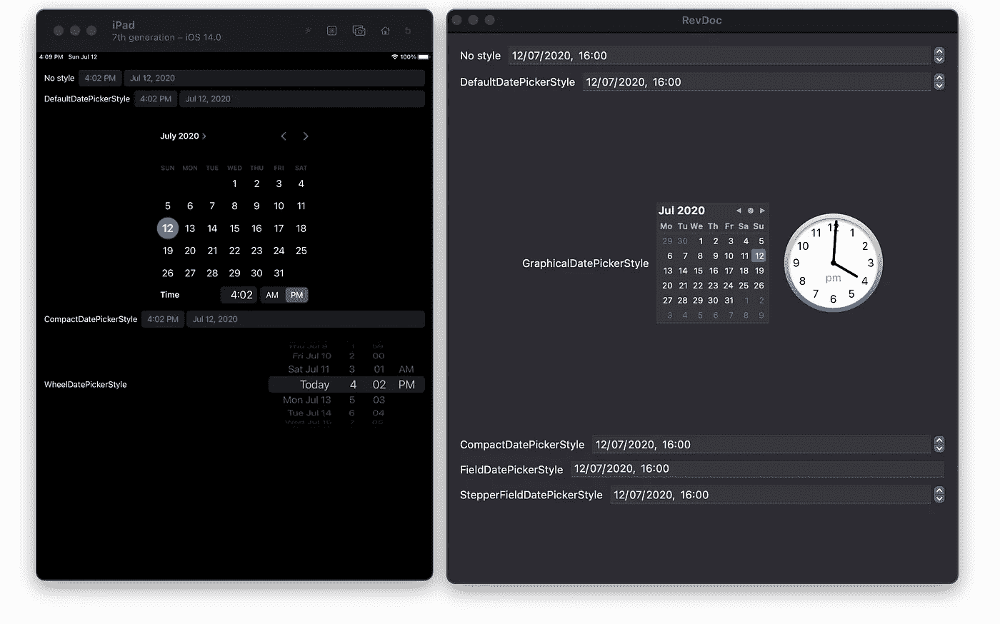

你可能会注意到右边 macOS 上的`GraphicalDatePickerStyle`版本比左边 iOS、iPadOS 和 Mac Catalyst 共享的版本小得多。当我允许最小高度为 400 时，我只能让`DatePicker`正确显示。少一点的话,`DatePicker`就会截取一些文本——特别是用来设置时间的部分。

这导致宽度按比例缩放，这意味着在像 iPhone 8 这样的小设备上，`DatePicker`超过了屏幕宽度。也许这将在未来的测试版中得到解决，因为我使用的是 Xcode 12 beta 2。不幸的是，在 iOS、iPadOS 和 Mac Catalyst 上可用但不是原生 macOS 应用程序的 WheelDatePickerStyle 似乎仍然具有最小宽度，这使得它在小屏幕上的标签空间非常小。

`CompactDatePickerStyle`现在是 iOS、iPadOS 和 Mac Catalyst 上的默认。这实际上是一个显示当前值的按钮，当点击按钮时，会显示一个类似于`GraphicalDatePickerStyle`的小日历。这使您可以非常紧凑地显示当前日期，而无需一直显示整个日历。

我的示例在`WheelDatePickerStyle`示例周围有条件编译标志`#if os(iOS) || targetEnvironment(macCatalyst)`。

这意味着无论你为什么平台构建它，你都会看到该平台支持的所有`DatePicker`变体。

# 2.0 中新增和更新的视图修改器

# 。matchedGeometryEffect(2.0 中的新功能)

从名字就可以看出，`[.matchedGeometryEffect](https://developer.apple.com/documentation/swiftui/securefield/matchedgeometryeffect(id:in:properties:anchor:issource:)?changes=latest_minor)t`是一种动画效果，可以改变大小和位置。


像[萨润的例子](https://sarunw.com/posts/a-first-look-at-matchedgeometryeffect/#what-is-matchedgeometryeffect-for%3F)，我用了一个`Text`和一个`Shape`，但是我的是一个`Circle`而不是一个`RoundedRectangle` ( *完全*不同)。我认为在各种配置中放置两个视图会很有趣，而不是在 bool 的基础上从一个`VStack`变成一个`HStack`。这些配置是相对于`TextPosition`枚举的，您可以猜测它的值是什么意思。这些值是左、中、右、上和下。当`Text`位于中间时，`Circle`通过降低其不透明度进行调整，从而更容易看到在`ZStack`中层叠在它上面的文本。

我的例子相对简单，所以请查看以下更好的来源:

*   [用 Swift 进行黑客攻击:matchedGeometryEffect()](https://www.hackingwithswift.com/quick-start/swiftui/how-to-synchronize-animations-from-one-view-to-another-with-matchedgeometryeffect)
*   [SwiftUI 实验室 MatchedGeometryEffect 第 1 部分](https://swiftui-lab.com/matchedgeometryeffect-part2/) & [第 2 部分](https://swiftui-lab.com/matchedgeometryeffect-part2/)
*   [苹果的 Fruta 样本 app 代码](https://developer.apple.com/documentation/swiftui/fruta_building_a_feature-rich_app_with_swiftui)

# 。帮助(2.0 中的新功能)

可访问性修饰符。“帮助”提供了 MacOS 中的工具提示以及在 MacOS 和 iOS 上都有效的辅助功能提示。我的例子展示了这个新的修饰符实际上是如何覆盖先前应用的任何可访问性提示的，反之亦然。当我在 iOS 上运行这个时，VoiceOver 将第一个文本读为“标签 1，帮助 1”，因为帮助修饰符是在提示后添加的。第二个文本读作“标签 2，提示 2”，因为该提示是在 help 修饰符之后添加的。

这种行为在 MacOS 上是类似的，除了显示帮助文本的工具提示，而不管帮助是否被可访问性提示覆盖。换句话说，虽然第二段文字仍然被 VoiceOver 读为“标签 2，提示 2”，但是鼠标悬停在上面仍然显示“帮助 2”。

在 Mac Catalyst 中，似乎既不读取帮助修饰符也不读取可访问性提示。

Catalyst 中似乎也没有帮助的工具提示功能。

# 。可访问性(输入标签:)(2.0 中的新功能)

输入标签由语音控制(不是 VoiceOver)和全键盘访问使用。当启用语音控制时，说出“点击输入”等命令将按下此`Button`。这为您的 UI 元素提供了一系列不同的标签，VoiceOver 看不到这些标签。

换句话说，它们是人们口头描述按钮的方式。

# 。可访问性(selectionIdentifier:)(在 2.0 中已弃用)

该标识符先前被`Picker`用来识别当前选择。

# 。scaleEffect(在 2.0 中更新)

这不是新的，但是一个原始的修改器已经被修复了。在 Xcode 11 中，。scaleEffect(x: 2)导致 Y 缩放为零。在 Xcode 12 中，默认参数都是 1，这意味着您可以保持其中一个不变，并缩放其中一个，而无需同时设置两个参数。

打电话。Xcode 11 中的 scaleEffect()将整个视图缩放为零！

在 Xcode 的每个版本中试试上面的例子，你就会明白我的意思了。

在 Xcode 11 中，两个矩形都是不可见的，而在 Xcode 12 中，它们显示为一个正方形和一个矩形。

# 。imageScale(2.0 中的新功能)

`[imageScale](https://developer.apple.com/documentation/swiftui)`似乎只适用于符号。我尝试过将图像文件的名称传递到图像的初始化器中，但是`imageScale`似乎不起作用。

然而，它将在`Label`上工作，它也有一个初始化器，为所提供的 SF 符号之一取一个系统名。

# 。重音颜色(在 2.0 中更新)

下面的第一个例子在 iOS 13、macOS Catalyst 13、tvOS 13 和 watchOS 6 上是可能的。唯一不支持它的平台是 macOS，但这在 2020 年发生了变化。用一个`Button`来改变字体颜色，这在以前的平台上是不可能的。

在我的第二个例子中，我使用了`foregroundColor`来改变 Mac 上`Button`的字体颜色。这是可行的，但在 Xcode 12 中不再需要。

现在我们可以使用`accentColor`来改变所有平台上的字体颜色，这允许我使用接受字符串的`Button`版本，并且不需要我创建`Text`。

# 。preferredColorScheme(在 2.0 中更新)

现有的`colorScheme(_ colorScheme: [ColorScheme](https://developer.apple.com/documentation/swiftui/colorscheme))`修饰符现在在苹果操作系统的当前版本中被弃用。此修改器的目的是覆盖单个视图及其子视图的系统配色方案，而`preferredColorScheme`用于覆盖整个演示文稿的配色方案。这是指显示视图的弹出窗口或窗口。

虽然这个修饰符不是新的，但是 2020 年新增加的是这个参数现在是可选的。为了说明这一点，我的例子包含了一个开关，它可以改变纸张是否应该是深色的。用`colorScheme`，不可能有三进制表达式`sheetIsDark ? .dark : nil`，但现在我们可以用`preferredColorScheme`。

`preferredColorScheme`只适用于演示文稿，而不是每个单独的视图，这似乎是一个缺点，但我不知道为什么你想只对一个视图应用配色方案。

你要么希望你的应用程序的屏幕使用系统配色方案，要么你想用你自己的覆盖它。

如果你想让不同的视图表现出不同的配色方案，你可以改变它们的配色方案。

# 。text content type(2.0 中的新功能)

这个修饰符告诉设备当用户输入时什么样的建议是有用的。

您可能会注意到，与其他平台相比，这个修改器在 Mac 上采用了不同的类型。Mac 不仅不能使用任何 UITextContentType 声明，而且还被限制使用 NSTextContentType，该类型目前只有三个选项。当我试用它们时，我看不出它们在 MacBook Touch Bar 上提供的建议有什么不同，但也许我在某种程度上做错了。

我注意到没有用户名和密码的建议，这可能是不必要的。

我没有时间一一介绍它们，也没有时间注意它们的复杂性，但是我提供了它们的一个数组，这样我的代码示例就不会太长。

看看你能找到什么不同，然后告诉我！

# 。listItemTint(2.0 中的新功能)

根据平台的不同，更改列表项的色调会有不同的效果。引用苹果关于新`.listItemTint`修改器的官方文档:

> 包含列表的样式将适当地应用该色调。watchOS 使用浅色作为其背景拼盘外观。iOS 和 macOS 上的边栏将淡色应用到它们的`ItemLabel`图标，否则默认使用强调色。

在寻找一种叫做`ItemLabel`的东西后，我意识到这似乎并不存在。然而，`List`中的任何项目都可以是`Label`，所以我尝试了一下，它成功了。


我不知道他们为什么指定“iOS 和 macOS 上的侧边栏”，因为它似乎对任何`List`都通用，而且 iOS 没有侧边栏。

那是 iPadOS，完全*不一样！*

watchOS 使用浅色作为背景是一个巨大的差异。`Label`图标完全不着色，着色用于任何项目，而不仅仅是`Label`。`.listItemTint`修饰符可以直接采用一种颜色，但它也可以采用一种叫做`ListItemTint`(带有一个大写字母)的结构。您可以给它一个`.preferred`变体，它可以被父类覆盖，或者给它一个`.fixed`变体，它不能。在 iOS 上，`ListItemTint`的`.monochrome`样式使图标变成灰色，而在 watchOS 上，它使列表项的背景变成黑色。在 iOS 上，你会注意到`.accentColor`和`Color.blue`的变化是一样的，而在 watchOS 上，重音颜色是灰色而不是蓝色。

# 。listRowPlatterColor(在 2.0 中已弃用)

上面新的`.listItemTint`修改器取代了`.listRowPlatterColor`。

这个不赞成使用的修饰符只在 WatchOS 上可用，而且只有一种颜色。有了`.listItemTint`，你可以使用`ListItemTint`，所以你不仅仅局限于一种颜色。新的修改器也覆盖了旧的，所以即使在`.listItemTint`之后使用`.listRowPlatterColor`，也会使用传递给`.listRowPlatterColor`的颜色。

# 。onLongPressGesture(在 2.0 中更新)

现在可以使用 SwiftUI 向 tvOS 上的视图添加长按手势。

你需要能够给你的视图添加焦点，所以我使用了`focusable()`修改器。你可以在没有参数的情况下使用这个修饰符，但是我使用了一个闭包来改变我的自定义按钮的颜色，当它们有焦点时显示出来。如果我不这样做，在任何给定的时间都不会有哪个按钮被选中的指示。我使用了一个枚举来包含四种按钮状态:未聚焦、聚焦、按下和按下。没有必要为按下状态设置一个闭包，但是我这样做是为了说明在长按达到其最小持续时间之前，您可以运行代码。默认的持续时间是 0.5 秒，所以如果您也增加这个持续时间，您可能只需要对 UI 进行更改。

这个代码从 2019 年开始可以在任何平台上工作，但从 2020 年开始只能在 tvOS 14.0 上工作。

# 。onOpenURL(2.0 中的新功能)

这个修饰符与打开网站的 URL 无关。这些网址只能由你的应用程序打开，而且只能由你的应用程序打开。

`onOpenURL`修饰符适用于使用新 SwiftUI 应用生命周期的 SwiftUI 应用，该生命周期不使用 AppDelegate 或 SceneDelegate。如果你的项目中有这些文件，你可能无法让这个修改器工作，就像我一样。创建项目时，确保选择“SwiftUI App”作为生命周期选项，而不是“UIKit App Delegate”。

要为您的应用程序创建一个独特的 URL 方案，请选择您的项目设置的“信息”标签，无论它是用于 iOS 还是 macOS 目标。无需更改屏幕顶部的自定义目标属性，您会看到屏幕底部已经有一个 URL 类型部分。打开它并单击“+”按钮将允许您为您的应用程序创建一个新的 URL 方案，前提是它是唯一的，并且不能与用户设备上的任何其他应用程序相同。为了这个例子的目的，我称它为`my-scheme`，但是你可以选择任何东西。

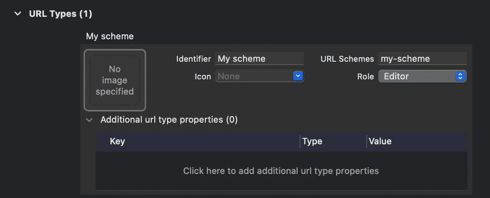

标识符字段是可选的，但是您可能想要使用它，因为 URL 类型在没有它的菜单中被简单地称为*无标题*。

现在我们已经有了一个 URL 方案，我们可以用代码来完成剩下的工作。在下面的例子中，我添加了使用文本字段来改变打开的链接的功能。您设置的 URL 方案需要在 ContentView 结构中设置为常量。如果你像我一样使用我的方案，你不需要做任何事情。我扩展了 URL、字符和字符串，以便过滤来自文本字段的输入。

因为 URL 中允许的字符被设置为一个名为`allowedCharacters`的常量，所以我们可以确定添加到 TextField 中的任何文本都可以成功创建一个 URL。如果创建的 URL 除了非法字符什么都没有，这段代码会把它们全部过滤掉，留给我们一个空字符串。这是代码可能失败的一种方式，因为 URL 不能用空字符串创建。幸运的是，我们是单独应用 URL 方案的，URL 只能用这个方案来构造，其他什么都没有，所以在这种情况下，空字符串是可以的。

无论您是否键入 URL，显示“Open”的链接都会打开该 URL，onOpenURL 修饰符会将该 URL 添加到一个列表中。因为我们是在打开这些网址的应用程序中进行这项工作，所以我们实际上并不去任何地方。如果您想要查看链接实际执行的操作，请尝试输入以您在 Safari 中设定的 URL 方案开头的 URL。这将询问您是否要打开应用程序中的 URL，然后您将被带回到应用程序。

如果一切正常，您在 Safari 中输入的 URL 也应该被添加到已打开的 URL 列表中。

# 。onPasteCommand(2.0 中的新功能)

这个花了很长时间才弄明白。[onPasteCommand](https://developer.apple.com/documentation/swiftui/text/onpastecommand(of:perform:)-6gha3)的官方文档称修饰符增加了“一个响应系统粘贴命令的动作”但是不要认为你给它的闭包会在你粘贴到一个`TextField`时运行。修改器似乎只对 SwiftUI 视图有效，而不是像 TextField 那样用`UIViewRepresentable`包装 UIKit 控件。

但是如果它不是一个`TextField`，你怎么允许一个视图接受粘贴呢？毕竟，在没有文本字段的情况下尝试这样做会导致错误声音，并且默认菜单栏中的编辑>粘贴选项是灰色的。答案就在[WWDC 2019](https://asciiwwdc.com/2019/sessions/231)第 231 届会议的一份文字记录中，当时发布了该修改件的原始版本:

> 然而，我想指出一些真正使 onPaste 不同于 onDrop 的东西。第一部分是闭包里没有位置参数。这是了解这里到底发生了什么的关键。当你拖放时，用户通过光标或触摸位置直接定位哪个视图应该接受拖放，但是粘贴命令更加间接。用户要么从菜单中选择粘贴，要么使用键盘快捷键或 iOS 中的新手势。**我们解决粘贴命令应该指向哪个视图这一问题的方法是使用焦点系统。**

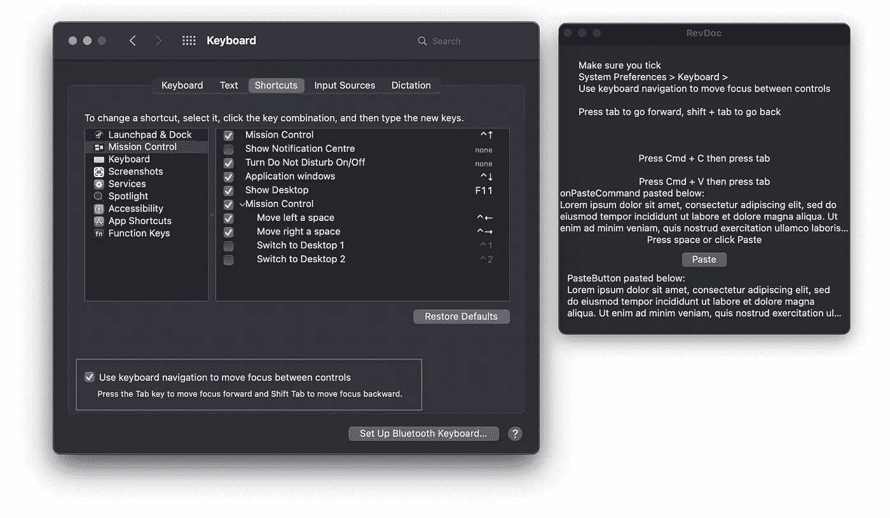

您必须在 macOS 系统偏好设置中启用键盘导航选项，此功能才能工作

如果你点击 onPasteCommand 的官方文档中的链接[，你会注意到其中完全没有提到对焦系统。那么什么是焦点系统呢？SwiftUI 的聚焦指南](https://developer.apple.com/documentation/swiftui/text/onpastecommand(of:perform:)-6gha3)很好地解释了这一点，所以我只总结一下与这个修饰符相关的重要部分。如上面截图的左窗口所示， **focus 需要 macOS 上的系统偏好设置中的设置，该设置允许您使用标签按钮**在可聚焦的项目之间导航。

现在您已经启用了它，我的代码示例应该可以工作了。

本质上，我们在顶部有一个`Text`，当应用程序运行时，它会自动获得焦点。假设您在系统偏好设置>常规中选择了默认的“多色”强调色，您会注意到它被蓝色轮廓包围。如果您选择了不同的强调颜色，则`Text`将以该颜色显示。现在，当您从菜单栏中选择 Edit > Copy，或者按下等效的 cmd+C 组合键时，我们运行一个闭包来复制到剪贴板。

这对于使用`onPasteCommand`并不是绝对必要的，但是这是控制粘贴板中数据的统一类型标识符的一种更简单的方法。2020 年的`onPasteCommand`与 2019 年的原版的主要区别在于`UTType`结构的存在。2019 年，闭包将接受的类型以类似“public.utf8-plain-text”的字符串形式给出。

这使得在键入字符串时出现人为错误的可能性很高，并且也不容易找到什么字符串适用于您想要的类型。

有了`UTType`结构，我们有了大量的常量，这些常量可能涵盖了你可能想要粘贴的任何内容。您也可以遵循`[UTTypeContent](https://developer.apple.com/documentation/uniformtypeidentifiers/uttypecontent)`和/或`[UTTypeData](https://developer.apple.com/documentation/uniformtypeidentifiers/uttypedata)`协议来创建自己的协议。如果您想看的话，我已经包含了一个常量，它显示了所有提供的数据类型的数组。在`onCopyCommand`闭包中，您可能会注意到我们正在将想要复制的字符串转换为`NSString`。

以下是符合`[NSItemProviderWriting](https://developer.apple.com/documentation/foundation/nsitemproviderwriting)`的类型列表，因此可以用`[NSItemProvider](https://developer.apple.com/documentation/foundation/nsitemprovider)`粘贴:

*   `[CNContact](https://developer.apple.com/documentation/contacts/cncontact)`
*   `[CNMutableContact](https://developer.apple.com/documentation/contacts/cnmutablecontact)`
*   `[CSLocalizedString](https://developer.apple.com/documentation/corespotlight/cslocalizedstring)`
*   `[MKMapItem](https://developer.apple.com/documentation/mapkit/mkmapitem)`
*   `[NSAttributedString](https://developer.apple.com/documentation/foundation/nsattributedstring)`
*   `[NSMutableString](https://developer.apple.com/documentation/foundation/nsmutablestring)`
*   `[NSString](https://developer.apple.com/documentation/foundation/nsstring)`
*   `[NSTextStorage](https://developer.apple.com/documentation/uikit/nstextstorage)`
*   `[NSURL](https://developer.apple.com/documentation/foundation/nsurl)`
*   `[NSUserActivity](https://developer.apple.com/documentation/foundation/nsuseractivity)`
*   `[UIColor](https://developer.apple.com/documentation/uikit/uicolor)`
*   `[UIImage](https://developer.apple.com/documentation/uikit/uiimage)`

当第一个文本有焦点时，一旦你复制了，你可以按 tab 键将焦点循环到下一个`Text`。当这个`Text`被突出显示时，粘贴运行`onPasteCommand`闭包，它接收一个`NSItemProvider`实例的数组。要将最新条目的数据转换回字符串，我们首先需要加载条目的数据表示，并将其转换成字符串。然后我们使用一个绑定到下面的`Text`显示的字符串，这样我们可以立即看到操作是成功的。

我还包括了一个`PasteButton`的例子，这样你就可以看到`onPasteCommand`是多么的相似。

闭包采用完全相同的 UTType 实例数组，尽管参数被标记为`supportedContentTypes`。

# 。翁德拉格和。onDrop(在 2.0 中更新)

下面的两个视图互不了解。它们不共享一个可观测的对象。最上面的一个不会传递一个`Binding<String>`给最下面的一个，也不会传递一个常量给它的初始化器。它们之间唯一的联系是顶部应用了一个提供`UTType.utf8PlainText`种类数据的`.onDrag`修饰符，底部应用了一个期望`UTType.utf8PlainText`的`.onDrop`修饰符。

有关 UTType 的更多信息，请参见上面的`.onPasteCommand`。

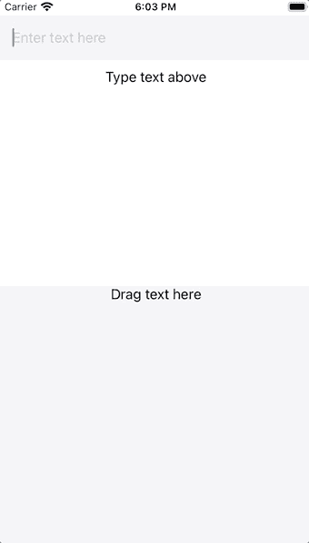

`TextField`用于生成一个字符串，这个字符串是唯一的，只有一个视图知道。一旦生成，它将显示为带有圆角的橙色矩形。这个橙色的形状被赋予了一个`.onDrag`修饰符，该修饰符为底层数据提供了一个`NSItemProvider`，该数据已经被转换为`NSString`，因为这个类符合`NSItemProviderWriting`协议。

提供某种类型的`NSItemProvider`是你的视图变得可拖动所需要做的，但是你必须有一个地方放下它以便拖动是有用的。

这就是`.onDrop`的用武之地。

在`DragView`中，我们有一个类似的`TextWithBackground`，由于它有一个清晰的背景并且没有文本，所以最初被隐藏了。

与`.onDrag`不同，`.onDrop`需要一个符合 DropDelegate 协议的委托。与某些委托类型不同，DropDelegate 可以是一个结构，而不必是一个类。这个协议唯一的强制性要求是它有一个名为`performDrop`的函数，这个函数确实像它听起来的那样。您尝试读取数据，如果成功，则返回 true 以确认发生了拖动。如果任何一点有错误，就返回 false。

这是我的代码中唯一稍微复杂的部分，但是它与上面的`PasteButton`和`.onPasteCommand`中使用的代码有很多相似之处。

# 。onChange(2.0 中的新功能)

SwiftUI 最初版本的一个恼人之处是缺少[属性观察者](https://www.hackingwithswift.com/sixty/7/3/property-observers)。使用类似于`didSet`的东西的唯一方法是在`ObservableObject`类中使用它，它允许您在每次属性值改变时运行闭包。由于这些是常规的 Swift 类，它们不能使用`[@State](https://www.hackingwithswift.com/books/ios-swiftui/why-state-only-works-with-structs)`[属性包装器，该包装器只对结构](https://www.hackingwithswift.com/books/ios-swiftui/why-state-only-works-with-structs)有效。但是他们可以像我们期望的那样使用属性观察器，甚至可以在标记为`@Published`的属性上使用，因此可以从 SwiftUI 访问。

因为结构是值类型，而`self`是不可变的，所以当发生变化时，结构需要完全重新创建。在`@State`的情况下，属性已经被观察到。对该属性的更改会导致结构被完全重新创建，因为它不能被改变。

引用 `[@State](https://www.hackingwithswift.com/books/ios-swiftui/why-state-only-works-with-structs)` [属性包装器](https://www.hackingwithswift.com/books/ios-swiftui/why-state-only-works-with-structs)的官方文档:

> 一个`[State](https://developer.apple.com/documentation/swiftui/state)`实例不是值本身；这是一种读写值的方法。要访问一个状态的底层值，使用它的变量名，这将返回`[wrappedValue](https://developer.apple.com/documentation/swiftui/state/wrappedvalue)`属性值。

因此，你的结构中的属性实际上并不是你所认为的值——它是一个包装器，实际上把它保存在一个完全独立和不可见的结构中。这就是为什么包装器的文档将它声明为`@propertyWrapper struct State<Value>`，因为它不仅修改了属性的行为，还将它存储在其他地方。这就是为什么试图使用`didSet`属性观察者不起作用的原因:属性包装器的实例永远不会改变，只有它的 wrappedValue 属性会改变。

那么我们如何在这些变化的基础上做任何事情呢？

在 SwiftUI 存在的第一年，在`ObservableObject`中使用属性包装器几乎是唯一的方法。在 2020 年，我们有一个新的修饰符叫做`.onChange`，当`@State`属性的值改变时，它允许你的结构中的任何视图运行闭包。如果一个`TextField`有一个`Binding<String>`，当字符串改变时，它可以使用修饰符来运行代码。但是观察变化的视图不需要直接的`Binding`来对变化作出反应，并且布局的另一部分中的`Button`的`.onChange`修饰符不会或多或少地使用这种能力。

为了让事情变得更有趣，我的例子使用了一个`Binding`而不是一个`State`作为属性供`onChange`观察。`.onChange`观察的值实际上可以是任何符合`Equatable`的类型。为了更好地了解 Equatable 影响 SwiftUI 视图的所有方式，请查看 SwiftUI 实验室关于 EquatableView 的教程。注意不包含`.onChange`修饰符的`ContentView`仍然受到其子`OnChangeView`修饰符中逻辑的影响。

例如，`ContentView`中的`TextField`在`OnChangeView`中的`Toggle`关闭时被清空，尽管它没有`Binding`来控制或者甚至不知道它的存在。

这可能是这个新修改器最强大的功能之一，因为它允许层次结构中任何地方的视图判断情况，并要求其他地方的视图也应该根据它所关心的属性重新绘制。

# 。键盘快捷方式(2.0 中的新功能)

引用苹果公司的文档。键盘快捷键:

> 当控件位于最前面的窗口或场景中的任何位置，或者位于 macOS 主菜单中的任何位置时，按下控件的快捷键相当于与控件直接交互以执行其主要操作。

下面是两个`Button`和相关键盘快捷键的例子。第一个按钮的键是`.upArrow`，但是没有指定修饰符。你可能认为这意味着按下向上箭头将执行`Button`的动作，但那将是错误的。命令按钮是默认的修饰键，所以这个`Button`实际上需要按下 Cmd + Up 组合键。

第二个按钮确实显式地声明了一个修饰符，允许它使用 shift 键而不是 command。如果你读过上面的`onPasteCommand`修饰符，你会发现在 macOS 上有一个系统偏好选项，可以用 tab 键在可聚焦的项目中导航。如果启用该选项，您会发现默认情况下顶部的`Button`会高亮显示。Tab 将焦点移到第二个按钮，Shift + Tab 将焦点移回第一个按钮。

无论哪个`Button`被聚焦，你设置的键盘快捷键依然有效。

这也许是这些快捷键最有用的方面，因为尽管空格键将执行当前聚焦的`Button`的功能，它们仍然继续工作。

# 。focusedValue 和@ focused binding(2.0 中的新功能)

这是一种在视图之间传递数据的新方法。我们没有使用`ObservableObject`，而是使用`FocusedValueKey`来保存数据。

在下面的例子中，`DisplayTextView`能够显示您输入到`TextFieldView`中的文本，尽管绑定<字符串>或字符串常量没有在视图之间传递。

这里的神奇之处在于底部的结构和扩展。

`FocusedValueKey`协议要求一致性结构对于它们存储的值有一个`typealias`。

一旦有了为键定义了`typealias`的结构，就需要为该值定义一个 getter 和 setter。这个对`FocusedValue`的扩展将`\.text`定义为我们将用来读写值的键。注意，getter 和 setter 都使用`FocusedTextKey`类型作为`FocusedValues`的下标。现在我们只需要在`TextFieldView`中写一个值给 key，然后我们需要在`DisplayTextView`中从中读取。

`TextField`上的`.focusedValue(\.text, $text)`修改器将值保存到键中。

`DisplayTextView`中的`@FocusedBinding(\.text) var text: String?`属性为其订阅相关值的变化。请注意，它是可选的，因为不必设置该值。正如苹果官方文档所说，“与`EnvironmentKey`不同，`FocusedValuesHostKey`没有默认值要求，因为一个键的默认值始终是`nil`。”我假设最初的名字是`FocusedValuesHostKey`，因为文档中仍然提到了它，尽管它已经不存在了。

换句话说，你可以设置一个键，而不用给它一个值，你的代码仍然会运行。

当你设置一个值时，你需要像我一样使用 nil 合并操作符来展开它。?'。

你可能会问的下一个问题是为什么需要这些值。毕竟，它们似乎是全球性的，至少在单一窗口的背景下是如此。我们不希望将所有数据都放在这个范围内，拥有大量数据可能会使调试变得困难。[苹果开发者论坛上的一个更复杂的例子展示了一个有趣的用例。当 Mac 应用程序有单独的命令时，例如本例中的 Shift、Cmd + D，您可能仍然希望访问应用程序中的数据，尽管这些命令在`WindowGroup`范围内。](https://developer.apple.com/forums/thread/651748)

现在你可以了！

# 。首选 DefaultFocus 和。聚焦镜(2.0 中的新功能)

在 tvOS 14 和 watchOS 7 上，我们现在有能力声明默认情况下我们想要聚焦的用户界面元素。在 tvOS 上，这很重要，因为按下 Siri 遥控器的触摸表面会执行带有焦点的`Button`的动作。在 watchOS 上，聚焦元素通过移动数字表冠来控制。

在`VStack`中，默认情况下俯视图总是会获得焦点，除非我们采取措施防止这种行为。

为此，我们需要定义可以覆盖焦点系统的范围。声明一个焦点范围需要一个`@Namespace`，这个主题在上面的`.matchedGeometryEffect`部分有更多的细节。重要的是我用我的财产给了一个`Namespace.ID`，我也叫它`namespace`。我将它传递给了 VStack 上的`.focusScope`修改器，现在我们有了自己的作用域。

我需要做的另一件事是在底部的`Button`上使用`.prefersDefaultFocus`修饰符，传递给它名称空间。

现在底部的`Button`将被默认聚焦，尽管它不在`VStack`的顶部。

# 。全屏覆盖(2.0 中的新功能)

与`.sheet`不同的是，`.fullScreenCover`修改器呈现一个覆盖整个屏幕的模态视图，你可能不会对此感到惊讶。我举了一个例子，它允许你无限地创建表单和全屏封面，因为这向你展示了关于它们如何工作的重要信息。可以滑动表单来消除它，但全屏幕封面不能。一个视图可以允许两种模态，并且模态本身在任何一种情况下都可以是相同的。

我已经在模态中提供了`@Environment(\.presentationMode)`属性，由于没有滑动解除，全屏盖无法解除。

# 。defaultAppStorage(2.0 中的新功能)

这个修饰符`.defaultAppStorage`改变了整个视图的`@AppStorage`属性保存到什么`UserDefaults`。如果你不熟悉`@AppStorage`或`UserDefaults`，这是一种保存简单信息的方式，在用户退出应用程序后仍然存在。`@AppStorage`属性包装器将不会在这里具体介绍，但它将作为我的文档的修订版的状态和数据流章节的一部分介绍。

引用 Axel Kee 的帖子[何时使用用户默认值、钥匙串或核心数据](https://fluffy.es/persist-data/):

> 之前，我们已经解释过 UserDefaults 将数据保存到 plist 中。使用 [iExplorer](https://macroplant.com/iexplorer) 等应用程序，用户可以访问他们 iPhone 的 Library/Preferences 文件夹，并轻松读取/修改 UserDefaults plist 数据(例如:将“boughtProVersion”的布尔值从 false 更改为 true，或者更改硬币的数量)。**永远不要在 UserDefaults** 中存储用于检查用户是否购买了应用内购买的布尔值！用户可以很容易地改变它(无需越狱)，并免费获得你的好东西！😬
> 
> 除了应用内购买状态之外，出于同样的原因，您也不应该在 UserDefaults 中存储用户密码/ API 密钥。

# 。app store overlay(2.0 中的新功能)

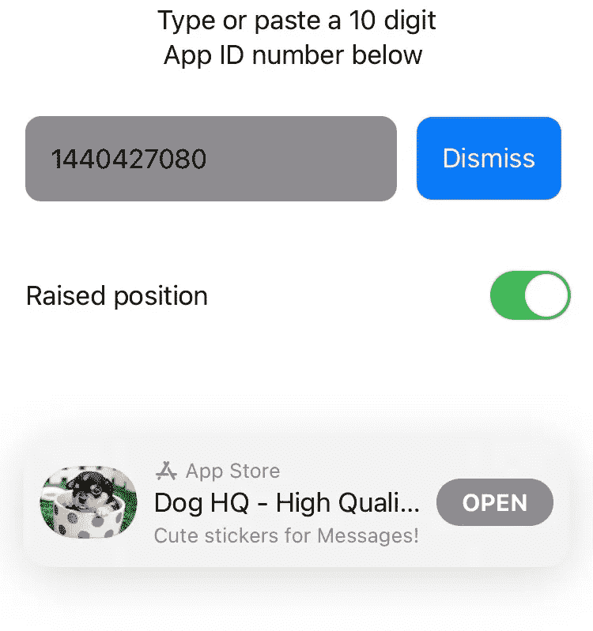

为了推荐一个自己或者别人做的 app，需要知道 10 位的 App ID。如果你拥有该应用，这相对容易，因为你会在 App Store Connect 的应用信息部分找到它。然而，如果你不知道一个应用程序的应用程序 ID，请前往 [iTunes Link Maker](https://linkmaker.itunes.apple.com/en-gb) 并搜索它，确保将媒体类型更改为 Apps，这样你就不会只是获得一堆音乐。无论你选择什么应用程序，都会给你一个直接链接，链接以一个数字结尾，后面跟着一个查询。

10 位数代码位于字母“id”和问号“？”之间。

例如，苹果开发者应用有链接:
[https://apps.apple.com/us/app/apple-developer/id**640199958**？mt=8](https://apps.apple.com/us/app/apple-developer/id640199958?mt=8)

因此 App ID 为 **640199958。**

在这一节的开始有一个我的例子的截图。我添加了一个`TextField`，您可以在其中键入或粘贴应用 ID，一个`Button`用于切换应用商店覆盖图的外观，还有一个切换按钮用于更改位置。

一个应用商店覆盖只有两个位置:`.bottom`和`.bottomRaised`，因此这个开关的名字叫做“凸起”。

# 。工具栏(2.0 中的新功能)

使用`ToolBarItem`可以在所有平台上轻松创建工具栏。这些可以是`Button`或任何视图。

就放置 ToolBarItem 而言，有许多选项。

我将引用 Majid 的精彩帖子[在 SwiftUI](https://swiftwithmajid.com/2020/07/15/mastering-toolbars-in-swiftui/) 中掌握工具栏，而不是重述他所说的话:

> *自动* —该项目被放置在默认部分，根据当前平台的不同而不同。
> 
> *主要操作* —该项目代表一个主要操作。通常情况下，SwiftUI 会将这个项目放在 iOS 上的导航栏中，或者放在 watchOS 上其他视图的顶部。
> 
> 有一些放置选项，我们只能在模态视图显示的工具栏中使用。
> 
> *confirmationAction* —该项表示一个模态接口的确认动作。您可以在工作表中使用它来确认保存操作。
> 
> *cancellationAction* —该项表示一个模态接口的取消操作。
> 
> *destructiveAction* —该项表示一个模态接口的破坏性操作。您可以在删除一些数据的模态屏幕中使用它。
> 
> 还有许多特定于平台的放置选项。
> 
> *底部工具栏* —该项目被放置在底部工具栏中。它仅在 iOS 上可用。
> 
> *导航栏前导* —该项目被放置在导航栏的前导区域。仅在 iOS 和 macOS 上可用。
> 
> *导航栏 training*—该项目被放置在导航栏的尾部区域。仅在 iOS 和 macOS 上可用。

# 。预览上下文(2.0 中的新功能)

当您想预览一个可以用新的 WidgetKit 框架制作的小部件时，您遇到了一个问题。可能适用于其他 SwiftUI 视图的预览在设备上显示全屏应用程序，或者如果您选择`.previewLayout(.fixed(width: 300, height: 300))`，则显示自定义大小和形状。

我们不再需要手动选择一个尺寸来匹配部件的外观，我们现在有了一个新的修改器，允许我们从部件的三个尺寸中进行选择。

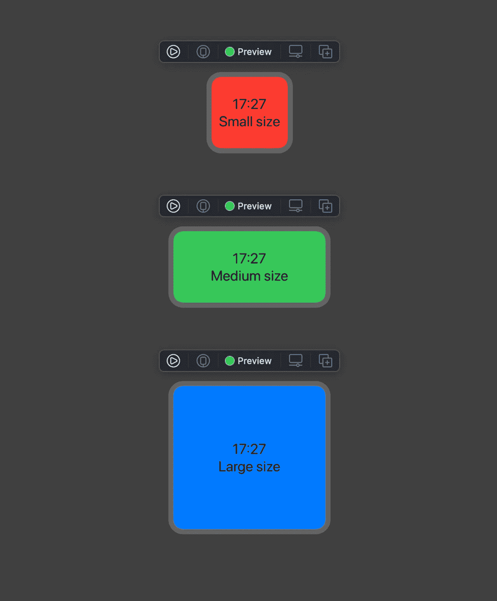

据我所知，这些是`.previewContext`的唯一选择:

*   `.previewContext(WidgetPreviewContext(family: .systemSmall))`
*   `.previewContext(WidgetPreviewContext(family: .systemMedium))`
*   `.previewContext(WidgetPreviewContext(family: .systemLarge))`

如你所见，我们需要初始化`WidgetPreviewContext`，这符合`PreviewContext`协议。我们传入一个`WidgetFamily`枚举的实例，这提供了预览所需的配置。我决定用我的例子制作一个普通视图，而不是制作一个完整的小部件。我这样做是因为这需要更少的代码，同时也是为了表明 previewContext 可以适用于任何视图。

我制作了一个包含实际小部件的例子，如果你想看代码的话。

我上面的例子使用了一个`Date`扩展来获取时间字符串。这没有太多的理由，但是在一个真正的小部件中，你需要在你的`TimelineEntry`结构中有一个`Date` 对象。视图的其余部分使用环境变量`\.widgetFamily`来访问我们传递给`WidgetPreviewContext`的值。我可以根据这个值为`backgroundColor`和`text`使用计算出的属性，所以在每种情况下，视图最终完全不同。

当我在 Xcode 12 beta 2 上尝试时，我无法在 body 属性中使用 switch 语句。当我这样做时，即使我在 switch 语句的每种情况下都有基于计算属性的相同视图，我也会得到每个预览的“中等”颜色和文本，即使它们都显示为不同大小的小部件。当你读到这篇文章时，这个问题可能已经解决了。

在我发现 PreviewContext 的用途之前，我已经指出在文档中很少能找到有用的信息，我仍然不知道它是如何工作的

如果你想自己做`PreviewContext`呢？我尽了最大努力，但由于苹果`WidgetPreviewContext`实现的不可访问性，这有点困难。该协议要求您允许来自符合`PreviewContextKey`的结构实例的下标，并且您返回一个与该键结构中的`typealias`匹配的值。该类型实际上可以是任何类型，因为它没有任何类型的协议要求或限制。

当我试图制作自己的 PreviewContext 时，我希望能够将小部件做得太大。小部件有一个最大尺寸，所以我认为尝试将它们显示得比以前更大会很有趣。为此，我使用了一个 enum，就像`WidgetFamily`一样。枚举有一个名为`size`的计算属性，这将用于定义我的小部件预览的大小。不使用下标，我决定只做一个新版本的`previewContext`修饰符。

毕竟，我们无法知道最初的修改器实际上是如何工作的。

我的自定义版本`.previewContext`可以选择绑定传递给它的自定义值，将其转换为 my `LargePreviewContext`类型。当这成功时，我从存储在那里的自定义枚举案例中获取预览的大小，并返回具有该大小和形状的自定义预览的视图。如果可选绑定失败，我只需使用 previewContext 的常规版本。

你可能会注意到，我底部的`PreviewProvider`同时使用了两种`previewContext`。使用系统版本，我的自定义`PreviewContext`完全被忽略。使用我的自定义版本，它是成功的。这是我试图复制这些协议的基本原理。苹果可能没有在这些结构中存储任何尺寸信息，因为访问内部的`WidgetFamily` enum case 可能会为系统提供足够的信息来提供来自其他地方的尺寸。

然而，它在表面下工作，`.previewContext`是一个神秘的新功能，可能会导致未来更多的定制预览的方式。

如果你想出了更好的方法来利用它，让我知道！

# 。用户活动和。onContinueUserActivity(2.0 中的新功能)

既然我们可以让[在没有应用委托](https://medium.com/better-programming/swiftuis-new-app-lifecycle-and-replacements-for-appdelegate-and-scenedelegate-in-ios-14-c9cf4a2367a9)的情况下制作 SwiftUI 应用，我们需要能够添加通常会有的功能。也就是说，假设我们没有采取步骤[向 SwiftUI 应用](https://www.hackingwithswift.com/quick-start/swiftui/how-to-add-an-appdelegate-to-a-swiftui-app)添加应用委托。`.onOpenURL`修饰符是另一个闭包的例子，它在应用程序恢复时采取行动。

我发现`.onContinueUserActivity`的主要用途是从 Spotlight 搜索中打开应用程序。下面的示例创建了一个显示 10 个 UUIDs 的列表。这些唯一标识符将用于在每个项目变得可搜索时识别它们。当应用程序启动时，UUIDs 被生成并保存到`UserDefaults`。

仅当点击`List`中的`Button`时，UUID 才会被索引，创建一个`CSSearchableItem`并为其分配一个`CSSearchableIndex`。

如果此功能打印“保存成功”，则您选择的 UUID 已被编入索引。

我发现很难让我的 UUIDs 出现在搜索中，但这可能是因为我没有添加搜索词。为此，使用您的`CSSearchableItemAttributeSet`的`keywords`属性，它只是一个可选的字符串数组。尽管没有这样做，我还是通过搜索我的应用程序的名称找到了我的 UUIDs。虽然应用程序本身会出现，但您也会看到一个在应用程序内搜索的选项，显示为搜索结果，您的应用程序名称旁边有一个放大镜图标。

点击这个应该可以调出你已经索引的 UUIDs。

当你点击一个已被索引的项目时，应用程序将会打开。如果没有应用程序委托，我们如何知道当它出现时该做什么？`.onContinueUserActivity`修饰符就是这么做的，它给出了一个函数，当任何搜索活动打开应用程序时，这个函数就会运行。但是我不需要传递函数，因为我可以很容易地使用尾随闭包来代替。重要的是我可以选择绑定商品的 ID，这样我就可以确定我有一个 UUID。

我将 UUID 设置为一个`State`属性，并呈现一个显示该数据的警报供您查看。UUID 应该与您在搜索中选择的项目描述相匹配。

我提供了一个空的`.onContinueUserActivity`版本的实现，用一个字符串代替`activityType`，尽管我无法让它工作。

`.userActivity`修改器“广告”一个`NSUserActivity.`你可以看到当 UUID 改变时这个更新。在我的例子中，我发现在这里打印更改之前有大约 30 秒的长时间延迟。这是当你的活动，无论是什么，将可用于移交，如果实现的话。

在任何情况下，了解这些修饰词的重要一点是，它们与非连续性、移交和聚光灯搜索相关。

# 。tabItem(在 2.0 中更新)

这个就不多说了，我就贴个苹果的例子，在顶部加个`@available`属性。

注意到什么了吗？

对于 WatchOS 来说，`TabView`以及允许您在标签栏上创建代表该页面的图标的修饰符`.tabItem`都是新的。虽然它去年在 Mac、iOS、iPadOS 和 tvOS 上可用，但它今年才刚刚出现在手表上。你可能会问，它可能采取什么形式？它类似于 UIKit 的`[UIPageViewController](https://developer.apple.com/documentation/uikit/uipageviewcontroller)`,每一页都要求你从一页水平滑动到另一页。虽然`.tabItem`修饰符存在，但是苹果示例中的`Text`和`Image`都是不可见的。


相反，我们得到的是点，这与`UIPageViewController`利用`[UIPageControl](https://developer.apple.com/documentation/uikit/uipagecontrol)`的方式非常相似，苹果将其描述为“一系列水平的点，每个点对应于应用程序文档或其他数据模型实体中的一个页面。”

# 。上下文菜单(在 2.0 中更新)

和上面的`.tabItem`一样，`.contextMenu`去年是新的，但今年已经来到了一个新的平台，和上面的`.tabItem`一样，我使用了苹果的一个例子。这一次我付出了更多的努力，因为为 tvOS 改编他们的例子实际上需要制作`Text`和`.focusable`，这在这篇文章的前面有详细的介绍。一旦视图可以成为屏幕上的焦点元素，它也可以接收长按手势。如果它有一个`.contextMenu` 修饰符，这将显示您提供给它的选项列表。

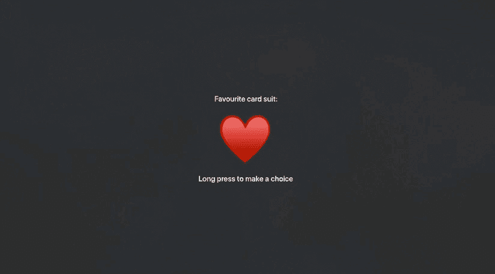

事实上，我能够使用一个`Text`意味着你不需要一个`Button`来做到这一点，但是正如我所说的，你使用的视图必须使用`.focusable()`修饰符才能工作。

我是这样做的。

# 。导航标题和。导航子标题(2.0 中的新功能)

这次我做不出比苹果官方文档更好的了:

> 视图的导航标题用于直观地显示界面的当前导航状态。在 iOS 和 watchOS 上，当在导航视图内部导航到某个视图时，该视图的标题会显示在导航栏中。在 iPadOS 上，主要目的地的导航标题在应用程序切换器中反映为窗口标题。类似地，在 macOS 上，主要目的地的标题被用作标题栏、窗口菜单和 Mission Control 中的窗口标题。

这是苹果官方的导航文档 Subtitle :

> 视图的导航副标题用于在导航标题旁边提供额外的上下文信息。在 macOS 上，主要目的地的字幕与标题栏中的导航标题一起显示。

我的例子用一个`Picker`遍历了`navigationBarTitleDisplayMode`的选项，所以你可以看到它们的样子。我把这个例子限制在 iOS 上，因为`NavigationBarItem.TitleDisplayMode`选项与 macOS 兼容。

# 。navigationViewStyle(在 2.0 中更新)

WatchOS 现在有能力使用`[.navigationViewStyle](https://developer.apple.com/documentation/swiftui/text/navigationviewstyle(_:))`，但似乎唯一提供的价值是`[StackNavigationViewStyle](https://developer.apple.com/documentation/swiftui/stacknavigationviewstyle)`。任何平台上唯一的另一个选项是`[DoubleColumnNavigationViewStyle](https://developer.apple.com/documentation/swiftui/doublecolumnnavigationviewstyle)`，你可以打赌这不会很快出现在 WatchOS 上！

# 。navigationBarTitle(在 2.0 中已弃用)

事实上，macOS 上没有导航栏，这也是更通用的`.navigationTitle`正在取代`.navigationBarTitle`的原因之一。并不是所有出现`.navigationBarTitle`的文档页面都显示它已被弃用，但是`Text`的页面显示它已被弃用。看起来可能会有错误，即使它应该被弃用，却没有被弃用。例如，它目前在 Mac Catalyst 13.0 上不被弃用，但如果它在 iOS 13.0 上被弃用，这似乎没有什么意义。

# `.navigationBarItems (Deprecated in 2.0)`

要将`Button`添加到导航栏的开头或结尾位置，请使用带有`ToolbarItem(placement: .navigationBarLeading)`和/或`ToolbarItem(placement: .navigationBarTrailing)`的工具栏。

# iOS、iPadOS、Mac Catalyst 和 tvOS 上的样式(2.0 中的新功能)

这里有一个两者都用的例子。标签样式和。indexViewStyle 是 2020 年的新功能，在 macOS 上不可用:

以下是`PageIndexViewStyle`的选项，这是目前唯一可以传给`.indexViewStyle`的东西:

*   `.automatic`:后台使用平台默认
*   `.interactive`:只有在与索引视图交互时才显示背景
*   `.always`:背景总是显示在页面索引视图的后面
*   `.never`:页面索引视图后面不显示背景

# 仅 macOS 上的样式(2.0 中的新功能)

我不能让他们工作，但他们在这里！这些样式与呈现的窗口有关，所以我只能假设它是你呈现在视图前面的窗口。`.groupBoxStyle`修改器是新的，但是我们只能和`DefaultGroupBoxStyle`一起使用，除非我们自己定制。

这些的名字至少足够清楚，即使我不能给出一个可行的例子，你也能大致想象它们是做什么的。

# 后续步骤

在我写这篇文章的时候，SwiftUI 才一岁，而且已经有了大量的资源。如果没有以下网站，我的写作是不可能的:

*   [利用 Swift 进行黑客攻击](https://www.hackingwithswift.com)
*   [Swift UI 实验室](https://swiftui-lab.com)
*   [带 Majid 的 Swift】](https://swiftwithmajid.com)
*   [WWDC by Sundell](https://wwdcbysundell.com)
*   [雨燕 by Sundell](https://www.swiftbysundell.com)
*   [LOSTMOA 博客](https://lostmoa.com/blog)

如果你有很棒的资源可以与社区分享，请告诉我，我会很乐意把它添加到这个列表中。

正如我在帖子开头所说的，如果你对某个主题有更详细的要求，或者如果你认为我犯了一个错误，请在下面的回复中告诉我。

感谢阅读！