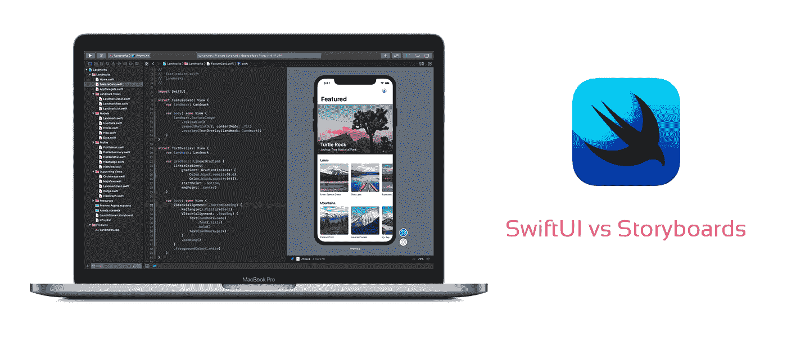

# SwiftUI 与自动布局:每种方法的优缺点

> 原文：<https://betterprogramming.pub/swiftui-vs-autolayout-pros-and-cons-of-both-approaches-c09b37b9aff2>

## 加入新的 SwiftUI 语言还是继续使用负担得起的故事板系统？

[Yura Fresh](https://unsplash.com/@mr_fresh?utm_source=unsplash&utm_medium=referral&utm_content=creditCopyText) 在 [Unsplash](https://unsplash.com/search/photos/ios?utm_source=unsplash&utm_medium=referral&utm_content=creditCopyText) 上的照片

我还记得苹果发布 [Swift](https://developer.apple.com/swift/) 语言的时候，那是一个真正的突破，是超越现代编程语言的一步。这让开发人员非常兴奋。

距离其发布日期(2014 年 9 月)已经过去五年了，苹果一直在将该语言升级到 Swift 5，有时提供良好的功能，有时只是更新 Xcode IDE 和故事板的改进。

然后，SwiftUI 语言在 6 月份的 WWDC 2019 上亮相，并在此后不久开始流行。对我来说，似乎每个人都喜欢 SwiftUI。

SwiftUI 语言/技术是一种新的方法来为 iOS 应用程序设计用户界面，它基本上是一个全新的系统，可能会取代自动布局系统。

Auto Layout 是可视化的，而 SwiftUI 是声明性的，为开发人员提供了编写 UI 的能力，而不是可视化地组合它。

这两者之间有许多差异，即使我们没有遗留自动布局支持的截止日期，猜测和谣言也在悄悄地说 SwiftUI 将是 iOS 编程中 UI/UX 开发工具的未来。

# 自动布局:从零到框架

自动布局系统是苹果公司在 2011 年构思的，后来发布给了开发者，并在 iOS 中得到支持。

自动布局的功能基于一个系统，该系统能够使用开发人员定义的约束和规则来调整其呈现和外观。

这些规则指定了视图是否应该放大、缩小、移动位置坐标等等，使得所有 UI 组件都能够响应并适应屏幕大小、分辨率和不同的上下文。

当苹果推出不同屏幕尺寸的 iPhone 时，自动布局开始变得重要——第一个案例是 iPhone 5，它比以前显示了更长的屏幕。

今天，对于标准的 iphone，加上 iphone，X 模型等等，所有的自动布局实现都是你无法避免的，它们只是强制性的，只要你创建了一个新的 Xcode 项目，自动布局支持就已经构建好了，随时可以使用。

自动布局不是苹果的专利，也不是唯一的 UI 系统。这只是苹果公司创建界面和管理界面响应的方式——如果你看看微软用来构建 Windows 界面的工具。它们非常相似。

在这些年中，我们经历了 UI 合成和自动布局的挑战性复杂性，尽管它很简单，但已经发展了很多，有时需要良好的技能和框架的集成才能使它们工作。

在某些情况下，我经历过使用 Swift 而不是 Xcode 或 Storyboards 来编码接口的需求，因为它们的条件和上下文相关的方面行为。

我曾多次被迫在 Swift 中而不是在视觉上设置约束和规则，并且我一直在努力争取原生苹果对它的支持。

这就是为什么我在大多数情况下使用 [Snapkit](http://snapkit.io) 来支持我的 UI 编码，我真的认为这是一个很棒的工具，简单而有效。有许多其他工具和框架支持自动布局功能，可能 90%的现代 iOS 应用程序需要它们来构建复杂的 ui。

我仍然记得 iPhone 3G 上的早期应用程序，它们看起来都一样。但是，现在每个流行的应用程序看起来都不错，有复杂的用户界面行为，经常使用视差、[洛蒂](https://airbnb.io/lottie/)动画、相对定位、渐变等等。

# SwiftUI:新的、好的和坏的

新的 SwiftUI 被认为是对 UI 合成和开发的重新排序。

环顾四周，有许多框架、环境和技术的用户界面更多的是“定义的”而不是“组成的”。想想旧的基于 XML 的 UI 组合，甚至 HTML/CSS 方法——它基本上是声明性的，而不是通过使用可视化工具来组合。

声明式界面在混合应用中很流行，因为几乎所有的界面都是使用 [Flutter](https://flutter.dev/) 和 [Ionic](https://ionicframework.com/) 开发的。

Flutter 使用声明性接口，如旧的 Sencha 或现代的 React native。在 IONIC 中，用户界面是纯 HTML/CSS，并没有太大的不同。

我对 SwiftUI 的第一印象是，对于简单的界面来说，它可能很有用，是一个不错的选择，但对于复杂的界面来说有点不合适。

通过使用 Swift 等特定于 UI 合成的语言编写所有内容来合成 UI 的想法对我来说听起来有点奇怪，即使有拖放 Xcode 功能的帮助。

想象一下，有一个像社交 feed 一样的界面，一个像脸书一样的个人资料页面…我们确定用 SwiftUI 来编码会是一件愉快的事情吗？我不确定。

你必须承认，这会导致嵌套的代码块和声明看起来非常糟糕和混乱。

是的，我们有一个简化的语法，它与 Xcode 使用故事板和编写 XML 构建的语法没有太大的不同，但在预测我的应用程序将使用复杂的动画和 UI 时开始使用 SwiftUI 可能有点鲁莽。

在我去过的所有研讨会上，在我看过的每个教程中，在我读过的每个演示中，SwiftUI 界面都很基本，我知道现代应用需要更多。

# 自动布局和 SwiftUI 的优缺点

## **自动布局和故事板得到了开发者的良好支持和熟知**。

我们在这一年中使用了太多的自动布局，我们知道如何解决这个问题。

SwiftUI 在理论上使用了相同的方法(SwiftUI 基本上是一种设置类似自动布局的约束的不同方式，它不是一种独立的工具或独立的技术)，但它是新鲜的，新的，有时这对开发人员的体验有负面影响。

## **SwiftUI 看起来很酷，看起来代码很快**

由于基本组件自动集成了基本约束和行为，简单的接口可以在零到很短的时间内完成编码。

## **故事板和连续镜头让你知道你在做什么**

SwiftUI 基本上是为设计单一视图而设计的。

## 自定义视图扩展支持 Xcode 故事板

**Xcode Storyboards 通过@IBDesignable decorators 得到自定义视图扩展的支持，SwiftUI 需要时间得到社区开发的自定义工具的支持和集成。**

## ****仅 iOS 13 支持 swift ui****

**这可能是最有影响的负面方面，因为基于 SwiftUI 的应用至少一年内不会在企业环境中发布。**

**今天，官方还没有宣布如何最终让它在早期的 iOS 版本上工作。这可能不会影响 B2B 应用，但肯定会影响 B2C 和趋势应用，不管 iOS 用户保持操作系统更新的习惯如何。**

## ****SwiftUI 有实时预览****

**最后，我们有一种“响应性”的方式来编码我们的视图，这是我们在故事板和 UIKit 中真正想要的，当使用自定义视图和动态内容时，预览质量很低，有时效率很低。**

## ****SwiftUI 有简化的动画****

**这是我们在旧系统中真正错过的东西，在旧系统中，你必须与`UIView.animate()`和更多东西战斗。新的放松和动画系统看起来更好。**

# **结论**

**如果你想遵循苹果对 UI 开发的现代解释，SwiftUI 肯定是要采取的步骤，但这是一条全新的未经探索的道路，可能会导致无人值守的行为，并使你的预期出错。**

**如果您仍然需要一些不会影响您的客户正在等待的新版本或新项目的时间安排的东西，我建议继续使用故事板或自动布局。**

**如果你想接触这种新的、迷人的技术，并且你有时间花在学习和实验上，那就去 SwiftUI 吧。**