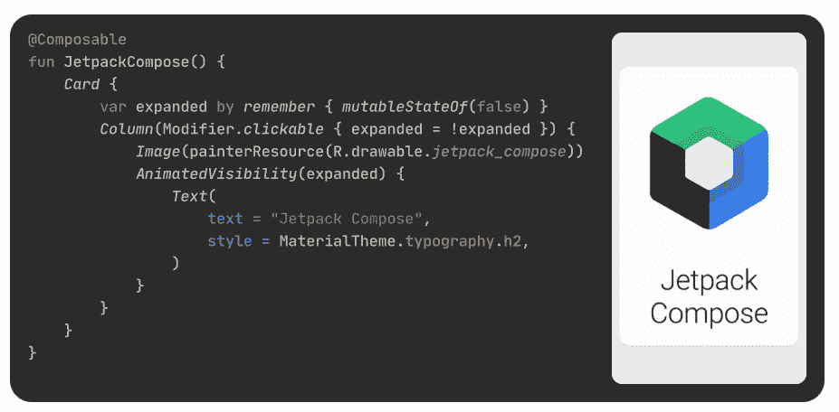
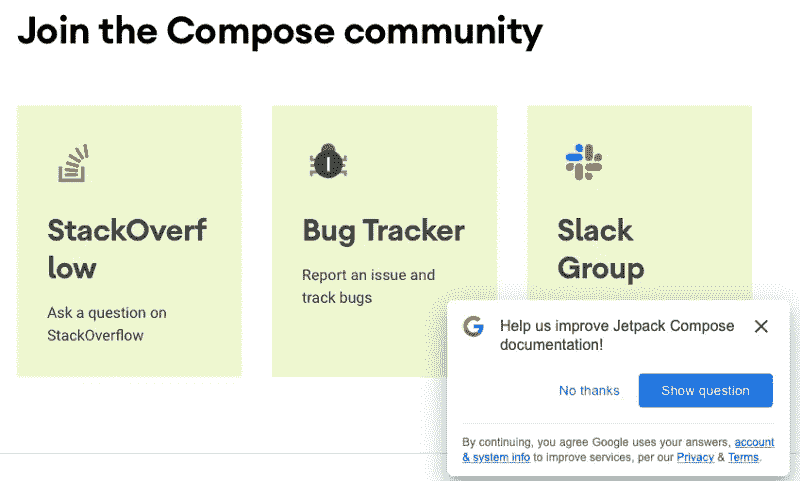
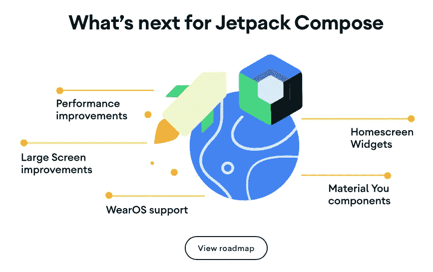
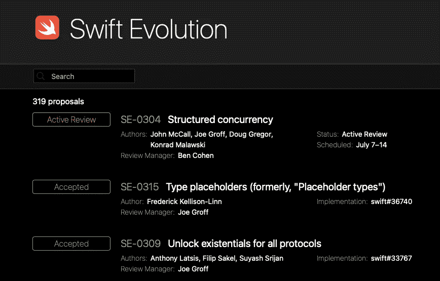

# SwiftUI vs. Jetpack Compose:为什么 Android 轻松获胜

> 原文：<https://betterprogramming.pub/swiftui-vs-jetpack-compose-why-android-wins-hands-down-b5f849b730db>

## SwiftUI 是一个强大的工具，但 Android 的版本更好。原因如下。

Google 编写的 Jetpack

如果你是一名苹果开发者，那么毫无疑问你已经看到和听到了 SwiftUI，苹果新的声明式框架，用于创建在 iOS、iPadOS、macOS、watchOS 和 tvOS 上运行的应用程序。

但你可能不知道的是，Android *还有*有一个全新的声明性框架，用于在 Kotlin 中创建应用程序接口。2019 年 Google I/O 上公布了 Jetpack Compose 的测试版；同年，苹果发布了 SwiftUI。

你可能也不知道，谷歌刚刚将 Jetpack Compose 退出测试，正式发布了 1.0 版本。引用新闻稿中的话:

> 今天，我们发布了 1.0 版本的 [Jetpack Compose](https://developer.android.com/jetpack/compose) ，这是 Android 的现代原生 UI 工具包，可以帮助你更快地构建更好的应用。它很稳定，随时可以在生产中采用。

你所期待的。但下一句才是真正的故事。

> 在过去的两年里，我们一直在利用 Android 社区的反馈和参与来开发 Compose。

而*那个*只是 Jetpack Compose 将 SwiftUI 远远甩在身后的众多原因之一。这是全部名单。

1.  平台版本独立性
2.  开源社区
3.  发布周期
4.  证明文件
5.  公共路线图

请注意，这些事情中没有一件与实际使用 Jetpack Compose 编写代码有关。总的来说，我更喜欢 SwiftUI 的语法和方法论。

但是，Android 开发者实际上可以使用 Jetpack Compose 来创建应用程序，这一事实远远超过了易用性。

# 平台版本独立性

将 Jetpack Compose 添加到项目中也很容易。只需对应用程序的 gradle 文件做一些更改，所需的依赖项就会与您的项目捆绑在一起。

当然，使用 SwiftUI 更加容易。只要使用正确版本的 XCode 并导入 SwiftUI 头，就可以了。嗯…我的意思是…还有一个小事实，你可能需要调整你的应用程序支持的最低 iOS 版本。

只能针对 iOS 15 吧？

我已经写了这个[再](/swiftui-and-the-uistackview-problem-34381ffaa71f)再[再](https://michaellong.medium.com/why-you-cant-use-async-await-7066482ef864)，但是事实很简单。SwiftUI 的所有特性、功能和错误修复都与特定版本的 iOS 相关联。句号。句号。

因此，例如，如果你想使用 SwiftUI 3.0 的一些高度创新的新功能，如文本字段跳转和拉至刷新，你必须将 iOS 15 作为你的应用程序将在其上运行的仅*支持的 iOS 版本。*

或者，如果您需要延迟加载的列表，或者实际上按预期工作的状态管理(@StateObject)，那么您可以一直下降到 iOS 14。

没问题，对吧？我的意思是，你在 iOS 14 和 13 以及 12 和 11 上的现有客户会很高兴升级或放弃他们的旧手机和设备，对吗？

另一方面，Jetpack Compose 支持低至 SDK 21 的 Android。那是安卓 5(棒棒糖)，早在 2014 年就发布了！

这意味着 Android 开发人员今天就可以开始在他们现有的应用程序中使用 Jetpack Compose。不要让任何人掉队。

另一方面，大多数 iOS 开发者可以期待在…什么中使用 SwiftUI 的当前版本？2023?

## 开源开发

如前所述，Jetpack Compose 是一个 Android 开源项目，由一个庞大而活跃的开发人员社区提供支持。

另一方面，SwiftUI 是苹果公司内部开发的，几乎没有透明度或反馈。

Jetpack Compose 是一个未捆绑的工具包，是谷歌为 Android 开发者提供的整个 [Android Jetpack](https://developer.android.com/jetpack) 软件组件集的一部分，但不要求使用任何其他 Jetpack 组件，也不要求您的客户必须拥有最新、最好的 Android 版本

SwiftUI 同样与 iOS 的特定版本相关联。

Jetpack Compose 于 2019 年在 Google I/O 上作为公测版发布，此后又有[多个版本的 Compose 及其组件发布](https://developer.android.com/jetpack/androidx/releases/compose)。

SwiftUI 有三个正式版本，分别与 iOS 13、14 和 15 绑定。

Compose 有一个 [Android Jetpack 博客](https://android-developers.googleblog.com/search/label/Jetpack)，YouTube 上有一个 [Android Jetpack 开发者播放列表](https://www.youtube.com/watch?v=LmkKFCfmnhQ&list=PLWz5rJ2EKKc9mxIBd0DRw9gwXuQshgmn2)，还有一个 [Stack Overflow 上的开发组](https://stackoverflow.com/questions/tagged/android-jetpack)。

您甚至可以使用 Twitter 和[与 Compose 开发团队的开发人员直接对话](https://twitter.com/romainguy/status/1127638172874096640?lang=en)！

苹果？他们有一个开发者论坛，你可以在那里提问。

当然，他们很大程度上会被忽略，但至少你可以问他们。

# 发布周期

如前所述，Jetpack Compose 于 2019 年作为测试版发布，但许多公司已经推出了使用 Compose 构建的产品，或者其中集成了使用 Compose 创建的界面。

此外，Jetpack Compose 库已经定期更新了新的特性、功能和错误修复，这些更新已经发布到世界各地。

苹果？是啊，一年一次，用 iOS 13，14，15。

我已经写了几篇关于 SwiftUI 问题的文章…

*   [SwiftUI 和间歇编辑模式](https://medium.com/geekculture/swiftui-and-the-intermittent-editmode-b714c923f536)
*   [SwiftUI 和如何不初始化可绑定对象](https://medium.com/p/swiftui-101-how-not-to-initialize-bindable-objects-6e539d1b5344)
*   [SwiftUI 和丢失的环境对象](https://medium.com/p/swiftui-and-the-missing-environment-object-1a4bf8913ba7)

这些问题中的每一个今天仍然存在。但是谁知道呢？也许他们明年会得到修复…

# 证明文件

公平地说，苹果在这方面已经做得更好了，但几年来，SwiftUI 的许多支持页面都终止于死胡同占位符。

然而，正如上面的“加入撰写社区”截图所示，Google 正在积极寻求社区的帮助来完善和改进 Jetpack 撰写文档。

你能想象苹果这样做吗？

没有。我也没有。

# 公共路线图

众所周知，苹果是一个相当隐秘的组织。整个开发者社区都知道——或者至少希望——苹果会在发布 iOS 15 时修复 SwiftUI 工作方式中一些更明显的漏洞，并添加所需的缺失功能。

但这在很大程度上是希望，因为没有人确切知道苹果正在开发什么功能，或者期待什么。

另一方面，谷歌已经发布了一个公共路线图，指明了什么是可用的，什么是即将到来的，以及预计什么时候到来。

想象一下。

# 快速进化

可悲的是，事情本不必如此。苹果已经有了一个行之有效的模式，让开发者社区参与到引导和塑造对其未来成功至关重要的技术中来。

我说的是快速，快速进化。

想要扩展 Swift 来做一些新的事情吗？写一个快速发展的推介，让社区讨论。

想修复编译器中的一个 bug？当然，你必须知道你在做什么，但是你可以这样做。

想看看接下来会发生什么吗？跟随快速进化，看看语言中接受了什么。

苹果有机会用 SwiftUI 做同样的事情。

他们没有。

苹果本可以让社区参与 SwiftUI。

他们没有。

苹果本可以将 SwiftUI 制作成一个软件包，可以与你的应用程序捆绑下载，这样就可以在 iOS 14、13 或 12 上支持 SwiftUI 的许多最新和最棒的功能。

他们肯定是做了 T6，而不是 T7。

# 采用率

一些读者会指出，与 Android 相比，苹果享有极高的 iOS 采用率。这是完全正确的。但这也与讨论不完全相关。

让我们用我们客户的一个应用程序作为例子。当然，*最终*所有这些用户都会迁移到最新版本的 iOS。但是，如果今天的指标保持不变，到明年*的这个时候*，大约 85%的用户将使用 iOS 15。

iOS 14 还剩 10%左右。而在 iOS 13 上是 3–4%。而在 iOS 12 上是 1–2%。

从百分比来看，这些数字似乎并不算高。但是如果你有一个拥有 1000 万用户的主要应用，那么这个数字的 5%就是 50 万。你试着说服管理层放弃 50 万客户，这样我们就可以玩一些很酷的新语言功能。

去吧。我会等的。

# 完成块

在这篇文章中，我花了相当多的时间抨击苹果和 swift ui……这样做确实很伤人。

我写过一些个人应用，用 SwiftUI 编码，我很喜欢。它简洁优雅，我最喜欢在我们的公司和企业应用程序中使用它。

但是我不能。

这很伤人。

苹果的开发者可能都在着手 iOS、iPadOS 和 macOS 上的下一阶段应用程序开发。

但是大部分都不能。

这很伤人。

可悲的是，你、我和苹果都知道，事情本不必如此。

谷歌、Android 和 Jetpack Compose 都生动地证明了事情本不必如此。

快速进化表明，事情本不应该是这样的。

但事实如此。

这很伤人。