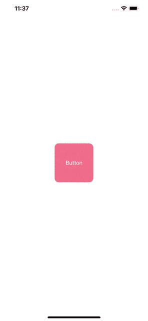

# 为什么更改注入属性不会更新我在 SwiftUI 中的视图？

> 原文：<https://betterprogramming.pub/swiftui-why-changing-my-injected-property-doesnt-update-my-view-ebfbf129d0bc>

## 理解绑定和状态的用例

由 [Kelly Sikkema](https://unsplash.com/@kellysikkema?utm_source=medium&utm_medium=referral) 在 [Unsplash](https://unsplash.com?utm_source=medium&utm_medium=referral) 上拍摄的照片

刚开始用 SwiftUI，自己训练了一些自定义视图的时候，通过这一点真的很迷茫。假设您有一个自定义按钮，为了方便起见，我可以称之为`SelectionView`，它有一个布尔值来指示是否选中它:

未选择的视图

选定视图

它有一个名为`isSelected`的初始化属性，这是一个布尔值，如果它是真的，我们将它的背景设置为一个彩色的粉红色，但是如果它是假的，我们将背景设置为第一个有点透明颜色的图像。其代码如下所示:

我们创建了两个绑定属性，因为我们希望更新上层的一些`ViewModel`状态。现在，试着点击预览上的按钮，看看会发生什么…什么都没发生，对吗？那是因为这两个属性不是`State`属性。

在 SwiftUI 中，底层的`State`包装器告诉它的层次结构要用它得到的新参数再次呈现。因为它不是`State`属性，所以没有理由更新`SelectionView`的主体。

# 为了测试这种行为我们需要什么？

为了拥有新的布局，我们需要重新实例化我们的`SelectionView`。为此，我们依赖于上层视图中的一个`State`变量，它将负责更新所有下层。假设我们有一个`ScreenView`:

当`isSelected`改变时，其绑定被注入的`State`变量改变，因此它强制重绘。

# 结论

每次你在一些自定义的 SwiftUI 视图中注入一个在内部被改变的属性，为了在布局上反映你的改变，这个属性应该是上层视图中的一个`Binding`到一个`State`变量，否则什么都不会重画。我希望你对 SwiftUI、`Binding`和`State`用例有更多的了解，并喜欢；)