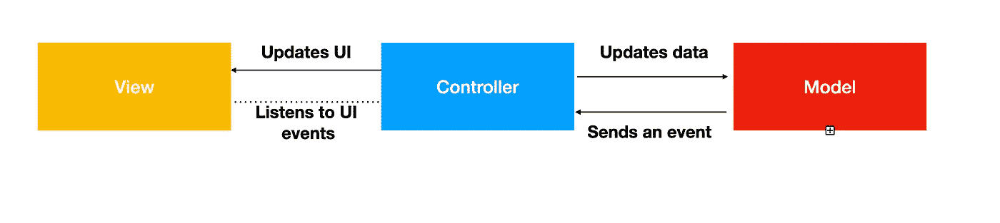
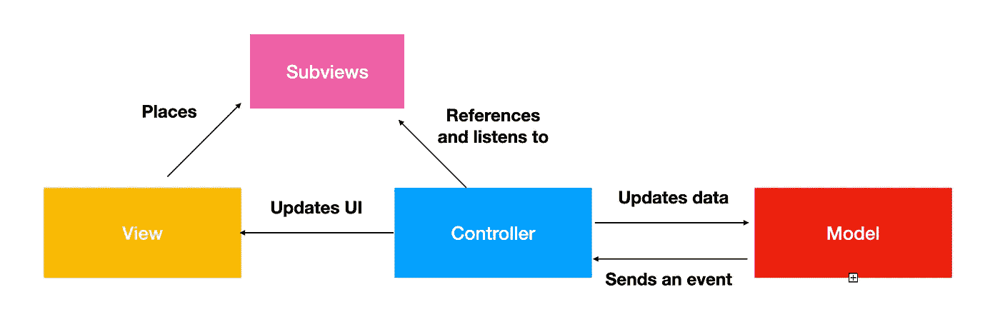
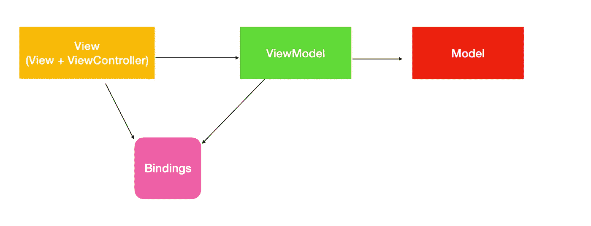
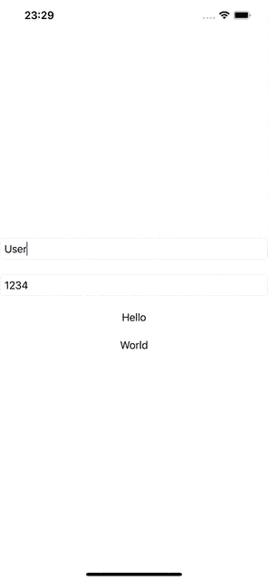
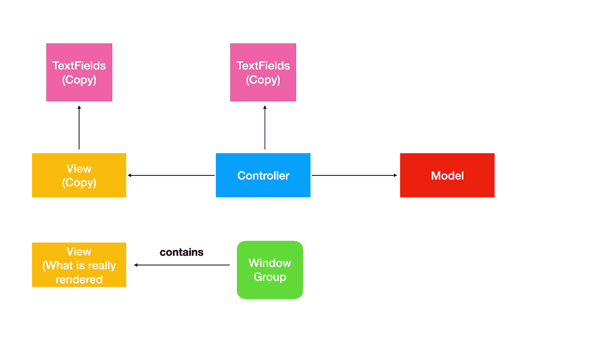

# 为什么 MVC 架构不可能在 SwiftUI 中实现？

> 原文：<https://betterprogramming.pub/swiftui-why-mvc-architecture-became-totally-inviable-aeeab4570d79>

## SwiftUI MVC？我不这么认为。

图片来自[https://unsplash.com/backgrounds/art/aquarium](https://unsplash.com/backgrounds/art/aquarium)

苹果并没有平白无故地构建它的核心 UI 框架。UIKit 和 SwiftUI 在概念上都侧重于前端项目的一些特定架构，甚至一些设计模式。

它们之间的核心区别是 UIKit 的目标是 MVC 架构，而 SwiftUI 是为 MVVM 设计的。

尽管 99%的开发人员认为 MVC 在 2022 年的项目中没有用，而且 MVVM 的设计要好得多，但我应该说我们仍然有一些 MVC 的优势，但由于这篇文章的目的是不同的，我将把它作为一个练习留给读者。

# UIKit 和 MVC

正如我之前所说的，苹果创建 UIKit 框架完全是考虑模型-视图-控制器。

甚至它的本地类也是这样编码的。在 MVC 中，所有的流都是围绕着`ViewControllers`构建的，它管理一个`View`的生命周期(你可以把它们看作一个屏幕单元，尽管它们并不完全是这样)，每个流都包含一个根视图和控制器控制的逻辑(很抱歉是冗余的)`View`把一个数据模型作为参数:

1.  `Model`:管理你的场景状态，保持所有逻辑数据不变。
2.  `Controller`:通过监听一些核心事件(加载、出现等)来管理屏幕(或者子组件)的生命周期。)并根据模型输出更新视图。所有控制器都继承自`UIViewController`类。
3.  `View`:是一块粗糙的画布，里面放置了一些其他的组件。这里没有任何逻辑，每一个变化都是由它的 ViewController 委托的。

这是我们的架构:我们有一个`Model`，它包含了场景的所有逻辑，这些逻辑将反映到我们的`View`外观中。我们在`View`和`Controller`之间有一条虚线，因为尽管我们的控制器有它自己监听视图的方式，但是视图没有(也不能)引用它的 ViewController，因为它违反了我们的 MVC 原则。

那么，`Controller`如果不能引用`ViewController`又怎么能听我们的`View`呢？这背后的关键概念是我们的组件所代表的引用类型。你应该知道我们的`Controller`和我们的`View`是完全耦合的。`UIViewController`引用了从`loadView`方法中的 xib(或`ViewCode`)加载的 UIView 类型。视图只是作为一个根组件来保存 UI 的所有部分。

我们的`View`有对其子组件的引用，但是`Controller`通过`IBOutlet`属性有相同的引用(或者惰性变量？)并通过`IBAction`事件(或处理方法)监听其事件。由于此`UIViews`在`**View**`和`**Controller**`之间共享，控制器可以知道事件而不需要`**View**`告知。

只是一个观察，如果你使用`ViewCode`并通过委托或完成在`ViewController`和`View`之间建立一些通信，现在就停止它，`View`不会有任何关于控制器的线索，这与 MVVM 的情况不同。

作为引用类型的视图类允许在两层之间共享内存，所以`Controller`管理一个`View`，而它对此一无所知。

# 斯威夫图伊和 MVVM

我认为 MVC 和 MVVM 的一个核心区别是我们的逻辑和用户界面的交互方式。

当我们在 MVC 中的控制器管理一个`View`时，就像它是一个照顾产品的制造商一样，在 MVVM 的`ViewModel`充当了我们的视图(现在是`UIView` + `UIViewController`)应该依赖的所有行为和数据的蓝图。

尽管我们的 ViewModel 对视图一无所知，但是视图知道关于我们的 ViewModel 的一切作为参考。

谢尔盖·佐尔金在 [Unsplash](https://unsplash.com?utm_source=medium&utm_medium=referral) 上拍摄的照片

UIKit 项目允许 MVVM 与最初的想法有所不同:我们的`ViewModel`能够通过访问协议更新`View`，但你可以通过使用共享内存以及通知中心、RxSwift 和 Combine 来扭转这一局面。关键是我们的`View`根据我们的`ViewModel`状态采取所有的动作，但是 ViewModel 层并不知道。

在 SwiftUI 中，真正发生的是我们的视图结构依赖于一个`ObservedObject` / `StateObject`，它对应于我们实现`ObservableObject`协议的视图模型，因此在数据更新时重新呈现我们的视图。这样，我们的视图可以将其所有数据参数化到`ViewModel`属性，它不需要知道视图，因为当再次渲染并查看`ViewModel`时，它会自行更新。

# SwiftUI MVC？我想并非如此

正如我们之前讨论的，真正使 MVC 在 UIKit 中成为可能的是`UIView`和`UIViewController`之间的共享内存，这依赖于一些 UI 属性，如按钮、表格视图、子视图等。这样，我们的控制器可以对任何事件做出响应，并自行更新各个组件，而不需要任何组件知道控制器，因此建立了逻辑隔离。让我们在 SwiftUI 场景中尝试同样的方法:

这里我们有一个`ContentView`对应于我们的**视图**层。如你所见，我们有两个对应于`TextFields`的注入属性和两个将填充我们下面标签的状态。文本字段将由我们的控制器保存，就像我们在 UIKit 中所做的一样。

现在我们有了一个`**Controller**`层，它有一个可选的`ContentView`类型的属性，并创建了两个我们需要监听的文本字段，以便更新我们的 UI。由于 SwiftUI 类型不依赖于委托，我们创建了一个`ContentModel`并将其属性绑定到文本字段。

MVC 的 M 不是白代表的。让我们创建我们的模型:

注意，每当我们的模型通过文本字段改变时，我们都使用一个 observer `didSet`闭包，它将更新我们的视图。剧透:不会的！

现在创建一个工厂枚举来实例化我们的`ContentView`并包装所有其他层:

现在我们创建一个模型实例，并将其注入到新的`Controller`类中。之后，我们用相同的 textField 值创建一个新的`ContentView`，并将其值赋给我们的控制器，然后我们返回我们的视图。

# 运行我们的样本

让我们试着运行我们的结果:

正如你所看到的，两个标签没有被更新，原因很简单:我们在控制器中“引用”的视图不是引用类型，所以当我们注入视图时，我们实际上是传递了一个副本给`Controller`。

在 UIKit 中，所有的 UI 实例都是类，而不是结构，这使得我们可以使用 MVC 原则。现在我们没有任何机制来处理来自`Controller`的视图以反映`Model`数据，因为所有的东西都是副本。

# 结论

在本文中，我们展示了 **MVC** 模式由一个中央控制器组成，它通过一个逻辑模型和一个视图进行操作，以保持它们彼此同步。核心是只有控制器知道每个层，并通过共享内存监听它们的变化，这只有引用类型才有可能。我们证明了这种架构不可能在 SwiftUI 中实现，因为它的声明性本质完全依赖于值类型。如果你们中的任何一个读者可以证明我是错的，并且确实有一种跨 SwiftUI 设计一个 **MVC** 的方法，请对这篇文章发表评论，我将很乐意学习一些新的东西。