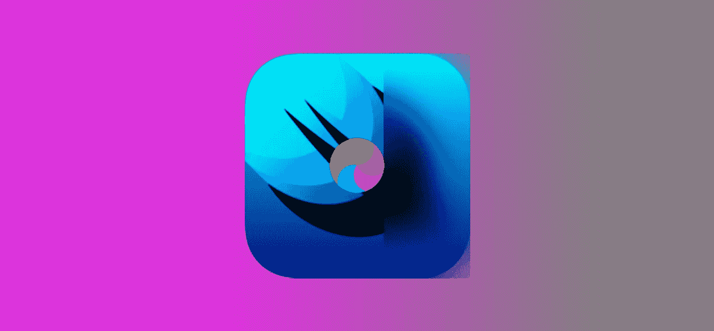
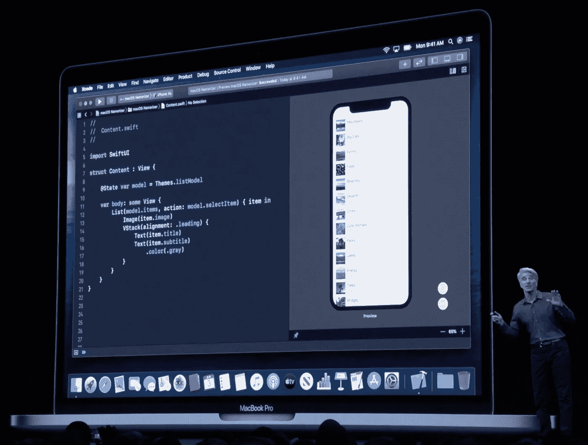
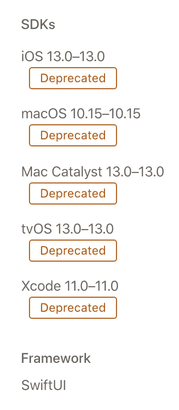

# SwiftUI:它会在只剩一个月的时候准备好吗？

> 原文：<https://betterprogramming.pub/swiftui-will-it-be-ready-with-only-a-month-to-go-128cc9187028>

## SwiftUI 有风险吗，我是否愿意将我的项目押在它上面？

我们都知道 [Xcode 11](https://developer.apple.com/xcode/whats-new/) 将于 9 月上市，这意味着我们可以*在技术上*在大约一个月后开始使用 [SwiftUI](https://developer.apple.com/xcode/swiftui/) 发布 iOS 应用。

虽然 iOS/Swift 社区对苹果的前景感到兴奋，但这并不意味着每个人都要冒险一试。

我怀疑是否有人会急于在 SwiftUI 中重写他们的生产应用程序，除非这已经在进行中。但是，对我来说，有两类开发人员正在问同样的问题。

第一类是已经有项目在进行中的开发人员，根据发布日期的远近，他们至少在考虑开始 POC。

另一类是从零开始的开发者，他们可能也有可变的发布时间表，当然，他们希望他们的应用程序以最新最好的开始。

然而，他们都在问的问题是:“SwiftUI 有风险吗？我愿意把我的项目押在这上面吗？”

让我们把它分解，好吗？

# 好人

我的伙计 Craig Federighi 向我们展示了这种魔力(截图来自 WWDC 主题演讲)

## 好处是显而易见的

虽然我错过了 WWDC 的现场直播，但我想我看录像时的反应和大多数人的现场反应差不多。

这将改变原生 iOS(实际上是苹果)用户界面的构建。

所展示的是事情正在改变的承诺，特别是对于那些一遍又一遍地采取相同单调步骤的事情，或者对于我们代码中如此小的支出来说似乎过于复杂的事情。

它们被简化为简单的线条，带有内置的向导，以及一系列免费的 UI 考虑因素(自动样式向导参数、自动深色主题考虑因素、可访问性和本地化特性等)。).

我们甚至可以开始想象以这种方式原生编写我们的 UI 可以节省多少时间(Paul Hudson 甚至在一个很棒的[视频对比](https://youtu.be/qk2y-TiLDZo)中演示了这一点)。

甚至我刚才说的感觉很自由:*原生写作*。没有人可以看着 SwiftUI 而不想到一些好处，包括以下几点。

## 我们喜欢它，因为我们已经超越了 IB/SB

作为一个快速发展的市场的早期解决方案，Interface Builder 有着成长的烦恼。

故事板是连接旧方法和 UI 构建中实现的需求的桥梁。尽管如此，在 GUI 中需要做的事情之间，在代码中需要做的事情之间，或者在 GUI 的字段中需要编码的事情之间，仍然存在着这种奇怪的差距。

虽然自动布局和约束为我们多年来不断增长(和变形)的屏幕尺寸做好了准备，但它们需要很长时间才能掌握。看起来是一个有用的工具(这也是它们成为 SwiftUI 核心的原因)，但它是一个复古的功能。

现在，一个设置为 SwiftUI 的单视图应用程序项目甚至没有附带`Main.Storyboard`。这是一个官方的独立 UI 解决方案。这本身就让我开始的每个 SwiftUI 项目都感觉很现代。

## 预览是一切(当它工作的时候)

如果时间等于金钱，那么预览就是 Xcode 11 为开发者提供的最大价值。无需点击`CMD+R`，变化几乎立即出现。

更好的是，我还可以预览子视图，这意味着我不需要仅仅为了查看和测试一个深度嵌套的子视图而经历一个工作流。我们开发者知道，我们一遍又一遍地点击`Run`，直到我们做对为止。

计算节省的时间。以目前测试一个视图的平均构建/导航时间为例，乘以你一天中点击`Run`的平均次数。

说真的，给出你最好的估计，然后算一算。去吧，我等着。

## 斯威夫特现在是完整的

现在能够用 Swift 编写您的 UI 有些特别。这真的像一场婚姻；您的代码和用户界面现在合二为一了。我承认，这是一种极其愚蠢的看待方式，但这是一件美妙的事情。

是的，有让 Swift 做出反应的框架。是的，你可以成为一名 UIkit 大师，用代码构建你的 UI(尽管你仍然需要一个故事板)。

而且没错，也有不使用 Swift 做 reactive，用代码构建 UI 的框架( [React Native](http://www.reactnative.com/) 和 [Flutter](https://flutter.dev/) ，我看着你)。

但是，当他们遇到功能限制时，他们仍然可能最终依赖本机代码/插件。有用，但就是不一样。

如果你现在还没想明白，我真的很喜欢斯威夫特。这是一种令人兴奋的语言，有一个专注而有趣的社区。SwiftUI 感觉像是一个礼物，因为现在，当我在构建一个应用程序时，我可以从头到尾呆在一个 Swift 世界中。

# 坏事

## 测试版有问题

是真的。SwiftUI 有很多问题。我有过没有好理由的错误，错误出现在远离实际错误的地方，我的 UI 变得扭曲和丑陋，只有在重新运行时才能修复，等等。

我并不孤单。有些人甚至会称之为[阿尔法](https://www.reddit.com/r/iOSProgramming/comments/ckedfm/will_swiftui_be_ready_for_its_debut_in_this/)。

这非常令人沮丧，因为它正处于一个剥夺一些好处的阶段。诚然，这是一个测试产品。即使是过去的 Xcode 测试版，它们也不可思议地错误百出，直到金牌，然后它们不知何故设法神奇地变好了。

但是，这不是一个 IDE 工具，只要我的代码没有问题，我就可以随便使用它。这个*是*我的代码。

## 折旧平方

一点机会都没有。

我遇到过一些被否决的项目。`PresentationLink`、`Sheet`、`Modal`没了，换了，`identified(by: )`换了，`relativeSize`去掉了，等等。

我认为测试版会有一些变化，但其中一些是整个特性的呈现方式。

有些事情的改变并不总是一目了然的。像改变`TextField`的 init 这样的小事并不明显，但在开发者论坛上被认为是[“大收获”。](https://forums.developer.apple.com/thread/119203)

随着编辑数量的增加，你会怀疑在发布后是否还会有变化。

当您试图实际学习 SwiftUI 或获得对 swift ui 的支持时，这变得更加令人沮丧。我提到的一些教程和视频已经过时了。

再说一次，我知道这是一个测试版，但在 SwiftUI 发布后的任何时候发布它都没有太大意义。

## 这不是第一次了

那些希望通过代码构建 UI 的人已经有很多年的选择了。正如我之前提到的，它们是建立在本地资源之上的附加组件和框架，但是，对许多人来说，这已经足够好了。

甚至有必要填补原生 Swift 的空白，并将其链接到选择的框架。因此，从某种意义上说，SwiftUI 面临着经验丰富、成熟且已被采用的竞争。

## 而且还是不跨 OS

这是显而易见的一点，但是，在我们有相当可行的跨操作系统选项的时候，这是值得考虑的。特别是如果你的应用程序真的没有太多的本机或特定于操作系统的依赖，并且你想同时进入 iOS 和 Android 市场。

人们很乐意看到 Swift 适当地成为跨操作系统，但即使像 SwiftUI 这样的东西也肯定仍然是苹果特有的。

如果你希望在两个平台上发布，并且不想编写两个原生应用程序，答案是你真的不需要这样做，这将 SwiftUI 从等式中删除。

但这并没有考虑到 SwiftUI 不仅仅适用于手机和平板电脑。如果我们想在苹果领域编写跨平台的应用程序，那就完全是另一回事了。

# 未来的前景——丑陋也不美好

## 应用程序的总体状态

有人猜测(甚至在 Medium 上)是否“有一个应用程序”已经不再是一件事了。我们真的还需要应用吗？

对此，我至少能想到三种直接的回应:

*   希望利用硬件优化的应用( [ARKit](https://developer.apple.com/augmented-reality/) 和 [Core ML](https://developer.apple.com/documentation/coreml) 有人知道吗？).
*   不仅仅是 iPhone 的应用程序(iPadOS 是一个致命的原因)。
*   想要拥有移动网站所不能提供的非常棒的 UX 的应用程序。

所以从本质上来说，应用程序还远没有灭绝。如果有的话，趋势平台和硬件能力将真正决定应用程序前进的轨迹和规模。

## 解码 iPhone 销量

众所周知，苹果去年的 XS 和 XR 没有得到他们希望的回应。他们的销售在[确实受到了一点影响。](https://9to5mac.com/2019/08/06/iphone-shipments-decline-q3/)

不过，这并不一定意味着人们会离开 iOS。这只是意味着，既然苹果已经将财务门槛设得很高，普通消费者将会更加仔细地考虑采用新设备。

在过去的一年里，我周围的大多数人都问他们如何才能买到便宜的 iPhone 7 或 8，因为他们承担不起冒险的代价。他们不需要肖像模式，Face ID，有机发光二极管屏幕，甚至是 ML 优化的硬件(特别是因为他们甚至不知道这意味着什么)。

他们需要一部 iPhone，任何 iPhone。为什么？因为他们习惯了，像苹果，和/或有一般的需求。

过度概括，我懂了。但这些都是我身边的人真实的评论。就我个人而言，我的妻子和我得到了 XR 的生命挤压出我们的 6。

# 你该怎么办？

总的来说，每个项目都是独一无二的(或者是一个独一无二的应用程序的克隆)，就像每个开发人员都是独一无二的(不是克隆的部分)。

我会在 2019 年使用 SwiftUI 开发一款应用吗？这真的取决于复杂性和我维护这个应用的意愿。

我们在这里真正要解决的是是否要成为早期采用者。这是一个 21 世纪的难题。而且，和任何事情一样，成为某样东西的早期采用者也有风险？太快了？).

对于我个人来说，我只是对 SwiftUI 感到兴奋，并希望将其全部吃光。我满足于只是暂时学习，看看它的发展方向，但打算在未来的版本中使用它。

至于我的标题问题，我无法回答。更多的是你去琢磨。

事实上，我希望听到来自你们社区的反馈！你在冒险吗？如果不是下个月，那么不久之后呢？还是你已经找过其他地方了？