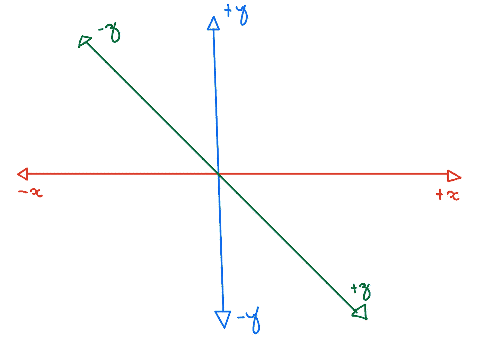
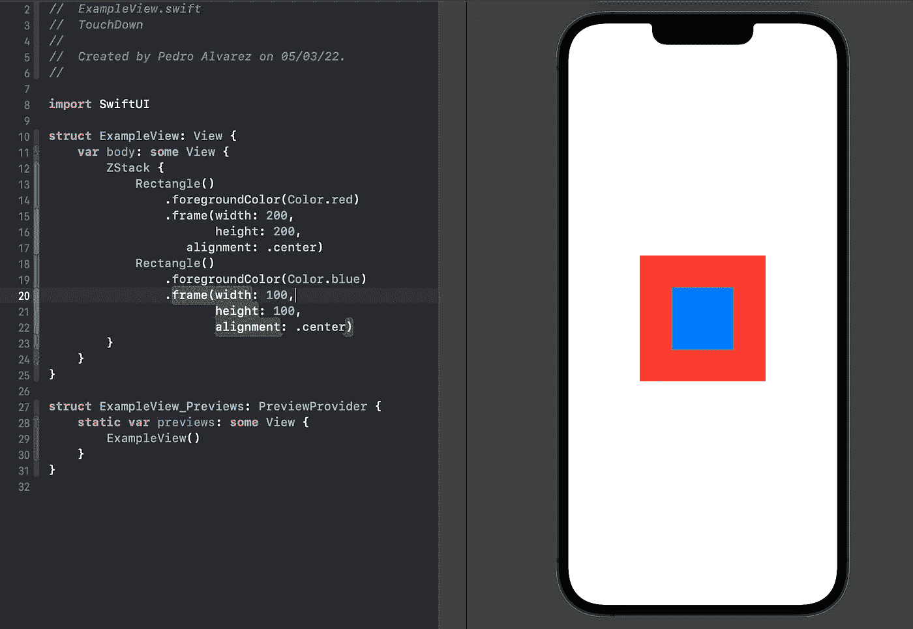
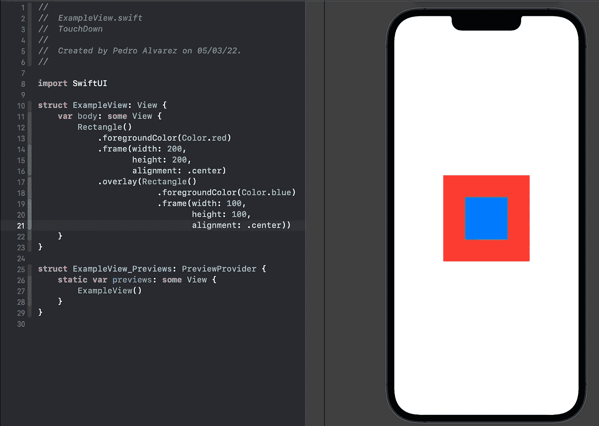
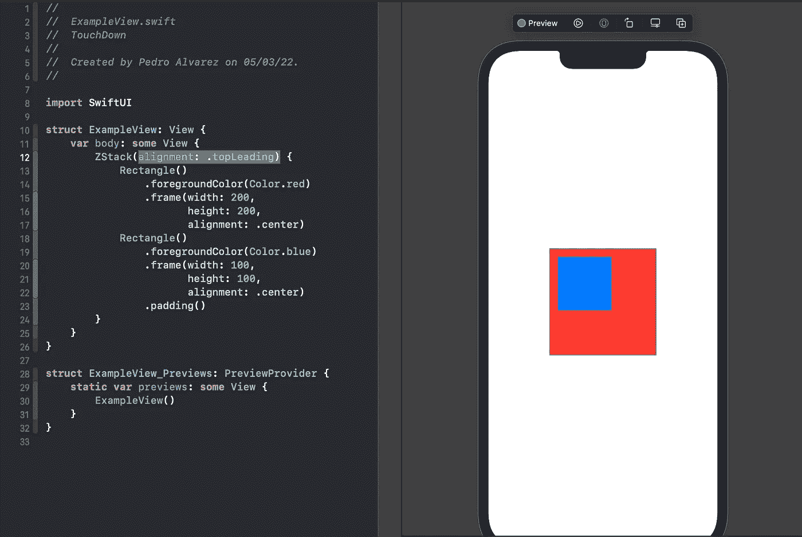
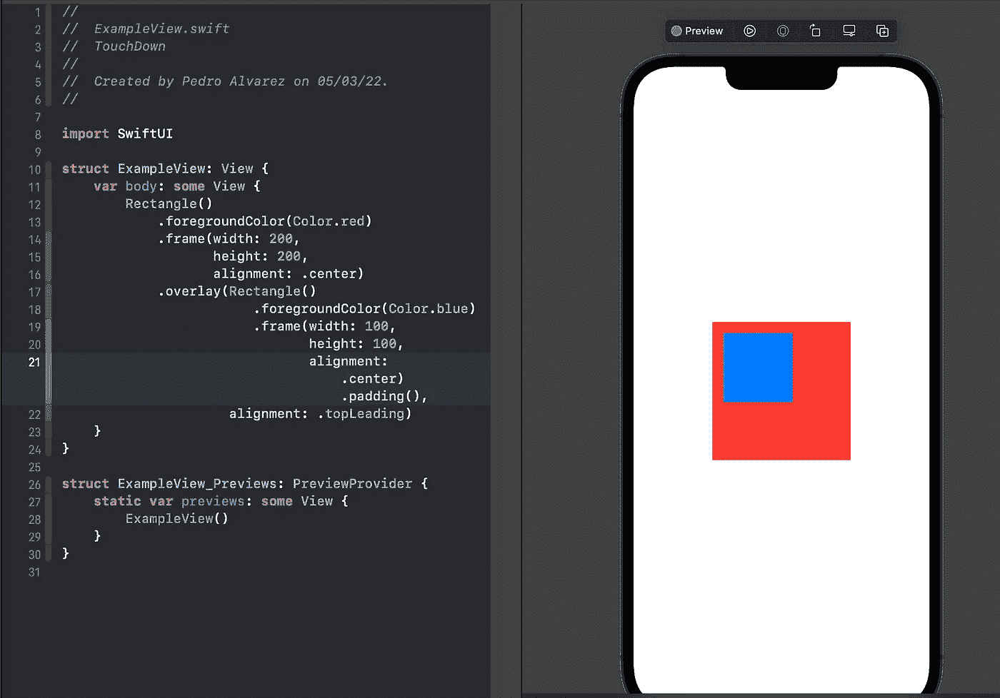
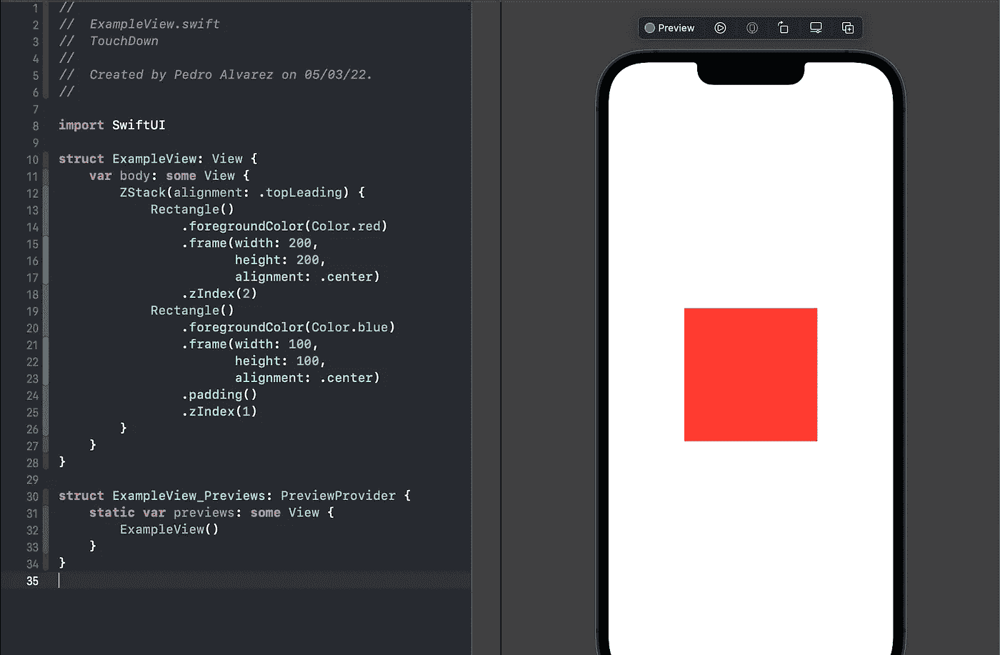
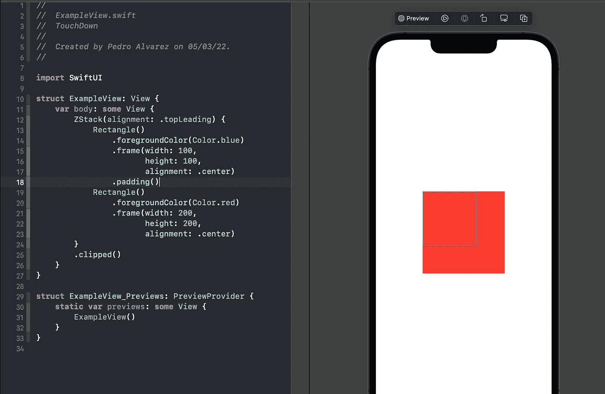
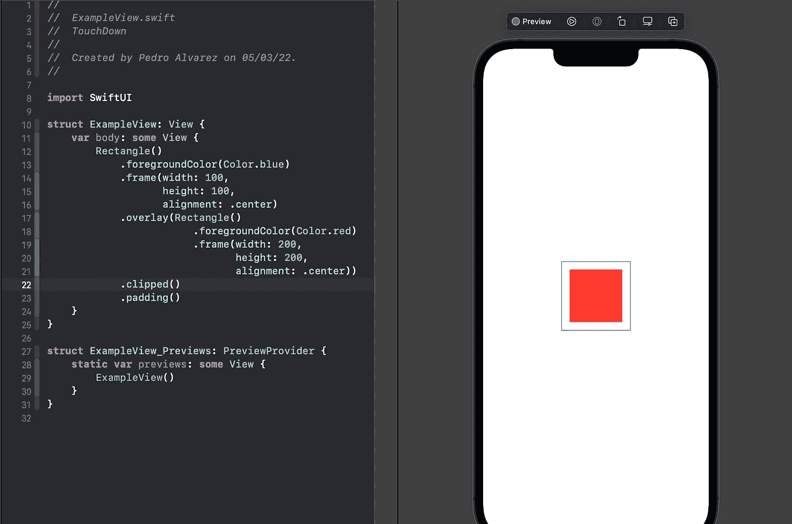

# SwiftUI ZStack 与覆盖修改器:相似与不同

> 原文：<https://betterprogramming.pub/swiftui-zstack-x-overlay-modifier-which-is-the-real-difference-5a47dfa7ab1e>

## 比较叠加可视组件的两种方法

嗯，这是我关于 SwiftUI 框架的第一篇文章，真的希望我能给你带来一些关于这个主题的知识。

今天的文章关注这两种将一个可视组件叠加到另一个组件上的常用方法。当我了解到这两者时，我真的在试图找出何时使用其中一个，经过一些研究和一系列实验后，我会让它的特殊性变得非常清楚。

# ZStack vs. Overlays:它们是什么？

好吧，让我们首先澄清什么是`ZStacks`和`overlay`修改器，以及在 SwiftUI 场景中应用它们的结果是什么。

正如您可能已经知道的，堆栈是一个标准容器，用于跨一个轴放置其内部组件，包括 x(水平)、y(垂直)和 z(一个在另一个前面)。

在`ZStack`的例子中，与 UIKit 相比，这相当于创建一个自定义 UIView(或者另一个小部件)并开始在其中添加每个子视图。

结果将是一些视图出现在其他视图的前面，这取决于尺寸和支持的空间(当然在 UIKit 的情况下，约束关系到它们之间的位置)，但是它们都在同一个父视图中。当你把一个`View1`和`View2`放入一个`ZStack`时，根据顺序和`zindex`的不同，一个会覆盖它的“兄弟姐妹”的一部分。看下面:

如您所见，根据已建立的层次结构，蓝色矩形被放置在红色矩形的前面

同样，我们在 SwiftUI 中也有一个修改器，允许您放置一个视图来覆盖另一个视图:

蓝色矩形放置在红色矩形的上面

正如你所看到的，两种情况产生了相同的结果，我们把蓝色的矩形放在与另一个相同的 z 轴上。

关于这两种方法的另一个观察结果是，在这两种情况下，我们都可以指定重叠视图的对齐:

ZStack 在顶部对齐其子视图

蓝色的矩形覆盖了顶端角落的红色

因此，我们讨论了这两种方法之间的主要相似之处，但现在让我们讨论一下不同之处:

## 栈指令

当我们处理`ZStack`时，有一个关于视图在堆栈中放置顺序的非常重要的概念。有一个修改器应用到视图中，称为`zIndex`。

如果你已经和`SpriteKit`一起工作过，你肯定知道这个概念。

如果您将一些`zIndex`应用于内部视图，则显示顺序完全由该参数定义:最大的`zIndex`，它将更靠前。

默认情况下，`zIndex`值等于 0，如果两个视图有相同的`zIndex`，那么产生的顺序将被堆栈中的顺序解开。

虽然蓝色矩形是在红色矩形之后定义的，但是它的 zIndex 较低，所以它留在后面

使用`overlay`修改器时，没有预先定义的顺序。无论`zIndex`值如何，每个放置在修改器内的视图层次都应该保持在前面，就是这样。

## 剪辑时显示框架

当我提到框架时，你可能已经知道我在说什么。考虑到视图的大小(宽度和高度)，视图的框架只不过是其父视图的内部尺寸。它跟`ZStack`和`overlay`有什么关系？一切！主要是在剪辑视图内容时

`ZStack`是一个动态容器，因此它的框架完全基于其内部内容。实际上，为了使一切可见，它的框架是由最大的子框架定义的。所以，如果我们剪辑了`ZStack`，不管顺序如何，可见内容将完全是最大的内部视图:

ZStack 框架由红色矩形定义

在`overlay`案例中，情况有所不同。被覆盖的视图是主要焦点，即使覆盖视图有更大的框架，也只考虑由第一个视图定义的尺寸:

现在修复红色矩形的可见内容是由蓝色矩形定义的，这是修改后的视图

如果我可以用几句话来描述它们之间的差异:在`ZStack`中，所有的子视图都是平等的，焦点停留在较大的视图上，而在`overlay`中，修改后的视图是焦点，它的框架才是真正重要的。

# 结论

所以，这两种方法产生的结果非常相似，意义也几乎相同。唯一的区别在于应用`zIndex`和定义帧和剪辑时的两种特殊情况。我希望你从现在开始知道什么时候使用这两种方法。感谢阅读。