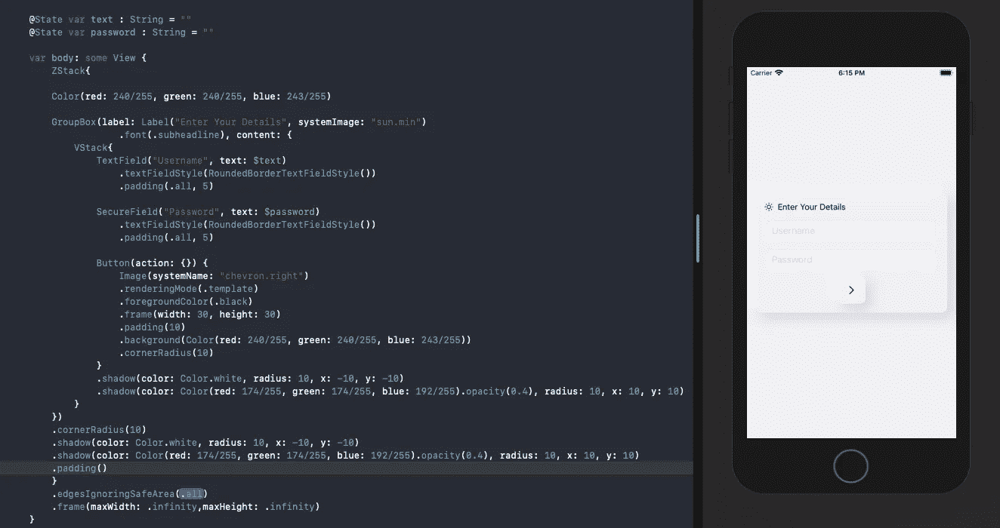
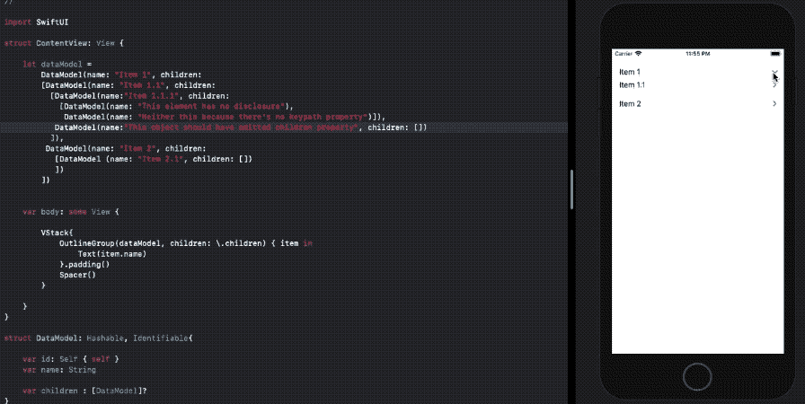
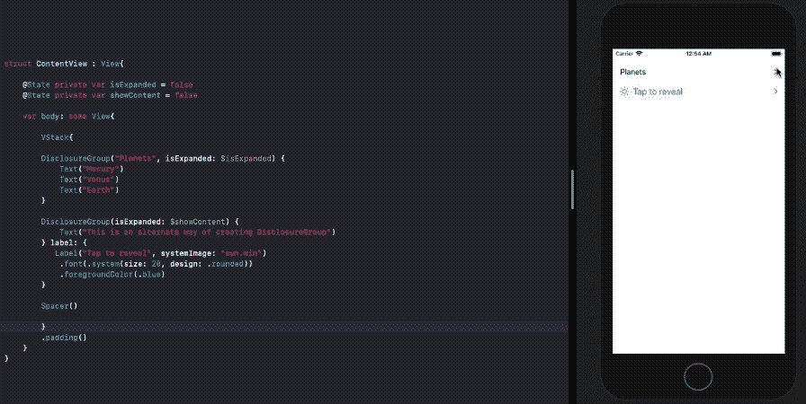

# iOS 14 中 SwiftUI 的 GroupBox、OutlineGroup 和 DisclosureGroup

> 原文：<https://betterprogramming.pub/swiftuis-groupbox-outlinegroup-and-disclosuregroup-in-ios-14-cf9fb127cdc0>

## 让我们看看新的风格化组控件


照片由 [Kawin Harasai](https://unsplash.com/@kawin?utm_source=medium&utm_medium=referral) 在 [Unsplash](https://unsplash.com?utm_source=medium&utm_medium=referral) 上拍摄

iOS 13 中引入了 SwiftUI 组。它们充当包装不同视图类型的容器，并允许您在 VStack 和 HStack 的 10 ChilidItem 限制附近工作。

SwiftUI 在 WWDC 2020 的第二次迭代中，为我们提供了一些新的分组控制。即`GroupBox`、`DisclosureGroup`、`OutlineGroup`现在 iOS 14 及以上版本都有。

让我们逐一介绍一下。

# 分组框

`GroupBox`是一个风格化的容器视图，带有一个可选的`Label`，早期它只在 macOS 中可用。现在，您可以使用它对视图进行逻辑分组，并构建类似登录屏幕、自定义警告对话框等内容。

下面的代码展示了如何在 SwiftUI 中创建一个`GroupBox`:

```
GroupBox(label: Label("Enter Details"), content: { VStack{
  TextField("Username", text: $text)
  Button(action: {}) {Text("Submit")}
 }})
```

视图修改器在`GroupBox`上的工作方式和在其他视图上一样。例如，您可以设置阴影。下面的截屏显示了 SwiftUI 中`GroupBox`的外形设计:



*神经变形*是关于设置灯光和阴影，以给出一个突出的外观，这就是上面的代码通过使用强大的视图修改器所做的。该代码可在[本要点](https://gist.github.com/anupamchugh/8c7c09848a2964016df11011eeb55da0)中找到。

# OutlineGroup

大纲对于显示文件层次结构或者任何结构都非常方便。`OutlineGroup`结构主要用于显示嵌套的`ForEach`视图。

这意味着每个父视图或顶级视图都是一个由零个或多个子视图组成的公开视图，正如数据结构中所定义的那样。

`OutlineGroup`按需加载。

为了使`OutlineGroup`正常工作，您需要:

*   传递符合`Identifiable`协议的数据集合
*   确保在`OutlineGroup`的初始化器中用嵌套子数组的所需对象属性设置了`\.children` keypath

以下代码显示了如何在 SwiftUI 中创建`OutlineGroup`视图的示例。

```
OutlineGroup(array, children: \.children) { 
item in
Text(item.name)
}
```

让我们看看`OutlineGroup`在虚拟阵列中的表现:



正如你在 GIF 中看到的，当`children`参数被忽略时，没有公开组。

SwiftUI 列表为 iOS 14 中的`OutlinedGroup`提供了[开箱即用的支持](https://medium.com/better-programming/whats-new-in-swiftui-lists-for-ios-14-e6aed43ca134)。

# 披露小组

虽然`DisclosureGroup`已经嵌入到了`OutlineGroup`中，但是你也可以独立使用它们。

`DisclosureGroup`用于显示或隐藏基于`Binding`控件的内容，在下拉菜单中非常方便。

s 的一个很好的特性是你可以将它们嵌套在一起。

让我们看一个 SwiftUI `DisclosureGroup`的例子:

```
DisclosureGroup("Planets", isExpanded: $isExpanded) {      
Text("Mecury")        
Text("Venus")        
Text("Earth")    
}
```

我们也可以使用多重闭包语法以不同的方式设置`DisclosureGroup`标题，如下所示:



您还可以通过使用`Binding`属性以编程方式切换`DisclosureGroup`。

# 结论

我们看到 iOS 14 的 SwiftUI 中引入了不同类型的组。我希望它们对您有用，尤其是在构建基于文档的应用程序时。

SwiftUI 组的一个很酷的秘密是对它们设置的视图修饰符被应用到所有包含的视图。

这一次到此为止。感谢阅读。