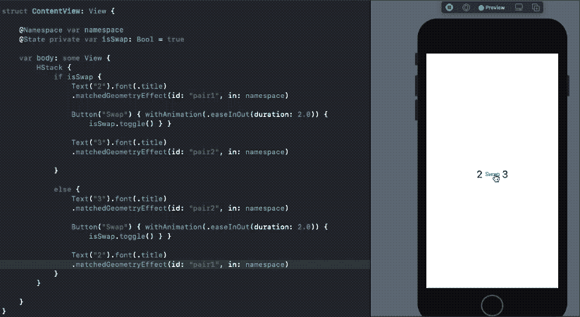
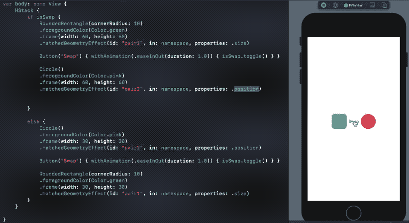
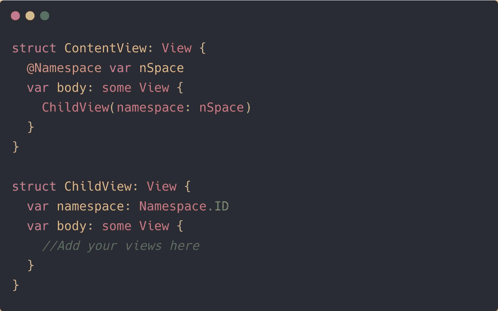

# SwiftUI 在 iOS 14 中的 matchGeometryEffect 动画网格

> 原文：<https://betterprogramming.pub/swiftuis-matchgeometryeffect-in-ios-14-ab701b2c99c3>

## 爱上这个新的修改器，创建令人惊叹的动画


Joanna Kosinska 在 [Unsplash](https://unsplash.com?utm_source=medium&utm_medium=referral) 上拍摄的照片。

SwiftUI 的第二次迭代引入了一个非常酷的修饰符:`matchedGeometryEffect`。

该修改器允许您创建惊人的过渡，以跨层次动画视图。要使用它，您需要做的就是将它附加到两个视图上，并确保指定了相同的标识符。

它有一些强大的用例——从动画尺寸变化到视图位置变化的插值。

当在 SwiftUI 网格中创建跨视图的奇特模式转换时，或者当用动画重新加载 SwiftUI 视图时，您肯定会发现它非常方便。

在接下来的部分中，我们将探索使用`matchedGeometryEffect`可以做的一系列事情。

# SwiftUI 基本 matchedGeometryEffect

下面是一个简单的`matchedGeometryEffect`修改器的定义:

```
matchedGeometryEffect(id: "unique", in: namespace)
```

*   `id`是一个唯一的标识符，设置在您希望动画或插值的一对视图上。
*   `Namespace`是一个属性包装器，用于区分视图间的 id，基本上防止 SwiftUI 中的名称冲突。

还有几个可选参数可以在修饰符中传递。我们将很快讨论它们。

让我们来看一个简单的`matchedGeometry`的例子:



哇！我们设法制作了两个文本视图，显示视图重载中的数字。对于演示如何交换两个数字的可视化演示来说，这不是很棒吗？

您也可以对 *n* 个数字进行同样的操作。只需确保指定了正确的对 id。

# 使用 matchedGeometryEffect 制作大小和位置动画

我们之前看到的是整个`frame`的动画。但是我们也可以通过指定适当的属性来选择只制作`size`和`position`的动画:

```
.matchedGeometryEffect(id: "id", in: nSpace, properties: .size)
.matchedGeometryEffect(id: "id", in: nSpace, properties: .position)
```

当您只想显示一个缩放过渡(使用`size`)或想要插入位置时，这很方便。

但是要确保正确设置属性。例如:



如您所见，圆角矩形仅过渡其`size`。所以，它并不是真的从左向右移动。与此同时，圆只对它的`position`进行插值，但不会对它的`size`进行动画处理，直到我们将属性设置为`frame`。

# 使用命名空间 ID

有时，您希望将名称空间传递给子视图或导航链接。

为此，您需要在目标视图中指定`Namespace.ID`作为类型:



# 具有 matchedGeometryEffect 的 SwiftUI 网格

网格在 SwiftUI 2.0 中是一个巨大的增加，它们与`matchedGeometryEffect`是天作之合。

从跨布局过渡到英雄模式的动画，我们都可以做到。

在下面的截屏中，我们展示了如何在显示所选项列表的同时，使用`matchedGeometryEffect`将项目从 SwiftUI 网格中插入和移除。所有内容都包含在不到 50 行代码中:


如您所见，我们已经创建了两个 ScrollViews。一个保存带有三个列项目的`LazyVGrid`，另一个保存在`HStack`中选择的项目。为了选择和取消选择项目，我们创建了一个数组`selectedItemIDs`。

GitHub 上的[提供了该动画的完整源代码以及视图和实用方法。](https://github.com/anupamchugh/iOS14-Resources/blob/master/SwiftUIMatchedGeometryEffect/SwiftUIMatchedGeometryEffect/ContentView.swift)

# 结论

那是一个包裹。我希望这能启发你建立一些很酷的过渡。SwiftUI 中的动画已经变得更加简单、灵活和强大。

感谢阅读。