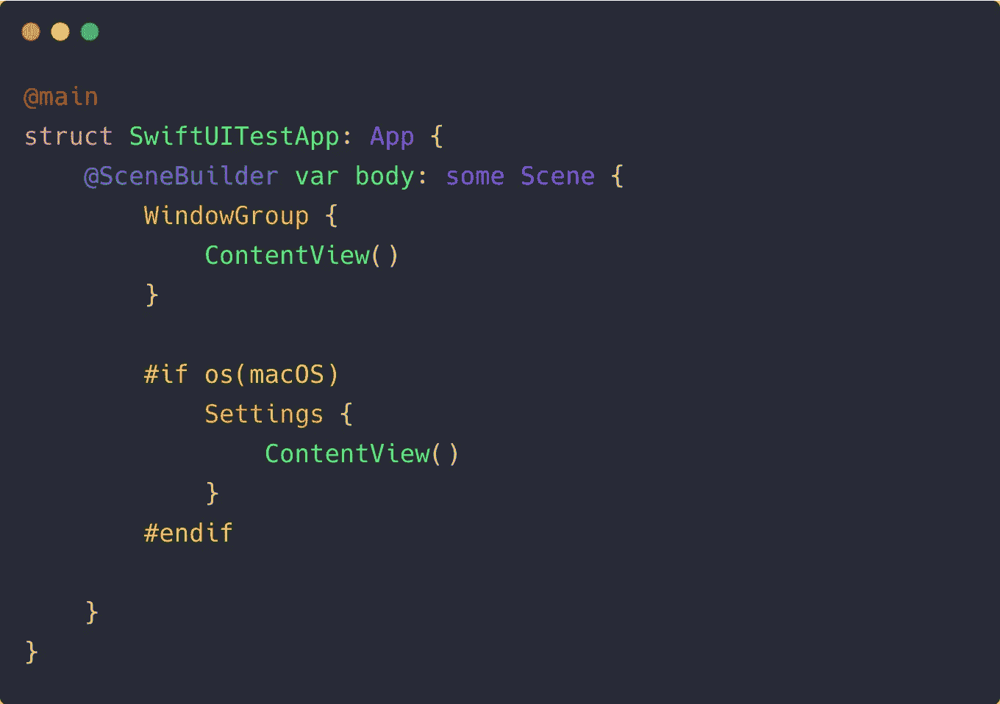

# SwiftUI 的新应用生命周期以及 iOS 14 中对 AppDelegate 和 SceneDelegate 的替换

> 原文：<https://betterprogramming.pub/swiftuis-new-app-lifecycle-and-replacements-for-appdelegate-and-scenedelegate-in-ios-14-c9cf4a2367a9>

## 全新的属性包装器和函数构建器减少了样板代码


照片由[米卡·鲍梅斯特](https://unsplash.com/@mbaumi?utm_source=medium&utm_medium=referral)在 [Unsplash](https://unsplash.com?utm_source=medium&utm_medium=referral) 上拍摄

在 WWDC 2020 期间，SwiftUI 获得了自己的应用生命周期，以摆脱 UIKit 的 AppDelegate 和 SceneDelegate。为此，iOS 14 现在提供了一个`App`协议、一个`SceneBuilder`、`scenePhase`枚举器和一个新的属性包装器`UIApplicationDelegateAdaptor`。在我们看它们是什么之前，让我们快速地复习一下`SceneDelegate`。

iOS 13 中引入 SceneDelegate 主要是为了解决 iPadOS 上的多窗口支持。它带来了从窗口概念到场景的转变，并允许我们将责任从 AppDelegate 转移。

从 iOS 14 开始，当你在 Xcode 12 或更高版本的项目中创建新的 SwiftUI 应用时，你会得到一个选项，在 *SwiftUI 应用生命周期*和 *UIKit 应用委托*之间进行选择。虽然后者将生成相同的旧的`AppDelegate`和`SceneDelegate`样板代码，其中`UIHostingController`用于嵌入 SwiftUI 视图，但前者将用一个新的起点迎接您，纯粹是为了 SwiftUI。

# SwiftUI App 协议:一个新的起点

```
[@main](http://twitter.com/main)
struct ProjectName: App {
    var body: some Scene {
        WindowGroup {
            ContentView()
        }
    }
}
```

虽然上面这段代码很短，但是在引擎盖下有很多自动发生的事情。首先，该结构通过将`Scenes` 和`Views`统一在一个地方，提供了 SwiftUI 应用程序层次结构的鸟瞰图。代码中需要注意的几个重要事项是:

*   `@main`属性是 Swift 5.3 中引入的，它表明上述结构是我们 SwiftUI 应用程序的起点。
*   通过遵守`App`协议，我们需要实现一个`SceneBuilder`，它本质上是一个函数构建器，用于组成一个或多个场景。因为我们在上面的例子中只使用了一个场景，所以我们实现了 computed 属性`body`。另外，`App`协议负责触发启动 SwiftUI 应用程序的`main()`方法。
*   上例中的容器场景包装了我们的 SwiftUI 视图。在 iPadOS 或 macOS 上运行上述应用程序可以创建多个`WindowGroup`场景，因为它们支持这些功能。

除了`WindowGroup`，你还可以为基于文档的应用程序使用`DocumentGroup`场景类型，或者为 macOS 或 watchOS 使用`Settings`和`WKNotificationScene`。

你也可以在`WindowGroup`场景上设置命令修改器，为场景添加快捷键。为此，我们需要利用新的`CommandsBuilder`对使用`Commands`协议的`CommandMenu`进行分组。

在合成复杂场景时，将 computed 属性设置为`@SceneBuilder`非常重要。例如，下面给出的例子为 macOS 平台创建了一个首选菜单场景。



# 如何听 SceneDelegate 生命周期方法？

尽管样板代码减少了，但人们可能想知道如何收听场景的生命周期更新——正如我们在`SceneDelegate`中所做的。很高兴，我们有一个`scenePhase`枚举器来保存场景的当前状态。我们可以使用它作为一个`Environment`属性包装器和一个`onChange`修改器来监听我们场景的状态变化，如下所示:

# 如何将 AppDelegate 与 SwiftUI App 协议一起使用

`AppDelegate`类是我们应用程序的重要组成部分。无论是处理通知还是配置 Firebase，它都以其不同的生命周期方法发挥着关键作用。

为了挂钩`AppDelegate`功能，我们需要将 UIKit(为了符合`UIApplicationDelegate`)带回到目前为止的纯 SwiftUI 应用程序中。SwiftUI 提供了一个新的属性包装器`UIApplicationDelegateAdaptor`，通过它我们可以在 SwiftUI 结构中注入`AppDelegate`实例:

同样，我们可以使用`WKExtensionDelegateAdaptor`属性包装器来提供 watchOS 的委托。

# 结论

我们看到了一个新的属性包装器，用于将 AppDelegate 注入到 SwiftUI 结构中，还看到了一个新的函数生成器——`SceneBuilder`——用于合成场景。

新的 SwiftUI 应用生命周期有助于快速启动 SwiftUI 开发。您可以利用新的`@SceneStorage`属性包装器在应用程序的多个场景中进行状态恢复。

记住 SceneDelegates 在 iOS 14 和最新的 SwiftUI 迭代中都没有被弃用。苹果只带来了一个新的应用生命周期，用于构建不依赖于 UIKit 的原生 SwiftUI 应用。

感谢阅读。