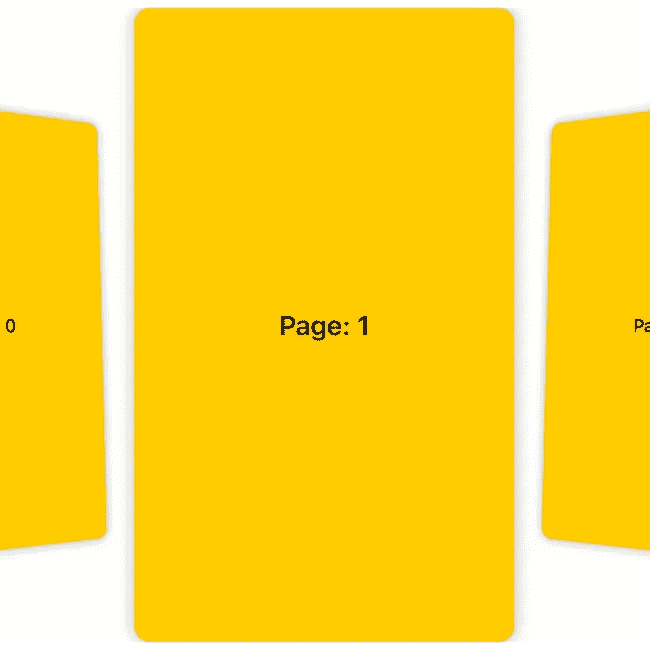
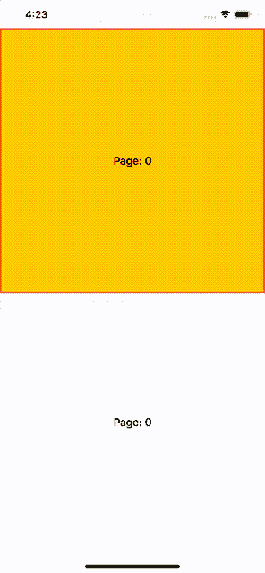
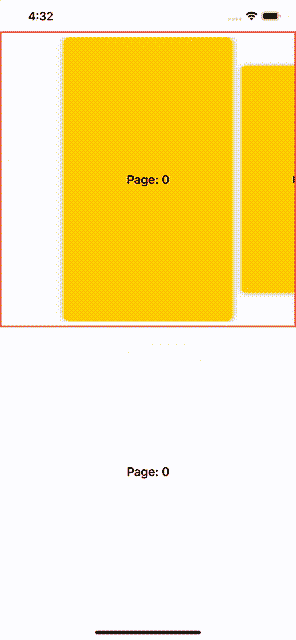
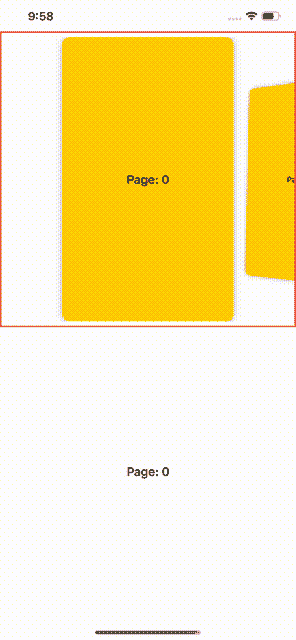
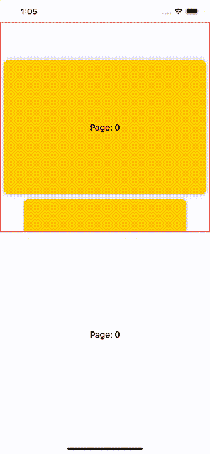
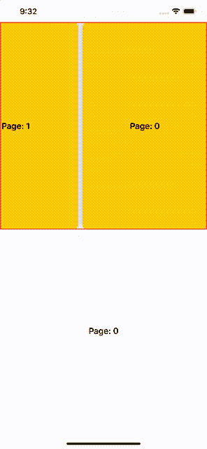

# 使用 SwiftUIPager 滑动页面

> 原文：<https://betterprogramming.pub/swipe-the-page-with-swiftuipager-981e379e3bbd>

## 仅使用本地组件在 SwiftUI 中实现一个寻呼机，并以您想要的方式进行定制



# 介绍

这个新框架已经存在了一段时间，你们大多数人都已经能够对它进行一些研究了。你可能听说过，尽管它是一个强大的框架，被认为是 iOS 开发的未来，但它仍然缺少许多功能，这些功能目前由`UIKit`提供。

在`SwiftUI`中没有的一个元素是`Pager`。如果你在谷歌上搜索“SwiftUI 中的寻呼机”，你会发现大多数人的解决方案是将一个`UIPageViewController`包装成一个`UIViewControllerRepresentable`。还有其他解决方案吗？没有人用`SwiftUI`组件实现类似的东西吗？

`SwiftUIPager` 来救援了！在本教程中，我们将介绍一个原生构建的解决方案:`[SwiftUIPager](https://github.com/fermoya/SwiftUIPager)`。

[](https://github.com/fermoya/SwiftUIPager) [## fermoya/SwiftUIPager

### SwiftUIPager 提供了一个用 SwiftUI 本机组件构建的 Pager 组件。寻呼机是一个视图，它呈现一个可滚动的…

github.com](https://github.com/fermoya/SwiftUIPager) 

# SwiftUIPager:基础知识

`SwiftUIPager` 自带一个叫`Pager`的组件。这个组件建立在`SwiftUI`本地组件之上——也就是说，它根本不依赖于 *UIKit* 。这可能看起来不重要，但实际上很重要，因为`SwiftUI`在幕后使用`Metal`渲染，这使得它比它的前身快得多。

`Pager`是一个可滚动的容器，显示一些可回收的视图。这需要:

*   绑定到页面索引
*   用于填充页面的项目数组
*   工厂方法来创建每个页面

`Pager`回收视图，这样你就不用担心内存问题——不用调用`applicationDidReceiveMemoryWarning`，这有多好？！

好吧——太多单词了。让我们看看它是如何工作的:

```
Pager(page: self.$pageIndex,
      data: self.items,
      content: { item in
           // create a page based on item
      self.pageView(item)
})
```



就这样。就是这么简单！难以置信。

有一堆修改器可以用来定制它:

*   `alignment`改变焦点页面在容器中的位置:开始、居中或结束。
*   `itemSpacing`给元素之间留出空间。
*   `itemApectRatio`根据可用空间和此*宽高比*配置页面尺寸。
*   `pageOffset`动态改变`Pager`偏移量。
*   `itemTappable`使页面可点击。

到目前为止还好吗？但是等等——还有更多！

# SwiftUI 方式

有两种方法可以制作分页动画。我们可以通过使用`interactive`修改器给滚动添加一个收缩效果:

```
Pager(...)
    .itemAspectRatio(0.6)
    .itemSpacing(10)
    .padding(8)
    .interactive(0.8)
```

注意到了`0 < value < 1`。否则默认为`1`，无交互。让我们看看这是什么样子:



它看起来令人惊奇不是吗？我们还要看更多吗？

让我们看看剩下的可用动画— `rotation3D`:

```
Pager(...)
    .itemAspectRatio(0.6)
    .itemSpacing(10)
    .padding(8)
    .rotation3D()
```



太棒了，我们有一个漂亮的旋转，我们几乎不需要任何代码！

结束了吗？*没有*，还有更多！

# 支持不同的方向和滑动方向

`Pager`使改变分页方向变得容易。只需添加`vertical`修饰符:

```
Pager(...)
    .vertical()
```



谁说传呼机一定要一直往同一个方向刷？使用`horizontal`或`vertical`修饰键改变分页方向:

```
Pager(...)
    .itemSpacing(10)
    .alignment(.start)
    .horizontal(.rightToLeft)
    .itemAspectRatio(0.6)
```



# 更多功能

还有两个特性值得一提。其中一个就是`onPageChanged`修改器。该便利函数接受一个回调，每次`pageIndex`改变时都会执行该回调:

```
Pager(...)
    .onPageChanged({ index in
        // do something
    })
```

这允许您对`Pager`上的任何变化做出反应。你听到我在那里做了什么吗——*反应！是的，反应式编程是当今的一个热门话题。为尽可能多的事件服务。*

最后但同样重要的是，`pageOffset`允许您动态改变`Pager`偏移。请注意，传递的值是相对于页面之间的距离。

假设您想以交互和增量的方式管理屏幕任何其他部分的偏移。您可以轻松使用`pageOffset`让`Pager`为您滚动:

```
Pager(...)
    .pageOffset($someOffset)
```

# 结论

`SwiftUIPager`为您带来功能强大的本地寻呼机:

*   水平和垂直寻呼机。
*   不同的方向，取决于方向:从右到左，从上到下。
*   更改屏幕对齐和位置的选项。
*   动画效果，给滚动增加一点趣味。