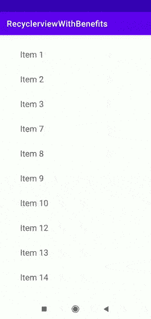

# 滑动以关闭 Android RecyclerView 使用 Kotlin 查看项目

> 原文：<https://betterprogramming.pub/swipe-to-dismiss-android-recyclerview-items-using-kotlin-95ca20cfb812>

## 在你的 Android 应用中创建漂亮的、可定制的列表

由[凯莉·西克玛](https://unsplash.com/@kellysikkema?utm_source=medium&utm_medium=referral)在 [Unsplash](https://unsplash.com?utm_source=medium&utm_medium=referral) 上拍摄的照片。

在本文中，您将学习如何实现`RecyclerView`，它为您提供了滑动项目的能力。我们将在不使用任何第三方库的情况下做到这一点。我们将使用`RecyclerView`默认装饰器和一些接口来实现这一点。

如果您感兴趣，本文末尾嵌入了一个带有实现的 GitHub repo 链接。

我们开始吧！

# 介绍

如果你是一名 Android 开发者，你会知道`RecyclerView`是显示大型数据集的优化解决方案，并具有有效的内存管理。

与它的前辈(`listview`)不同的是，`RecyclerView`拥有像`ItemTouchHelper`这样的巨大支持，简单的动画，以及强大的更新功能，如`insert`、`remove`等等。

使用`RecyclerView`中的`ItemTouchHelper`，我们可以在不添加任何第三方库的情况下，快速添加令人敬畏的功能，如重新排序和滑动。您可以阅读下面的文章，了解如何使用项目装饰器对项目进行重新排序:

 [## 使用 Kotlin 拖移以重新排序 Android RecyclerView 项目

### 在你的 Android 应用中创建漂亮的可定制列表

medium.com](https://medium.com/better-programming/drag-to-reorder-android-recyclerview-items-using-kotlin-afcaee1b7fb5) 

在本文中，我们将了解滑动以消除。为此，我们将使用`ItemTouchHelper`。它只是从`RecyclerView.ItemDecoration`扩展而来的一个简单的类。这提供了多个回调，例如`onMove`、`onSwiped`、`onSelectedChanged`、`Clearview`等等。随着所有这些回调的及时使用，我们将在`RecyclerView`中实现重新排序。

# 实现 ItemTouchHelper

首先，我们需要创建一个 Kotlin 类并用`ItemTouchHelper.Callback`扩展它。然后我们覆盖`getMovementFlags`、`onMove`和`onSwiped`功能，如下所示:

这里，我们使用`onSwiped`函数为`RecyclerView`项添加滑动功能。`onMove`函数用于实现重新排序等功能。`getMovementFlags`是一个功能，通过它我们可以注册运动标志到`RecyclerView`项。我们可以使用`makeMovementFlags`函数注册`swipe`和`drag`标志:

我已经注册了`swipe`和`drag`。如果不想包含拖动功能，那么将`0`作为第一个参数传递。我们的目标是实现滑动功能，所以我将`START`和`END`作为`swipe`标志。

然后，一旦用户成功刷过`RecyclerView`项，就会调用`onSwiped`功能。这个函数将接收用户滑动的视图容器实例，通过它我们可以找到`adapterposition`，我们稍后会谈到。

我们需要关注的下一部分是如何传输用户已经滑动了一个视图容器，以便在适配器中执行必要的操作。为了解决这个问题，我们使用了一个接口。这是一个简单的界面，有两个功能(`onItemMove`)和(`onItemDismiss`)，分别在用户执行`drag`和`swipe`动作时触发。看一看:

接下来，我们需要传递我们在`SwipeHelperCallback`构造函数中创建的接口。之后，我们需要做的就是通过使用`viewHolder`实例传递`adapterPosition`来调用接口实例上的`onItemDismiss`函数:

至此，我们已经基本完成了核心逻辑。默认情况下，当用户开始在任何`RecyclerView`项目上滑动时，将触发滑动。

# 回收视图支架和适配器

首先，我们需要创建一个简单的`RecyclerView`容器，并从适配器`onBindViewHolder`函数调用`setData`函数来更新其中的 UI:

接下来，我们需要实现一个简单的具有必要功能的`RecyclerView`适配器(例如`onCreateViewHolder`、`onBindViewHolder`等等)。看一看:

现在我们已经完成了基本功能，是时候实现滑动功能了。我们已经创建了`ItemTouchHelperAdapter`接口来监听一个项目何时被滑动。这将覆盖`onItemDismiss`函数，在该函数中，我们将删除适配器列表中该位置的项目，并调用`notifyItemRemoved`函数来更新 UI。看一看:

# 调用滑动以消除

最后，我们完成了`ItemTouchHelper`、适配器、`ViewHolder`和接口。是时候给`RecyclerView`分配适配器了。我们需要创建一个`SwipeHelperCallback`实例，并将其传递给附加到`RecyclerView`的`ItemTouchHelper`构造函数的构造函数。看一看:

仅此而已！您已经在没有任何第三方库的情况下成功地用`swipe`项实现了`RecyclerView`！

# 输出

# 奖金

要了解有关 Android 中的`RecyclerView`适配器的更多信息，请阅读以下文章:

*   [在 Kotlin 中构建反应式&异构适配器](https://medium.com/android-dev-hacks/building-a-reactive-heterogeneous-adapter-in-kotlin-eed9487df29b)
*   [Android 中适配器的演变](https://medium.com/better-programming/evolution-of-adapters-in-android-2e2ff58c0f98)
*   [如何在 Android 中顺序合并适配器](https://medium.com/better-programming/how-to-merge-adapters-sequentially-in-android-11914eac53d)
*   [Android RecyclerView 与 Kotlin 密封类](https://medium.com/better-programming/android-recyclerview-with-kotlin-sealed-classes-6d2985aac3e5)

# GitHub 回购

 [## SG-K/recyclerviewithsbenefits

### 这是一个演示应用程序，旨在为开发人员展示如何实现复杂的功能，如重新排序、滑动等…

github.com](https://github.com/SG-K/RecyclerviewWithBenefits#drag-and-reorder-recyclerview-items) 

目前就这些。希望你学到了有用的东西。感谢阅读！