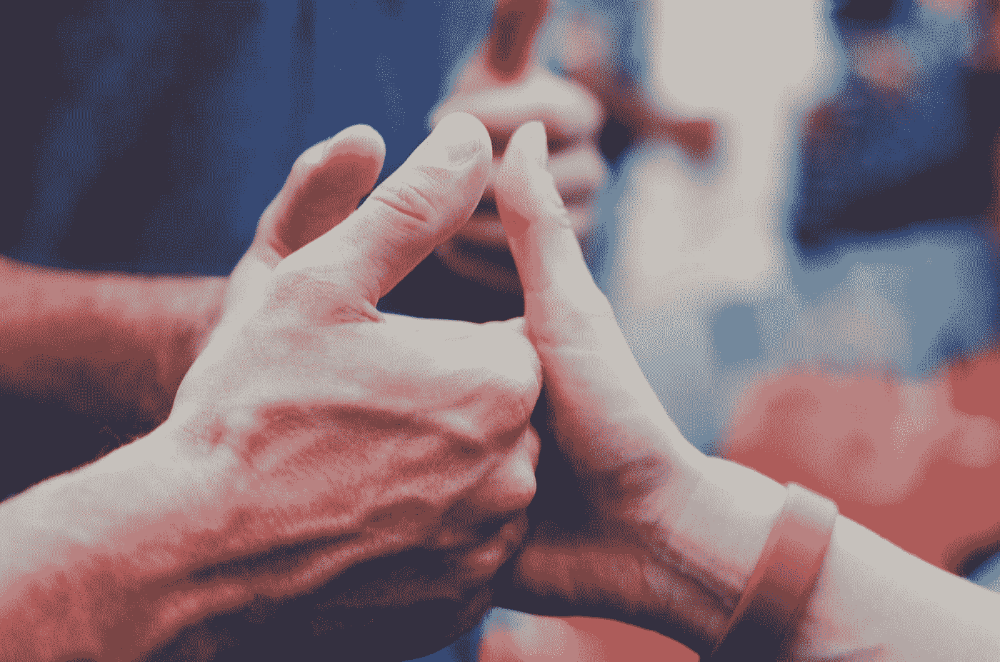
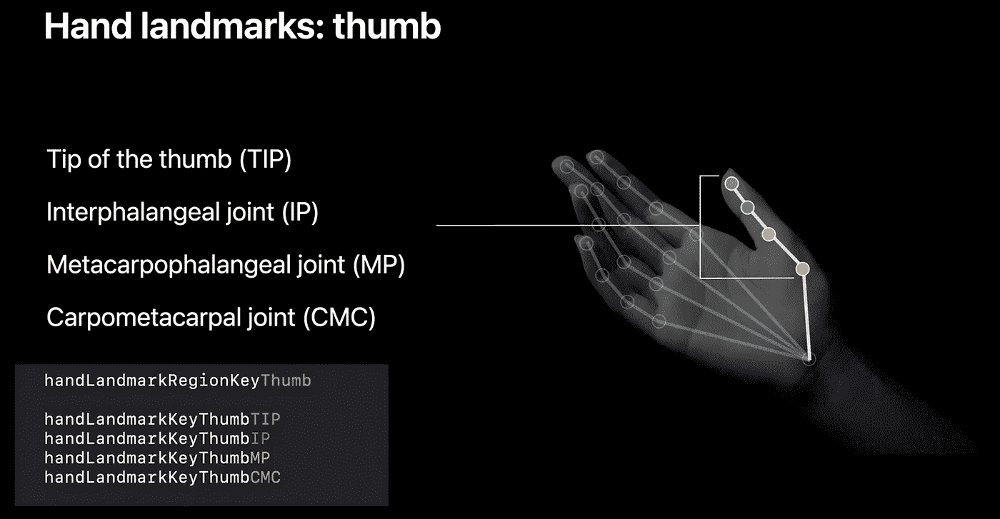
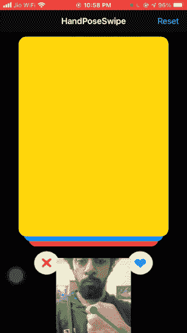

# 使用 iOS 14 视觉手姿态估计的无刷打火机

> 原文：<https://betterprogramming.pub/swipeless-tinder-using-ios-14-vision-hand-pose-estimation-64e5f00ce45c>

## 让我们利用计算机视觉的力量来检测 iOS 中的手势



[奥尔尼克](https://unsplash.com/@everhooder?utm_source=medium&utm_medium=referral)在 [Unsplash](https://unsplash.com?utm_source=medium&utm_medium=referral) 拍摄的照片

iOS 14 的推出为苹果的计算机视觉框架带来了一系列增强和有趣的新功能。

视觉框架于 2017 年发布，旨在让移动应用程序开发者轻松利用复杂的计算机视觉算法。具体来说，该框架包含了一系列预先训练的深度学习模型，同时还充当了一个包装器，可以快速运行您自己的定制核心 ML 模型。

在 iOS 13 中引入文本识别和 VisionKit 以提振 OCR 之后，苹果在 iOS 14 的视觉框架中将重点转向了运动和动作分类。

主要是，视觉框架现在可以让你做[轮廓检测](https://heartbeat.comet.ml/new-in-ios-14-vision-contour-detection-68fd5849816e)，光流请求，并包括一堆新的离线视频处理工具。但更重要的是，我们现在可以估计手和身体的姿势——这无疑为增强现实和计算机视觉的新可能性打开了大门。

在本文中，我们将重点关注手部姿态估计，以构建一个 iOS 应用程序，让您执行无触摸的手指手势。

如果你一直在关注我的文章，我已经演示了如何使用 ML Kit 的人脸检测 API 构建一个无触摸滑动 iOS 应用程序。我觉得 prototype 集成到 Tinder、Bumble 等约会应用程序中很酷。但同时，由于眨眼和转动，它可能会导致眼睛疲劳和头痛。

因此，我们将简单地通过使用手势来扩展这一用例，而不是向左或向右滑动——因为在 2020 年，懒惰和用手机练习社交距离是可以的。在我们深入研究之前，我们先来看看如何在 iOS 14 中创建一个视觉手姿势请求。

# 视觉手部姿态估计

新的`VNDetectHumanHandPoseRequest`是一个基于图像的视觉请求，检测人手姿势。在类型:`VNHumanHandPoseObservation`的实例中，它返回每手牌上的 21 个标志点。我们可以设置在视觉处理过程中每一帧要检测的`maximumHandCount`。

要获得每个手指的点数组，我们只需通过以下方式调用实例上的枚举:

```
try observation.recognizedPoints(.thumb)
try observation.recognizedPoints(.indexFinger)
try observation.recognizedPoints(.middleFinger)
try observation.recognizedPoints(.ringFinger)
try observation.recognizedPoints(.littleFinger)
```

还有一个手腕标志，位于手腕的中心，不属于上述任何一组。相反，它属于`all`组，可以通过以下方式检索:

```
let wristPoints = try observation.recognizedPoints(.all)
```

一旦我们得到了上面的点数组，我们可以用下面的方法提取各个点:

```
guard let thumbTipPoint = thumbPoints[.thumbTip],
let indexTipPoint = indexFingerPoints[.indexTip],
let middleTipPoint = middleFingerPoints[.middleTip],
let ringTipPoint = ringFingerPoints[.ringTip],
let littleTipPoint = littleFingerPoints[.littleTip],
let wristPoint = wristPoints[.wrist]else {return}
```

`thumbIP`、`thumbMP`、`thumbCMC`是您可以从拇指的点组中检索的其他单个点(其他手指依此类推)。



来源:苹果视频

每个单独的点对象包含在`AVFoundation`坐标系中的位置以及它们的`confidence`阈值。

随后，我们可以找到点之间的距离或角度，以创建某些手势处理器。例如，在[苹果的演示应用](https://developer.apple.com/documentation/vision/detecting_hand_poses_with_vision)中，他们通过计算拇指和食指尖端之间的距离创建了一个捏手势。

# 入门指南

既然我们已经完成了视觉手势请求的基础知识，让我们深入到实现中。

启动 Xcode 并创建一个新的 UIKit 应用程序。确保您已经选择了 iOS 14 作为部署目标，并在`Info.plist`中设置了`NSCameraUsageDescription`字符串。


作者图片

因为我们已经介绍了如何用动画创建 Tinder 风格的卡片，这里是那个类的[最终代码。](https://gist.github.com/anupamchugh/6a7f8941dc097d2e9c467cf791d94c91)

类似地，下面是存放 Tinder 卡的类的代码。

# 使用 AVFoundation 设置我们的摄像机

接下来，让我们使用苹果的`AVFoundation`框架创建我们自己的定制相机。

以下是 ViewController.swift 文件的代码:

上面的代码中发生了很多事情。我们来分解一下。

*   `CameraView`是一个在屏幕上显示摄像机内容的自定义 UIView 类。我们很快就会谈到它。
*   `setupAVSession()`是我们设置前置摄像头并将其作为输入添加到`AVCaptureSession`的地方。
*   随后，我们调用了`AVCaptureVideoDataOutput`上的`setSampleBufferDelegate`。

`ViewController`类符合`HandSwiperDelegate`协议:

```
protocol HandSwiperDelegate {
  func thumbsDown()
  func thumbsUp()
}
```

我们将在检测到手势时触发相应的方法。现在，让我们看看如何在捕获的帧上运行视觉请求。

# 在捕获的帧上运行视觉手部姿态请求

在下面的代码中，我们创建了上面的`ViewController`的扩展，它符合`AVCaptureVideoDataOutputSampleBufferDelegate`:

值得注意的是，`VNObservation`返回的点属于视觉坐标系。我们需要将它们转换成 UIKit 坐标，以便最终在屏幕上绘制它们。

因此，我们通过以下方式将其转换到 AVFoundation 坐标系中:

```
wrist = CGPoint(x: wristPoint.location.x, y: 1 - wristPoint.location.y)
```

随后，我们将在`processPoints`函数中传递这些点。为了简单起见，我们只使用两个标志——拇指尖和手腕——来检测手势。

下面是`processPoints`函数的代码:

以下代码行将`AVFoundation`坐标系转换为 UIKit 坐标系:

```
previewLayer.layerPointConverted(fromCaptureDevicePoint: point!)
```

最后，基于两点之间的绝对阈值距离，我们在牌堆上触发相应的向左滑动或向右滑动动作。

`cameraView.showPoints(pointsConverted)`在`CameraView`子层上的两点之间画一条线。

下面是`CameraView`类的完整代码:

# 最终输出

下面给出了实际应用程序的输出:



作者截屏

# 结论

从基于手势的自拍点击到绘制签名，再到找到人们在视频中做出的不同手势，您可以通过许多方式来利用 Vision 的新手部姿势估计请求。

人们也可以将这种视觉请求与身体姿势请求链接起来，以构建复杂的手势。

上述项目的完整源代码可以在 [GitHub 资源库](https://github.com/anupamchugh/iOS14-Resources/tree/master/iOS14VisionHandPoseSwipe)中找到。

这一次到此为止。感谢阅读！