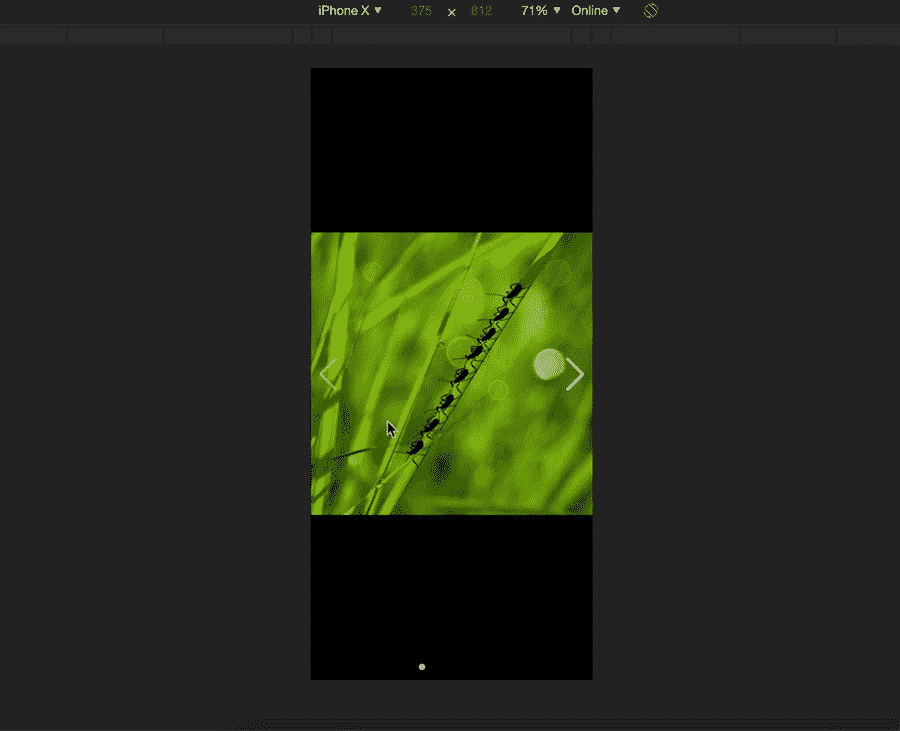
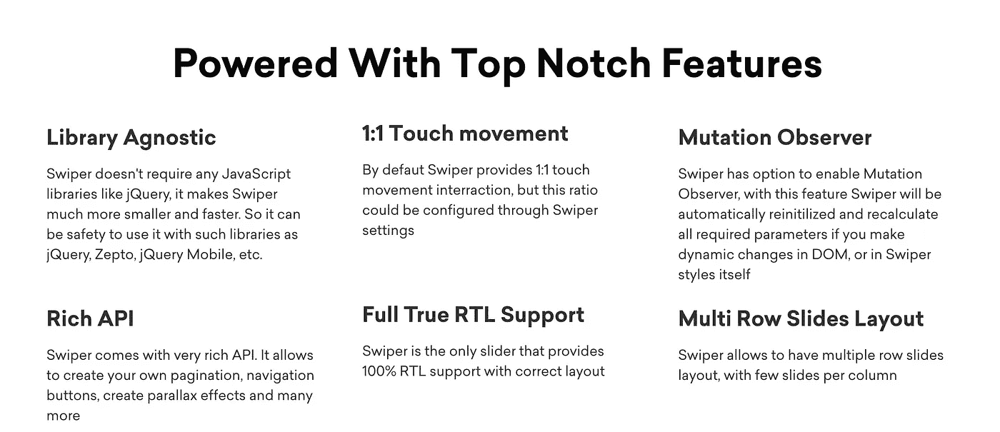

# Swiper:如何在移动浏览器上实现类似 Tinder 的滑动

> 原文：<https://betterprogramming.pub/swiper-how-to-implement-tinder-like-swiping-on-mobile-browsers-78f45797061e>

## Swiper 是一款带有硬件加速过渡的现代移动触摸滑块



用 swiper 滑动

Swiper 是一个开源的、免费的现代移动触摸滑块库，具有硬件加速转换和惊人的本地行为。它旨在用于移动网站、移动 web 应用程序和移动本机/混合应用程序。

注意: *S* wiper 并不兼容所有平台，它是一个现代的触摸滑块，只专注于现代的应用程序/平台，以带来最佳的体验和简单性。请确保您使用最新版本的浏览器来顺利完成此过程。



为什么是 Swiper？—资料来源:[https://swiperjs.com/](https://swiperjs.com/)

# 入门指南

我们可以安装带有 npm 的 Swiper，或者通过 CDN 包含它。

## npm

```
npm install swiper
```

## 使用 CDN 中的 Swiper

如果您不想通过 npm 安装 Swiper，您可以从 CDN 使用它，如下所示:

```
<link *rel*="stylesheet" *href*="https://unpkg.com/swiper/css/swiper.min.css"><script *src*="https://unpkg.com/swiper/js/swiper.min.js"></script>
```

# Swiper API

```
<!-- Slider main container -->
<div class="swiper-container"> <!-- Additional required wrapper -->
    <div class="swiper-wrapper">
        <!-- Slides -->
        <div class="swiper-slide">Slide 1</div>
        <div class="swiper-slide">Slide 2</div>
        <div class="swiper-slide">Slide 3</div>
        ...
    </div></div>
```

# 初始化 Swiper

现在，当我们有了 Swiper 的 HTML，我们需要使用下面的函数来初始化它:

`new Swiper(swiperContainer, parameters)` -用选项初始化 Swiper。

*   Swiper 容器 HTML 元素的`swiperContainer` — `HTMLElement`或字符串(带 CSS 选择器)。必需的。
*   `parameters` —对象—带有 Swiper 参数的对象。可选。
*   该方法返回初始化的 Swiper 实例。

## 例子

```
import Swiper from 'swiper'const mySwiper = new Swiper('.swiper-container', {
    speed: 400,
    spaceBetween: 100
});
```

在初始化 Swiper 之后，就可以在它的`HTMLElement`上访问 Swiper 的实例了。它是 Swiper 的 HTML 容器元素的`swiper`属性:

```
const mySwiper = document.querySelector('.swiper-container').swiper// use slider methods like
mySwiper.slideNext();
```

# 事件

Swiper 附带了一堆有用的事件，你可以听听。可以通过两种方式分配事件:

1.  在 swiper 初始化时使用`on`参数:

```
const mySwiper = new Swiper('.swiper-container', {  
  // ...   
  on: {
    init: function () {
       console.log('swiper initialized');     
    }
  }, 
};
```

2.Swiper 初始化后使用`on`方法。

```
const mySwiper = new Swiper('.swiper-container', {   
  // ... 
}; mySwiper.on('slideChange', function () {   
  console.log('slide changed'); 
});
```

注意:事件处理程序中的`this`关键字总是指向 Swiper 实例。

# 接下来呢？

正如你所看到的，将 Swiper 集成到你的网站或应用程序中真的很容易。所以，这是你接下来的步骤:

*   转到 [API 文档](https://swiperjs.com/api/)以了解更多关于 Swiper API 以及如何控制它的信息。
*   查看可用的[演示](https://swiperjs.com/demos/)。
*   如果你有关于 Swiper 的问题，请在[堆栈溢出](http://stackoverflow.com/)中提问，不要忘记用`[swiper](http://stackoverflow.com/questions/tagged/swiper)`标签标记你的问题。
*   如果你发现了一个 bug，在 [GitHub](https://github.com/nolimits4web/swiper/) 上创建一个问题。

# 结论

如果你是 JavaScript 新手，想学习这门语言，我建议你从阅读书籍和构建东西开始。从《[](https://amzn.to/2LOkzjj)*》这本书开始，这里有一个有趣的应用程序列表，可以构建。*

*感谢阅读，我希望你学到了新的东西。请记住，作为开发人员，我们必须始终保持开放，欢迎新的工具和库，让我们的生活更加轻松。*