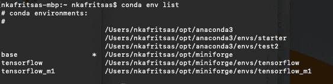
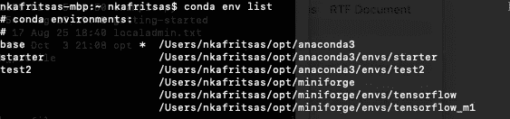

# 在 macOS 上的多个 Conda 发行版之间切换

> 原文：<https://betterprogramming.pub/switching-between-multiple-conda-distributions-on-macos-b78b6b21720>

## 使用 MiniForge 的数据科学家的实际使用案例


由[阿纳夫·辛哈尔](https://unsplash.com/@arnav_arw?utm_source=medium&utm_medium=referral)在 [Unsplash](https://unsplash.com?utm_source=medium&utm_medium=referral) 拍摄的照片

苹果 M 系列芯片的问世在苹果社区引发了新的希望。从 2020 年第四季度的 M1 芯片开始，Mac 开发者，尤其是数据科学家开始从第三方资源和工具(最流行的是 Colab)转向 M1 处理器的原生 GPU。

从那以后，越来越多的开发者开始将他们的工作空间转移到 macOS 上。macOS 中用于数据科学项目的所有设置的共同点是 MiniForge。

对于那些没有听说过 MiniForge 的人来说，它基本上是一个康达发行版，以其与苹果的兼容性而闻名，包括苹果 M1 设备。有人可能会说它与 Miniconda 不相上下，但与苹果合作得非常好。

> *从* [*这里*](https://medium.com/@nikoskafritsas/list/setup-apple-m1-for-deep-learning-75e74b9f7cb4) *可以访问“为深度学习设置苹果 M1”系列的所有文章。*

尽管 MiniForge 没有被广泛采用。因此，主要的挑战是一小部分库(大多数时候不是流行的库)不能被 MiniForge 安装。然而，随着苹果社区接受这个 conda 发行版，这个分数变得越来越小。

显而易见的解决方案是同时使用 MiniForge 和 Anaconda:例如，MiniForge 可能有利用 GPU 的框架或工具，而 Anaconda 可能有不兼容的库，或者开发人员认为必要的任何东西。这种方法的问题是每次只能初始化一个 conda 环境。为了克服这种情况，下面是如何做到这一点:

> **这一招对 Ubuntu 同样有效**！

安装 MiniForge 后。zshrc 文件如下所示:

```
# >>> conda initialize >>>
# !! Contents within this block are managed by 'conda init' !!
__conda_setup="$('/Users/johndoe/opt/miniforge/bin/conda' 'shell.zsh' 'hook' 2> /dev/null)"
if [ $? -eq 0 ]; then
    eval "$__conda_setup"
else
    if [ -f "/Users/johndoe/opt/miniforge/etc/profile.d/conda.sh" ]; then
        . "/Users/johndoe/opt/miniforge/etc/profile.d/conda.sh"
    else
        export PATH="/Users/johndoe/opt/miniforge/bin:$PATH"
    fi
fi
unset __conda_setup
# <<< conda initialize <<<
```

如果您执行`'conda env list'`，输出将如下所示:



MiniForge 是活跃的 conda 发行版

上图显示有两种康达分布可用:`anaconda3`和`miniforge`。然而，这也意味着康达将始终使用 MiniForge 进行初始化。因此，虽然使用`'conda env list'`命令你可以看到所有的`conda`环境，但是你不能激活非 MiniForge 环境。要切换到 Anaconda，在`.zshrc`文件中用`anaconda`替换单词`miniforge`。我的情况是`anaconda3`。然后，`.zshrc`文件应该是这样的:

```
# >>> conda initialize >>>
# !! Contents within this block are managed by 'conda init' !!
__conda_setup="$('/Users/johndoe/opt/anaconda3/bin/conda' 'shell.zsh' 'hook' 2> /dev/null)"
if [ $? -eq 0 ]; then
    eval "$__conda_setup"
else
    if [ -f "/Users/johndoe/opt/anaconda3/etc/profile.d/conda.sh" ]; then
        . "/Users/johndoe/opt/anaconda3/etc/profile.d/conda.sh"
    else
        export PATH="/Users/johndoe/opt/anaconda3/bin:$PATH"
    fi
fi
unset __conda_setup
# <<< conda initialize <<<
```

当然，你必须执行`'source zshrc'`。如果操作正确，当您检查 conda 环境时，您会看到以下输出:



Anaconda3 是活跃的 conda 发行版

要自动做到这一点，您可以使用脚本。姑且称之为`'changeconda.sh'`:

```
#!/bin/bash# Take the search string
read -p "Enter the search string: " search# Take the replace string
read -p "Enter the replace string: " replaceif [[ $search != "" && $replace != "" ]]; then
sed -i '' "s/$search/$replace/gi" $1
fi
```

通过执行以下命令来运行脚本:

```
bash changeconda.sh .zshrc
source .zshrc
```

就是这样！

## **注意事项**

1.  某些 macOS 版本可能会使用 bash 而不是 zsh。在这种情况下，执行:

```
bash changeconda.sh .bash_profile
source .bash_profile
```

2.这一招对 Ubuntu 同样有效！由于 Ubuntu 附带的是 GNU `sed`而不是 BSD `sed`，要在 Ubuntu 上使用这个脚本，只需删除`sed -i`命令后的单引号`''`。

3.完成更改后，不要忘记打开一个新的终端会话！如果您在执行脚本的同一个终端中测试命令`'conda env list'`，更改将不会发生，先前的 conda 发行版仍将处于活动状态。

# 结束语

毫无疑问，在过去的一年里，MiniForge 获得了发展，这主要归功于开源社区的巨大帮助。即使使用单独的 conda 发行版是互补的，但这并不意味着 MiniForge 缺乏通用性。

相反，许多流行的框架已经开始与 MiniForge 兼容。例如，查看本指南，其中深入描述了如何在 Apple M 系列电脑上安装 Tensorflow:

[](/installing-tensorflow-on-apple-m1-with-new-metal-plugin-6d3cb9cb00ca) [## 用新的金属插件在苹果 M1 上安装 Tensorflow

### 如何在 Mac M1 上启用 GPU 加速并实现顺利安装

better 编程. pub](/installing-tensorflow-on-apple-m1-with-new-metal-plugin-6d3cb9cb00ca)