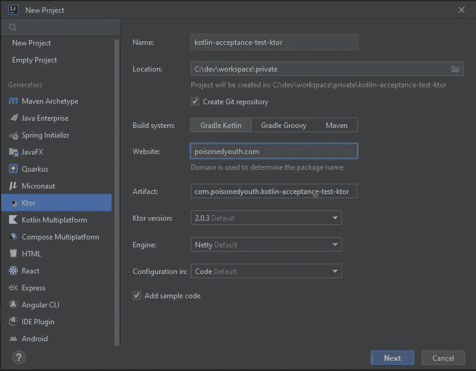
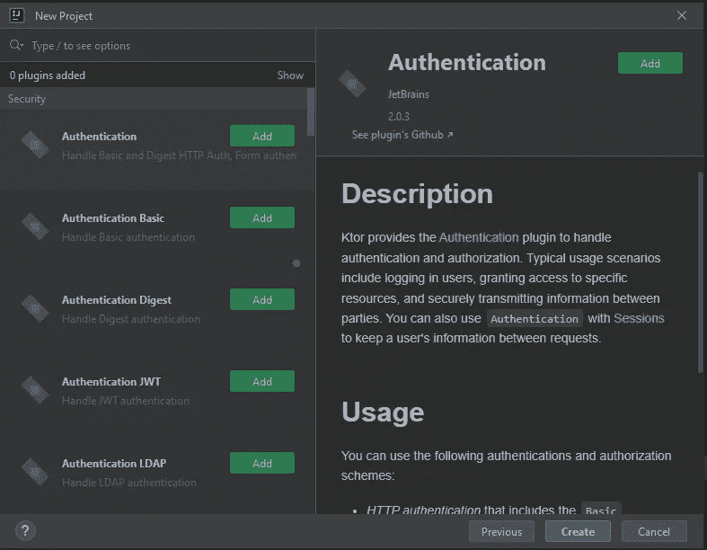
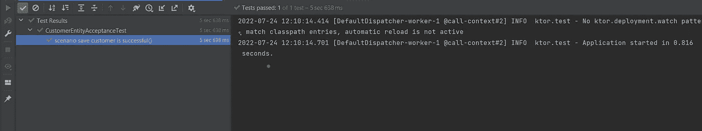

# 从 Spring Boot 转到 Ktor 的第一印象

> 原文：<https://betterprogramming.pub/switching-from-springboot-to-ktor-a-first-impression-1c4776970f39>

## 使用 Ktor、Koin 和 Exposed 编写 API 端点的分步指南


当我从 Java 切换到 Kotlin 时，我继续使用我熟悉的技术栈，它由 SpringBoot 生态系统的几个部分组成。除了一些小的不同，主要由 [Kotlin Spring 插件](https://kotlinlang.org/docs/all-open-plugin.html)处理，我可以像在 Java 世界中一样使用它。

随着我对 Kotlin 相关内容的兴趣增加，我搜索了一个 Kotlin 原生替代方案，它提供了与 SpringBoot 相似的功能范围。科特林社区的很多人都向我推荐了 Ktor。

在这篇文章中，我将分享我在使用 Ktor 时与 Spring Boot 相比的第一印象。

有了 IntelliJ，使用“新项目”菜单很容易创建一个新的 Ktor 项目，该菜单提供了一个类似于使用 [SpringBoot starter](https://start.spring.io) 创建 Spring Boot 项目的向导



为了能够比较 Spring Boot 和 Ktor 实现功能的方式，我将使用我之前用 Kotlin + Spring Boot(包括 JPA)创建的 Rest API 应用程序。当然，我的解决方案并不是使用 Ktor + Koin + Exposed 的惯用方式，而是尝试看看在同样的需求下事情是如何完成的。

所以我的第一步将是编写验收测试来指导我的实现。这是测试的第一个版本(随着应用程序功能的增加，测试的设置将逐步更新)。

实现非常简单。使用了一个`testApplication`块来代替`@MockMvc`。该函数提供了一个测试应用程序的配置实例，该实例在本地运行。如果没有配置任何不同，则使用生产应用程序的设置(见下文)。

```
fun Application.module() {
  ...
  *configureRouting*()
  ...
}
```

更多细节可以在 Ktor 的[官方文档中找到。](https://ktor.io/docs/testing.html)

下一步将是`datasource`的配置。因为没有可用的自动配置，所以我需要手动实现它，并在应用程序启动时注册它。

我设置了一个光`datasource`并创建了必要的表(如果还不存在的话)。

对于`datasource`的设置，SpringBoot 提供了一个更简单的实现，因为它只需要在`application.properties`中指定配置，这也可以很容易地在测试中被覆盖，剩下的工作由自动配置完成。

实现中的下一个区别是表和存储库的配置。与 JPA 相比，没有可用的注释。相反，Exposed 为不同的表类型提供基类。在我的例子中，我可以使用`IdLongTable`类。

地址的创建非常简单，因为不需要任何关系。

customer 表和 account 表有点复杂，因为它们与寻址是一对一的关系(没有级联更新/删除),与记账是一对多的关系(有级联更新/删除)。

我使用 GitHub 资源库中的官方文档来获得必要的帮助。

暴露的 DAO API 应该提供一种类似于像 Hibernate 这样的 ORM 框架的持久化数据的方法(根据文档)。但是我的实体的配置工作方式与我以前使用 Spring Data JPA 的方式不同。

我将所有的 DAO 调用包装在事务块中，因此消费者不会被迫这样做。Exposed 期望数据库上的所有调用(读和写)都有一个事务。

公开的 DAO 提供了基类，用于将对表的访问包装在一个实体中。实体基类提供了对数据库的基本访问方法(与 Spring Data JPA 的`CrudRepositories`相比非常基本)。

暴露的 DAO 在建模关系上也是有限的。客户和账户之间的一对多关系不能由客户来处理(就像 JPA 支持的那样),而是需要从账户来处理。

有了这个限制，我必须按照需要将实体添加到数据库的相同顺序来创建和持久化实体，以符合约束。添加一个新客户将类似于下面的示例。这和 Spring Data JPA 版本比起来不是很舒服。

为了将`Exposed`的数据持久层封装成可交换的，我将添加一个额外的抽象层。但现在问题来了:如何在不改变实现的情况下使 Exposed 可交换？

在 SpringBoot 中，已经包括了依赖注入容器，并且很容易通过例如不同的配置文件来切换一个组件的多个版本。

所以我的下一步将是向 Ktor 应用程序添加一个依赖注入框架。为此，我使用了 Koin**，这是 Kotlin 的一个轻量级注入库。**

**在 Koin 的文档中，有一个[单独的章节](https://insert-koin.io/docs/reference/koin-ktor/ktor)关于 Koin 在 Ktor 应用程序中的集成。**

**所需的配置非常小。只需将依赖关系添加到`build.gradle.kts`，设置您的依赖关系图并安装 Koin 模块。应该由 Koin 管理的组件的定义需要手动配置。没有任何注释能帮我完成这项工作。**

**存储库类只是包装公开的功能，并将实体对象映射到域对象。**

**测试组件也非常简单。Koin 提供了一个接口，可以用来在测试类中注入依赖项。**

**我将在本文中省略应用程序服务层的实现，因为它的工作方式与 SpringBoot 相同，因此对于比较这两个应用程序来说并不有趣。**

**满足需求所缺少的部分是添加一个处理程序，它提供处理 post 请求的功能。在`SpringBoot`中，这部分由 RestController 完成。**

**Ktor 有不同的概念。由应用程序处理的端点的定义在路由配置中定义。为了将路由的定义与 HTTP 请求的处理分开，我创建了一个控制器组件来完成这项工作。**

**当运行测试时，我得到一个异常，因为应用程序不能反序列化 JSON 有效负载。所以我需要添加一个额外的插件和对`build.gradle.kts`的依赖，它支持 JSON 的序列化/反序列化。**

**通过这一步，我已经达到了我的目标，验收测试也顺利通过。**

**在添加功能的过程中，我需要更新我的验收测试设置，以便正确地设置测试应用程序。**

**最终版本如下所示:**

****

**我用 Ktor 的第一印象结束了。与跳羚相比，我需要花费更多的时间来达到同样的目标，但这主要与我的跳羚经验有关。**

**我仍然需要评估一些未解决的问题:**

*   **事务处理**
*   **使用注释来简化组件的处理([https://insert-koin . io/docs/reference/koin-annotations/annotations/](https://insert-koin.io/docs/reference/koin-annotations/annotations/))**
*   **添加请求过滤器功能(例如用于请求/响应日志记录)**
*   **SpringBoot 提供的更多高级功能(例如安全性)**
*   **SpringBoot 提供的集成(例如 JMS、Keycloak、Kafka)**

# **结论**

*   **对于 Ktor 来说，SpringBoot 通过自动配置或组件扫描在引擎盖下执行的许多步骤都需要手动完成。**
*   **Ktor 和我在应用程序中使用的框架比 Spring Boot 使用的“魔法”更少，所以发生了什么更清楚。**
*   **与 SpringBoot 应用程序相比，该应用程序更加轻量级。**
*   **对于编写 REST 应用程序，Ktor 是一个选项。**

**对于本文使用的示例应用程序，请查看 GitHub 资源库:**

**[](https://github.com/PoisonedYouth/kotlin-acceptance-test-ktor.git) [## GitHub-PoisonedYouth/kot Lin-验收-测试-ktor

### 此时您不能执行该操作。您已使用另一个标签页或窗口登录。您已在另一个选项卡中注销，或者…

github.com](https://github.com/PoisonedYouth/kotlin-acceptance-test-ktor.git)**