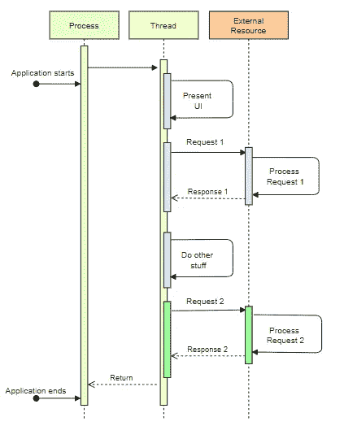
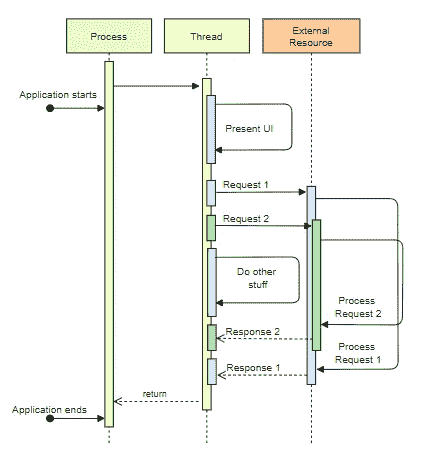
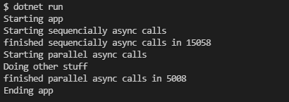

# C#中的同步、异步和多线程

> 原文：<https://betterprogramming.pub/sync-async-and-multi-thread-9bb2be072942>

## 停止错误地使用异步

由[monar CGI 艺术家](https://pixabay.com/pt/users/monoar_cgi_artist-2240009/)在 [Pixabay](https://pixabay.com/) 拍摄的照片

尽管对于大多数开发人员来说，同步、异步和多线程之间的区别非常清楚，但在实践方面，这可能会产生一些疑问。

async-await 操作符为列表增加了一个场景，在某些情况下这可能会很棘手。

在开始谈论棘手的情况之前，我将简要解释几个基本概念。

# 过程

当一个计算机程序启动时，操作系统会创建一个进程来执行该程序，通常，你可以在操作系统的应用程序管理器上看到这个进程的 id，当关闭这个进程时，你的应用程序就完成了。

# 线

一个*线程*是一个*进程*的子集，用于执行应用的代码指令，通常一个*进程*从一个单独的*线程*开始，但是*进程*可以创建并完成另外的*线程*。

当关闭一个*进程*时，所有相关的*线程*完成。

# 阻塞线程

有些任务执行起来要比其他任务花费更多的时间，例如读写一个大文件，访问网络资源，或者连接和执行针对数据库的命令。

启动应用程序时，会创建一个新线程，它开始执行所有代码指令，如显示用户界面、呈现内容以及加载按钮和文本框等可视组件。

想象一下，当单击一个按钮时，应用程序需要读取和处理一个大文件，在这种情况下，当线程忙于读取和处理文件时，用户界面将被阻塞，无法接受任何用户命令，如单击或滚动

同样的情况也可能发生在没有像 API 这样的用户界面的应用程序上，当线程执行一个任务时，所有其他指令都必须等待。

# 多线程

解决这个问题的答案非常简单，我们只需要创建一个额外的线程来执行长流程任务，然后主线程可以执行其他指令，比如让用户点击另一个按钮、滚动屏幕等等。

当长进程完成执行时，附加线程被关闭，应用程序从他等待的点继续执行。

# 异步ˌ非同步(asynchronous)

事实上，大多数长时间的处理任务都是由操作系统而不是应用程序来管理的，这表明创建一个新线程来等待操作系统来管理这些任务是不明智的。

这就是异步来党的地方。

异步方法将任务委托给操作系统，不会阻塞主线程，当操作系统完成处理时，它将作为回调返回到调用点。

聪明多了，不是吗？

# 差异

下面我们可以看到同步、异步和多线程之间的执行差异。

同步通话。作者图表

异步调用。作者图表

# 等待操作符

有时需要一个长任务的结果来执行程序中的下一步，所以当任务正在被操作系统执行时，程序不能继续执行其他指令，在这种情况下，我们可以使用 await 操作符，它将一直等待，直到任务完成并返回来执行下一条指令

> 重要提示:使用 await 不会阻塞主线程，这意味着在执行任务时应用程序不会没有响应

# 棘手的情况。

使用 async-await 使开发人员的体验非常接近 sync 方法，但实际上并非如此。

一个不完全了解它如何工作的开发人员将总是使用 async-await，而不考虑实际发生了什么，当我们处理多个任务时，我们可以优化并行运行它们的应用程序。

为了更好地理解它，请看下面的问题

# 问题是

我需要调用三个方法，这将需要很长时间来执行，我只能在所有任务完成后返回到调用者。

我将演示两种方法，并测量每种方法执行所花费的时间。

AwaitingTest 类

# 非优化方法

在这里，我异步调用所有方法，并按顺序等待它们。

自动排序法

# 优化方法

现在，我首先创建所有的任务，然后等待它们。

awaitin 并行方法

# 结果

调用这两个方法会产生非常不同的结果

程序类

执行结果

第一种方法在 15 秒后完成，而第二种方法只花了 5 秒，因为它并行运行所有的调用。

尽管 async-await 模型与 sync 模型非常相似，但它们并不相同，区别可能很微妙。

希望这篇文章能帮助你和你的团队更好的理解，下次再见，感谢阅读。