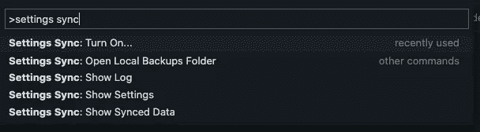
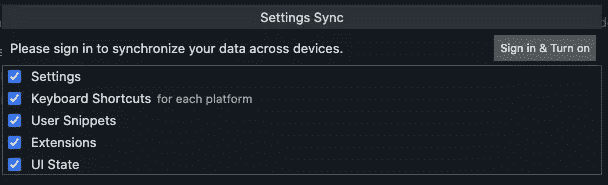
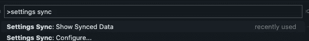
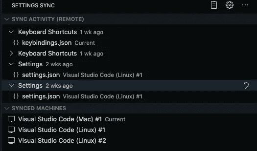

# 如何在多个设备上同步 VS 代码设置和扩展

> 原文：<https://betterprogramming.pub/sync-visual-studio-code-settings-extensions-shortcuts-across-multiple-devices-9fa6a980f25e>

## 将您的设置与您的工作电脑同步，以便在任何地方都具有相同的设置

克里斯里德在 [Unsplash](https://unsplash.com?utm_source=medium&utm_medium=referral) 上的照片。

在过去的几个月里，把我的工作和个人电脑分开是我试图改善工作和生活平衡的事情之一。我曾经用我的办公室电脑来处理我的个人发展，但是由于电脑上到处都是工作资料，我很难保持专注。

我忽略了一件事，当我设置我的个人电脑时才意识到，那就是我使用的 ide 的配置。我主要使用 Visual Studio 代码和 IntelliJ IDEA，这些年来配置已经得到了完善，以适应我的工作流和偏好。虽然有导出和导入配置的方法，但通过这种方法，一台计算机上的配置更改不会自动反映到另一台计算机上。

想象一下两台笔记本电脑的设置。照片由[freestokes](https://unsplash.com/@freestocks?utm_source=medium&utm_medium=referral)在 [Unsplash](https://unsplash.com?utm_source=medium&utm_medium=referral) 拍摄。

# 设置同步简介

在谷歌上快速搜索“同步<insert your="" ide="" here="">中的设置”，会出现几个关于 VS 代码和 IDEA 的选项。有几种方法。安装第三方插件就是其中之一。然而，由于有几个不同的插件可供选择，经过进一步研究，结果表明 VS Code 和 IDEA 都有一种同步应用内置设置的方法。</insert>

# Visual Studio 代码中的设置同步

该特性是在 VS Code 的【2020 年 7 月版或版本 1.48.0 中添加的。截至 11 月 1 日，它仍处于预览阶段，但我已经使用了大约一个月，没有遇到任何问题。确保您的 Visual Studio 代码是最新的！

## 步骤 1:在命令面板中搜索“设置同步”

打开命令选项板的默认快捷方式:

*   Mac: ⌘ + Shift + P
*   Linux 和 Windows: Ctrl + Shift + P

在命令调板中搜索设置同步

## 步骤 2:打开设置同步并登录

目前，你可以使用 Microsoft/GitHub 帐户登录(我使用 GitHub)。您还可以选择同步什么和不同步什么。

我想每个选项都是不言自明的。

使用 Microsoft/GitHub 帐户登录

## 第三步:全部完成！

登录后，应该会打开设置同步，您的设置将会同步到您的帐户。只需在您的每台设备上重复同样的操作。

任务成功！

# 同步时的常见问题

同步设置时，可能会发生冲突。解决设置冲突类似于在两个分支之间合并时解决代码冲突。常规选项包括:

*   合并:尝试将本地设置与远程设置合并。
*   替换本地:用远程设置覆盖本地设置。
*   手动合并:逐个手动合并首选项。

# 监视

我们还可以通过“显示同步数据”选项在 Visual Studio 代码上监控同步活动和我们的同步机器，我们可以通过命令面板访问该选项。

同步活动+同步机器(我猜没有 windows 机器)

# 结论

在本文中，我只介绍了我最常用的和最有用的特性。有关该特性的更多完整信息，您可以随时访问[官方文档](https://code.visualstudio.com/docs/editor/settings-sync)。

去试试吧，如果你也想知道如何在 IntelliJ IDEA 上同步你的设置，看看我写的[指南](https://devinryanriota.medium.com/sync-intellij-idea-settings-extensions-across-multiple-devices-aeaf682dc551)！