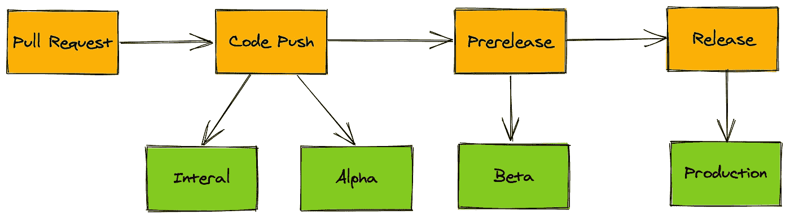

# 同步您的 Android 和 GitHub 版本

> 原文：<https://betterprogramming.pub/sync-your-android-and-github-releases-519c0e9dfa8c>

## 以直观的方式自动化应用的发布流程

布鲁斯·马斯在 [Unsplash](https://unsplash.com/s/photos/app?utm_source=unsplash&utm_medium=referral&utm_content=creditCopyText) 上的照片

# 在 NoOps 中的部署应该是直观的

NoOps 意味着自动化整个工作流程——开发人员所要做的就是推送代码。这是 2020 年的流行概念。

由于 app store 和 GitHub 存储库概念之间的不一致，自动化应用发布经常会导致混乱。

为了确保开发人员有信心做出改变，来自应用商店的应用发布流程应该在概念上与 GitHub 发布流程一致，因为存储库是开发人员推送代码的地方。

本文主要关注 GitHub 发布流程与 Android 发布流程(谷歌 Play 商店)的一致性，以及实现细节。

# Google Play 支持 GitHub 事件的超集

首先，我们需要了解谷歌 Play 商店版本的各个阶段:

1.  **内部**:向核心团队成员推送更新，收集 bug。
2.  **Alpha** :向更广泛的团队成员推送更新，收集 bug。
3.  **Beta** :向外部测试人员推送更新，收集反馈。
4.  **制作**:给大家推送更新。

然后，让我们看看 GitHub 发布的各个阶段:

1.  **推**:代码进入主分支。
2.  **预发布**:当版本代码完成时。
3.  **发布**:当一个版本准备好生产时。

谷歌 Play 商店和 GitHub 库事件匹配演示

因此，beta 在概念上类似于预发布，而生产在概念上类似于发布。

虽然存储库没有定义内部和 alpha 之间的界限，但是内部只允许少量的测试人员，所以我们可以把内部和 alpha 结合起来对应 push。

在匹配概念之后，让我们一步一步地实现一个自动发布工作流。

本文将展示与 GitHub Action (CI/CD 平台)和浪子(app automation framework)的版本同步，但是这个想法适用于任何 CI 和 app automation 框架。

注:我从一个加密的隐写应用程序[迷你驴](https://medium.com/minidonkey101)那里借来了脚本。要了解它在一个完整的移动应用中是如何工作的，请查看[资源库](https://github.com/tianhaoz95/photochat)。

# 步骤 0:编写一个浪子脚本来与谷歌 Play 商店进行交互

由于浪子不是这里的主要焦点，我将简单地发布一个上传应用到谷歌 Play 商店的最小的浪子脚本:

# 步骤 1:让工作流触发推送和发布事件

以下脚本在每次推送或释放时触发释放操作:

# 第二步:捕捉推送动作，发布内部和 Alpha 应用

这里我们希望捕获推送事件，而忽略释放事件:

## 步骤 3:捕获预发布操作以发布测试版应用程序

以下脚本确保触发事件是预发布事件:

## 步骤 4:捕获发布动作以发布生产应用程序

以下脚本检查触发事件是发行版，而不是预发行版:

注意:只有两种类型的发布事件:“预发布”和“发布”，所以检查它不是“预发布”就足够了。

万岁！通过这种设置，开发人员可以检查代码，就好像发布的应用程序不存在一样。该应用程序将准确地出现在谷歌 Play 商店或你喜欢的市场上。