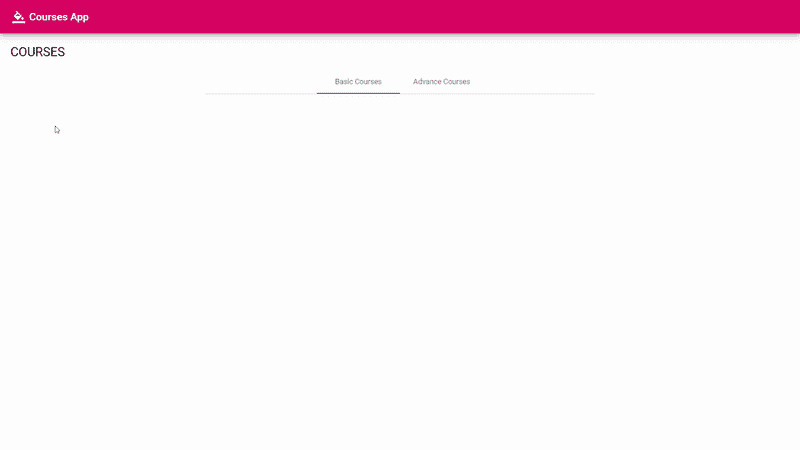

# 用 NgRx 同步本地存储中的状态

> 原文：<https://betterprogramming.pub/sync-your-state-in-local-storage-with-ngrx-9d6ceba93fc0>

## 了解如何创建一种通用的可配置机制，用于将部分应用程序状态持久化和重新组合到本地存储中。

照片由 [Fabian Grohs](https://unsplash.com/@grohsfabian) 在 [Unsplash](https://unsplash.com/photos/TUnXXhb2-a8) 上拍摄

当开发一个应用程序时，我们自然会考虑尽可能构建最佳的用户体验。确保我们的应用程序在重新启动时返回到之前的状态，维护用户偏好，以及支持离线支持只是我们希望包含在应用程序中的一小部分功能。

在这段代码中，我们将有效地将应用程序的一些状态保存到`localStorage` 中，并在刷新后恢复它。然后，我们将构建一个通用机制，使我们不仅能够保存状态的一部分，而且能够配置它，同时还支持延迟加载特性。

## 设置和库

对于该解决方案，我使用了以下技术:

*   [有角 7+](https://angular.io/)
*   [NgRx 7+](https://ngrx.io/guide/store)
*   [Lodash-es](https://www.npmjs.com/package/lodash-es)—Lodash 的树摇动版本

## 基本解

假设我们的应用程序中有多个自定义主题，我们希望我们的应用程序在页面重新加载后保留用户的偏好。为此，我们将创建一个新的`layoutState`，它将在`localStorage`中维护。

为了捕捉每一个变化的新状态，我们想要挂钩每一个用户动作*。*对于那个*，*我们就用`metaReducer`。

## 元还原剂

元缩减器(也称为高阶缩减器)是一个函数，它接受一个缩减器函数作为输入参数，并返回一个新的缩减器函数作为结果。它的基本特征如下:

你可以把它想象成一个减少动作的管道。

要了解更多关于元减速器的信息，我推荐阅读来自 *ngrx.io* 的[文档](https://ngrx.io/guide/store/metareducers)。

## 履行

为了拯救和恢复我们国家的一部分，我们需要:

*   定义我们将保存和恢复的密钥。
*   将存储的状态恢复并合并到初始状态。
*   为每个状态变化选择这些键并保存它们。

为此，我们首先创建一个文件`storage.metareducer.ts`

现在，要在我们的商店中使用我们的`storageMetaReducer`，我们需要将它添加到`app.module.ts`中的`storeConfig`,如下所示:

## 通用解决方案

到目前为止还不错，但是随着我们应用程序的增长，我们将自然地把状态分解成特性，我们希望能够为每个特性使用`metaReducer`。

为此，让我们的`metaReducer`通用。每个功能模块都会为`metaReducer`设置自己的配置，其中包含`storageKey`、`stateKeys`和一个外部`localStorage`服务。这样，我们可以将我们的`metaReducer`绑定到正确的特性模块。我们将通过角度依赖注入来实现。

让我们首先创建一个新的`app.tokens.ts`文件，我们将在其中定义我们的令牌:

现在，我们将创建`LocalStorageService`:

最后，我们将创建一个工厂函数，使用 NgRx 的`META_REDUCERS`令牌将其配置传递给`metaReducer`。

此外，我们需要为模块的提供者中的`ROOT_STORAGE_KEYS`和`ROOT_LOCAL_STORAGE_KEY`标记提供值。

这里是`metaReducer`:

既然我们已经使`metaReducer`可配置，让我们将它用于我们的惰性加载特性。

假设我们有一个按级别显示课程列表的应用程序，允许用户查看、注册和更改课程。在这种情况下，我们希望保留显示的课程列表和用户最后选择的级别。

这是我们的状态:

并使用以下标记添加新的`courses.tokens`文件:

最后但同样重要的是，这是我们的课程特色模块:

## 摘要

我们创建了一个通用的元缩减器来获取一个配置，并使用它来保存一些从状态中选择的部分。

我们简单地演示了应用程序如何总是显示最新用户的应用程序状态，即使是在刷新之后。当然，这可以用于与服务器同步信息、离线支持和大量其他功能，所有这些都是为了改善用户体验。

非常感谢[蒂姆·德施里弗](https://medium.com/@timdeschryver)和[诺亚·巴克利](https://twitter.com/BarkiNoaa)帮助我写这篇文章。

这篇文章中使用的所有代码示例都可以在[这个库](https://github.com/itayod/sync-state-blog)中找到。