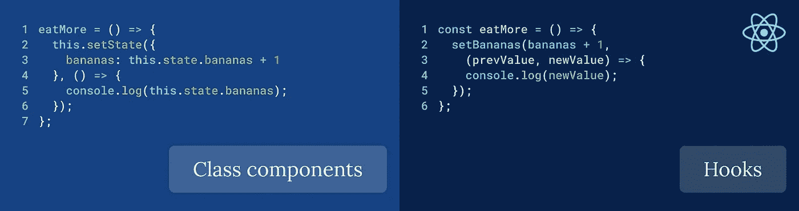
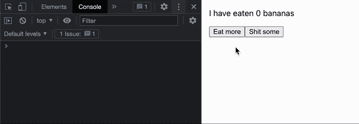
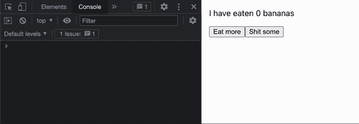
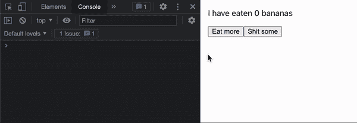
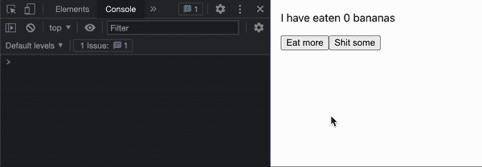
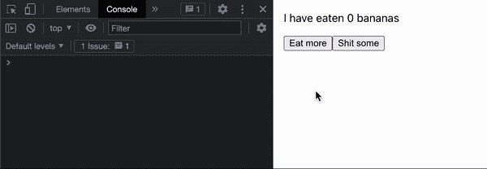

# React 中的同步状态使用挂钩

> 原文：<https://betterprogramming.pub/synchronous-state-in-react-using-hooks-dc77f43d8521>

## 将回调函数传递给 React 钩子的 setter 函数的方法



# 什么是使用状态挂钩？

`useState`钩子允许你在一个功能组件中创建一个状态，告诉 React 在它被改变时重新渲染。它不同于使用普通变量，因为它的值在重新呈现器之间保持不变，并且在更改时还会导致组件重新呈现。

# 怎么用？

下面是使用钩子的方法:

```
import { useState } from 'react';const Monkey = () => {
    const [bananas, setBananas] = useState(0);
    ...
}
```

钩子有两部分:参数和它的返回值:

*   参数:提供的参数是状态的初始值。
*   返回值:它返回两件事:状态变量和用于改变该变量的值的函数。

要使用状态，我们只需使用括号内的变量。`{}`

```
<div>
    <p>I have eaten {bananas} bananas</p>
</div>
```

## 设置状态

给定一个值作为参数和一个函数作为参数，有两种方法可以设置 stage。

1.  **作为参数的值**

```
const eatMore = () => {
    setBananas(bananas + 1);
};
```

2.**用作自变量**

```
const shitSome = () => {
    setBananas((bananas) => bananas - 1);
};
```

# 设置状态是异步的

React 异步设置该状态，这意味着状态不会立即改变，而是在几毫秒后改变。React 异步设置其状态，因为否则会导致开销很大的操作。使其同步可能会导致浏览器无响应。

异步`setState`调用被批量处理，以提供更好的用户体验和性能。

出现的一个问题是，如果我们在调用 setter 函数后立即访问状态，我们得到的是现有的值，而不是更新后的值。

```
const eatMore = () => {
   setBananas(bananas + 1);
   console.log(bananas);
}
```

下面您可以看到呈现的值与控制台中记录的值不同。



# 解决办法

## 类别组件

如果您以前使用过类组件，那么您可能知道`setState`函数。

它也不返回一个`Promise`，所以使用 async/await 或任何类似的方法都不起作用。实际设置状态的时间可以变化。通常，它会在下一次渲染时发生，但有时为了提高性能，它可以进行批处理。

`setState`函数接受一个可选的回调参数，该参数可用于在状态改变后进行更新。

```
eatMore = () => {
   this.setState({ bananas: this.state.bananas + 1 }, () => {
       console.log(this.state.bananas);
  });
}
```

在这里，我们可以看到它的工作原理:



# 用钩子解决这个问题

我们上面看到的解决方案对由`useState`钩子返回的 setter 函数不起作用。

即使您尝试将回调函数传递给 setter 函数，React 也会向您发出警告，并建议您使用`useEffect`钩子，但这并不是所有用例的最佳解决方案。



## 使用函数参数

我们知道 setter 函数也接受一个函数作为参数，它接受初始值并返回修改后的值。我们能做的就是在这个函数内部调用我们的函数，然后返回所需的值。

```
const eatMore = () => {
    setBananas(bananas => {
        const modifiedValue = bananas + 1;
        console.log(modifiedValue);
        return modifiedValue;
    });
};
```

下面你可以看到增量函数工作得很好，但是减量函数有问题



# 使用自定义挂钩的解决方案

上面的解决方案很棒，但是我们可以抽象它以使代码看起来更干净，为了抽象解决方案，我们将使用自定义的 React 钩子。

构建自己的钩子可以让您将组件逻辑提取到可重用的函数中。自定义钩子是一个 JavaScript 函数，它的名字以`use`开头，可能会调用其他钩子。

这个钩子可以选择使用一个回调函数，这个函数通过`prevValue`和`newValue`被调用。代码如下:

要使用它，请尝试以下代码:

这里有一个优雅的解决方案:



# 最终代码

## `App.js`

## useStateWithCallback.js

# 参考链接

[](https://reactjs.org/docs/hooks-state.html) [## 使用状态钩子-反应

### 钩子是 React 16.8 中的新增功能。它们允许您使用状态和其他 React 特性，而无需编写类。的…

reactjs.org](https://reactjs.org/docs/hooks-state.html) [](https://reactjs.org/docs/hooks-custom.html) [## 建立你自己的钩子-反应

### 钩子是 React 16.8 中的新增功能。它们让你不用写类就可以使用状态和其他 React 特性…

reactjs.org](https://reactjs.org/docs/hooks-custom.html) 

*非常感谢您的阅读。我希望这能对你有所帮助。如果您有任何问题或建议，请随时回复。*