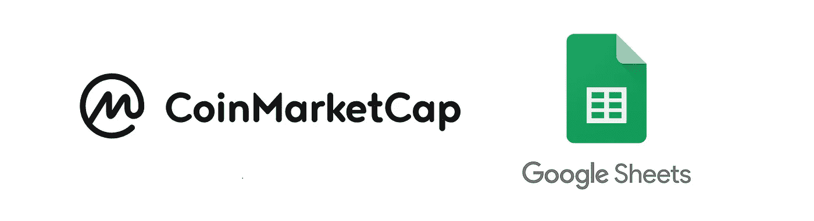
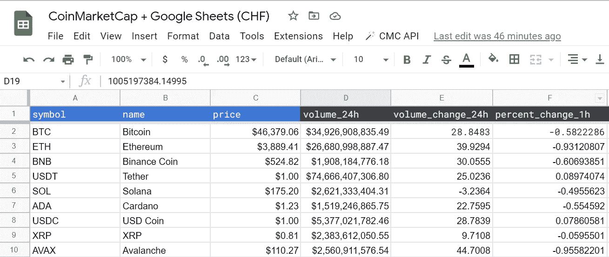
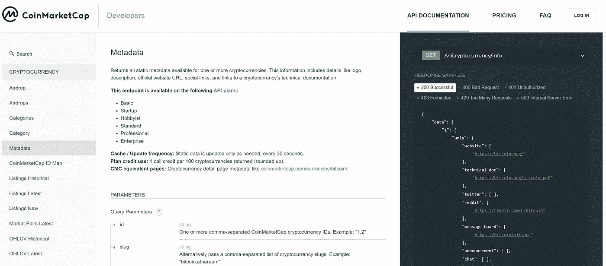
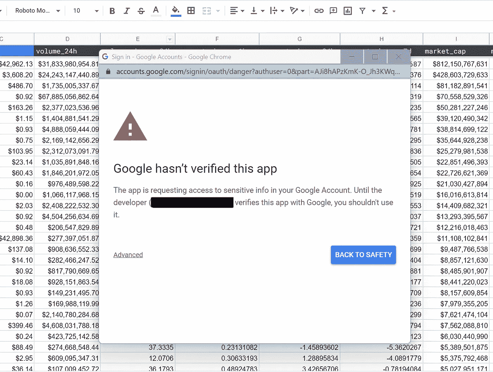
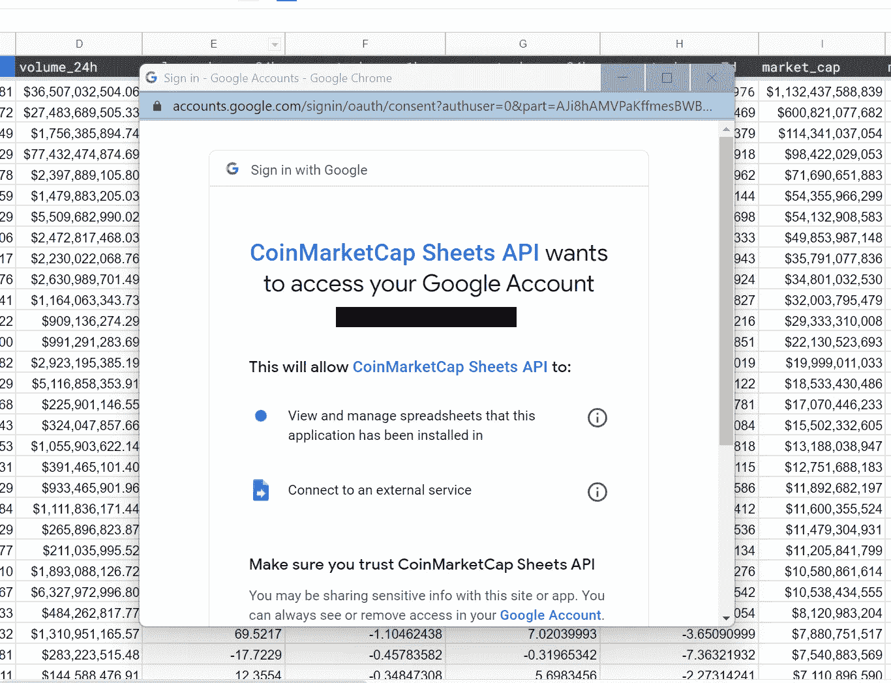
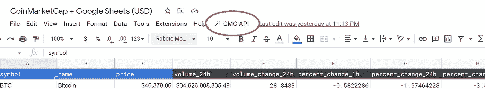
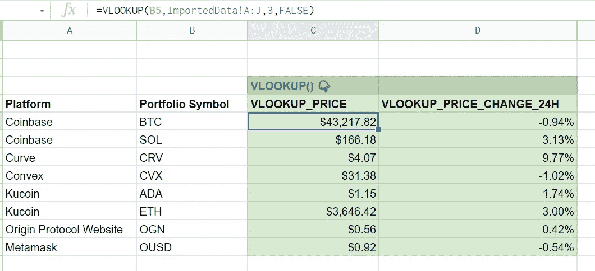

# 用 100 行代码将加密货币价格同步到谷歌表单中

> 原文：<https://betterprogramming.pub/syncing-cryptocurrency-prices-into-google-sheets-with-100-lines-of-code-df18764a79b6>

## 这种自动化是无服务器的，并且使用 CoinMarketCap 自由层 API



作者图片

嘿，我写了这个指南，因为和许多加密持有者一样，我花了太多时间手动复制和粘贴加密价格数据到我的谷歌投资组合跟踪器中。我想现在一定有人已经自动完成了，对吧？

起初，我试图在网上寻找，但我找不到任何容易设置的东西，我也不想为电子表格插件的高级功能付费。

因此，我做了任何一个电子表格呆子都会做的事情:我使用一些谷歌应用程序和 CoinMarketCap 的免费层 API 编写了一个解决方案…然后*瞧*，你可以在下面看到我的概念证明:



一个[演示谷歌表单](https://docs.google.com/spreadsheets/d/1Osa81aLQGN-QlkydWMwTqnpnojbTNBSZv3cBYJ2gxV0/edit#gid=0)的例子，它每天从**CoinMarketCap.com**获取一次实时价格数据

如果你只是想使用`VLOOKUP`和`IMPORTRANGE` 将一些每日价格数据放入你的 Google Sheets，这里是我为自己和他人构建的 5 个常见加密货币对:

*   [前 5000 种美元加密货币(USD](https://docs.google.com/spreadsheets/d/1Osa81aLQGN-QlkydWMwTqnpnojbTNBSZv3cBYJ2gxV0/edit#gid=0) )
*   [瑞士法郎(CHF](https://docs.google.com/spreadsheets/d/1CGG1Be8Dyjr0yqql3epRRZm6CGcjdR8eVNPm6V8dKDI/edit#gid=0) )的 5000 种顶级加密货币
*   [以欧元计的 5000 种顶级加密货币(欧元](https://docs.google.com/spreadsheets/d/1rnO13faOwmLiiiFye19Fr41qZlMN2RWRUQgSKlhekWQ/edit?usp=sharing)
*   [前 5000 种加拿大元加密货币(CAD](https://docs.google.com/spreadsheets/d/1qBvh-VnERib_31xF_W-EQDCA5ngyA2bWaVJLZ-krSZQ/edit?usp=sharing)

上述工作表每天运行一次，太平洋标准时间为每天早上 6 点。

> “这固然很好，但如果我想让它一天运行一次以上，或者以不同的货币运行，该怎么办？”

好问题！为此，您需要对代码进行一些定制。请继续阅读…

## 1)首先，从 CoinMarketCap 为自己申请一个开发者账户

CoinMarketCap API 与比特币基地用于他们不支持的硬币和代币价格的 API 相同(我认为)，所以如果它对他们来说足够好，对我来说也足够好:)

在这里创建一个账户来获得你的 API 密匙:[coinmarketcap.com/api/](https://coinmarketcap.com/api/)



了解更多:【https://coinmarketcap.com/api/documentation/v1/ 

## 2)接下来，从[sheets.google.com](http://sheets.google.com)创建一个新的谷歌表单

给它起个好记的名字，比如*coin market cap+Google Sheets*

## 3)从这里，从**扩展>应用程序脚本**访问[谷歌应用程序脚本](https://developers.google.com/apps-script)

也给你的脚本起个名字，比如*coin market cap+Google Sheets API*


第一次？了解更多关于 Google Apps 脚本的信息: [Google Apps 脚本](https://developers.google.com/apps-script)

## 4)我们将[添加一个自定义菜单](https://developers.google.com/apps-script/guides/menus?hl=en)到我们的表单**和**中，一种安全存储硬币市值 API 密钥的方法(例如，不是明文)

*   这些工具使用 getUI()库向 Google 工作表添加定制菜单
*   `[@OnlyCurrentDoc](https://developers.google.com/apps-script/guides/services/authorization)` 使脚本只能访问它所链接的工作表。

*   这些使用 Apps 脚本的内置`[PropertiesService](https://developers.google.com/apps-script/reference/properties/properties-service)`为脚本提供了某些助手功能。这将把 API 密匙保存到您的 Google 帐户中，作为一个用户属性*稍后将被菜单项 **Run Query 调用。***

我决定使用用户属性的原因是因为它比仅仅将 API 密钥存储在代码中更安全。我还希望电子表格的每个“用户”使用他/她自己的 API 键，而不是共享。

## 5)接下来，让我们编写查询 CoinMarketCap API 所需的代码

*   `queryCoinMarketCapEndpoint` 使用 [Apps 脚本的 urlfettchapp](https://developers.google.com/apps-script/reference/url-fetch)库通过 HTTP 请求查询 API 端点。你可以从 Google Apps 脚本中使用这个 API。如果您的 API 需要 OAuth，他们甚至有一个受支持的 OAuth 库！

*热点提示:*

1.  如果你愿意，你可以定制`PARAMETERS`，但我只是拿了前 5000 个硬币，只要求以美元报价。
2.  如果您需要不同种类的货币，请用您的货币替换美元。

## 6)现在端点工作了，将返回的数据写入您的 Google Sheet

*   如果您需要不同货币的报价，请记住在此替换“**美元”**
*   确保您的 Google Sheet 有一个名为 **"ImportedData"** 的工作表，并且从单元格 A1 开始的标题与代码中的标题匹配！

```
symbol,name,price,volume_24h,volume_change_24h,percent_change_1h,percent_change_24h,percent_change_7d, market_cap,market_cap_dominance,fully_diluted_market_cap,last_updated
```

## 7)现在运行您的脚本

谷歌会告诉你这个应用还没有被验证。您应该使用高级链接授权该应用程序。

既然你是开发者，你可以信任他/她/他们，但显然不要在不舒服的情况下盲目地在网上运行脚本。



点击**高级**进入下一个提示！



向下滚动并**批准**您的脚本

## 8)刷新浏览器窗口后，或者如果您手动运行 OnOpen()，一个新的自定义菜单将出现在您的 Google 表单中



该菜单是您添加 CoinMarketCap API 密钥的地方

## 9)添加您的 CoinMarketCap API 密钥

这可以通过`**CMC API > Set API Key**`从谷歌表单中完成

## 10)一旦设置了 API 键，运行查询

这可以通过`**CMC API > Run Query**` **完成。**如果您已经正确设置了所有内容，数据应该会为您加载，如下所示:


噪音🐥

## **11)使用 Google Sheets 公式合并数据源**

要将这些数据添加到您的个人电子表格中，请在现有电子表格的新标签中使用`[IMPORTRANGE()](https://support.google.com/docs/answer/3093340?hl=en)`。它看起来会像这样:

```
**=IMPORTRANGE({{SPREADSHEET_URL}},ImportedData!A:J)**
//This ImportRange() brings data from one spreadsheet to another. Afterward, you can manipulate or query the data from your own portfolio tracker or move it where you want it the screenshot below:
```


参见前 5000 枚硬币电子表格中的**用法示例**选项卡

一旦来自 CoinMarketCap 的数据进入你的个人电子表格，你还没有完成。你需要找到一种方法将你的投资组合数据和价格数据“连接”起来。为此，在我的电子表格中创建一个新列，并使用如下所示的内容，根据您的需要使用`VLOOKUP().`进行填充:

```
**=VLOOKUP({{SYMBOL}},ImportedData!A:J,3,FALSE)**
//This Vlookup searches the ImportedData range and returns the **3rd** **column** using {{SYMBOL}} as its search key.
```

使用这个公式，你可以查询符号，**、** BTC、ETH、SOL 或任何你想要的硬币或代币**、**将你的投资组合数据与价格数据“结合”在一起。或者，如果您熟悉 Google Sheets 参考语法，您可以匹配列值，而不是硬编码符号，如下图所示:



为了方便使用，我在 Top 5000 Coins 电子表格的**示例用法**选项卡中添加了示例公式

你的交易日志可能和我的不一样，所以我就写到这里，但希望你能明白。

## 12)安排你的代码自己运行

你可以使用基于时间或动作的 [Google Apps 触发器](https://developers.google.com/apps-script/guides/triggers)来用实时数据自动刷新你的工作表。只是确保不要超过每月 333 次调用的免费 API 限制。

## 13)定制脚本以检索其他数据(可选)

我将在这里结束，但我已经在 github repo 中包含了另一个地方，您可以在那里自定义 API 结果，名为`parameters`。定制您的 API 结果记录在[https://coinmarketcap.com/api/documentation/v1/](https://coinmarketcap.com/api/documentation/v1/#section/Endpoint-Overview)中。

也就是说，如果您对参数进行了更改，请准备好更改脚本的其余部分，特别是更改第**行第 40** 行返回的字段，以及它们如何映射回 Google 工作表:

# 源代码

[](https://github.com/danphamx/CoinMarketCap-to-Google-Sheets) [## GitHub-danphamx/CoinMarketCap-to-Google-Sheets:从 CoinMarketCap 查询数据的模板…

### 此时您不能执行该操作。您已使用另一个标签页或窗口登录。您已在另一个选项卡中注销，或者…

github.com](https://github.com/danphamx/CoinMarketCap-to-Google-Sheets) 

## 要阅读更多我的个人理财文章，请查看 Dan Pham 个人理财文章索引并关注我:)[https://danphamx . medium . com/Index-of-Dan-phams-Personal-Finance-Articles-290 f 7a 3 fad 98](https://danphamx.medium.com/index-of-dan-phams-personal-finance-articles-290f7a3fad98)

本文仅供参考。不应将其视为财务或法律建议。并非所有信息都是准确的。在做任何重大财务决定之前，先咨询财务专家。