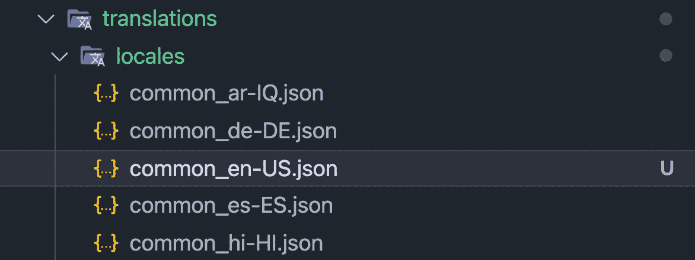

# 使用 JavaScript 在 React 应用程序中同步 i18n 翻译文件

> 原文：<https://betterprogramming.pub/syncing-i18n-translations-files-in-react-app-using-javascript-91fd50513bee>

## 如果你在这里着陆，你无疑会明白挑战。国际化是提供多语言应用或网站的关键。挑战在于，如何在所有语言文件中保持 JSON 键的同步？


[Towfiqu barbhuiya](https://unsplash.com/@towfiqu999999?utm_source=medium&utm_medium=referral) 在 [Unsplash](https://unsplash.com?utm_source=medium&utm_medium=referral) 上拍照

# 解释:问题

作为软件开发人员，我们花费大量时间构建包含文本、指令或其他 HTML 元素的 UI 元素，这些元素向用户呈现文本。该文本将取决于用户选择的语言，并且通常从其各自的键/值对的 JSON 文件中检索，例如:

```
**// Example: English Translation File**{
  "title": "Example Ltd.",
  "tagline": "Find the best examples right here.",
  "subtitle": "This is a demo website",
  ...
}**// Example: German Translation File**{
  "tagline": "Hier finden Sie die besten Beispiele.",
  "subtitle": "Dies ist eine Demo-Website",
  ...
}
```

前端实现(例如，`title`和`tagline`在翻译文件中被替换为它们各自的值):

```
<h1>{title}</h1> => to render the title text
<p>{tagline}</p> => to render the tagline text
```

## 那么…交易是什么？

根据构建 web 应用程序的经验，这些翻译文件(JSON 文件)可能会变得非常大。如果我们现在为一个新键添加一个翻译(比方说，一个`description`字段)，*我们必须将这个键复制到每一个语言文件*(其中可能有很多——每种语言一个)。

> 键可能是嵌套的、无序的，并且可能在不知不觉中被复制。简而言之:这是手动的、耗时的，并且不可扩展！

# 关于后备语言的一句话

您可能会注意到，在上面的例子中，我们的德语翻译文件不包含对`title`的翻译，这相当于说，我们的翻译文件不同步。

幸运的是，像 [react-i18next](https://react.i18next.com) 这样的 React 库允许您指定默认的后备语言——这样在缺少翻译的情况下，后备语言(大多数情况下是英语)的值就会呈现给用户。

如果你认为这导致了翻译碎片化，那你就对了！没有什么比给最终用户提供翻译不一致的界面更糟糕的了。

# 保持翻译文件同步

假设您是一名开发人员，正在用您的母语(可能是英语)添加新的翻译记录，您可能想知道如何构建一个简单的脚本，可以在您的终端中执行该脚本以将“主”语言键同步到所有其他语言文件。可能吗？

是啊！而且也很简单！

## 步骤 1:组织您的语言环境

让我们从将所有翻译文件放入同一个文件夹开始(在我的例子中称为`locales`)。现在，请注意`common_en-US.json`是我的主翻译文件——包含我的英语价值观。



## 步骤 2:遍历主翻译文件

我们现在想添加一个脚本来遍历 master (English)文件中的 JSON 键列表，并返回所有键。稍后，我们将把其他语言文件中的关键字与这些进行比较，添加那些已经丢失的关键字。

## 步骤 3:同步翻译文件

现在对于主动作，我们首先执行步骤 2 中的`traverseTranslations()`函数，以获得根据主文件(英语)应该包含的所有路径的列表。

接下来，我们读取`locales`目录中每个文件的现有 JSON 结构。对于每个文件，我们检查它是否包含所有它应该包含的路径/键(基于上面的内容)。如果目标语言中已经存在本地翻译，则不会对该记录进行任何更改，如果它不存在，我们只需将该记录与英语翻译一起添加。

最后，我们将文件写回文件系统，并使用[更漂亮的](https://prettier.io)将其格式化。瞧啊。

## 步骤 4:使用 NPM 执行

对于我们的最后一个技巧，我们将通过`npm run sync:i18n`命令执行这段代码。这可以在我们项目的`package.json`文件中定义如下:

如果您正在使用 TypeScript，请确保将一个非常简单的`tsconfig.json`添加到与其他两个脚本相同的文件夹中。参见[示例 tsconfig.json](https://gist.github.com/olafwrieden/b028ce5f74ae933249aa33c149705059#file-tsconfig-json)


现在，每当我们作为开发人员向我们的英语翻译文件添加 i18n 键值对时，我们只需要运行`npm run sync:i18n`来将这个新键同步到所有其他语言文件。整洁，对不对？

# 已知限制

1.  如果一个翻译**键**改变了怎么办？例如,`title`将嵌套在`app.title`下——运行时，`app.title`将作为一个新键追加，而不是替换现有的键。

```
**Want to Connect?**LinkedIn: [Olaf Wrieden](https://www.linkedin.com/in/olafwrieden/)
[GitHub](https://github.com/olafwrieden)
```