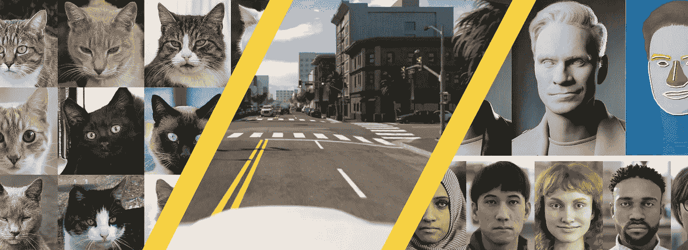
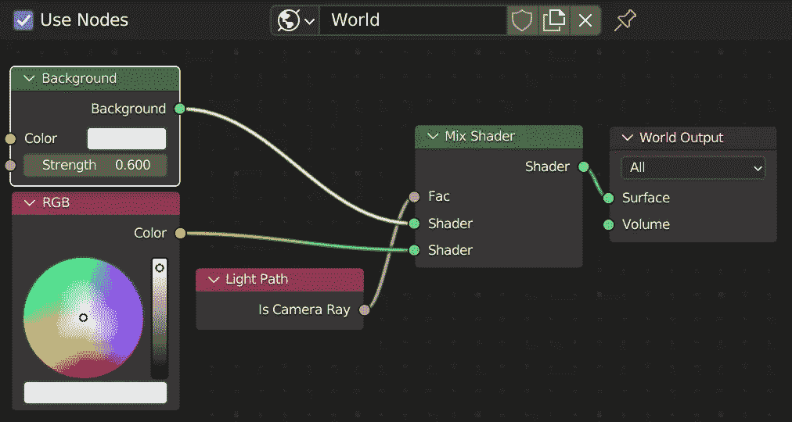
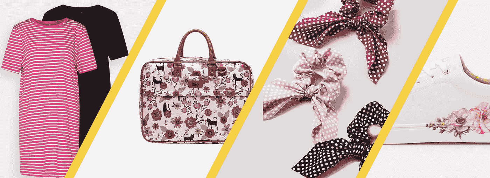
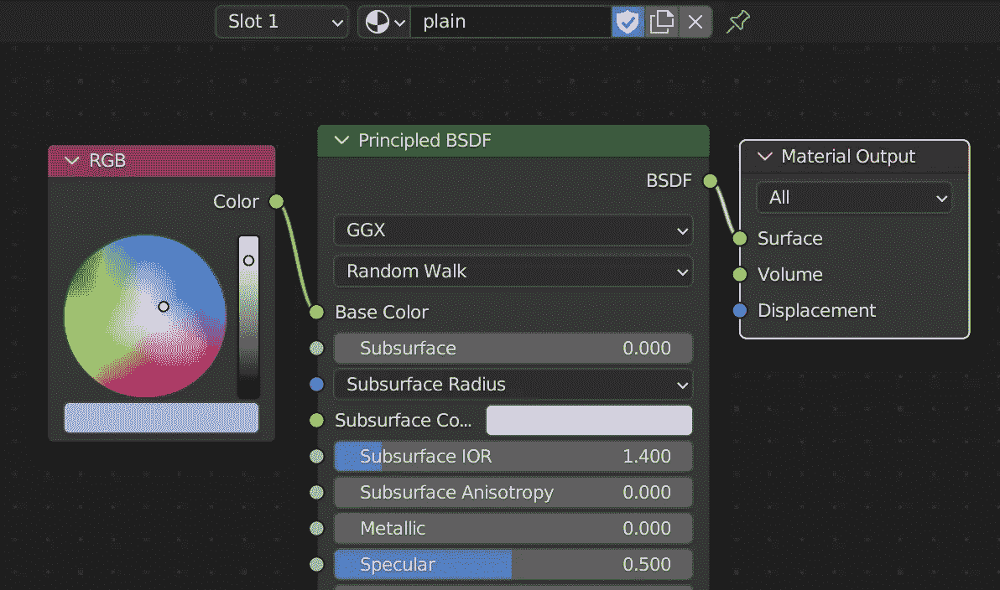
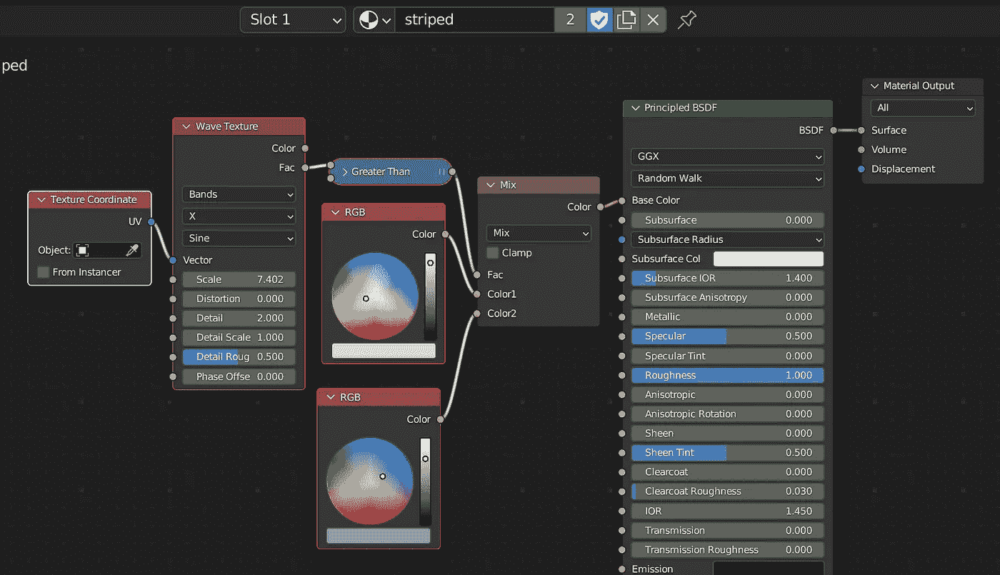
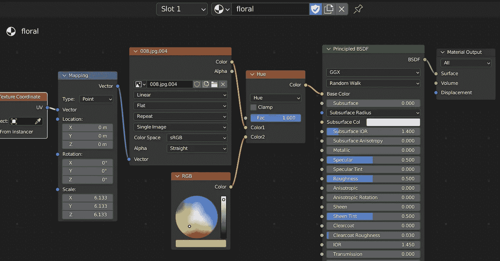
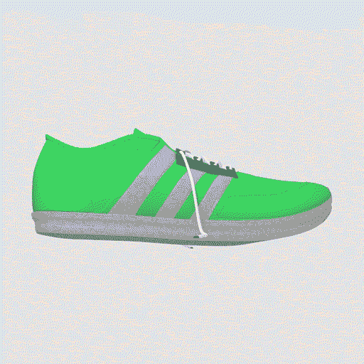

# 搅拌机中计算机视觉的合成数据生成

> 原文：<https://betterprogramming.pub/synthetic-data-generation-for-computer-vision-in-blender-part-1-6926819b11e6>

## (第一部分)



来自 thiscatdoesnotexist.com、paralleldomain.com 和微软的 synth 数据“伪造它直到你成功”

**内容:**这篇文章介绍了合成数据生成，以及如何通过 Blender 使用它来训练高性能和健壮的视觉模型。我们将提供 Blender 设置的概述，并且出于演示的目的，呈现来自时尚领域的具体视觉分类场景。

**为什么:**利用 Blender 的程序能力，采用以数据为中心的方法，在很少或不需要人工注释的情况下获得更好的机器学习模型。

**谁:**我们就靠 [Blender > 3.1](https://www.blender.org/download/) 和 Python ≥ 3.7。然后，生成的图像可以用于任何下游任务，而不管可能的依赖框架(例如 Tensorflow、PyTorch)。

# 合成数据生成

合成数据生成(SDG)包括各种旨在以编程方式生成数据以支持下游任务的方法。在统计学和机器学习(ML)中，最终目标是合成具有相同目标域分布的样本，用于模型训练或测试目的。这是[以数据为中心的 ML 方法](https://datacentricai.org/)的一部分，其中为了实现更好的性能，我们积极地处理数据，而不是模型、算法或架构。

采用 SDG 有多种原因，主要是:

*   最大限度地减少对人工标签和治疗的需求
*   促进和/或达到更高容量型号的数据要求
*   解决一般性、健壮性、可移植性、偏见等问题
*   克服真实数据使用限制(隐私和法规)

在计算机视觉(CV)中，我们感兴趣的是**合成真实的视觉样本**(最常见的媒体，如图像和视频)。合成该领域数据的两种主要方法是[生成模型](https://www.deeplearningweekly.com/p/deep-learning-weekly-generative-modeling)和计算机图形(CG)管道。存在混合方法，其基于目标设置在不同的度量中组合多种方法。

例如，想象一下[生成不存在的猫的图像](https://thiscatdoesnotexist.com/)来训练猫狗分类器，或者从游戏和[模拟环境中获取图像来引导自动驾驶系统的训练](https://paralleldomain.com/)，或者 r [为地标定位提供无限种类的 CG 人脸](https://microsoft.github.io/FaceSynthetics/)。

在本文中，我们将重点关注 CG 方法，它依赖于传统的软件和工具来操作 3D 内容(建模)，应用材料(纹理)，以及合成 2D 图像(渲染)。让那里有搅拌机。

# SDG 搅拌机

Blender 是一个免费的开源 3D CG 软件工具集。在过去的几年里，它经历了非凡的改进，特别是 2.8 版本的改进:重新设计的用户界面和工作空间，实时 Eevee 渲染器，优化的循环(路径跟踪引擎)，带[油性笔](https://towardsdatascience.com/blender-2-8-grease-pencil-scripting-and-generative-art-cbbfd3967590)的 2D 动画，更好的着色器节点和最近超级强大的[几何节点系统](https://docs.blender.org/manual/en/latest/modeling/geometry_nodes/introduction.html)。所有这些(以及更多)加上 Python API，使它成为对 3D 环境的编程和程序控制感兴趣的研究人员和爱好者的一个明显受欢迎的选择，而不需要依赖不太用户友好的 3D 工具或库。

关于 Blender 中脚本的介绍，请参见我之前的一篇文章的第一部分。

几行代码就可以展示 SDG(以及其他)的编程设置的强大功能。以下 Python 代码片段允许以可控的方式随机化相机位置。如果你的相机有一个`Track To`约束，你也保证它会从不同的角度指向同一个位置。

下面的片段显示了如何根据背景颜色和光线强度随机化*世界*(指场景环境)。它只需要一个基本的节点设置，如下所示。



随机化的基本世界设置

此时，放置在场景中的任何对象都已经可以在不同的光照条件和背景下从不同的角度进行渲染。
以下代码是将当前场景渲染到文件所需的全部内容。

人们可以扩展这些基本块，并自动/随机处理与他们的需求相关的任何方面。然后，渲染的图像可以用于任何下游任务。实时 Eeevee 渲染器保证您可以在几秒钟或更短的时间内生成图像，因此可以轻松扩展以适应数据饥渴的情况。如果您需要更高的真实感，Cycles 也是一个选项，但您会看到更长的渲染时间和对好的 GPU 的更强依赖性。

最重要的是，通过使用 Blender，您可以访问所有的 3D 场景和对象信息，并可以使用 [*通道*](https://docs.blender.org/manual/en/latest/render/layers/passes.html) 将目标内容分割为单独的渲染图像(例如，深度、法线贴图、环境遮挡、通过对象或材质索引的分割贴图)。

然而，对于这个条目，我们将把重点放在唯一的视觉分类设置上，并使用来自时尚领域的一个简单但具体的分类示例:纺织品图案分类来探索程序性材料。

# 示例用例:模式分类



不同图案类型的时尚单品示例。

让我们来介绍一下用例:我们有一个视觉分类任务，需要对一个时尚物品的图案进行分类。这是一个多类别的问题，我们依赖于一组先前定义的类别(例如，素色、条纹、圆点、花卉、方格、动物纹)。我们对这些类都有直观的理解，它们适用于任何时尚物品，比如一件衣服、一双运动鞋或一个包。我们可以为这项任务手动收集和管理数据，但是通过 Blender 综合生成数据怎么样？

我们首先需要获得一些适合我们的目标数据分布的 3D 对象。我们可以很容易地在高级包甚至单个免费模型中找到过多的 3D 时尚内容。我们甚至可以程序化地处理建模本身，但这是一个将在未来单独的条目中讨论的主题。

一旦我们有了 3D 物体，我们就可以开始制作材料了。
我们在这里展示了三种样本材料的节点树:*素色*、*条纹*和*碎花*。前两者完全可以在 Blender 中获得。对于 *floral* 来说，我们依赖于需要单独下载的外部图像。



*普通*物料节点树



条纹材料节点树



花卉材料节点树

除了这些材料，我们只需要以下代码。我们有一个简单的函数来为每个目标类生成随机颜色和包装函数。

运行时，这些函数随机化相应的 Blender 材质(代码中使用的名称必须与 Blender 中的名称相匹配，这既适用于所有节点树的名称，也适用于特定节点的名称)。

如果我们将上面的设置与上一节提供的随机化结合起来，我们就可以开始渲染了。



渲染图像的随机样本

# 使用生成的合成数据

使用生成的图像，您已经可以尝试训练一个视觉模型，并查看它在真实的目标领域数据上的表现。你不需要收集，刮擦和策划真实的图像，你不需要人工注释和验证，你有一个完全程序化的设置来扩展和进一步利用。

虽然这是一个玩具用例，但是你的概念/类越复杂、越小众、越缺乏代表性，SDG 方法就越能把你从数据收集和管理的痛苦中解救出来。

当合成数据集功能多样并且能够概化为真实数据集时，它是一个好的数据集。合成数据可以有多种用途。它可以作为训练期间已经可用的真实数据的补充，在训练期间，经常测试不同比率的合成与真实数据，以了解模型性能的最佳折衷。有时，它甚至可以只是一种测试/验证视觉模型鲁棒性的手段。

关于使用合成数据的有效性，这通常需要经验测试，但是多个[最近的](https://github.com/StoryMY/take-off-eyeglasses) [作品](https://ai.googleblog.com/2021/06/toward-generalized-sim-to-real-transfer.html)和[论文](https://microsoft.github.io/FaceSynthetics/)展示了 SDG 的力量。

其中一个主要限制是所谓的*畴隙*，意思是真实图像和合成图像之间的内在差异。对于我们的 Blender 示例，更多样和更详细的 3D 对象、更丰富的纹理或使用 Cycles 渲染器会产生看起来更真实的图像，但与真实的时尚图像相比仍有相当大的差距，如果包括人体模型，差距会更大。像*领域适配*这样的特定研究领域着眼于如何解决这样的问题。

**SDG 还需要专业的领域知识**(与人类注释需要的相同)，以及质量控制的整体设置，以避免更大和更具破坏性的领域差距。在生成过程中，总是存在注入隐含偏见的风险，或者完全错过你的领域中可能的异常(然而相关的)区域。再拿我们的玩具用例来说:我们需要清楚地理解我们的指导方针，即什么使得图案*具有花卉图案。*是否需要写实花卉描绘？需要足够丰富多彩吗？多少级别的风格化是可以接受的？如果没有对这些问题的明确答案，我们最终将根据我们的偏见和假设来定义合成生成过程，然后很可能无法捕获我们真实数据的要求。

# 结论

在这篇文章中，我们给出了合成数据生成(SDG)的高级介绍，以及如何通过 Blender 轻松实现它。

模式分类设置允许我们演示如何将 Blender 材料和 Python 脚本结合起来，通过传统的计算机图形管道生成合成数据。

这是一个简单而强大的设置，已经可以作为大量计算机视觉用例的起点。

本系列未来条目的计划是在这里介绍的基础上进行扩展，并探索 SDG 在视觉领域中不同的和更复杂的场景，同时展示如何使用 Blender 作为一个强大的工具来解决这些问题。

我们非常欢迎反馈和建议，以推动这种未来的条目。总的来说，我们计划涵盖深度、分割和其他场景信息等方面，这些信息可以在依赖 Blender 时免费获得。我们还希望超越纯材质节点树来处理程序建模，并查看例如几何节点如何用于操纵 SDG 的网格。

从那里，我们将转向 SDG 的混合方法，考虑计算机图形的机器学习领域最近取得的重要进展，如对象/身体生成和重建，纹理合成的生成模型，以及神经渲染。

```
**Want to Connect?**You can find more of my experiments and explanations on [Twitter](https://twitter.com/5agado) and see my graphics results on [Instagram](https://www.instagram.com/amartinelli1/).
```