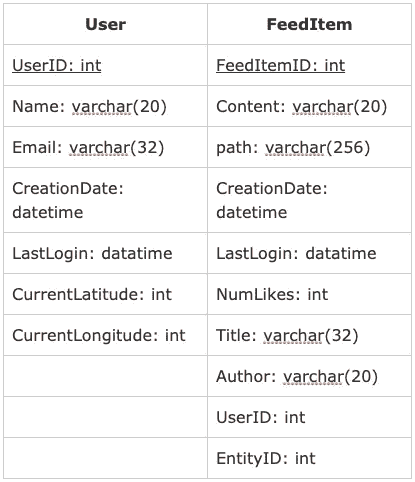
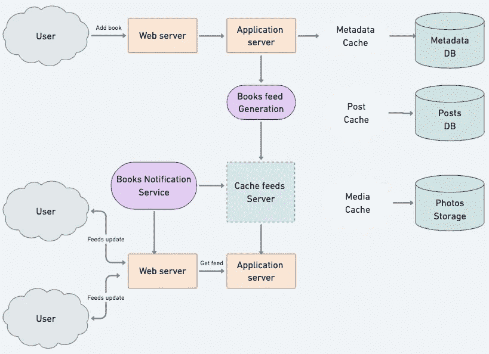

# 系统设计:图书借阅应用程序

> 原文：<https://betterprogramming.pub/system-design-book-lending-application-b21c88532293>

## 组件设计的细节

# **什么是图书借阅申请？**

图书借阅应用程序是面向读者社区的，他们可以在线上传自己的图书库，并以借阅为目的进行共享。任何人都可以使用各种类型的过滤器搜索特定的书籍，如作者、流派等。

换句话说，它是人民(朋友或附近)图书馆的可滚动版本。每本书都有自己的细节和可退还的保证金。

一旦借书人把书还给出借人，保证金就会退还给他。

# **系统的需求和目标**

让我们按照以下要求设计应用程序:

## **功能需求**

1.  一个选项，使用任何流行的登录 API 登录，如谷歌/脸书。
2.  书籍列表/订阅源将由任何登录的用户生成。
3.  要上传一本书，你必须输入完整的图书信息，如作者、书名、购买日期、封面和封底图片、软皮/硬皮等。每本书都会有一个唯一的识别号。
4.  任何图书馆成员都应该能够通过书名、作者、主题类别以及出版日期和搜索距离来搜索书籍。
5.  也可以有一个评级过滤器，人们可以对某本书的质量进行评级。(使用-full 从相同标题的书籍中选择)
6.  这本书可能不止一本，所以图书馆成员应该能够借出和预订任何一本
7.  图书提要/列表将包含图书的图像、标题和作者
8.  我们的应用程序应该支持在新书到达所有活跃用户的列表时追加新书。
9.  包含图书借阅的个人用户帐户页面。我
10.  一个会员最多可以借多少本书
11.  应该有一个成员可以保留一本书的最大天数限制(30)
12.  通知系统，通知用户某本书是否可用。
13.  贷方和借方之间的聊天系统(可选)
14.  为每本书保存保证金的钱包服务。如果到期前未归还，扣除 Get，否则退款。
15.  用户可以互相关注(可选)

## **非功能需求**

1.  我们的系统应该能够实时生成任何用户的图书列表——最终用户看到的最大延迟是 2s。
2.  假设有新的列表请求，任何新书都不应该超过 5 秒钟就进入用户列表。

# **容量估计和限制**

**流量估计**:假设每天有 100 万活跃用户，每个用户平均每天五次获取他所在区域附近的最新书单。这将导致每天 500 万个请求，即每秒大约 581 个请求。

**存储估计:**平均来说，假设我们希望在每个用户中保存大约 100 篇帖子，我们希望将这些帖子保存在内存中以便快速获取。让我们假设这本书的每个帖子平均大小为 1KB。这意味着我们将不得不为每个用户存储大约 100KB 的数据。为了存储所有活跃用户的数据，我们需要 500GB 的内存。如果一台服务器可以容纳 100GB，我们将需要大约 5 台机器来为所有活跃用户在内存中保存前 100 篇帖子。

读取请求将比写入请求多 5 倍左右。

# **数据库设计**

有 3 个主要对象，`User`(贷方/借方)和`FeedItem`(或记账)。以下是一些观察结果。

*   用户可以借书，也可以借书。
*   用户可以发布包含标题、图片或视频的`FeedItem`。
*   每个`FeedItem`都将有一个`UserID`，它将指向创建它的`User`。
*   每个`FeedItem`可以选择有一个`EntityID`指向也是用户的借用者。
*   在这里使用关系数据库看起来更合适，因为它比非关系数据库提供了 ACID 和其他事务性好处。例如:MySQL 和 Postgres 就是几个很好的例子。

如果使用关系数据库，我们需要对两种关系建模:User- `Entity`关系和`FeedItem` -book image 关系。

# **高层系统设计**

在高层次上，这个问题可以分为两部分。

## **图书供稿生成**和**供稿/图书出版**

**Book Feed 生成:** Bookfeed 由用户的帖子或 Feed 项生成。因此，每当我们的系统接收到为用户(比如 Kritika)生成提要的请求时，我们将执行以下步骤:

1.  检索 Kritika 跟踪的或半径 15 公里内的所有用户的 id
2.  检索这些 id 的最新、最受欢迎或相关的图书帖子。这些是我们在克里蒂卡的图书订阅上展示的潜在帖子。
3.  根据 Kritika 的相关性对这些帖子进行排名。这代表了克里蒂卡的新的饲料。
4.  将这个提要存储在缓存中，并返回要在 Kritika 提要上呈现的 top post(比如 20)。
5.  在前端，当 Kritika 到达当前提要的末尾时，她可以从服务器获取接下来的 20 个帖子，以此类推。

这里需要注意的一点是，我们曾经生成过一次 feed，并将其存储在缓存中。克里蒂卡周围的人发来的新帖子呢？

如果 Kritika 在线，我们应该有一个机制来对这些新帖子进行排名并将其添加到提要中。我们可以定期这样做(比如每 5 分钟)执行上述步骤来排名和添加新的职位到她的饲料。当 Kritika 的 feed 中有更新的项目可供获取时，她会收到通知。

**Feed/图书出版:**在我们的`BooksFeed`服务中，我们需要以下组件:

1.  Web 服务器:维护与用户的连接。此连接将用于在用户和服务器之间传输数据。
2.  应用服务器:执行在数据库服务器中存储新帖子的工作流。我们还需要一些服务器来检索和推送图书给最终用户。
3.  元数据数据库和缓存:存储关于用户的元数据
4.  帖子数据库和缓存:存储关于帖子及其内容的元数据
5.  照片存储和缓存:Blob 存储，如 GCS 或 S3，用于存储媒体项目，如帖子中包含的书籍照片
6.  图书提要生成:为用户收集和排列所有相关的文章，以生成图书提要并存储在缓存中。该服务还将接收实时更新，并将这些较新的提要条目添加到任何用户的时间表中。
7.  提要通知服务:通知用户有更新的条目可用于他们的`bookfeed`。

# **详细部件设计**

## **饲料生成**

对于周围有很多其他用户或关注很多其他用户的人来说，可能会面临疯狂的慢速 feed 生成。

**离线生成订阅源:**我们可以拥有专用的服务器，持续生成用户的图书订阅源，并将其存储在内存中。因此，每当用户请求新的职位，我们可以简单地从一个预先生成的，存储的位置为他们服务。使用这种模式，用户的图书提要不是在加载时编译，而是定期编译，并在用户请求时返回给用户。

每当这些服务器需要为用户生成提要时，它们将首先查询上次为该用户生成提要是什么时候。然后，从那时起将生成新的提要数据。然后，从那时起将生成新的提要数据。

**我们应该在内存中为用户的提要存储多少个提要？**最初，我们可以决定为每个用户存储 100 个 feed 项目，但是这个数字可以在以后根据使用模式进行调整。例如，如果我们假设一个用户提要的一个页面有 20 篇文章，而大多数用户从来不会浏览超过 3 页的提要，那么我们可以决定每个用户只存储 60 篇文章。对于任何希望看到更多帖子(比存储在内存中的更多)的用户，我们总是可以查询后端服务器。

**为所有用户生成图书订阅源？**会有很多用户连登录都没有那么频繁。

1.  更直接的方法是 LRU 缓存，它可以从内存中删除长时间未访问其订阅源的用户。
2.  一种更智能方式是跟踪用户的登录模式，以便预先生成他们的图书订阅源。例如用户在一天中的什么时间是活跃的以及用户在哪些天访问他们的订阅源等。

## **Feed 发布**

把帖子推给周围所有人的过程叫做扇出或拉。让我们讨论发布的不同选项。

1.  **拉模式:**这种方法将所有最近的提要数据保存在内存中，这样用户可以在需要的时候从服务器上获取。客户端可以定期获取提要数据，也可以在需要时手动获取。可能的问题 a)新数据可能不会显示给用户 b)可能会导致大部分时间都是空的资源，从而造成资源浪费。
2.  **推送模式:**一旦用户发布了一个图书帖子，我们可以立即将这个帖子推送给半径内的所有人/关注者。优点是我们不必手动获取。可以为此使用长轮询或 web 套接字。这种方法可能存在的问题是，当一个用户在该区域有成千上万的用户/追随者时，服务器必须将更新推送给很多人。
3.  **混合:**另一种方法是以混合方式处理，即拉和推模式的结合。我们不再向周围有很多用户的人推送，而只对他们使用拉模式。这样做我们可以节省很多资源。另一种方式可能是，一旦用户发布了一个帖子，我们可以将扇出限制为仅在线的人，而不是所有人。我们可以将“推送通知”和“拉取服务”结合起来。

如果用户的新闻源中有新帖子，我们是否应该总是通知用户？

每当有新数据可用时，通知用户可能是有用的。然而，在数据使用相对昂贵的移动设备上，它会消耗不必要的带宽。因此，至少对于移动设备，我们可以选择不推送数据，而是让用户“拉刷新”来获得新帖子。

## **饲料排名**

对图书订阅源中的帖子进行排名的最直接的方法是根据图书帖子的创建时间，但是我们可以做更多的事情来确保重要的帖子排名更高。排名的高级思想是首先选择最重要的关键“信号”,然后找出如何组合它们来计算最终的排名分数。

更具体地，我们可以选择与任何订阅源项目的重要性相关的特征，例如，点赞数、评论、更新时间、图书帖子是否具有图像/视频等。，然后，可以使用这些特征来计算分数。这对于一个简单的排名系统来说一般就足够了。一个更好的排名系统可以通过不断评估我们是否在用户粘性、留存、广告收入等方面取得进展来显著改善自身。