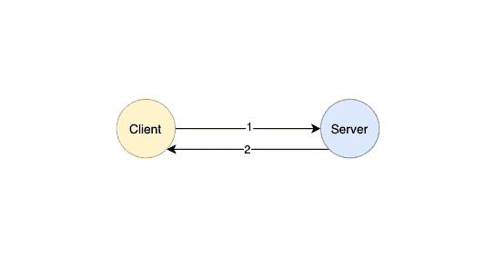
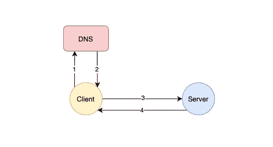
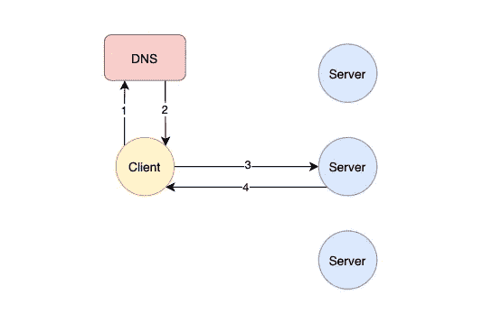
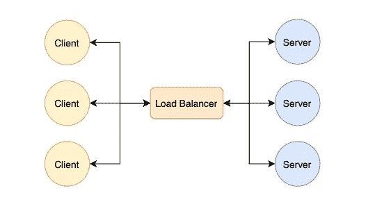
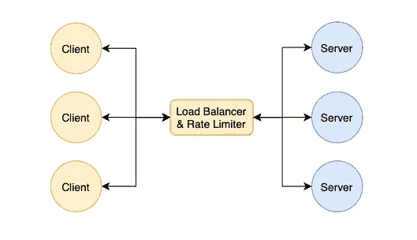
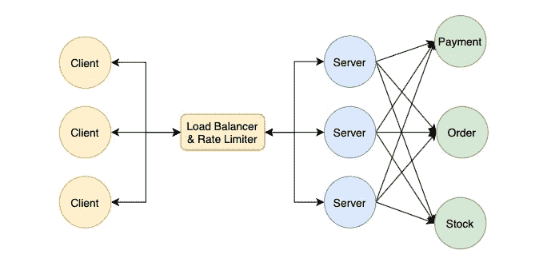
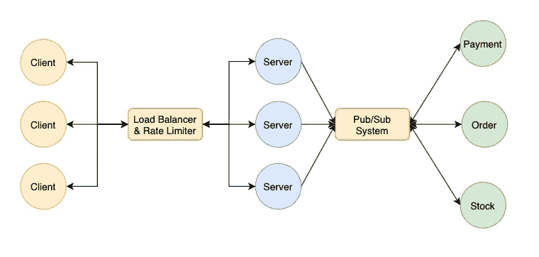
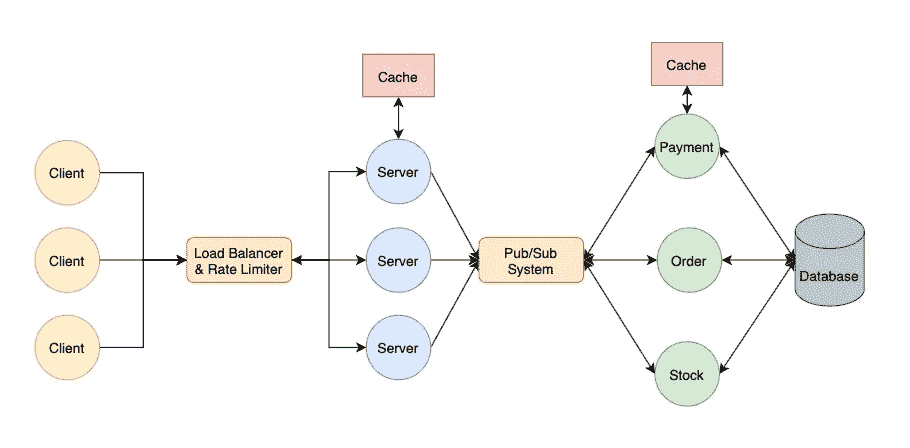

# 向奶奶解释系统设计

> 原文：<https://betterprogramming.pub/system-design-concepts-explained-for-grandma-313da71cae49>

## 赢得系统设计面试的概念

照片由[亚历克斯·哈维](https://unsplash.com/@alexharvey)在 [Unsplash](https://unsplash.com/photos/pMhS-1SzOEc) 拍摄

那是一个随意的周日下午。奶奶像往常一样，躺在躺椅上，尽情享用她最喜欢的自制饼干。

多年来，玛丽一直是我们友好的邻居饼干供应商。她的饼干虽然令人垂涎，但却是奶奶健康状况恶化的罪魁祸首。

第 n 次了，奶奶试图和我挑起话题。一如既往，它始于，

“那么孙子，你在电商公司做软件工程师呢？”

“是你贴的产品吗？”

"你能直接了解最新的饼干促销活动吗？"

我瞥了一眼手表，咕哝了一句

“好吧，我今天有些时间，让我们一劳永逸地结束这个问题吧。”

我轻轻放下正在狼吞虎咽的书，渐渐与奶奶目光相遇

“嘿奶奶，我给你讲个故事吧。标题以…”

> 简而言之，互联网。

# 客户机-服务器模型

由[像素](https://www.pexels.com/photo/selective-focus-photography-of-person-using-iphone-x-1542252/)上的 [Kerde Severin](https://www.pexels.com/@kseverin) 拍摄的照片

还记得你几乎每天都会浏览的网站`famousamos.com`吗？

你是怎么看到这些网页的？

实际上，它们是由工程师编写的文件。您的浏览器从这些文件中读取内容，并将其呈现为吸引人的网页。

随之而来的问题是，给定无限量的网络内容，你的浏览器如何存储所有这些文件？

这将是太多或几乎不可能的。

因此，当你把拇指放在浏览按钮上时，你的浏览器通过互联网从远程计算机请求这些文件。

您是客户端，远程计算机是服务器。这就是我们所说的客户机-服务器模型。

# 网络协议

**HTTP**

Andrea Piacquadio 在[像素上拍摄的照片](https://www.pexels.com/photo/cheerful-young-woman-screaming-into-megaphone-3761509/)

还记得之前你向玛丽提交了饼干订单吗？

如果每个人提交订单的方式都不一样怎么办？有些人给她写电子邮件，有些人给她发信息，有些人只是隔着栅栏大喊大叫。

会很混乱的。

因此，玛丽标准化了一种格式，或者你可以称之为协议。要订购 cookies，您需要填写指定的表格并通过邮箱提交。

HTTP 的工作方式类似，它是浏览器发出请求的一种协议或一组规则。

当您的浏览器发出 HTTP 请求时，它符合预定义的 HTTP 规则。它包括方法、路径、协议版本、报头和请求体。

**IP**

照片由[肖恩·帕特里克](https://www.pexels.com/@seanpatrickphotography)在[像素](https://www.pexels.com/photo/12402-mailbox-during-sunrise-1046403/)上拍摄

一旦你填好表格，在寄出前你需要一个地址，对吗？

同样，要向服务器发送请求，您的浏览器需要指定服务器的地址——IP 地址**。这是一个类似于这个`*2001:db8:0:1234:0:567:8:1*` *的 **128 位数字**。***

****端口号****

****

**照片由[脚轮座](https://www.pexels.com/@castorlystock)在[像素](https://www.pexels.com/photo/person-writing-on-white-paper-3951845/)上拍摄**

**如果你记得的话，玛丽住在一个大家庭里。他们每天收到大量邮件。在地址上方，你还需要注明收件人——玛丽。**

**服务器只是同时运行许多应用程序的另一台计算机，如 chrome、paint 等。每个应用程序都有一个端口号。**

**因此，在发送请求时，您必须指定服务器的 IP 和您要发送到的应用程序的端口号。**

****域名系统****

****

**照片来自[星期日泰晤士报](https://www.thetimes.co.uk/article/yellow-pages-condemned-to-print-history-pg9k6t7g3)**

> **奶奶:“嗯，但是我这辈子都没见过 IP 地址。”**

**你说得对。这些看起来神秘的术语实在太难记忆了。这就是我们的生命救星— **DNS** 发挥作用的地方。**

**DNS 是一个类似电话簿的服务器。它存储所有相应的网站的 IP 地址和端口号。**

**当您浏览`www.famousamos.com`时，您的浏览器从 DNS 获取服务器的 IP 地址和端口号，并在接收到它们时向给定的 IP 地址和端口号发送请求。**

**这就是你的浏览器与远程服务器通信的方式！**

**现在，如果你不介意的话，我能吃一块饼干吗？**

****

# **垂直缩放与水平缩放**

****垂直缩放****

****

**安德里亚·皮亚卡迪奥在[像素](https://www.pexels.com/photo/cheerful-black-waitress-standing-at-counter-3801426/)上拍摄的照片**

**随着生意的好转，玛丽接受了更多的订单。类似地，服务器每天都会收到大量的请求。**

**玛丽如何处理这些不断增加的订单？**

**她可以日以继夜地加班。**

**这就是所谓的垂直缩放。**

**一台计算机可以处理的同时请求的数量是有限制的。纵向扩展意味着向服务器添加更多的存储、RAM 和 CPU 能力，以便它能够执行更多的工作和处理更多的请求。**

**如你所见，随着业务的持续增长，这是不可持续的。玛丽可以“扩展”的范围是有限的。**

****水平缩放****

****

**照片由[上的](https://www.pexels.com/photo/photo-of-people-near-wooden-table-3184418/)[副](https://www.pexels.com/@fauxels)副拍摄**

**幸运的是，**水平缩放**来帮忙了。**

**玛丽可以通过雇佣更多的工人来横向扩展，而不是自己扩展。这些工人将一起工作来处理更多的订单。**

**类似地，我们可以**使用更多的服务器**来同时处理更多的传入请求，这也被称为**水平扩展**。**

****

# **负载平衡器**

****

**由[拉克伦·罗斯](https://www.pexels.com/@lachlan-ross)在[像素上拍摄的照片](https://www.pexels.com/photo/people-gathering-near-counter-at-festival-6510339/)**

> **奶奶:“如果有更多的服务器，那我的请求去哪一个？”**

**奇妙的问题！**

**最重要的问题是，当一个请求到达时，玛丽如何决定把请求交给谁，这样每个人都能得到一份公平的工作？**

**她也可以**

*   **随机分布**
*   **顺序分发(循环)**
*   **根据工人的能力分配(根据重量，如果他们能处理更多，就给他们更多)**
*   **根据饼干的味道分发(基于路径)**
*   **基于发件人分发(用户哈希)**

**在这种情况下，Mary 充当**负载平衡器**。**

**通常，您的请求将首先到达充当负载平衡器的服务器。负载平衡器将根据算法将请求路由到服务器。**

**负载平衡器在防止服务器过度浮动和利用不足方面起着至关重要的作用。它确保每个服务器**获得正确的工作量**。**

****

# **限速**

****

**由[像素](https://www.pexels.com/photo/photo-of-a-police-gesturing-to-stop-8927188/)上的[罗德尼制作](https://www.pexels.com/@rodnae-prod)拍摄的照片**

**在附近住了这么久，你应该知道玛丽和帕克相处得不好。**

> **奶奶:“是的……帕克一直在计划破坏玛丽的生意”**

**是的。Parker 可能做的一个攻击是发送大量带有错误味道的无效请求。虽然工作人员可以很容易地识别它们，但这仍然耗尽了它们的带宽。**

**他们将忙于扫描这些请求，没有时间处理正常的请求。由于漫长的等待时间，顾客最终会离开。**

**这就是所谓的**拒绝服务攻击**。**

**攻击者同时向服务器发送大量空的或无效的请求。服务器将被**囤积**并最终被关闭。**

****限速**是解药。如果一个用户在**短时间内发送了多个请求**，Mary 只是简单地将它们分散开，而不会传递给工作人员。**

**服务器可以通过检查用户是否在短时间内发送大量请求来执行速率限制。或者，这可以由负载平衡器来完成。**

****

# **微服务**

****

**由[索尼 Feo](https://www.pexels.com/@sonyfeo) 在[像素上拍摄的照片](https://www.pexels.com/photo/chefs-cooking-in-a-kitchen-while-wearing-face-masks-7488820/)**

**万一你忘了，玛丽需要有人来烤饼干。**

**当然，她可以把它留给工人。他们可以输入订单，冲进厨房，烤好饼干，送出去，然后冲回座位。**

**那是很大的工作量！还有什么？你有建议吗？**

**是的，你是对的。我们可以通过为每个角色雇佣一个人来划分职责。**

> **他们每个人只做一件事情，而且做得很好。**

**那就是**微服务**是什么！**

**例如，一个电子商务应用程序通常包含一个为这些功能指定的服务器**

*   **处理认证**
*   **执行付款**
*   **通知交货**

**接受你的请求的服务器只做基本的预处理。然后，它将您的请求路由到相应的服务器，以执行特定的任务。**

****

# **发布-订阅系统/消息队列**

****

**照片由[卡罗琳娜·格拉博斯卡](https://www.pexels.com/@karolina-grabowska)在[像素](https://www.pexels.com/photo/woman-in-pink-long-sleeve-shirt-sticking-post-its-on-the-wall-7680088/)上拍摄**

**随着订单越来越多，Mary 要求这些流程在订单到达时同时进行**

*   **一个人开始揉面**
*   **一个人预热烤箱**
*   **一个人准备包裹**

**这意味着输入订单的工人必须**通知每个人**！他/她需要跑来跑去，以确保每个人都收到消息。**

**雪上加霜的是，随着更多并发进程的增加，工人需要**跟踪通知谁。****

**作为一名精明的女商人，Mary 添加了一块白板。**

**当下订单时，工人在白板上添加便利贴。感兴趣的人，只需从白板上**观察和检索数据**。**

**这被称为**发布-订阅系统**又名**消息队列**。在微服务之间的交流中是必不可少的。**

**例如，当用户结帐时，结帐服务器应该通知**

*   **订单服务器创建新订单**
*   **库存服务器减少库存**
*   **仓库服务器来运送物品**

**所有这些都应该同时**和**完成。**

**有了发布-订阅服务器，结账服务器**不需要**通知任何人。它只是将事件添加到发布-订阅服务器，而感兴趣的各方订阅它并得到相应的通知。**

****

# **贮藏**

****数据库****

**坚持下去，我们一会儿就结束了！**

**奶奶，我相信你已经预定了接下来几个月的饼干。对于这些提前订单，Mary 需要将它们存储在某个地方。**

**幸运的是，她买了一些架子，把所有这些唱片有条理地存放在上面。**

**这些架子非常类似于**数据库** — **持久存储**，供服务器**持久存储**数据和信息。**

**说到数据库，有很多技术细节。因为我们的午睡时间就要到了，我现在就跳过这个。**

****缓存****

****

**劳拉·唐克雷蒂在[像素](https://www.pexels.com/photo/cheerful-asian-woman-writing-in-notebook-while-having-phone-call-7065271/)上拍摄的照片**

**就在 Mary 和她的团队将所有订单记录存储在货架上以便跟踪时，一个新的瓶颈出现了。**

**当订单到达时，一线工人需要**

*   **处理订单**
*   **在白板上添加便利贴**
*   **冲到书架前，把它写进记录里**

> **奶奶:“很多人会跑来跑去，挤满了货架”**

**没错。跑到货架上浪费的时间可以用来处理更多的请求。此外，拥挤的货架会进一步降低速度。**

**在这种情况下，笔记本可能会派上用场。下了订单后，记在笔记本上，只是偶尔更新一下货架**。****

****数据库将数据存储在**硬盘**中，检索它们需要时间。一致地查询数据库也会囤积数据库服务器，降低速度。****

****这就是缓存发挥作用的地方。它将数据存储在**服务器的内存(RAM)** 中。速度更快，但也不稳定。如果服务器停机，数据将会丢失。****

> ****奶奶:“万一有人拿着笔记本跑了呢？”****

****这是一个聪明的问题！是的，缓存有助于加快速度，但是它也带来了挑战，****

*   ****如果服务器出现故障，数据将会丢失****
*   ****如果只在数据库或缓存中更新数据，数据就会变得陈旧****
*   ****如果没有适当的缓存回收策略，缓存可能会消耗大量内存****

****因此，在设计缓存时，需要考虑很多因素并付出很多努力。****

********

# ****关闭****

********

****照片由[在](https://www.pexels.com/@shvets-production)[像素](https://www.pexels.com/photo/woman-with-empty-glass-jar-and-lid-7512755/)上拍摄生产****

****行动。好像我们的饼干用完了！嗯，我想是时候收工了。****

****再深入一点，我相信奶奶很快就能通过系统设计面试！****

****现在，如果你不介意的话，我需要小睡一会儿，然后再做一些饼干促销活动！****

****再见。****

# ****参考****

*   ****[https://github.com/donnemartin/system-design-primer](https://github.com/donnemartin/system-design-primer)****