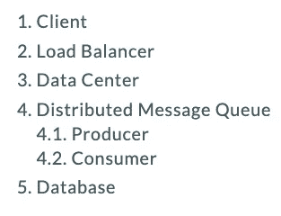
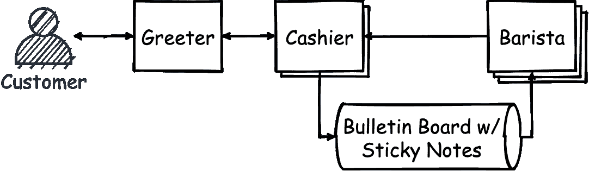
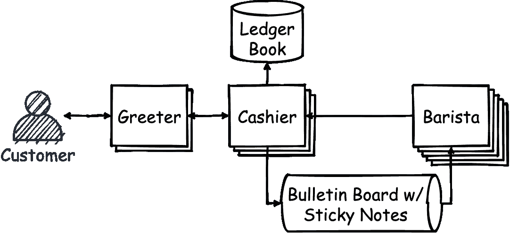
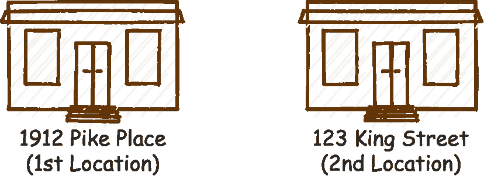
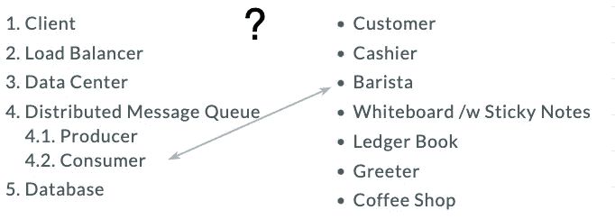

# 通俗地说就是系统设计——设计一家咖啡店

> 原文：<https://betterprogramming.pub/system-design-in-laymans-terms-design-a-coffee-shop-e1abb42dd123>

## 设计大规模分布式系统的起点

[在](https://unsplash.com/photos/d1ngW7SNehM) [Unsplash](https://unsplash.com/) 上创意交流的照片。

虽然我是一名软件工程师，但我总是梦想有一天能开一家咖啡店。前阵子我从两个人点 poutines 的角度写了关于[的编译。今天，让我们从一个咖啡店老板乔的角度来谈谈系统设计。](https://yzhong-cs.medium.com/what-is-compiling-584171268d4e)

# 系统设计术语

我们将讨论这些系统设计主题:

如果您没有听说过这些，请不要担心。我们实际上不会谈论它们。在这里，我想告诉你建立一个成功的咖啡店的五个步骤。就是这样。没什么大不了的。只有五步。希望在看完这些之后，你能够指出它们各自代表了什么。

# 一家新咖啡店

由于还在前期，咖啡店老板乔还没有雇人。一方面，他正在接受前排顾客的订单。另一方面，他也转身为顾客冲咖啡。一旦咖啡准备好了，他就把咖啡送给顾客。

图片来源:作者

在这一点上，我们在咖啡店里有一个单独的工人——店主乔本人。

# 简单的咖啡店

如果商店里一次只有一个顾客，一切都会很好。当有多个顾客时，当乔忙着为前一个顾客煮咖啡时，他们中的一些人将不得不等待。

这不是很好的用户体验吧？

为了最大化利润并创造更好的体验，Joe 认为最好避免让客户等待下单。

他在咖啡店里创造了两个角色:收银员和咖啡师。

他雇了一名收银员接受顾客的订单，并在后面雇了一名专门煮咖啡的咖啡师。

由于收银员只负责接单和接受付款，所以通常很快。下单后，收银员会转身对咖啡师大喊，让他们知道新的订单。

如果咖啡师此刻没有煮咖啡，他们会马上开始煮。如果他们正忙着为另一位顾客冲咖啡，他们会记住订单，然后下一次再冲。

事实上，也可能是收银员记得订单。他们中只有一个人需要这么做。

图片来源:作者

此时，我们共有两名员工在咖啡店工作。

# 一家好的咖啡店

这种情况会持续一段时间，直到咖啡店变得非常受欢迎，有了更多的顾客。

Joe 意识到客户现在必须等待下订单。他们中的一些人在过程中离开(超时)。

为了解决这个问题，Joe 又雇佣了一名收银员来处理订单。

尽管这只能解决部分问题，但不久之后，一些顾客开始抱怨，因为他们要永远等着煮咖啡。乔立即雇佣了另外两个咖啡师。

然而，这带来了一个更大的问题。现在，由于收银员和咖啡师之间的争吵，很难跟踪哪个订单得到了处理。有些订单做了两次，而有些订单错过了。顾客们又伤心又愤怒，收银员和咖啡师都紧张得不得了。

为了解决这种混乱，Joe 提出了一个带有公告板和一些便笺的系统。不要再大喊大叫，也不要记得哪些订单已经完成。每次下新单，收银员都会记在便利贴上。这是要写在便笺条上的信息:

*   客户的姓名
*   点的咖啡类型(如拿铁、卡布奇诺、美式咖啡、浓缩咖啡等)。)
*   咖啡的大小(例如小杯、中杯、大杯等)。)

然后收银员会把它按顺序贴在公告栏上。一名咖啡师将从公告板上拿走第一张便笺。这样的话，就是先到先得。这对每个人都是公平的。

咖啡店在这一点上做得很好，但有一点需要注意。

由于我们现在有两个收银员，当顾客走进商店时，这变得令人困惑。他们不清楚应该去哪里，应该和谁交谈。乔多雇了一个人来招呼顾客，并把他们带到最不忙的收银台。他把这个新员工叫做迎宾员。

图片来源:作者

此时，我们总共有六名员工在咖啡店工作:一名迎宾员、两名收银员和三名咖啡师。

# 一家成功的咖啡店

生意继续做得很好。乔又雇佣了一名收银员和两名咖啡师。现在我们总共有三名收银员和五名咖啡师。

如果我们看看咖啡店的员工队伍，几乎每个职位都有多名员工，除了一个人——迎宾员。迎宾员成为商店的重要组成部分。

当迎宾员去洗手间或午休时，咖啡厅会相当混乱。店主决定雇用第二名迎宾员。

坦率地说，大多数情况下这并不是真正必要的，而且可能感觉像是浪费金钱。但是为了提供一流的客户体验，Joe 还是决定这么做。

咖啡店在这一点上非常成功。困扰乔的一件事是，他从来不知道每天卖出多少杯咖啡。他意识到一个成功的企业缺少一个关键的组成部分:簿记。

除了知道每天卖出多少咖啡，这里还有一些记账如此重要的原因:

*   有时，可能会出现错误，顾客回到店里争辩说他们点了一杯拿铁，但他们得到的是一杯卡布奇诺。我们需要记录来证实。
*   我们想分析什么是受欢迎的，什么是不受欢迎的，以便我们可以在未来适应和调整菜单。
*   到了年底，我们还需要计算自己赚了多少钱，这样才能报税。
*   我们可以看看这几天的销售记录来预测哪种咖啡豆会在什么时候用完。

最后，乔买了一本大账簿。他要求出纳员在把便签贴在公告板上的同时，把交易记录在分类账本上。

图片来源:作者

此时，我们总共有十名员工在咖啡店工作:两名迎宾员、三名收银员和五名咖啡师。

# 第二家咖啡店

最后，Joe 决定开第二家店，把这家成功的咖啡店带到下一个层次！

有了第一家咖啡店的经验，感觉很直白。他需要找到一个新的位置，雇用一些员工，买一个新的公告板，一个新的分类账薄，然后就可以开始了。

乔选择了一个在城镇另一边的位置。以前，人们不得不穿过城镇去买咖啡。现在他们可以去离他们更近的商店。顾客更开心了，这也给咖啡店带来了更多的收入。

图片来源:作者

时光流逝。已经快一年了。在某一天，第一家咖啡店的厨房里一根管子爆裂了。当乔打电话给承包商修理破裂的管道和修理/更换一些损坏的设备时，他也在商店前面贴了一个巨大的招牌。上面写着:

> 亲爱的客户:
> 
> 不幸的是，我们的厨房被洪水淹没了，接下来的几天我们将暂停营业。要得到我们令人惊奇的咖啡，你可以去我们在国王街 123 号的商店。
> 
> 你诚挚的，
> 咖啡店

虽然情况很糟糕，压力很大，但 Joe 很高兴他开了第二家店。他仍然能够服务那些愿意去第二家店的忠实顾客。

# 结束了

乔的故事到此结束。

我们介绍了收银员、咖啡师、迎宾员、公告板和分类账。你能猜出它们分别代表文章开头的哪个系统设计术语吗？

[答案在 GitHub](https://gist.github.com/yzhong52/6a96ab9c3b5099fa8e91c70b9b25ddb7) 上。