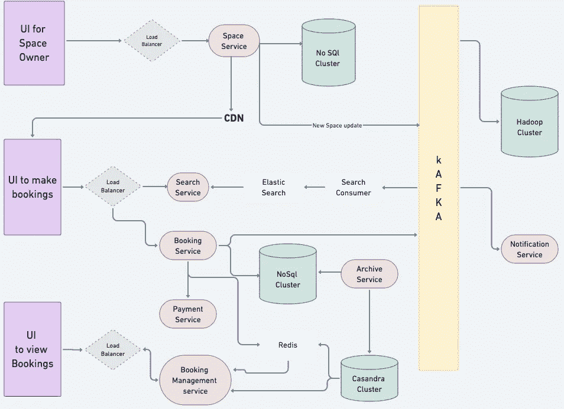

# 系统设计:构建一个真实的物理存储应用程序

> 原文：<https://betterprogramming.pub/system-design-real-world-physical-storage-application-8859c2415175>

## 设计、优化、分析


存储空间应用程序是一个平台，在这个平台上，空间所有者可以连接到需要在特定时间段内存储其商品和项目的客户。

# **系统的需求和目标**

让我们按照以下要求设计应用程序:

## **功能需求**

***空间主人:***

1.  一个新的空间，一个应用程序的仓库
2.  更新现有空间的信息。可能想要添加或修改该区域。
3.  查看特定时间段的预订情况。

***客户:***

1.  使用搜索标准搜索特定位置的空间存储
2.  预订特定时间段的存储。最短持续时间为 15 天。
3.  检查预订

***附加要求:***

1.  空间所有者提供货物的取货和卸货服务
2.  货物可以是个人的、商业的、文件的、家庭的或汽车的。
3.  观看现场录像的选项(如果空间所有者安装了闭路电视)。这会建立信任。
4.  由场地所有人提供的货物保险。所有应用程序可以扣留空间所有者的钱，一旦合同结束，完全可以退还并转移回空间所有者。
5.  分析以检查哪些空间位置和区域工作得最好。

## **非功能需求**

1.  低延迟
2.  高可用性
3.  高一致性。

# **产能估算**

让我们假设全球有大约 50 万空间所有者和大约 1000 万存储空间。

该应用程序将具有较少的活跃用户，因为用户将主要在特定时间段内使用该服务一次。

# **系统架构**

我们的应用程序主要由三个主要 ui 组成:

1.  面向空间所有者的用户界面/应用程序
2.  供客户预订的用户界面/应用程序
3.  查看预订的通用用户界面/应用程序



我们的应用程序将由以下组件组成:

1.  负载平衡器:它们将来自所有 ui 的流量平衡到多个服务器上，帮助应用程序扩展。
2.  存储服务:这项服务将让空间所有者保存他们的存储空间细节，还包括 blob 数据，即图像/视频的地方。
3.  NoSql 集群:保存存储空间的元数据。为此，我们可以使用任何 nosql 数据库。
4.  CDN:我们需要 CDN 在地理上分发信息

所有信息都将实时更新给客户和空间所有者，以便他们上传新的存储空间进行搜索和预订。为此，我们将使用消息队列，如 Kafka 或 Rabbit MQ。

1.  卡夫卡:提供从生产者到消费者的数据流。
2.  搜索消费者:应用程序中更新的关于新存储的数据将流向搜索消费者，这些消费者将连接到弹性搜索。
3.  弹性搜索集群:主要用于快速搜索服务检索以及模糊搜索。
4.  搜索服务:搜索服务将能够从弹性搜索中获得结果，并提供给客户界面。
5.  预订服务:预订服务使客户能够在特定时间段内对特定存储进行数据块存储。这些数据将流向卡夫卡。为什么？因为一旦我们预订了存储空间，我们不希望它在搜索中显示该特定时间段。
6.  预订服务将与支付服务就支付相关事宜进行沟通。一旦付款成功，我们就可以在 nosql 集群中成功预订。
7.  存档服务:用于现场预订。这基本上阻止预订，并将数据存储在 Casandra 类型的数据库中。也可以使用 HBase。
8.  通知服务:通知所有用户。例如，如果客户进行了预订，则通知空间所有者。否则，如果被空间所有者取消，则通知客户。
9.  预订管理服务:该服务将与客户和空间所有者对话以查看预订。预订来自 NoSQL 集群(表示取消，进行中，支付失败，成功)，并通过 Casandra db 实现实时预订服务。
10.  Redis:减少我们的数据库集群的负载，并用作快速检索的缓存。
11.  Hadoop 集群:空间和预订事务流入，我们可以在其上分析和操作一些 M.L。

# **API 和数据库设计**

我们将有 4 个主要的 API 来上传和更新存储:

`POST /space`(到船上新的空间存储)

`GET /space/:id`(获取特定存储以查看信息和书籍)

`PUT /space/:id` (编辑特定空间的信息)

`DELETE /space/:id`(删除特定空间)

*预订我们将有:*

`POST /booking` (在特定的时间间隔内预订特定的存储)

对于使用数据库，关系数据库适合这种业务模型，因为它有 ACID 保证。

## **太空数据库**

```
Space: {id, type, name, locality, dimensions, amenities, description, original_images, is_active, price_per_day}SpaceType ENUMS: [PERSONAL, BUSINESS]SpaceAmenities: {id, space_id, amenity_id, is_active}SpaceLocality: {id, city_id, state_id, country_id, zipcode, is_active}
```

## **预订数据库**

```
AvailableSpace: {space_id, date, initial_qty, available_qty > 0}Booking: {booking_id, space_id, user_id, start_date, end_date, status, invoice_id, goods_type}GoodsType ENUMS: [HOUSEHOLD, AUTOMOBILE, OFFICE_ITEMS]Status ENUMS: [RESERVED, BOOKED, CANCELLED, COMPLETED]
```

API 如何从 UI 与应用服务器交互，然后最终与数据库交互:

`POST /book` 以这些参数为例{ `booking_id`、`space_id`、`user_id`、`start_date`、`end_date` }

1.  检查可用空间[每个可用空间/房间]
2.  插入预订数据库并减少`available_qty`
3.  在 Redis 中输入 TTL(生存时间),例如 10 分钟的实时预订，以保留预订，然后预订将过期。一旦令牌过期，Redis 将发出通知。我们稍后会处理这个问题。
4.  放入卡夫卡(消息队列)
5.  重定向至付款。可选地，可以重定向到聊天，以便所有者和客户之间进行对等交流(更新预订状态帖子)

## **如何处理 Redis 过期令牌？**

Redis 密钥最终会过期。

1.  如果 Redis 密钥过期，然后付款成功，那么我们可以用多种方式处理，比如将付款退回给用户，通知他请求已过期。或者更聪明的方法是检查是否有可用的存储空间，然后预订。
2.  如果支付成功，那么我们可以忽略 Redis 令牌是否过期。

# **优化**

如果支付成功，那么我们可以直接从 Redis 删除密钥。

我们还应该监视整个系统的 CPU 和内存是如何工作的。

在整个基础架构中，我们需要密切关注 CPU 使用率以及内存和磁盘使用率。

grifana 可以进行监控，这是一种工具，我们可以在特定的阈值上设置警报。如果超过任何阈值，开发人员将会收到警告。

这对于低延迟和高可用性非常重要。

# **分析学**

我们可以在我们的应用程序中设置 Kibana 日志，并在 kibana dashboard 上创建不同类型的图表，以监控如何以及哪些存储工作得最好，特定区域的需求和供应，以及预订的成功率和失败率。

基于这些数据，业务部门采取行动，决定应用程序应该如何关注以及关注哪个方向。

# **分布式数据**

我们可以通过在该地区的不同部分建立数据中心来在地理上分布我们的数据，因为空间存储将主要建立在一个特定的区域并且不会移动。

因此，区域 1 的用户说印度应该从印度数据中心获取数据，区域 2 的用户说美国应该从美国数据中心获取数据。

数据将有复制节点。如果其中一个节点发生故障，另一个节点可以代替它来检索信息/数据。复制也可以与具有区域的数据分区配对，