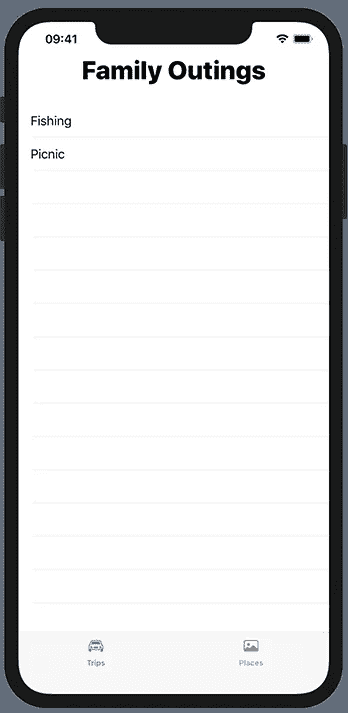
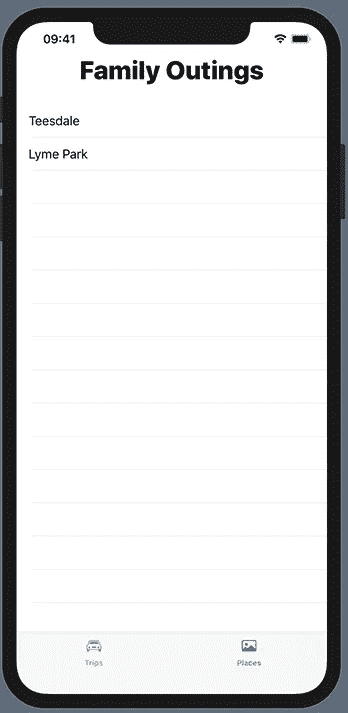
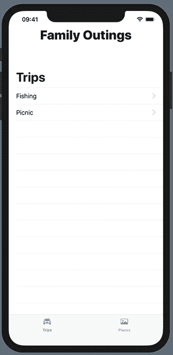
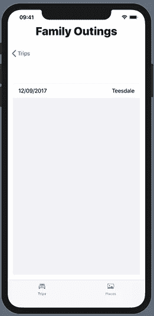
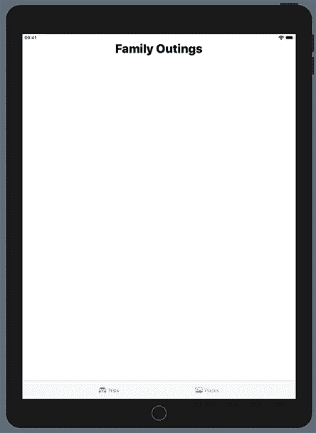

# 如何在 SwiftUI 中构建选项卡和拆分视图

> 原文：<https://betterprogramming.pub/tab-and-split-views-in-swiftui-cf15bf615192>

## 使用 SwiftUI 简化选项卡视图的管理

Mia Baker 在 [Unsplash](https://unsplash.com/s/photos/iphone?utm_source=unsplash&utm_medium=referral&utm_content=creditCopyText) 上拍摄的照片

维基百科和脸书等多模态应用程序使用标签栏界面，让用户在应用程序的操作模式之间进行选择。例如，维基百科有历史、地点、保存和搜索标签。通常，你可以将标签栏与一个`UITabBarController`对象结合使用，但是你也可以在你的应用程序中将它们作为独立的控件使用。标签栏总是出现在屏幕的底部边缘，显示一个或多个`UITabBarItem`对象的内容。

如您所料，SwiftUI 极大地简化了管理选项卡视图的过程。关于 SwiftUI Essentials 的 WWDC19 讲座引入了一个 TabbedView，其中每个选项卡项目导航到一个拆分视图。不幸的是，我很快就发现了这一点，苹果在 WWDC 之后改变了 TabbedView，以及处理标签的方式:他们用 TabView 取代了它。

在本文中，我将向您展示如何创建一个选项卡视图，以及如何将一个选项卡链接到一个拆分视图。

# 使用标签栏的示例应用程序

假设您想要构建一个记录家庭出游的应用程序，并决定它应该让用户记录每次出游的细节。此外，你可能想看看你去过的地方。这是应用程序的标签栏:

我为这个应用程序创建了一个简单的 XCode 项目。以下是内容视图的代码:

如您所见，这由一个具有两个视图的`VStack`组成:

*   包含主视图标题的简单`Text`视图
*   由两个标签组成的`TabView`

如果你看第一个项目，你会看到它由几个部分组成。首先，有一个通过调用`tabitem`修改的视图声明`TripsView(trips:trips)`，它的作用是为一个`TripsView`设置标签项。接下来是一个包含目的地是`TripsView`的`NavigationLink`的闭包。链接本身有一个闭包，由选项卡的图像及其标题组成。

启动应用程序会显示`TripsView`的内容。

默认操作是选择第一个选项卡项目。有一个版本的`TabView`允许你指定选择的值，但是注意这需要一个可绑定的对象。

点击地点选项卡显示地点列表。

`TabView`到此为止，接下来是`SplitView`。目前，`TripView`和`PlaceView`的代码如下:

如您所见，每个都由一个简单的列表组成，为`trips`的每个元素创建一个条目。假设我们希望能够查看每次旅行的细节。在这种情况下，我们需要将`List`包装在`NavigationView`中，列表中的每一项都需要包含在`NavigationLink`中，就像这样:

注意`List`末尾的`NavigationBarTitle`修饰符，而不是`NavigationView`末尾的修饰符。启动应用程序，现在你会在列表项中看到显示按钮，指示链接的存在。

点击一个将显示一个`TripDetails`视图:

点击返回按钮将带您回到旅行列表。到目前为止，我只使用 iPhone 模拟器演示了这一点。如果我使用 iPad 模拟器，你会得到这样的结果:

我想你会同意这不是很有帮助。点击“位置”标签也显示一个空屏幕，这是怎么回事呢？当我第一次看到这个的时候，我以为我做错了什么。我花了很长时间才弄明白发生了什么事。SwiftUI 使用的是拆分视图！我所要做的就是从左向右滑动，嘿，很快，一个包含旅行列表的主视图出现了。点击一个显示主视图后面的细节视图。如果您随后轻按细节视图，它会出现在母版上，但没有后退按钮，您必须再次向右滑动。

好吧，它工作，但它的界面设计很差，我不想发布这样的应用程序。在网上搜索了很多之后，我找到了一个解决办法。它一直存在于文档中，只是不可见。我所要做的就是将`.navigationViewStyle(StackNavigationViewStyle()`添加到`NavigationView`中，应用程序开始像 iPhone 版本一样运行——当一个项目被选中时，主视图填充屏幕，详细视图滑过它。

iPad 主视图/详细视图显然已经存在，但我还没有找到一种方法来配置它以克服可用性问题。我确信苹果最终会找到复制 UIKit 版本 `UISplitView`的方法，但就目前而言，我可以接受上面的解决方案。

大概就是这样。我希望这对正在使用 SwiftUI 的其他人有所帮助。