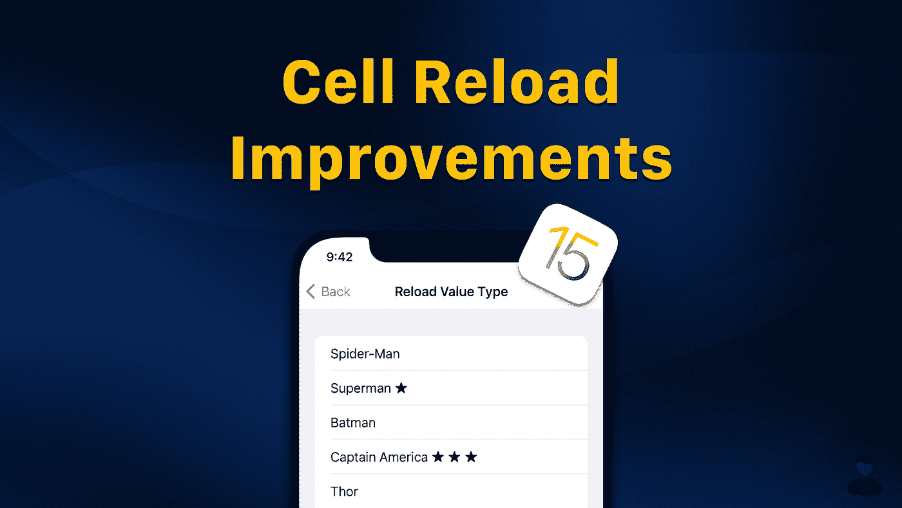
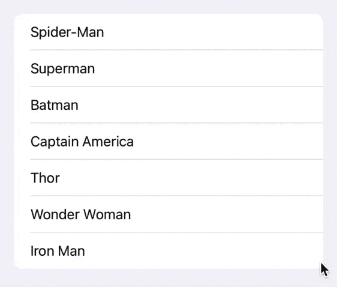
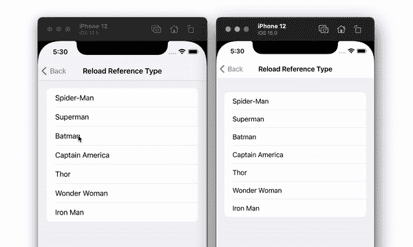

# iOS 15 的 UITableView 和 UICollectionView 有什么新功能？

> 原文：<https://betterprogramming.pub/table-and-collection-view-cell-reload-improvements-in-ios-15-52de0b56a76e>

## 重新加载的改进很有希望，但是在值类型模型对象上使用它们时有一个问题



2020 年 10 月，我发表了一篇[文章](https://swiftsenpai.com/development/modern-ways-reload-cells/)，讨论了在使用不同的数据源时如何重新加载表和集合视图单元格。本文向您展示了在用引用类型和值类型的项重新加载单元格时，如何使用两种完全不同的方法。

概括地说，对于引用类型的项目，我们可以利用快照的`reloadItems(_:)`方法来重新加载指定的项目。对于值类型项目，`reloadItems(_:)`不起作用。我们必须手动替换快照中更新的项目。

我一直很困惑为什么苹果会把这么简单的任务变得这么复杂。在 WWDC21 上，苹果向我们展示了另一种方法，这种方法使得使用单一方式重新加载单元格成为可能。最重要的是，苹果还在 iOS 15 中引入了新的 API，允许我们更有效地重新加载单元格。

这些都是非常有趣的变化和改进，所以让我们开始吧！

# 示例应用程序

出于演示目的，让我们更新我为上一篇文章创建的示例应用程序。它是一个超级英雄评级应用程序。每当用户点击一个单元格，一个星号(★)就会被附加在英雄的名字后面。



示例应用程序

以下是集合视图的数据源和模型对象数组的定义:

# 重新加载引用类型项目

在 iOS 15 之前，我们可以使用快照的`reloadItems(_:)`方法来重新加载引用类型项目的单元格，如下所示:

在 iOS 15 中，苹果引入了一种新的`[reconfigureItems(_:)](https://developer.apple.com/documentation/uikit/nsdiffabledatasourcesnapshot/3804468-reconfigureitems)`快照方法，可以帮助开发者更有效地重新加载单元格。要使用它，我们可以简单地用`reconfigureItems(_:)`方法替换`reloadItems(_:)`方法:

正如你从下面的动画 GIF 中看到的，当我试图快速点击同一个单元格时，iOS 15 中的单元格(使用`reconfigureItems(_:)`)重新加载的速度比 iOS 14 中的单元格(使用`reloadItems(_:)`)快得多:



reload items(_:)vs reconfigure items(_:)

这一改进背后的原因是`reconfigureItems(_:)`重用了项目的现有单元，而不是退出队列并配置一个新单元。因此，从 iOS 15 开始，开发者应该总是使用`reconfigureItems(_:)`而不是`reloadItems(_:)`，除非你明确需要用新单元替换现有单元。

# 重新加载值类型项目

如前所述，`reloadItems(_:)`方法不适用于值类型项目。但是`reconfigureItems(_:)`怎么样？它对值类型的项目有效吗？不幸的是，答案是否定的。你会得到一个`NSInternalInconsistencyException`异常，并显示“为重新加载指定的无效项目标识符”消息，就像在 iOS 14 中一样。

然而，在今年的 WWDC 上，苹果向我们展示了使用不同数据源的另一种方法，这使得在值类型项目上使用`reconfigureItems(_:)`成为可能。关键是使用模型对象的标识符作为数据源项标识符，而不是模型对象本身。

> *“不同的数据源是为了存储模型中的项目标识符而构建的，而不是模型对象本身。”——*[*苹果开发者*](https://developer.apple.com/videos/play/wwdc2021/10252/)

这与我们对如何使用不同数据源的理解有些冲突。

但是现在，让我们把它放在一边，探索我们能做些什么来实现它。

## 使用模型标识符作为不同的数据源项标识符

我们需要做的第一件事是给我们的`SuperHero`结构添加一个惟一的、不可变的标识符。我们将标识符命名为`id`，并使用超级英雄的名字作为标识符。

由于我们现在使用`id`作为我们的数据源项标识符，我们还需要将我们的数据源项标识符类型从`SuperHero`更改为`String`。

接下来，我们必须声明一个字典，并使用它来保存标识符和它们对应的`SuperHero`对象。我们需要这个字典，这样我们就可以使用`id`轻松获得`SuperHero`对象，而不必遍历`heroArray`。

```
var heroDictionary = [String: Superhero]()
```

为了填充`heroDictionary`，我们可以利用`Dictionary(uniqueKeysWithValues:)`初始化器来帮助我们将`[SuperHero]`转换为`[(String, SuperHero)]`，然后再转换为`[String: SuperHero]`。方法如下:

在`heroDictionary`就位后，我们现在可以将单元注册项目类型从`SuperHero`更改为`String`。最重要的是，我们还需要对单元注册处理器进行调整，因为它现在提供的是`id`而不是模型对象。

在单元注册处理程序中，注意我如何使用`heroDictionary`来获得相应的超级英雄名字。

难题的最后一部分是更新我们如何填充数据源快照。我们现在需要将模型对象 id 附加到快照，而不是将模型对象添加到快照。

至此，我们已经成功地将示例应用程序转换为使用模型对象的标识符作为数据源项标识符。

## 使用 reconfigureItems()更新单元

有了新的数据源，更新值类型项的单元格的方法与更新引用类型项的方法非常相似。唯一的区别是数据源给了我们`id`而不是模型对象。因此，我们必须使用`heroDictionary`来获得选中的英雄，并相应地更新它。

就是这样！我们现在可以享受`reconfigureItems()`带来的性能提升，即使我们使用的是价值型物品。

*注意:ID 作为数据源项标识符的方法不仅适用于值类型项。它也适用于引用类型的项目。*

下面是完整的示例代码:

# 我们一直以来都用错了吗？

通过使用 ID 作为数据源项标识符，我们现在能够使用`reconfigureItems(_:)`来更新值类型和引用类型的项。这让我想知道我们是否可以应用同样的改变，让`reloadItems(_:)`在 iOS 14 中同时适用于值类型和引用类型的项目？

显然，答案是肯定的！

如果是这样，这是否意味着我们一直以来都在错误地使用不同的数据源？

嗯，我不确定。

既然 Apple 声明我们应该只在 diffable 数据源中存储标识符，我想我们应该从现在开始停止使用模型对象作为项目标识符。另一方面，我也看不出使用模型对象作为项目标识符有什么问题。事实上，这篇[文章](https://swiftsenpai.com/development/modern-ways-reload-cells/)中介绍的旧的单元重载方法在 iOS 15 中仍然非常好用。

因此，我对此的看法是，让我现有的所有不同数据源保持原样，并开始采用苹果公司为任何未来实现推荐的新方法。

# 包扎

`reconfigureItems(_:)`方法只是苹果对不同数据源所做的许多改进之一。要了解更多信息，我建议查看[这个](https://developer.apple.com/videos/play/wwdc2021/10252/) WWDC21 视频以及演示文稿附带的[样本代码](https://developer.apple.com/documentation/uikit/uiimage/building_high-performance_lists_and_collection_views)。

如果你喜欢读这篇文章，请随意查看我的其他 iOS 开发相关的[文章](https://swiftsenpai.com/tag/ios/)。

感谢阅读。

*本文原载于 2021 年 6 月 16 日 https://swiftsenpai.com*[](https://swiftsenpai.com/development/cells-reload-improvements-ios-15/)**。**