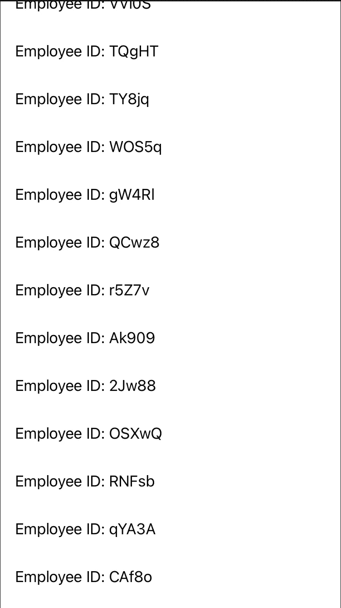
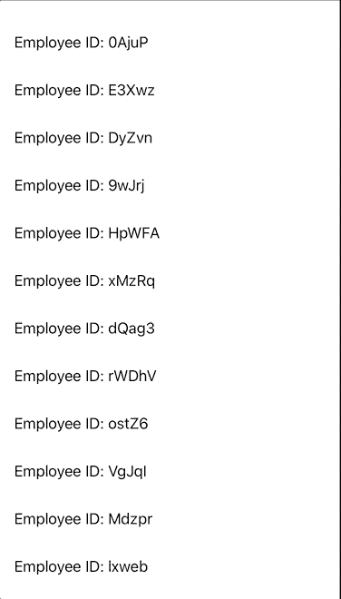
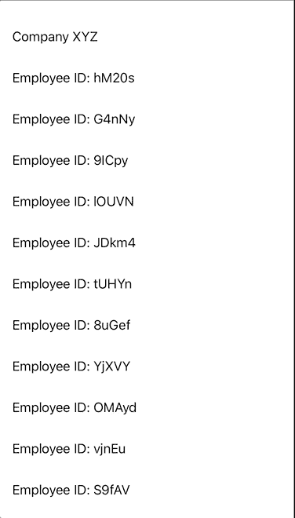
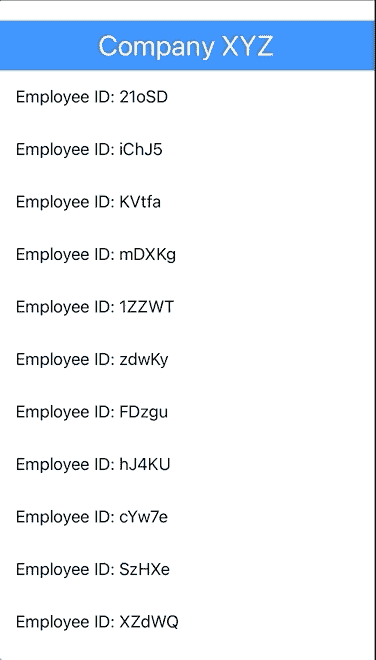

# 带 LazyVStack 的 SwiftUI 中的表视图

> 原文：<https://betterprogramming.pub/tableviews-in-swiftui-with-lazyvstack-8de9d8bc17ee>

## 了解 LazyVStacks 以及它们与常规 VStacks 的不同之处


[王占山](https://unsplash.com/@jdubs?utm_source=medium&utm_medium=referral)在 [Unsplash](https://unsplash.com?utm_source=medium&utm_medium=referral) 上拍照。

在 WWDC 2020 上，苹果推出了`LazyVStack`。在我看来，由于在性能上的优势，它是`VStack`的改进版。

`LazyVStack`的行为与`VStack`相似，除了懒惰。在许多情况下，“懒惰”意味着如果你在屏幕上看不到它，它就没有被加载。这反过来又提高了性能。另一方面，`VStack`装载一切。

请这样想:如果您有大量数据，理想的方法是只加载您看到的内容。这就是`LazyVStack`的作用。当你滚动时，你将加载数据。

总之，如果您有大量数据，请使用`LazyVStack`,如果您有相对少量的数据，请使用`VStack`。

> *“将子视图排列成垂直增长的行的视图，仅在需要时创建项目。”—* [*苹果开发者*](https://developer.apple.com/documentation/swiftui/lazyvstack)

# 先决条件

要学习本教程，您需要了解以下方面的一些基本知识:

*   迅速发生的
*   至少 Xcode 12+

*注意:这只支持 iOS 14+。*

# LazyVStack 入门

用法类似于`VStack`的，我把这个做得更进一步，在玩`LazyVStack`的时候让它变得更有趣。

场景是这样的:现在是 2024 年，你最近被一家公司雇佣来建立一个员工数据库。每台 iPhone 设备的最低 iOS 至少是 iOS16+,对此的要求是它不应该落后。你瞬间想到`LazyVStack`。请记住，最低 iOS 要求是 iOS14+。

现在，您已经准备好动手编写代码了。为了让它看起来真实，我写了一个代码，随机生成一些 ID:



# 滚动 LazyVStack

快好了！唯一的问题是它不能滚动。这应该很容易解决。包在里面`ScrollView`:

```
ScrollView {
...
...
}
```

现在我们来看看滚动效果。这难道不会让你想起`UITableView`？唯一的区别是代码更短，不需要使用委托和数据源。



只花了五分钟。因为你是按小时计酬的，所以你想通过更多的定制让它看起来更好。

# LazyVStack 定制

加个表头怎么样？现在看起来应该更像一辆`UITableView`。

添加一个名为`pinnedViews`的额外参数，并通过将`.sectionHeaders`作为参数值来表明您想要一个标题。您甚至可以添加带有`.sectionFooters`的页脚:

```
LazyVStack(alignment: .leading, pinnedViews: [.sectionHeaders]) {
...
```

这样，我们现在必须把所有的东西都包在`Section`里面:

```
LazyVStack(alignment: .leading, pinnedViews: [.sectionHeaders]) {
    Section(header: Text("Company XYZ").padding()) {
        ForEach(1...100, id: \.self) { value in
        ...
        ...
```

唯一的问题是背景颜色是`.clear`，这里有很大的定制灵活性:



解决方法是创建您的视图并定制视图中的所有内容:

现在使用新创建的`HeaderView`作为标题:

```
Section(header: HeaderView()) {
...
```

与之前的标题相比，您现在应该会看到一个更吸引人的标题:



干得好。我相信贵公司会对这个结果非常满意。