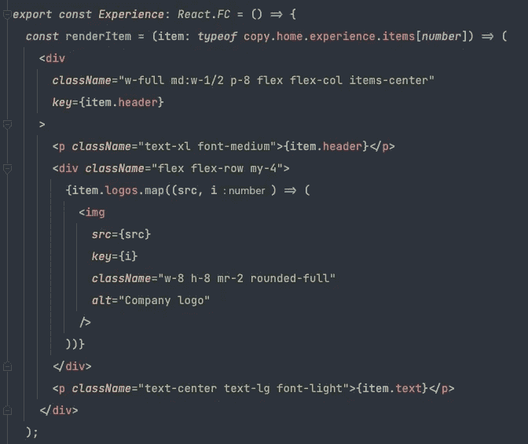
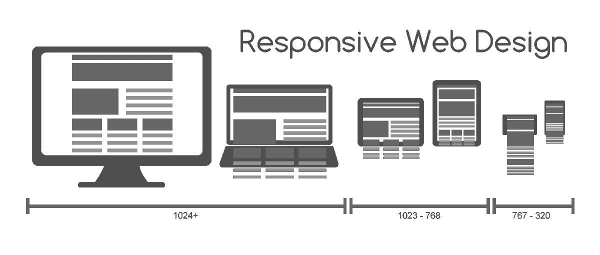
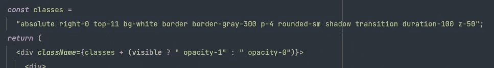

# 顺风+反应第一印象:利弊

> 原文：<https://betterprogramming.pub/tailwind-css-first-impressions-pros-and-cons-f36d6ff38ae0>

## 炒作是否实至名归？我用它做了一个 React 应用程序——这是我喜欢的和不喜欢的

来源:[顺风社](https://medium.com/u/d8c8c34e2236?source=post_page-----f36d6ff38ae0--------------------------------)

自 2017 年发布以来，CSS 框架 Tailwind 在 web 开发人员中的受欢迎程度激增。与大多数其他前端库不同，Tailwind 没有提供预先设计好的 UI 组件，而是提供了实用程序类，声称可以加快开发速度和简化样式。

像 Bootstrap 这样的组件库声称提供了类似的好处，但是根据我的经验，它们在不牺牲那些声称的生产力好处的情况下，几乎不允许定制。此外，大多数大型 web 应用程序需要的远不止 UI 库提供的简单、通用的组件。

这就是为什么 Tailwind 作为一个框架脱颖而出，实际上可能会提高我的生产率。它没有试图为我编写通用的 CSS，而是使编写我想要的 CSS 变得更简单、更快速——或者它声称如此。

所以，我决定在我的最新项目中测试一下——我的[新个人网站](https://billwohlers.com)，用 React 和 TypeScript 构建。

我的新个人网站，用 React + TypeScript + Tailwind 构建

让我们从我喜欢的开始。

# 告别数千行 CSS

Tailwind 确实几乎完全消除了对 CSS 文件的需求。

CSS 的组织和架构总是让我感到沮丧，尤其是在构建 React 应用的时候。有几种选择，但是没有一种是特别好的设计模式:

*   您可以为每个组件创建一个单独的 CSS 文件，但是这意味着大量的 CSS 文件会使您的 repo 变得混乱
*   您可以维护一些全局 CSS 文件，但是这意味着超长的文件和大量的 Ctrl + F 来完成任何事情
*   您可以使用样式化的组件，但是这用语法上难看的 CSS 注入使您的组件文件变得混乱

Tailwind 采取了一种完全不同的方法:几乎你所有的风格都保留在你的 JSX 标签中。这感觉很像编写内联样式——讽刺的是，这种做法在 web 开发中一直不被鼓励。不用声明大量重用的 BEM 类，只需使用实用程序类独立地设计每个元素的样式，比如用`bg-white`表示白色背景，用`text-lg`表示 18px 字体。

下面是使用 Tailwind 时 React 组件的快照:

JSX 片段来自我的网站，包括许多顺风类

*这不违反干原则吗？*当然——如果你不写小的、可重用的组件的话(后面会详细介绍)。此外，您可以编写自己的实用程序类，集成默认的 Tailwind 类。您甚至可以编写自定义组件类，将默认的和自定义的实用程序类结合起来。

# 原型制作速度明显加快

起初，顺风的开发非常慢，因为我不认识任何一个速记员，比如用`mr-12`代替`margin-right: 48px`。我不得不经常参考这个[备忘单](https://nerdcave.com/tailwind-cheat-sheet)来了解哪些实用程序类映射到了哪些 CSS 规则。但是随着我构建越来越多的组件，我注意到了命名约定中的模式，这使得记住 Tailwind 实用程序类的名称变得很容易。

一旦我掌握了窍门，我发现自己惊讶于自己可以如此快速地原型化 UI 组件。

除了提高生产力，用顺风设计组件比使用 BEM 风格的 CSS 更自然。我可以简单地为每个元素编写我想要的样式——不需要为每个组件创建新的 CSS 文件，不需要打开一千行的 CSS 文件，也不需要设计在整个应用程序中唯一的短类名。

在项目结束时(总共 20-30 个小时)，我确信使用 Tailwind 进行前端开发确实比我使用过的任何其他 CSS 框架、库或预处理器都更快、更令人愉快。

# 标准化风格

Tailwind 附带的实用程序类并没有包含所有可能的 CSS 规则。例如，大多数间距值的间隔为 4px，文本大小的间隔为 2px 和 4px。例如，要设置 1000 像素的`max-height`(用于下拉菜单),我必须编写一个自定义的实用程序类。

乍一看，这似乎是一个骗局，但是它带来了标准化的令人惊讶的有益结果。首先，它强化了 CSS 最佳实践，比如使用`rem`而不是`px`。第二，它提供了常用的预置值，否则可能需要一些修补，如`box-shadow`。不用定义一个自定义的`box-shadow`值并在整个 CSS 中使用它，你可以直接使用 Tailwind 的`shadow`类。想要阴影更微妙一点吗？使用`shadow-sm`。

当您使用 Tailwind 时，您的代码库中的所有 CSS 值都是整齐标准化的，易于阅读和修改。

# 鼓励小的、可重用的组件

当谈到 SPA 框架中的组件时——尤其是 React——组件应该尽可能的小和通用。这带来了两个重要的好处:

1.  减少代码重用。通过将组件定义为其他更小组件的组合，您可以保持所有组件都很小并且易于理解。
2.  创造了单一的真相来源。如果您想更改文本输入的外观或行为，只需在一个地方完成即可。

使用 BEM，不用定义单独的 React 组件，就可以很容易地在 CSS 中定义 UI 组件。但是在 Tailwind 中，UI 组件和 React 组件之间没有区别，因为大多数样式是内联的。如果你想重用样式，你需要用 T7 来定义一个可重用的组件，这会产生一个更好的组件架构。

# 响应式设计轻而易举

在今天的互联网中，小屏幕设计至关重要。如果你的网站在手机上看起来和感觉都不好，那还不如干脆不存在。

来源:维基共享资源

忘记媒体查询，这可能很难组织，并导致混淆选择器的优先级。

在 Tailwind 中，您可以在任何实用程序类前面加上一个断点名称和一个冒号。例如，`sm:text-sm`仅在`min-width`为 640px 的设备上设置较小的文本尺寸。

使用`min-width`而不是`max-width`作为断点鼓励了移动优先的风格。任何不带前缀的实用程序类都将应用于所有设备，而任何带`md:`前缀的类将仅应用于宽度大于 768px 的设备。(如果需要，您可以调整断点值。)

Tailwind 还附带了其他有用的前缀，比如`:hover`、`::before`，以及几乎所有伪类、伪元素和属性选择器的更多映射。完整列表见[此处](https://tailwindcss.com/docs/hover-focus-and-other-stateshttps://tailwindcss.com/docs/hover-focus-and-other-states)。

# 坏处

每个框架都有成本，Tailwind 也不例外。

## 陡峭的学习曲线

与其他 CSS 工具和库相比，Tailwind 是最难上手的工具之一。它需要记忆大量的人手，以及对顺风的不同“层”(基础、实用程序和组件)的概念性理解。

使用顺风时，参考表是必备的。当你第一次开始时，你可能会不断地引用它，这将大大减慢你的发展。但是当你记住了更常见的实用程序类，并开始理解 Tailwind 的一般命名约定时，你会越来越快。

然而，即使在使用 Tailwind 完成了一个完整的项目之后，我仍然没有记住几乎所有的实用程序类。我不确定我是否能在不使用引用表的情况下用 Tailwind 构建一个 UI。

## 长类名

从更大的角度来看，Tailwind 改进了组织，简化了前端代码。但这不是最优雅的解决方案。最丑陋的部分是你的一些 JSX 标签上的长`className` s(有时很荒谬)。我说了这么久，连 Prettier 都不太确定怎么格式化。

这是我的项目中的一个例子，一个`className`太长了，我不得不在 JSX 之外定义它:

除了视觉上不吸引人之外，还必须在一个 100 个字符的缩写实用程序类名字符串中查找您正在寻找的类，这也很烦人。但是只要你保持你的组件小，这种影响是完全可以控制的。

## 你需要对 CSS 有很强的理解

像 Bootstrap 这样的组件库的一个优点是它们只需要对 CSS 有一个基本的了解。无需理解或修改任何 CSS 代码，您就可以轻松创建一个现代外观的表单。

顺风就不是这样了。因为所有的实用程序类都映射到一个(或几个)CSS 规则，所以您必须知道这些 CSS 规则是做什么的，并且理解更复杂的概念，比如 flexbox 和 grid。

如果你不知道如何用普通的 CSS 开发一个 UI，那么用 Tailwind 就不行。

# 结论

Tailwind 并不适合所有人——它需要对 CSS 有深刻的理解，并在初次学习时有极大的耐心。此外，它只对基于组件的项目有意义，比如用 React 或 Vue 制作的项目。

但是对于那些对自己的 CSS 技能感到满意，并希望提高 web 开发速度或扩展前端技能的人来说，不妨试试 Tailwind。只要有一点耐心，你可能会对结果感到惊讶。