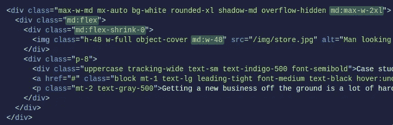
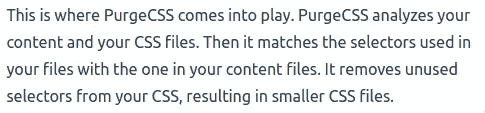

# 顺风 CSS(可能)被夸大了

> 原文：<https://betterprogramming.pub/tailwind-css-is-probably-overhyped-5272e5d58d4e>

## 对流行实用框架 Tailwind CSS 的批判性审视


照片由 [Verena Yunita Yapi](https://unsplash.com/@verenayunita?utm_source=unsplash&utm_medium=referral&utm_content=creditCopyText) 在 [Unsplash](https://unsplash.com/s/photos/hype?utm_source=unsplash&utm_medium=referral&utm_content=creditCopyText) 上拍摄

# 介绍

[在过去的两年里，Tailwind CSS](https://tailwindcss.com/) 已经获得了大量的关注(从每周 30K 的下载量增加到近 600K)。毫无疑问，流行的实用优先的 CSS 框架有很多好的方面。您可能已经听说过它有多棒，因为许多开发人员似乎也有同样的看法。

但是关于它还有更多要说的。

# 什么是顺风 CSS？

如果你从未见过顺风的运行，你可以试试:

```
<div class="**bg-gray-100 rounded-xl p-8**">Hello World</div>
```

突出显示的类就是 Tailwind:一组预定义的 CSS 类(所谓的实用程序类)。您不用编写基本的 CSS 样式规则，而是直接在 HTML 中应用这些预先存在的类。

而且有很多。类别的非详尽列表，每个类别后面都有两个示例:

*   **背景** ( `bg-gray-200`，`bg-gradient-to-bl`)
*   **伸缩** ( `flex-1`、`flex-row`)
*   **网格** ( `grid-cols-1`、`col-span-4`)
*   **填充** ( `p-0`、`p-1`)
*   **上浆** ( `w-1`，`h-1`)

前几天，另一位作者将这组预定义的类与您可以在代码中使用的一大箱乐高积木进行了比较。当然，与常规 CSS 有很多重叠，但还不止这些:预定义的范围(`bg-red-100`、`bg-red-200`、…)就是一个例子。顺风的目的是让你的生活更轻松，从一个角度来看，它做到了。

还有，我喜欢这个名字:顺风。那是好东西。

我业余时间是个水手，在这里可能会有所偏颇。

# 句法

正如我们在上面看到的，我们直接在 HTML 中编写实用程序类名。我马上想到的一个想法是，这看起来很像内联 CSS(这可能是 Tailwind 开发人员在[文档](https://tailwindcss.com/docs/utility-first#why-not-just-use-inline-styles)的第一页中提到这个问题的原因)。

尽管他们试图争辩说这并不坏，因为顺风给了你所有的好处(这本身就是真的，我同意)，但我并不信服。我不想用大量的每个 HTML 元素的类名来污染我的 HTML 语法。我不想每天都看到这个:



请记住:上面的例子来自 Tailwind 文档，它呈现了一个简单的卡片。它确实做得很漂亮。它甚至有反应。但是根据您的日常任务，这很快会升级:如果我创建一个比简单的卡片更复杂的组件呢？如果我不得不尊重设计师创造的某个设计，以及它所有的小怪癖，那该怎么办？

我试过这样做。而发生的事情并不意外。您的 HTML 元素每个都有许多 Tailwind 实用程序的类名。比如说，*很多*。这在他们的文档中是看不到的。也不在社交媒体上。但是，当我们开始开发更大的应用程序时，这是一个现实:

这就是实践中会发生的情况。

上面的例子并不夸张。我甚至敢称之为最小化的例子——至少在有一定要求和设计(基于不同屏幕尺寸的响应性和风格调整)的应用中。

那么我们如何组织这些类名呢？也许我们必须为他们的秩序创造并尊重惯例。我会觉得那很麻烦。另一种选择是，我们允许模板设计者和开发者使用他们想要的任何特定顺序。这将导致我们不得不水平扫描——甚至滚动——以便找到我们试图改变的类名。

**我不想“沃利在哪里？”我的元素的字号。**

我的观点是，一些 HTML 元素可以应用如此多的样式，默认情况下，它们可能应该与 HTML 标记分开。在他们自己的文件里。这样我们可以组织它，使它可读。你不能在一个叫做*类*的 HTML 属性中包含 CSS 的所有功能。也没有顺风。它很快变得太多了。

# @应用

Tailwind 提供了在 CSS 文件中使用它们的类的选项，就像我们上面讨论的那样:

但是，与我们传统的编写 CSS(或 SASS，或任何其他预处理程序)的方式相比，我看不出这给我们带来了什么好处。你可以说我过时了，但我更喜欢看这个:

同样，在现实生活中，元素可能会应用更多的规则。

我不回避顺风给我们带来的好处。毫无疑问，他们的一些实用工具类背后隐藏着强大的力量。但是说到语法，我更喜欢我们的标记代码(HTML)和样式规则之间的清晰分离。我猜是主观判断。

# 清理和吹扫

当我们将 Tailwind 包含在我们的项目中时，它们的所有类都是可用的。但是当我们构建我们的项目并捆绑它时，我们显然不需要所有这些类。这就是为什么 Tailwind 使用了一个叫做 PurgeCSS 的工具:



一个简短的总结来说明我的想法:首先，我们在项目中添加了大量的实用程序类。然后，当我们将要构建和完成我们的发布时，我们利用一个工具来扫描我们的代码，并试图找出这些类中哪些没有被使用，以确保它们不会成为我们的包的一部分。它通过使用正则表达式来实现:


通过添加和使用 Tailwind，我们给项目增加了一层复杂性。而且层层引入风险。事情可能会出错。他们会:

不能再动态生成类名了。这意味着顺风在限制我们。这可以在[文档](https://tailwindcss.com/docs/optimizing-for-production#writing-purgeable-html)中找到，但是很容易被忽略:


不允许串联。

不仅限制是一个问题，而且:通过给我们的项目增加一个新的复杂性层，我们正在引入一般的风险。

这就变成了判断。好处大于坏处吗？这个问题的答案因项目而异。但至少应该牢记在心。以上只是限制的一个例子；有多个。另一个例子是添加额外的(定制的)CSS 到你的 Tailwind 项目是不简单的。

# 可供选择的事物

在阅读了 Tailwind 文档并尝试使用了几天之后，我不禁觉得他们没有意识到我们中的许多人已经在日常生活中使用工具来简化设计了。

文档中写道，使用顺风的好处之一是你可以摆脱神奇的数字。这本身就是真的，而且这是一件非常好的事情:我们在幕后定义了一个颜色实用程序类(假设是`bg-red-200`)，并且我们在整个代码中使用这个类。因此，更改这个类的实际值可以在一个集中的地方完成(Tailwind 配置文件)。这太棒了，我相信你也能做到。

但是今天的工具，如 [SASS](https://sass-lang.com/) (每周超过 500 万次下载)，已经可以很容易地创建实用程序类和变量，并在我们的代码中重用它们。甚至原生 CSS 也支持变量。

当我们这样做时，我们不会面临额外的复杂性，并且在编写 CSS 和样式规则时，我们不必改变我们的习惯和语法。

使用顺风也是有成本的。通过花费精力和时间学习 Tailwind 的语法和类名，你开始忘记它背后的语法:原生 CSS 的语法。如果我的开发人员在一个更大的项目中专门使用 Tailwind 一年，他们肯定会慢慢忘记原生 CSS。这是一个积极的发展吗？我不太确定。

# 一锤定音

顺风很受欢迎。它似乎获得了牵引力，数字上升。我知道为什么了。使用它会给你带来很多好处。我同意。他们的一些实用程序类具有相当强大的功能。

我写这篇文章的全部目的是想向世界展示这个故事有两个方面。

有些人可能会从这个框架中受益匪浅。但其他人可能会受到它的限制，并会在这个过程中发现这些限制，或者更糟，过一段时间后。

在调整新框架时要有批判性。当“每个人”都在喊它很牛逼的时候，通常是坐下来好好看看它的好时机。

感谢您的宝贵时间！

杰勒德