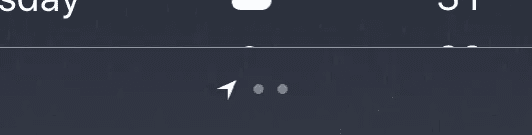
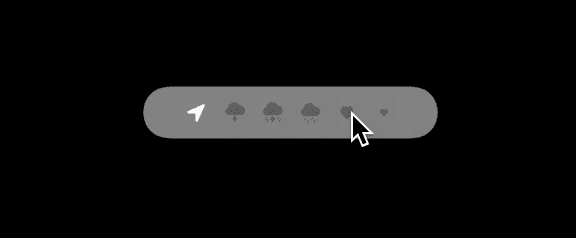
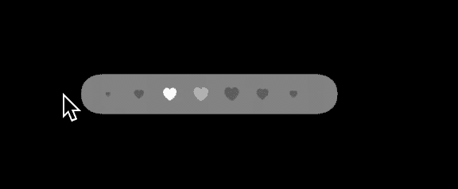

# 看看 iOS 14 的新 UIPageControl

> 原文：<https://betterprogramming.pub/take-a-look-at-ios-14s-new-uipagecontrol-3207a10212b9>

## 在 WWDC 20 上，苹果宣布了一些新的令人兴奋的 API，用于老而无聊的 UIPageControl


[David Grandmougin](https://unsplash.com/@davidgrdm?utm_source=medium&utm_medium=referral) 在 [Unsplash](https://unsplash.com?utm_source=medium&utm_medium=referral) 上的照片。

在本文中，我们将讨论 iOS 14 中对`UIPageControl`的以下新变化:

*   背景样式
*   自定义指示器图像
*   特定索引处的自定义指示器图像
*   无限页面(新的擦除行为)

# 背景样式

我们的`UIPageControl`有了一个新的造型选项，叫做`BackgroundStyle`。这是一个具有三个值的枚举:

用法很简单。默认为`minimal`:

```
pageControl.backgroundStyle = .prominent
```

*注意:当交互状态为* `*continuous*` *时，如果将* `*backgroundStyle*` *设置为* `*automatic*` *，背景样式会自动改变。我将在本文后面讨论交互 API。*


顶部:突出风格(新)与底部:简约风格(旧)

# 自定义指示器图像

苹果引入了一个新的 API 来为我们的`UIPageControl`设置自定义图标或图像，而不是旧的圆形图标。

我记得通过编写一个定制的`UIPageControl`类来实现这一点付出了很多努力。属性名称如下:

```
/// The preferred image for indicators. Symbol images are recommended. Default is nil.
 @available(iOS 14.0, *)
 open var preferredIndicatorImage: UIImage?
```

用法很简单。我在这个演示中使用了 SF 符号:

```
pageControl.preferredIndicatorImage = UIImage.init(systemName: “heart.fill”)
```


# 特定索引处的自定义指示器图像

```
/**
 * @abstract Returns the override indicator image for the specific page, nil if no override image was set.
 * @param page Must be in the range of 0..numberOfPages
 */
 @available(iOS 14.0, *)
 open func indicatorImage(forPage page: Int) -> UIImage?
```

你还记得你的 iPhone 预装的雅虎天气应用吗？其下方有`UIPageControl`，其中第一个图标是位置图标，表示当前位置。有趣的是他们从一开始就有这种控制。我过去总是考虑实现这一目标所需的实现和努力。



雅虎天气应用 UIPageControl 截图

现在这是小菜一碟，因为 iOS 14 给了我们一个新的 API，你可以用它为你的`UIPageControl`的每个索引设置一个自定义图标。

我在这个演示中使用了 SF 符号:

```
pageControl.setIndicatorImage(UIImage.init(systemName: “location.fill”),
 forPage: 0)
```


想象一下，你可以用设置每个图标的能力进行定制，你可以给我们的用户提供用户体验。

下面是一个根据不同的下雨天气条件将自定义图标设置为页面控件的示例。


# 无限页面(新的擦除行为)

使用新的`UIPageControl`，您可以设置无限数量的页面。好吧，不要无限创造…但那有多酷？

用法很简单。在本演示中，我将它设置为`400`:

```
pageControl.numberOfPages = 400
```

在 iOS 14 之前，我们可以设置任意数量的页面。那么苹果今年做了什么来改善这样的场景呢？

它引入了新的 API 和全新的 UX 来处理这个问题。

苹果在 iOS14 中为我们的新`UIPageControl`提供了一个名为`InteractionState`的自定义交互。它是一个具有两种交互类型的枚举:

*   分离的
*   连续的

在 iOS 14 中，`UIPageControl`的交互默认值为`continuous`:

通过将下面的属性设置为`false`，可以将交互状态更改为`discrete`:

```
/// Returns YES if the continuous interaction is enabled, NO otherwise. Default is YES.
 @available(iOS 14.0, *)
 open var allowsContinuousInteraction: Bool
```

您还可以添加一个观察者来更改`interactionState`属性的值，并使用下面的属性检查当前的交互状态:

```
/// The current interaction state for when the current page changes. Default is UIPageControlInteractionStateNone
 @available(iOS 14.0, *)
 open var interactionState: UIPageControl.InteractionState { get }
```

下面，我分享了这两类互动的 gif。你可以看到持续的交互帮助我们通过拖拽行为到达`UIPageControl`的任何索引。对于离散交互，我们点击它，然后一个接一个地移动到下一个索引。



离散相互作用



持续互动

# 结论

感谢您的阅读。希望这篇文章能帮助你在 app 中自定义`UIPageControl`，给你的老控带来一些生机。