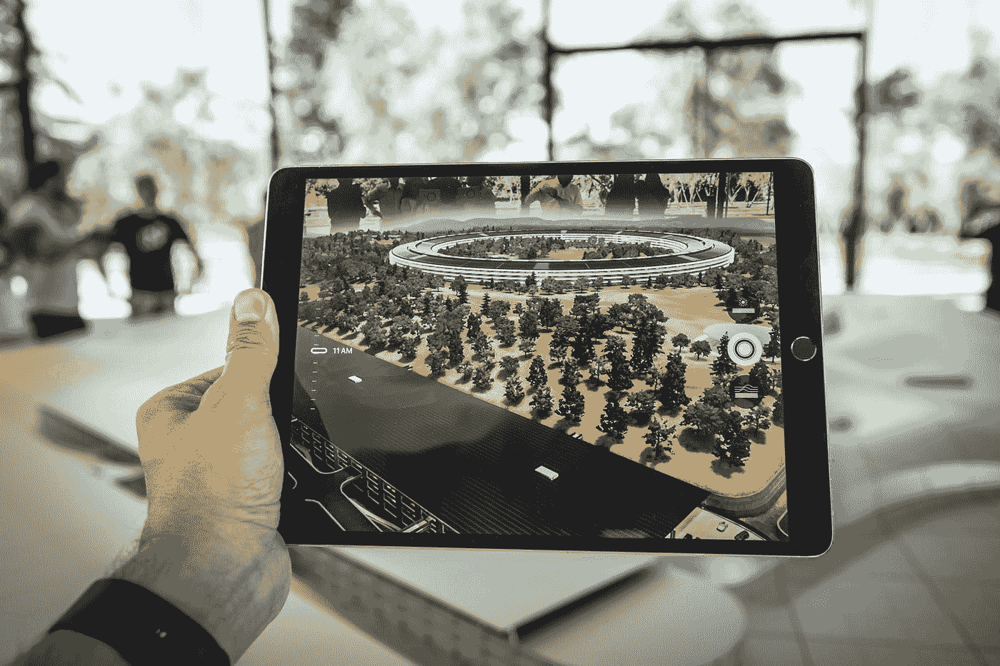
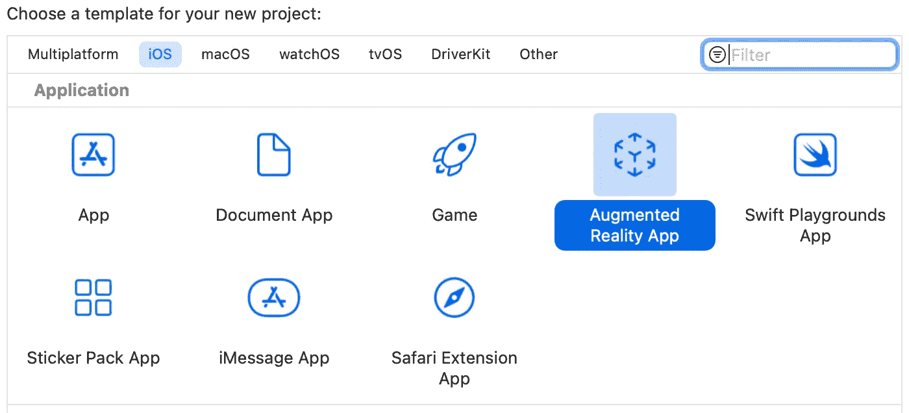
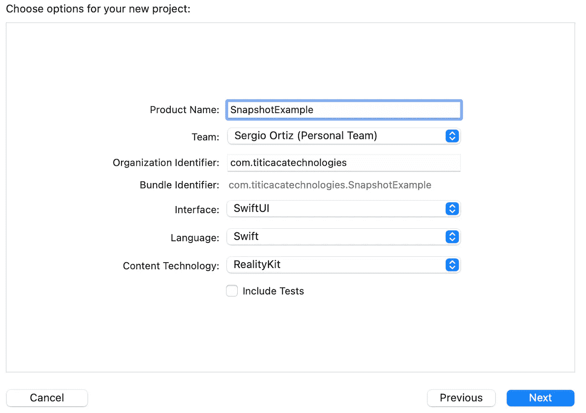
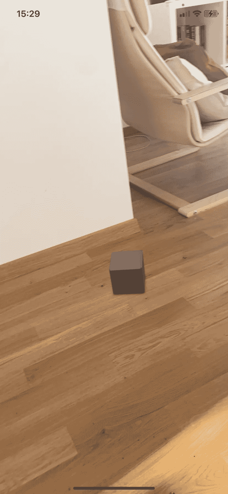
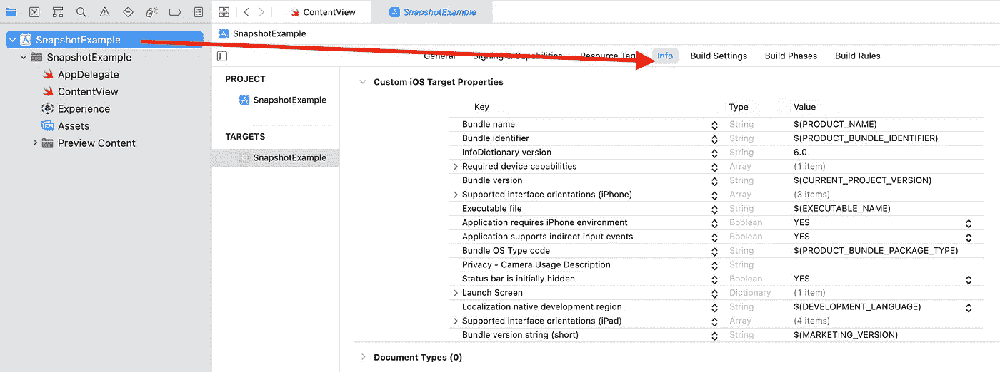
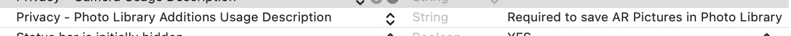

# 在 RealityKit 中拍摄视图快照

> 原文：<https://betterprogramming.pub/take-an-arview-snapshot-in-realitykit-93b620cf99b3>

## 构建增强现实 iOS 应用



帕特里克·施耐德在 [Unsplash](https://unsplash.com?utm_source=medium&utm_medium=referral) 上拍摄的照片

当我学习使用 Reality Kit 时，我很高兴地发现 Xcode 为您提供了一个不错的增强现实模板，其中包含一个“盒子”，您可以使用您的设备将其放置在一个平面上。轻松又爽！一旦我开始玩它，我脑海中出现的第一个问题是“如何给这个盒子拍照(不截屏)？”。

缺少文档，周围也没有很多教程。在这里，我分享一个我发现的简单解决方案，使用 Xcode 中提供的这个开箱即用的“盒子”(双关语)。

# 创建您的项目

在 Xcode 上，新建一个增强现实项目:**文件>新建>项目**。选择 **iOS >增强现实。**



点击**下一步**继续。将产品名称设置成自己喜欢的东西，比如`SnapshotExample` **。**保留默认选项，选择**下一步。**



将项目保存在通常的开发文件夹中。在这个阶段，如果你在你的 iOS 设备上运行你的项目，你已经可以把盒子放到 AR 世界中了。建造它并试一试。



我们现在将修改这个基本模板，添加一个快门按钮，并拍摄一张 AR 视图的照片。

# 构建用户界面

首先，我们将按下给我们拍照的按钮。在`ContentView`中找到下面一行:

```
**return** ARViewContainer().edgesIgnoringSafeArea(.all)
```

将此行替换为以下内容:

```
ZStack(alignment: .bottom){
  ARViewContainer().edgesIgnoringSafeArea(.all)Button {

  // Placeholder: take a snapshot

  } label: {
    Image(systemName: "camera")
      .frame(width:60, height:60)
      .font(.title)
      .background(.white.opacity(0.75))
      .cornerRadius(30)
      .padding()
  }
}
```

这将创建一个带有适当 SF 符号的圆形按钮。该按钮将在稍后执行快照，记下“占位符”行，因为我们稍后将回到它。

# 创建一个静态变量来跟踪 AR 视图

在同一个文件`ContentView.swift`中，创建一个新的结构`ARVariables`。这将拖住`ARView`。

```
**struct** ARVariables{
  **static** **var** arView: ARView!
}
```

这个静态变量将允许我们在代码的其他部分访问`ARView`,因此能够对它拍照。

我们现在需要指向`ARViewContainer`来使用这个变量，而不是本地创建的变量。找到`makeUIView` 方法并替换为:

```
**func** makeUIView(context: Context) -> ARView {
  ARVariables.arView = ARView(frame: .zero) // Load the "Box" scene from the "Experience" Reality File
  **let** boxAnchor = **try**! Experience.loadBox() // Add the box anchor to the scene
  ARVariables.arView.scene.anchors.append(boxAnchor) **return** ARVariables.arView
}
```

我们在上面所做的只是告诉方法使用我们在上一步中创建的结构。

# 编写函数

我们快到了！在先前创建的按钮中找到“占位符”动作，并将其替换为:

```
// (Placeholder): Take a snapshot
ARVariables.arView.snapshot(saveToHDR: **false**) { (image) **in** // Compress the image
  **let** compressedImage = UIImage(data: (image?.pngData())!) // Save in the photo album
  UIImageWriteToSavedPhotosAlbum(compressedImage!, **nil**, **nil**, **nil**)}
```

在这个片段中，我们调用了静态变量`arView`的 snapshot 函数，并在首先压缩图像后将其保存到我们的相册中。

# 请求相册权限

还有一步！我们需要请求相册权限，以便能够在我们的照片库中保存我们的快照。

选择您的项目(在我们的例子中是`SnapshotExample`，然后打开**信息**标签。



在任一键上，选择“+”按钮并搜索`Privacy- Photo Library Usage Description`，并将其值输入到最终用户能够理解的内容中，例如“需要在照片库中保存 AR 图片”。



# 构建并运行

我们完了！建立和运行您的项目，等到框出现在屏幕上，并采取您的照片，它将被保存在您的照片库。

我希望这有所帮助。你有意见、建议或问题吗？请在下方留言或给我发消息。

完整的项目可以在下面的 GitHub 资源库中找到:

[](https://github.com/serchazo/SnapshotExample) [## GitHub-serchazo/snapshot 示例:对 SwiftUI 上的视图进行快照

### 此时您不能执行该操作。您已使用另一个标签页或窗口登录。您已在另一个选项卡中注销，或者…

github.com](https://github.com/serchazo/SnapshotExample)