# 让你的角度应用更上一层楼(第 1 部分)

> 原文：<https://betterprogramming.pub/take-your-angular-apps-to-the-next-level-ee75b9655df4>

## 使用有棱角的材料、灵活的布局、反应式的形式和路线动画来构建漂亮的、反应灵敏的应用程序

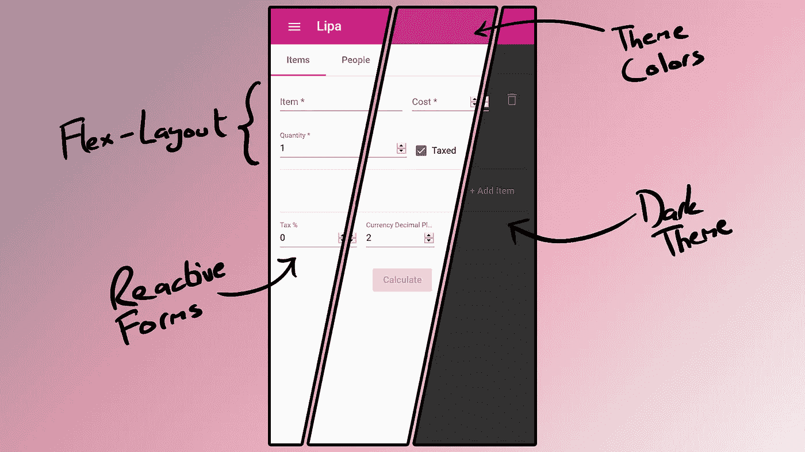

在 [https://lipa.imranr.dev](https://lipa.imranr.dev) 简单展示棱角分明的材料——图片由 Imran Remtulla 提供

Angular 就是快速完成任务。路由和服务等开箱即用的功能使您可以轻松启动并运行应用程序的基本框架。当然，当涉及到应用程序的实际内容(HTML、CSS 和 TS)时，您只能靠自己。还是你？在本指南中，我们将探索一些库和特性，使构建好看的、可维护的应用程序变得容易；即使你和我一样，不擅长设计。

具体来说，我们将研究:

*   角状材料
*   柔性布局
*   反应形式
*   路由动画

# 角状材料

[Angular Material](https://material.angular.io/) 是一个遵循谷歌[材质设计](https://material.io/design)准则的漂亮组件库。除了各种按钮、表单字段、导航组件和其他样式化的 UI 项目之外，它还提供了一组非样式化的“行为原语”,使得构建拖放、覆盖和剪贴板交互等复杂功能变得非常简单。

让我们看看如何安装角材料，使用一个组件，并指定自定义主题，包括一个自动黑暗的主题。

## 设置

要安装这个库，在 Angular 项目中运行`ng add @angular/material`。会问你几个问题。我建议选择“自定义”主题，然后对下面两个问题回答“是”,以启用字体样式和浏览器动画。

## 使用组件

要使用任何组件，您必须首先将它添加到您的`app.module.ts`文件中的 imports 数组。例如，要使用 mat 按钮:

然后，您应该能够在应用程序的任何地方使用该组件:

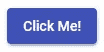

结果按钮

我们已经可以看到使用这个库的好处。按钮有颜色，阴影，点击动画，禁用时灰显——所有这些都不需要写一行 CSS！

此处提供了角形材料成分的完整列表[。](https://material.angular.io/components/categories)

## 主题

在上面的代码中，你可能注意到在按钮上添加`color="primary"`会使它变成蓝色。为了保持一致的外观，棱角分明的材质主题使用三种颜色:

*   原色:应用程序的主色。
*   次要颜色:补充主要颜色，用于强调一些组件，以防止应用程序被单一颜色主导。
*   警告:用于错误信息的颜色，通常为红色。

应用程序主题在`styles.scss`或`custom-theme.scss`中定义，取决于您的应用程序在安装 Angular Material 之前是否使用 SCSS 风格。

要定义一个主题，首先需要定义它将使用的三种颜色。然后，使用这些颜色创建一个主题变量。最后，使用`@include`指令告诉框架实际使用那个主题。

默认主题应该是这样的(默认评论被删除，我的被添加):

## 黑暗主题

如今大多数操作系统都有黑暗主题功能，所以人们使用的任何应用程序都应该尊重主机平台的黑暗主题设置，这是有道理的。

请注意，在定义了上面的 Angular 主题之后，`@include`关键字实际上是告诉应用程序使用该主题。这意味着我们可以定义任意数量的主题，然后根据我们当时想要使用的主题动态地使用`@include`关键字。

在创建黑暗主题时，棱角分明的材质也有特殊的作用。这会使 mat-menu 等组件变暗。

让我们使用这些概念和`prefers-color-scheme` CSS 查询来实现自动黑暗模式:

现在，该应用程序应该根据用户的设备设置从靛蓝/粉红色光主题切换到紫色/绿色暗主题！

# 柔性布局

如果你讨厌处理 CSS flexbox 或设置媒体查询来重新安排不同屏幕尺寸的布局，你会喜欢 [Angular Flex-Layout](https://github.com/angular/flex-layout) 库。

## 设置

通过运行`npm i @angular/flex-layout @angular/cdk`安装柔性布局。然后，将其添加到`app.module.ts`中的导入数组中:

## 使用

使用 Flex-Layout 非常简单。所有容器都可以按行或列排列它们的子容器。在这两种情况下，所有的孩子都可以聚集在容器的两端，或者均匀分布，或者根据具体情况给定一定的空间。根据屏幕是否属于五种尺寸类别之一，所有这些设置可能会有所不同。

让我们看一个简单的例子。假设我有一个表单域和一个按钮。在大屏幕上，我希望它们排成一行，但在较小的屏幕上，它们应该排成一列:

我们使用`fxLayout`属性来指定 div 应该包含行。然后，我们使用带有`.lt-sm`修饰符的相同属性来指定当屏幕小于小屏幕的阈值时，它应该包含列。这是结果:

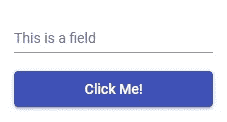

在小屏幕上。

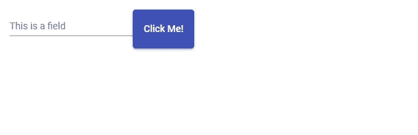

在更大的屏幕上。

好的，那可以，但是在大屏幕上看起来很奇怪。按钮被拉伸得太高，项目之间没有足够的空间。我们可以使用`fxLayoutGap`和`fxLayoutAlign`来解决这个问题:

如您所见，我们现在在 div 中使用了六个 flex-layout 属性；三个用于小屏幕，三个用于所有其他屏幕。除了在小屏幕上看起来不错之外，这是它现在在大屏幕上的样子:

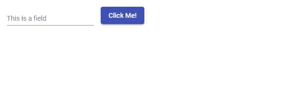

好多了。

一定要看看[详细文档](https://github.com/angular/flex-layout/wiki/API-Documentation#containers)才能真正解锁这个系统的威力！

# 反应形式

无论你在哪里学习 Angular，你都可能被教导使用带有 ngModel 指令的模板驱动表单。另一种选择是使用反应形式。这两者之间有许多不同之处，但简单来说，反应式表单设置起来稍微困难一些，但是更加灵活和可伸缩。如果你的应用程序包含复杂的表单，我建议使用反应式表单。

## 设置

从`@angular/forms`导入`ReactiveFormsModule`，并将其添加到`app.module.ts`的导入数组中，就像我们在前面的例子中对其他模块所做的那样。

如果您使用的是角度材质表单字段，也可以导入这些字段并将其添加到数组中:

## 使用

让我们创建一个简单的反应式登录表单。在组件的`.ts`文件中:

我们在组件中声明了两个表单控件/输入，并将它们组合成一个名为`loginForm`的表单。每个 FormControl 可以有任意数量的验证器。虽然您可以编写自己的自定义验证器函数，但是我们使用了内置的`required`函数来确保两个字段都不能为空。我们还使用了`Validators.email`函数来确保用户在电子邮件字段中输入了电子邮件。

现在让我们构建 HTML:

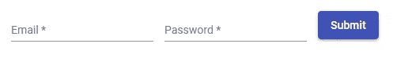

结果表单

如您所见，我们使用`form`元素上的`[formGroup]`属性将表单连接到我们在`.ts`文件中创建的`FormGroup`。每个输入元素还有一个`formControlName`属性，将它连接到适当的`FormControl`。请注意，尽管我使用的是 Angular Material 和 Flex-Layout 库，但反应式表单并不依赖于它们。另外，请注意，即使我们在`FormGroup`中使用了验证器函数，我们仍然需要向`input`元素添加`required`和`type="email"` / `type="password"`属性。这些不用于验证，但出于 UI 原因仍然需要存在，即屏蔽密码字符并将星号添加到必填字段。

现在，我们需要做的就是当点击“提交”按钮时，让表单实际提交它的输入。将以下内容添加到组件的`.ts`文件中:

然后，将该函数调用添加到 HTML 中表单元素上的一个`(ngSubmit)`属性中，如下所示:

我们已经告诉表单每当点击提交按钮时调用提交函数。submit 按钮检查用户输入的有效性，如果输入有效，则将其打印到控制台。

让我们看看当我尝试提交包含有效和无效输入的表单时会发生什么。

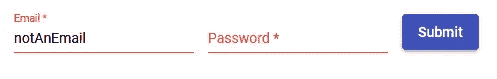

输入无效输入后，单击提交。

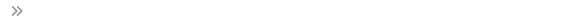

尝试提交无效输入后，控制台为空。

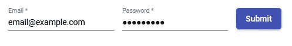

输入有效输入后，单击提交。

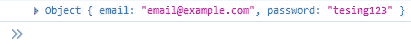

有效提交后，输入被打印到控制台。

如您所见，输入字段在无效时会变成红色，我们可以随时通过`loginForm.valid`检查表单的有效性，包括单击提交按钮的时候。当然，在现实世界中，提交函数会连接到一些登录 API，而不仅仅是打印到控制台。

反应形式，特别是当与有角的物质结合时，比我在这里展示的有更多的力量。您可以显示自定义错误消息，订阅值更改，等等。点击可获得更深入的指南[。](https://angular.io/guide/reactive-forms)

# 路由动画

当用户在路线之间移动时，路线动画是添加过渡动画的简单方式。您可以为不同的路线过渡指定特定的动画，或者为多个路线过渡重复使用同一个动画。

让我们看看如何在两条路线之间设置一个简单的淡入动画。我们有一个有两条路线的应用程序，`/a`和`/b`，包含在它们之间移动的按钮。我假设你对角度路由足够熟悉，能够理解并设置这样一个演示应用程序。

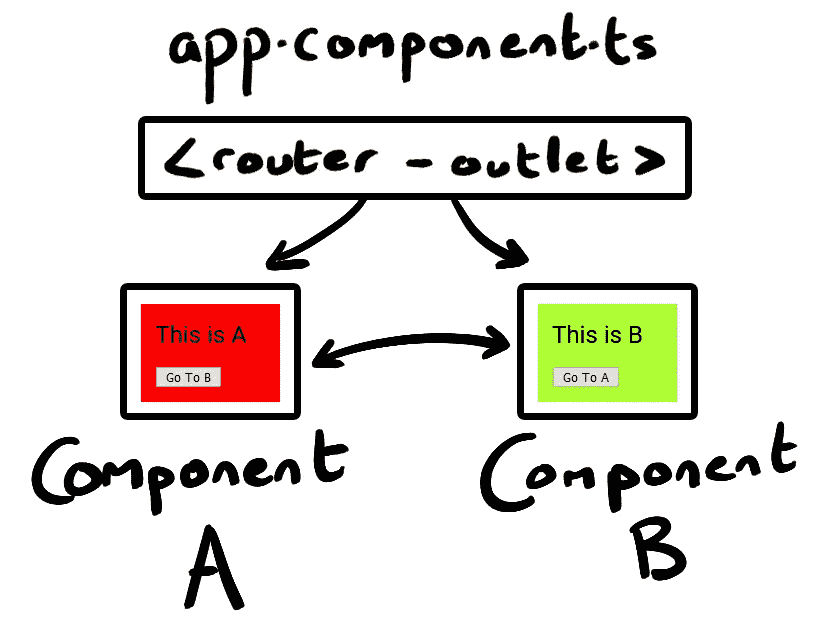

路线动画演示应用程序的结构。

首先，确保`BrowserAnimationsModule`在`app.module.ts`的导入数组中。如果不是，就从`@angular/platform-browser/animations`进口。

接下来，我们需要向每条路线添加一条额外的数据，以便在以后的动画中识别它:

接下来，创建一个名为`route-animations.ts`的新文件。这是我们定义实际动画的地方:

我不会深入动画的细节，但让我们来看一个高层次的概述。我们正在定义一个`fader`变量。在里面，我们为不同的路线转换定义了不同的动画。我们为从组件 A 到组件 B 的转换定义了一个动画(`pageA => pageB`)，为所有其他转换定义了另一个动画(`* <=> *`)。如您所见，我们通过之前添加的数据字符串来引用组件。动画本身只是为动画的开始指定一个 CSS 样式，为动画的结束指定一个 CSS 样式，为动画指定持续时间和[补间](https://en.wikipedia.org/wiki/Inbetweening)。

好了，我们已经定义了动画和它们应该应用的过渡。剩下的就是实际使用它们了。

将以下内容导入`app.component.ts`:

在同一个文件中，在`@component`指令下添加一个新的“animations”项:

然后将以下函数添加到 App 组件中:

最后，将`router-outlet`包装在`app.component.html`中的一个 div 中:

就是这样！动画现在应该可以工作了。

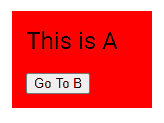

从组件 A 过渡到组件 b。

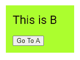

从组件 B 过渡到组件 a。

这是对路由器动画的快速浏览，但它更侧重于完成任务，而不是解释它是如何工作的。更详细的解释，查看[官方指南](https://angular.io/guide/route-animations)。

# 结论

我希望这个指南能帮助你把你的 Angular 应用程序提升到一个新的水平；你可能想看看第二部分。感谢阅读！