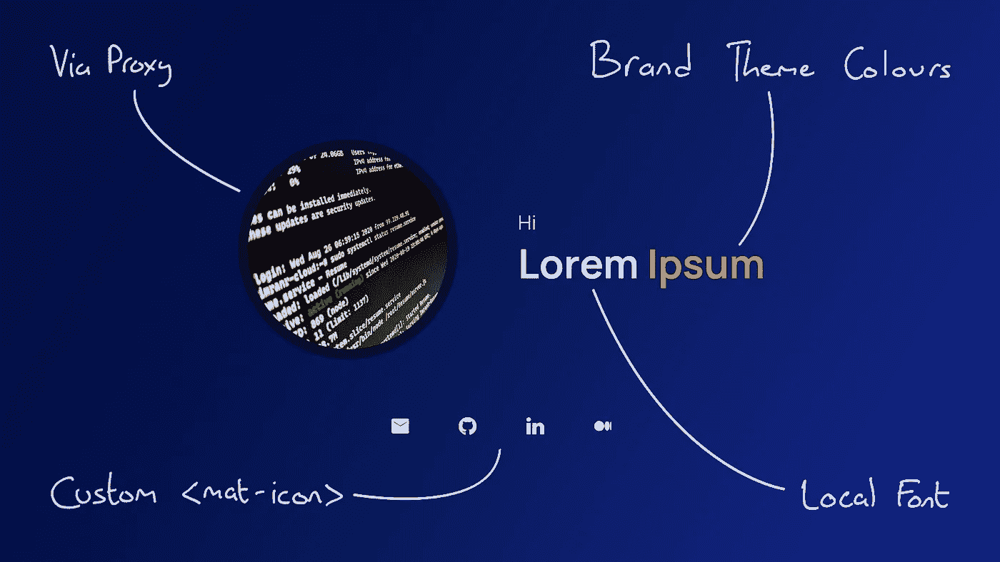
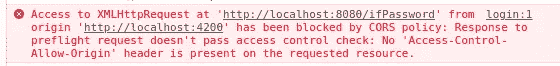

# 让你的角度应用更上一层楼(第二部分)

> 原文：<https://betterprogramming.pub/take-your-angular-apps-to-the-next-level-part-2-3cdec26e84d>

## 定制有角度的素材主题，使用本地资源、拦截器和代理来构建优化的、可维护的应用程序

作者图片

从开始的`ng new`命令开始，Angular 包含了一个基本 web 应用的所有要素，从路由到状态管理。当然，当涉及到更高级的功能时，随着应用程序的增长，你开始需要这种功能，事情就变得不那么清楚了。在本指南中，我们将探索一些更小众的角度特征，当你需要它们时，它们会成为你的救命稻草。

这篇文章基于第 1 部分中的一些概念，所以你可能想先阅读一下。

具体来说，我们将了解:

*   定制材料主题颜色
*   自定义材料图标
*   本地字体
*   HTTP 拦截器
*   代理配置

# 定制材料主题颜色

虽然 Angular 的官方材料组件库提供了一套很好的预定义主题颜色，但你迟早会发现自己需要使用非常特殊的颜色，也许是默认情况下不可用的品牌颜色。让我们看看如何为材质主题创建自定义调色板。

如同第 1 部分的素材主题部分，我假设您使用 SCSS，因此在`styles.scss`中定义了一个主题。

首先，我们用深色、浅色和常规颜色来定义颜色:

`contrast`下的项目定义了每种颜色变体背景下的文本颜色。在上面的例子中，三种变体都相当暗，所以文本应该是白色的(`#fff`)。

接下来，我们定义一个调色板。与标准材料颜色不同，我们需要明确提及每一种变体。我将使用标准的`mat-red`定义另一个调色板来显示不同之处:

就是这样！现在，您可以在主题中使用调板:

您还可以在样式文件中的任意位置使用调色板中的单个颜色变体:

# 自定义材料图标

Google 官方材料组件库的`[mat-icon](https://material.angular.io/components/icon/overview)`组件很棒；它让你用清晰的、经过测试的图标来代替文本，来呈现一个更紧凑、视觉上更吸引人的用户界面。不过，缺点是图标默认情况下不与应用程序打包在一起，而是从谷歌服务器远程加载。这在某些情况下会导致加载问题，比如当用户使用像 [uBlock Origin](https://ublockorigin.com/) 这样的浏览器扩展时。除此之外，你只能看到谷歌的[图标列表](https://material.io/resources/icons)。幸运的是，我们可以使用自定义图标来解决这些问题。

首先，确保您已经在`app.module.ts`中导入了`MatIconModule`。然后，将以下导入添加到`app.component.ts`的顶部:

然后将这些添加到`AppComponent`构造函数中:

接下来，将您的自定义图标(SVG 格式)添加到`assets`文件夹中。在这个例子中，我将使用一个名为`cancel.svg`的文件。

最后，将以下代码添加到`AppComponent`的`ngOnInit`函数中:

这段代码告诉应用程序使用我们在`assets`文件夹中的图标，并使它在`cancel`名称下可用。它现在可以用于任何`mat-icon`元素:

# 本地字体

这与上一节类似。本地存储的字体可能会占用空间，但你可以肯定它们永远不会加载失败，并且不太可能被用户扩展阻止。

就像我们处理自定义的`mat-icon`一样，我们将本地字体添加到`assets`文件夹中。从那里，我们将以下内容添加到`styles.scss`。(我这里用的是 Roboto 字体。)

代码非常简单。我们已经确定了字体的名称，并指定了它的位置，现在它可以在应用程序的任何地方使用。请注意，如果素材库使用自己的字体导入，这可能不起作用。您可以通过从`index.html`中移除对`fonts.googleapis.com`的所有引用以及`class="mat-typography"`的任何实例来解决这个问题。

# HTTP 拦截器

身份验证是 web APIs 的一个常见要求，一种常见的身份验证形式是 JSON Web Token (JWT)。这些令牌需要随着每个请求从客户端发送到受保护的 API 端点。虽然 JWT 的细节超出了本文的范围，但是我们将研究如何使用 HTTP 拦截器来自动发送存储的 JWT 和 HTTP 请求，而不是为每个请求单独发送。

Angular HTTP 拦截器就像它听起来的那样:一段代码，它查看应用程序发出的每个请求，并稍微修改它。首先，我们通过在`app`目录中创建一个新的`HttpInterceptor.ts`文件来创建拦截器:

当发出请求时，就会调用`intercept`函数。从那里，以某种方式检索 JWT 令牌(实际上，这可能来自不同的服务)。然后，使用`req.clone`函数制作请求的副本，同时将 JWT 附加到该副本的头部。然后副本通过`next.handle`功能传递到下一步。

既然已经创建了拦截器，就需要对其进行配置，以便在应用程序范围内使用。在`app.module.ts`文件中，创建以下导入(如果不存在的话):

最后，将其添加到文件底部的 providers 数组中:

完成—应用程序发出的所有 HTTP 请求现在都应该包含 JWT！注意，这是 HTTP 拦截器的一个流行用例的演示；它们实际上可以用于对 HTTP 请求(或响应)的任何修改。

# 代理配置

假设您有一个服务于 Angular 客户端的后端 API。在生产中，这两者都在同一个域中，但是在开发中，当然，Angular dev 服务器单独运行(通常在端口 4200 上)以支持热重载和其他特性。这意味着如果客户端试图请求 API 端点，它会失败，并出现一个令人讨厌的 [CORS](https://developer.mozilla.org/en-US/docs/Web/HTTP/CORS/Errors) 错误。有许多方法可以解决这个问题，但是对于 Angular 应用程序来说，最直接(也是最安全)的方法是使用代理配置文件。

铬中的 CORS 误差

这个错误基本上是浏览器抱怨它不想向当前页面正在访问的域之外的域发出 AJAX 请求。虽然我不想赘述，但代理配置基本上解决了这个问题。

## 设置

我们需要做的就是首先创建文件，然后告诉 Angular 在运行`ng serve`命令时使用它。

在 Angular 项目的根目录下创建这个`proxy.conf.json`文件:

让我们一行一行地检查这个文件。首先，我们定义了一个`/api/*`端点，表明对`/api`的任何 HTTP 请求都应该通过代理发送。接下来，我们使用`target`属性来说明这些请求应该被定向到`localhost:8080`，这是 API 被服务的地址。(当然，你应该根据你的情况改变这一点。)最后，`"secure": false`简单地说就是不使用 HTTPS。(反正`localhost`上你大概用不着。)

现在代理配置文件已经准备好了，我们只需要确保它在`ng serve`上运行。打开`angular.json`文件，在 JSON 对象中导航，找到以下属性:`projects`>`[your project name]`>`architect`>`serve`>`options`—它应该在一个典型的 Angular 项目的第 72 行附近。然后将该属性添加到`options`对象中:

请记住，我们仅将此应用于`serve`命令，而不是`build`命令，因为代理功能仅用于开发期间。如果您需要在生产中解决 CORS 问题，请在服务器端解决。

就是这样！你应该不会再从 Angular dev 服务器收到对`/api`的请求时出现 CORS 错误。

# 结论

我希望这个指南能帮助你把你的 Angular 应用程序提升到一个新的水平。感谢阅读！