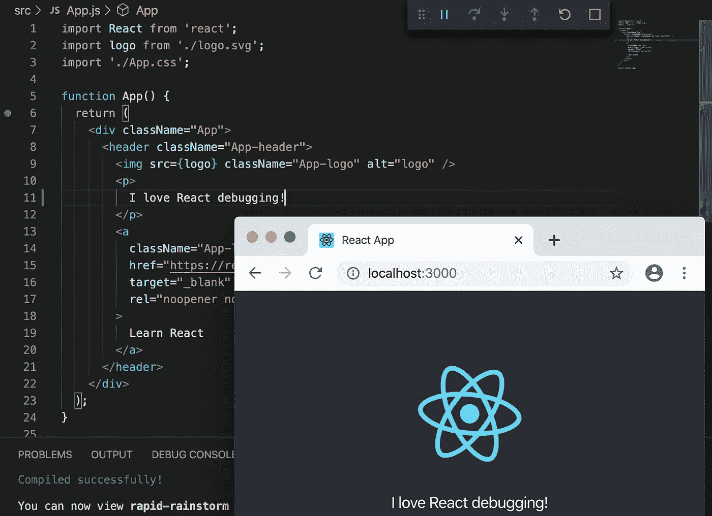
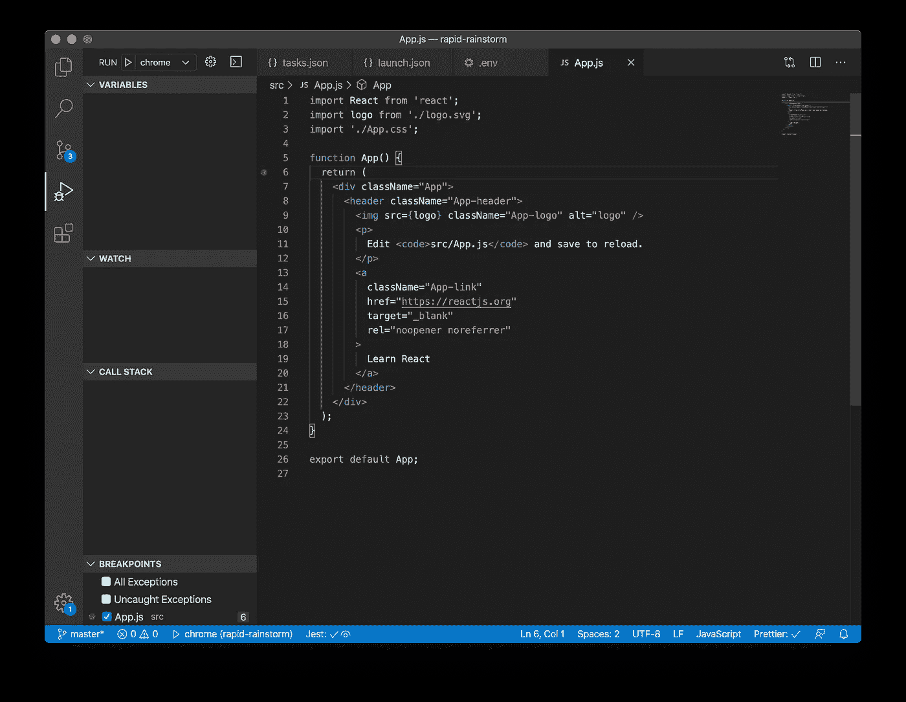
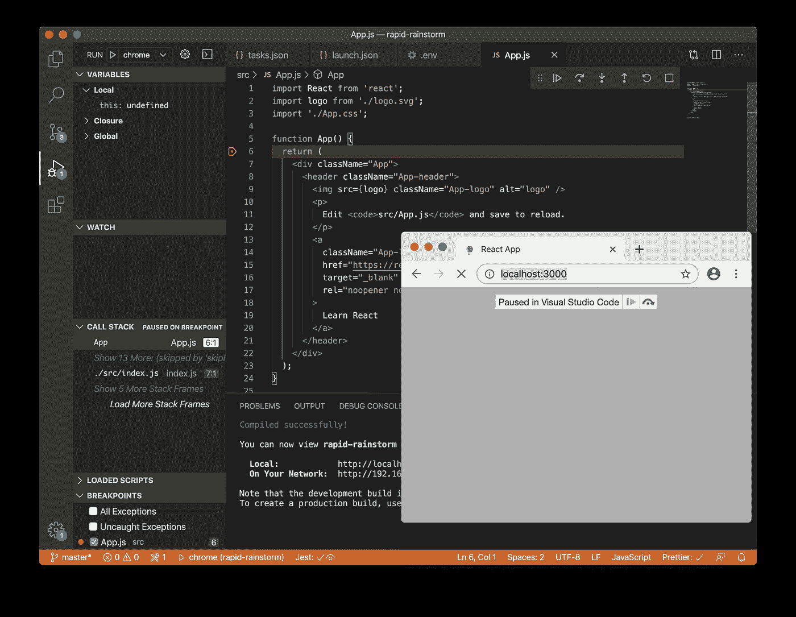
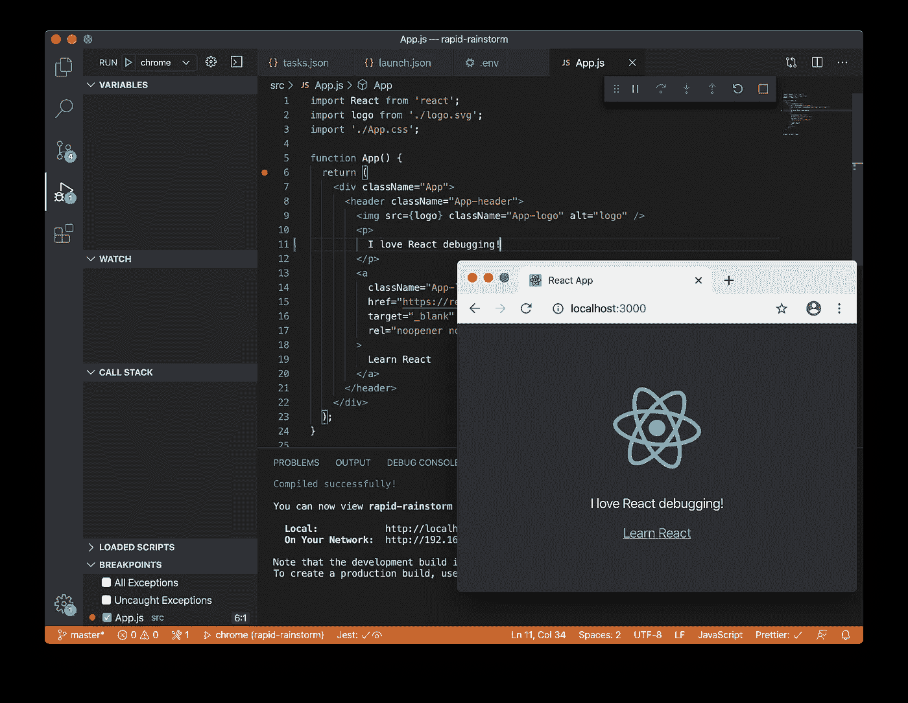

# 让您的 Create React 应用程序调试工作流程更上一层楼

> 原文：<https://betterprogramming.pub/take-your-create-react-app-debugging-workflow-to-the-next-level-9c40cd1904bd>

## 像专家一样调试 VS 代码



图片来源:作者

# 介绍

当然，您可以使用 web 浏览器提供的工具调试 React 应用程序。但是您知道您还可以使用文本编辑器调试 React 应用程序吗？如果您的文本编辑器是 Visual Studio 代码，则可以。

在本教程中，我将向您展示如何超越[文档](https://create-react-app.dev/docs/setting-up-your-editor#visual-studio-code)或[其他教程](https://code.visualstudio.com/docs/nodejs/reactjs-tutorial#_debugging-react)中介绍的基本 Visual Studio 代码调试配置，为使用 Create React App 生成的项目在 Visual Studio 代码中创建灵活的调试工作流。调试工作流将在您开始调试会话时启动 React 应用程序并启动 web 浏览器，并在您结束调试会话时停止应用程序。当应用程序运行时，只要编辑器中的文件发生更改，它就会自动在浏览器中重新加载，并且编辑器中的调试器断点会自动重新建立。

# 创建 React 应用

[Create React App](https://create-react-app.dev) 项目令人惊叹。它允许你快速建立自己的基于 [React](https://reactjs.org) 的项目，包括所有的附加功能:林挺、编译、捆绑和测试。该项目对前端 web 开发产生了巨大的影响。Create React App 为狂野的 JavaScript 生态系统带来秩序，为你选择一套工具，配置它们协同工作，并负责保持它们在更新中都能工作。

Create React App 我最喜欢的一个特性是，它生成的项目包括一个开发服务器，该服务器支持每当磁盘上的文件发生变化时自动重新加载所服务的站点——自动站点重新加载。

调试 web 应用程序的一种流行方式是使用 [Chrome](https://www.google.com/chrome/) 和 [Chrome DevTools](https://developers.google.com/web/tools/chrome-devtools) ，它们是 Chrome web 浏览器的一部分，包括一个交互式调试器和控制台，用于加载和运行应用程序。DevTools 很棒，但是如果你想在调试时修改代码——这是一个通过自动站点重载实现的工作流——你最终会在 DevTools 调试器和编辑器之间切换。

# Visual Studio 代码

[Visual Studio 代码](https://code.visualstudio.com)包括内置的[调试器](https://code.visualstudio.com/docs/editor/debugging)，安装了 Chrome 扩展的[调试器，可以连接 Chrome，远程调试浏览器中运行的 JavaScript 代码。这允许您在 Visual Studio 代码中设置断点、查看变量和运行控制台命令。](https://marketplace.visualstudio.com/items?itemName=msjsdiag.debugger-for-chrome)

在本教程中，您将使用 Chrome，但该工作流程也适用于 [Microsoft Edge](https://www.microsoft.com/edge) 和用于 Microsoft Edge 扩展的[调试器。](https://marketplace.visualstudio.com/items?itemName=msjsdiag.debugger-for-edge)

# 辅导的

现在你知道你在做什么，为什么要做，让我们开始吧。

## 1.生成新项目

通过运行以下命令生成一个新项目:

```
PROJECT=$(npx project-name-generator -o dashed)
npx create-react-app $PROJECT
cd $PROJECT
```

这将生成一个具有随机名称的项目。如果您已经有一个由 Create React App 生成的项目，您可以使用该项目。

## **2。在 Visual Studio 代码中安装 Chrome 调试器扩展**

您可以通过从 Visual Studio 代码中搜索来安装扩展，或者通过单击[Visual Studio market place](https://marketplace.visualstudio.com/vscode)的链接之一来安装。

**亲提示！**如果尚未安装，确保为您安装的调试器扩展安装相应的 web 浏览器。

在安装了扩展(和浏览器，如果需要的话)之后，您仍然需要告诉 Visual Studio 代码如何调试您的代码。首先，您将定义调试会话开始和结束时 Visual Studio 代码要运行的任务。然后，您将定义调试配置。在该配置中，您将连接您创建的任务，并且您将定义调试器将忽略的文件位置，以便您可以专注于调试您自己的代码而不是其他人的代码。

## 3.创建或更新`.vscode/tasks.json`

使用以下代码创建或更新`.vscode/tasks.json`:

**亲提示！如果您的工作区中还没有`.vscode`目录，您需要创建一个。**

第一个任务`debug-start"`被配置为在后台运行`npm start`，但是等待进入后台，直到它看到开发服务器打印出“您现在可以查看…”消息。问题匹配器被配置为不匹配任何消息，假设您已经以不同的方式将林挺集成到 Visual Studio 代码中。如果您确实想在 Visual Studio 代码的问题查看器中看到来自开发服务器的 lint 消息，那么这个项目可能会帮助您开始。

第二个任务，`debug-stop`，被配置为将`terminate`输入回显到 void 中，这本身似乎不是很有用。这是一些 Visual Studio 代码魔术，因为`terminate`输入正在做真正的工作。

在对`terminate`输入求值时，它会运行以`debug-start`为参数的`workbench.action.tasks.terminate`命令，这(正如您可能猜到的那样)会导致您上面定义的`debug-start`任务终止。您实际上并不关心回显运行命令的结果，您只需要命令运行，由于您不能在 Visual Studio 代码中直接将带有参数的命令作为任务运行，所以您求助于这种诡计。别担心，我不会把你的秘密告诉任何人。

## 4.创建或更新`.vscode/launch.json`

用以下内容创建或更新`.vscode/launch.json`:

**亲提示！**如果您使用 Edge 而不是 Chrome，将配置的名称和类型从`chrome`更改为`edge`。

在该配置中，`debug-start`和`debug-stop`任务分别被配置为`preLaunchTask`和`postDebugTask`。`url`已经被设置为开发服务器的默认 URL。最后，已经设置了`skipFiles`，以便调试器忽略 Node.js 本身的代码、由`node_modules`中的依赖项提供的代码以及由开发服务器生成的代码(`bootstrap`)。仍然可以在跳过的库代码中设置断点，但是这种设置将防止调试器意外地进入其他人的项目内部。

最后，因为您正在配置 Visual Studio 代码来启动浏览器，所以您将希望防止`npm start`在浏览器启动时也自动启动浏览器。

## 5.创建或更新。环境文件

用以下内容创建或更新`.env`文件:

```
BROWSER=none
```

这只是 Create React App 支持的众多[高级配置](https://create-react-app.dev/docs/advanced-configuration)设置之一。

# 游戏攻略

您现在可以调试您的应用程序了。如果您在教程开始时生成了一个新项目，那么您可以按照本演练进行操作。

在第 6 行的`src/App.js`中设置一个断点，方法是点击行号左侧的空白处:



Visual Studio 代码中第 6 行设置的断点

现在从运行菜单中选择开始调试。开发服务器启动，浏览器启动，执行在断点处停止:



在显示 Chrome 的 Visual Studio 代码中，执行在第 6 行暂停

单击“继续”按钮，查看站点渲染:


显示渲染应用程序的 Chrome

最后，通过替换文本来编辑`src/App.js`:

`Edit <code>src/App.js</code> and save to reload.`

配文:

`I love React debugging!`

保存文件，并看到页面在 Chrome 中自动重新加载，在 Visual Studio 代码中再次在断点处停止执行。再次单击 Continue 按钮，可以看到您的组件已经呈现了新的内容:



Chrome 显示更新的应用程序

这就完成了教程。通过按 Stop 按钮或关闭浏览器窗口来停止调试会话，注意开发服务器也会自动停止。

# 结论

在本教程中，您学习了如何为 Create React App 生成的项目启用高级调试工作流。我希望你玩得开心。编码快乐！

# 奖金配置文件

这里有一个`launch.json`文件，显示了 Edge、Chrome 和 Jest 的调试配置:

**亲提示！**这个配置依赖于本教程前面描述的`tasks.json`文件。

在这个文件中，`edge`和`chrome`配置是相同的，除了它们的名称和类型。`vscode-jest-tests`配置类似于 Create React App 的默认配置，复制自 [Jest](https://marketplace.visualstudio.com/items?itemName=Orta.vscode-jest) 扩展，增加了与其他配置相同的`skipFiles`。