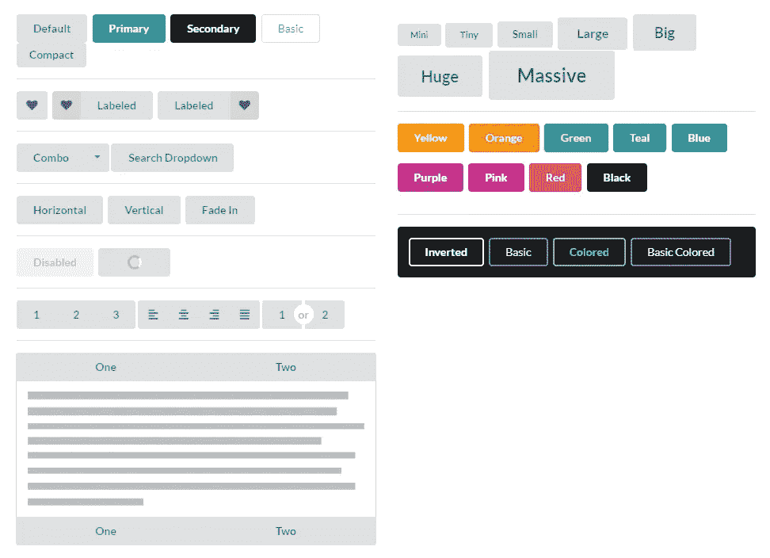
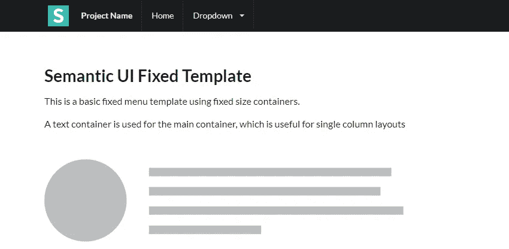
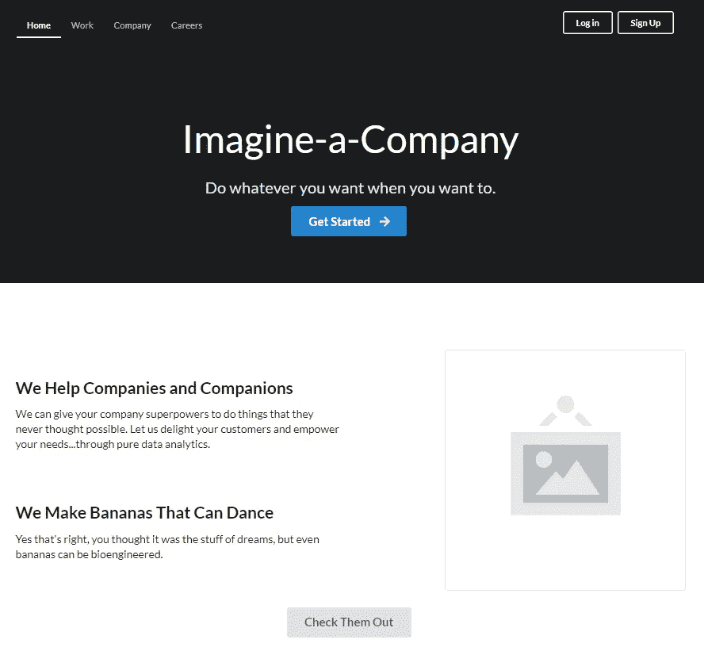
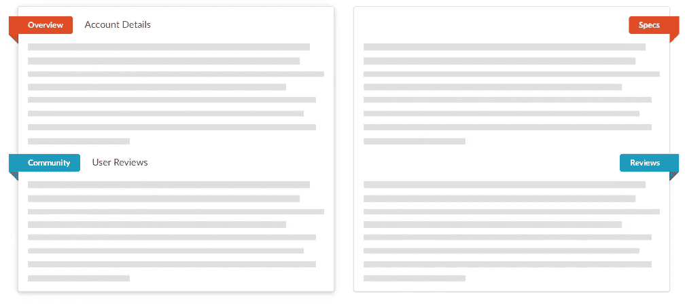

# 看看语义 UI:Bootstrap 的轻量级替代

> 原文：<https://betterprogramming.pub/taking-a-look-at-semantic-ui-a-lightweight-alternative-to-bootstrap-b4427b3843ff>

## 如果你喜欢极简主义和 GitHub 美学，看看吧

semantic-ui.com 的介绍横幅

很长一段时间以来，Bootstrap 一直是 CSS 框架的首选。它运行良好，有一套强大的组件，并让您快速建立网站。

它的网格系统多年来一直负责让开发人员轻松进入响应式设计实践，这种经验不断将他们带回未来的项目。

Bootstrap 也可能有点无聊——无论是写还是看。很多时候，你一眼就能看出一个网站是不是用 BS 写的，这就导致了互联网上的很多页面看起来有些一致。

最近我一直在做一些业余爱好项目，并决定不再使用 Bootstrap。

相反，我决定为每个项目使用一个替代的 CSS 框架——或者是通用的，或者是特定于我正在使用的 JS 框架的——这使我想到了[语义 UI](https://semantic-ui.com/) ，特别是它的 [React 实现](https://react.semantic-ui.com/)。

语义 UI 干净极简。我喜欢它 GitHub 风格的美感。最重要的是，它与 Bootstrap 有所不同，但又不太*不同——它有许多相同的概念(网格系统、相似的核心 UI 元素等)。).*

如果你厌倦了制作“仅仅是另一个引导网站”，看看语义 UI 提供了什么。

# 一目了然

首先，一些按钮。谁不爱纽扣！

彩虹的所有颜色

这是来自框架核心 UI 组件的展示。清晰、明了，但对于习惯使用 Bootstrap 的人来说仍然很熟悉。

现在，怎么样一些样本网站布局。首先，用一个简单的导航条:

非常典型的东西

第二，用更多的“英雄”布局:

我们以前都见过这样的网站

对于这些(和额外的)布局，还有一个展示区[。](https://semantic-ui.com/usage/layout.html)

这些示例涵盖了基础知识，应该会让您对框架的外观和感觉有一个很好的印象。现在，如果它引起了你的注意，我们可以深入了解它的主要特性，以及这个框架实际上是什么样子，以便使用。

# 核心组件

首先，它有一个强大的[网格系统](https://semantic-ui.com/examples/grid.html)这是[有据可查的](https://semantic-ui.com/collections/grid.html)。

Semantic 的系统使用 16 列基数(尽管这是可以改变的),而不是 Bootstrap 的 12 列基数。一旦学会了类语法，对于那些来自 BS 背景的人来说，使用起来就很容易和熟悉了。

它还拥有您所期望的所有其他核心组件:

*   小跟班
*   输入(不同类型)
*   卡片
*   情态动词
*   手风琴
*   [以此类推](https://semantic-ui.com/elements/button.html)(参考左边的列表)

它也有一些不错的 UI 亮点，比如[带状标签](https://semantic-ui.com/elements/label.html):

好别致！

我建议花时间去探索语义到底能提供什么。熟悉的概念，学习一些新的语法，你就能很快做出既实用又有视觉吸引力的东西。

# 下降趋势

由于语义的极简原则，它不像 Bootstrap 那样健壮。在使用它时，我很快发现一些“方便课”不见了。

例如，它有一个非常吸引人的调色板，我想将它的一种颜色应用到基本文本中，但发现开箱即用是不可能的。

GitHub 上有一个[问题，显示了对这样一个特性的大量需求，但不幸的是，框架的作者简单地排除了它。](https://github.com/Semantic-Org/Semantic-UI/issues/1885)

根据我在使用框架时对项目进行修补的经验，我决定，如果我将来要经常使用它，我可能要创建自己的一组支持便利类来填补这些空白——这很容易做到。

# 集成

它可以独立使用，但是我第一次使用这个框架是通过它的 React 实现，名为[语义 UI React](https://react.semantic-ui.com/) 。我发现它做事情的“反应方式”是:JSX 风格的组件和道具的使用。现在，当我用 React 做一些快速的事情时，它是我的首选。

它也有[其他一些集成](https://semantic-ui.com/introduction/integrations.html)，包括[流星](https://www.meteor.com/)和[成员](https://emberjs.com/)，有角度绑定“在开发中，但可用于一些组件”。

如果您想要 Bootstrap 的角形替代方案，我建议您查看 VMware 的 [Clarity Design](https://clarity.design/) 。

# 包扎

如果你想改变 Bootstrap，看看语义 UI 吧！做一个快速的项目来获得感觉，然后从那里开始。以下是帮助您入门的主要资源:

*   [主页](https://semantic-ui.com/)
*   [GitHub](https://github.com/Semantic-Org/Semantic-UI)
*   [GitHub (React)](https://github.com/Semantic-Org/Semantic-UI-React)
*   [UI 展示区](https://semantic-ui.com/examples/theming.html)
*   [布局示例](https://semantic-ui.com/usage/layout.html)
*   [单据](https://semantic-ui.com/introduction/getting-started.html)
*   [文档(反应)](https://react.semantic-ui.com/)

***更新:*** *语义 UI 最近在 GitHub 上有点不活跃，我听说过一个社区分支，如果你喜欢这个框架的话可能是一个更好的替代:*[【https://github.com/fomantic/Fomantic-UI】](https://github.com/fomantic/Fomantic-UI)