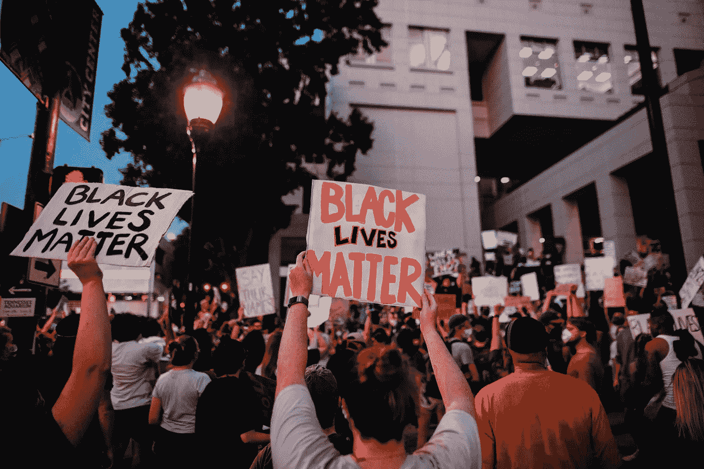
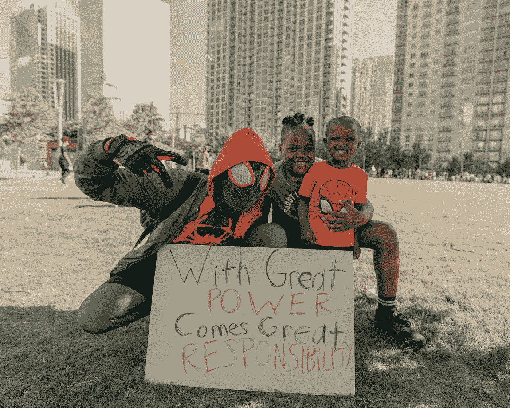

# 采取行动支持 STEM 中的黑人学生

> 原文：<https://betterprogramming.pub/taking-action-to-support-black-students-in-stem-37614fb10557>

## 一个有用的资源和行动列表，你可以在你的学校或大学采取支持黑人 STEM 学生

来自[佩克斯](https://www.pexels.com/photo/protesters-holding-signs-4552841/?utm_content=attributionCopyText&utm_medium=referral&utm_source=pexels)的[凯利·莱西](https://www.pexels.com/@kelly-lacy-1179532?utm_content=attributionCopyText&utm_medium=referral&utm_source=pexels)的照片

在花了一些时间反思我作为学校商业/技术社区的学生领袖为支持黑人社区所做的事情后，我意识到我做得还不够。大学的商业和技术俱乐部提供的最大优势是高年级学生、行业领袖和公司提供的开启职业生涯的机会。有才华的学生通过校园活动得到展示，但我不能证明总是有多样化的代表。更重要的是，虽然机会是存在的，*却没有一个全面的网站让 BIPOC 的学生找到这些资源并获得多样化的指导。*

我希望和其他人一起催化这种改变，从记录 STEM 中黑人学生的机会和资源开始。

# 数据说明了事实

[图像信用](https://www.cnbc.com/2020/06/12/six-years-into-diversity-reports-big-tech-has-made-little-progress.html)

数据显示了这个问题的极端性。一篇 OZY 文章指出:最近来自 Twitter、Google 和脸书的多样性报告发现不到 5%的公司技术人员认为自己是黑人。 由于种族偏见和经济差距等因素，这些低收入人群面临的不平等从学校开始，并持续到工作场所。

美国国家科学院最近的一份报告发现，导师制度对于扩大 STEM 的多样性至关重要。 公司、行业专业人士和大学必须积极努力培养多元化人才，并消除社区中的种族歧视。因为，你怎么能渴望成为一个在你的学校和行业中没有被充分代表的人呢？

我想指出的是，尽管在谷歌和 LinkedIn 上进行了令人厌倦的搜索，我还是努力找到了许多支持加拿大黑人学生的具体项目。出于这个原因，我首先讨论你和其他人可以采取的弥合差距的行动。然后向下滚动查看 STEM 中黑人学生的奖学金和资源列表。

# 你如何采取行动支持黑人学生？

*   了解黑人专业人士和学生所面临的情况。阅读个人分享的故事。反思你是否目睹了这些行为以及你的反应。一个消息来源是推特上的[#黑色象牙](https://twitter.com/hashtag/BlackintheIvory?src=hashtag_click&fbclid=IwAR1KQ53zz0K7t0yLqrSEkOzPbyk_We8Po1ZzMaSaaokUGDaK_XYjiBay9MY)。
*   **接触学生，提供指导。**无论你是一名成功的学生还是行业人士，在你的 LinkedIn 上分享一个日历链接，黑人学生可以在那里注册今年夏天的职业聊天。主动提出成为学生发展项目的导师。
*   **看看你自己工作场所的影响。**贵公司的产品是否无意中存在对个人的种族歧视？(阅读《洛杉矶时报》的这篇文章[可以获得更多关于这个话题的见解)。](https://www.latimes.com/business/technology/story/2020-06-02/tech-companies-with-police-contracts-and-poor-diversity-records-issue-statements-of-solidarity-with-george-floyd-protesters)
*   反思你公司的招聘实践。拥有多样化的工作场所[很重要](https://www.cultureamp.com/blog/diversity-in-the-workplace-benefits-and-challenges/)。你的招聘团队是多元化的吗？你如何改进招聘实践以促进多元化？你们是否提供奖学金/项目来鼓励代表性不足的学生从事 STEM 职业？
*   **向支持组织**捐款，以促进与黑人和代表性不足的 STEM 学生合作的项目和指导。我在下面补充了一些链接。

# 黑人学生资源

## 奖学金

[**2020 年 Quip 多样性奖学金**](https://corp.quip.com/blog/2020-quip-diversity-scholarship?q=1) **:** 面向 2020 年或以后毕业的美国或加拿大的本科生、硕士或博士，他们正在从事 STEM 职业。冠军:5000 美元，亚军:1000 美元，用于他们的教育。2020 年 6 月 24 日到期。

[**麦肯锡加拿大公司:黑人学生领袖奖**](https://jobs.mckinsey.com/careers/eventDetails?folderId=40265&rid=&appsource=&app2source=) **:** 授予自我认同为黑人的在校本科生/研究生。六个月的指导和 2500 美元。**2020 年 7 月 5 日到期。**

[**【BBPA 国家奖学金:**](https://bbpa.org/bbpa-scholarships/) 符合资格标准的加拿大黑人学生可获得各种奖学金，以支持其学业优异。**2020 年 7 月 12 日到期。**

[**2020 年 Telus 技术多样性奖学金**](https://telus.taleo.net/careersection/10000/jobdetail.ftl?job=ROL04348-20&lang=en&src=TECHSCH2020) **:** 学生进入加拿大大专院校技术领域学士学位或文凭项目的最后一年。5000 美元，特别活动，以及咨询他们的招聘团队。2020 年 7 月 31 日到期。

## 社区/组织

*   [**ColourStack**](https://www.colorstack.org/) :使命增加追求计算机科学和计算机科学相关专业的黑人和拉丁裔大学生的入学、留校和成功。
*   [**黑人女孩代码**](https://www.blackgirlscode.com/) **:** 通过社区外展计划，如讲习班和课后计划，他们向贫困女孩介绍基本的编程技能。**捐** [**此处**](https://www.blackgirlscode.com/donations.html) 。
*   [**代码化**](https://codenation.org/our-work/) **:** 让资源不足的高中学生掌握技能、经验和关系，共同创造技术职业的机会。**捐** [**此处**](https://codenation.org/donate/) 。
*   [**摄制组**](https://www.code-crew.org/) **:** 他们通过遍布孟菲斯的实用、动手的计算机科学教育项目，指导未被充分代表的年轻人成为技术创新者和领导者。**捐** [**此处**](https://codecrew.kindful.com/) **，或** [**志愿**](https://codenation.org/volunteers/) **。**

## 播客

*   [**Be The Code:**](https://podcasts.apple.com/us/podcast/be-the-code/id1197039467)**聚焦科技界最具影响力的黑人——从名人到金融家——以及他们如何以自己独特的视角重塑行业。**
*   **[**【Blk+】在研究生院**](https://www.blkingradschool.com/podcast) **:** 这是一个播客，旨在鼓励和激励有色人种进入并通过研究生院。**
*   ****黑人女孩代码面板:** [保障黑人女性在科技剧集中的未来](https://link.chtbl.com/BlackGirlsCode)**
*   ****黑人个人制作的 STEM 播客:** [播客列表](https://docs.google.com/document/d/1c-A-Y4-QUZKjZlou4mYe5EsomsX6YmUxOruogcDKJ00/edit)(凭证:随身电台)**

**感谢阅读。我知道我不能面面俱到。但我希望这能引发思考，引发变革对话，这些资源能帮助学生。请继续教育自己，采取行动反对种族主义。**

****

**[泥流:粘土层](https://unsplash.com/photos/ZnnLYJoh8I8)**