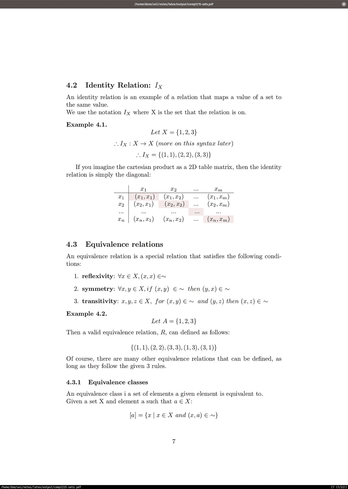
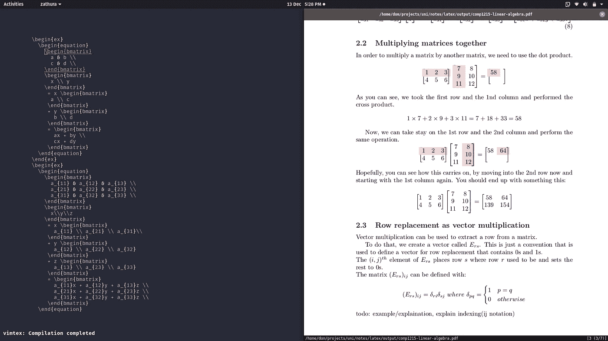
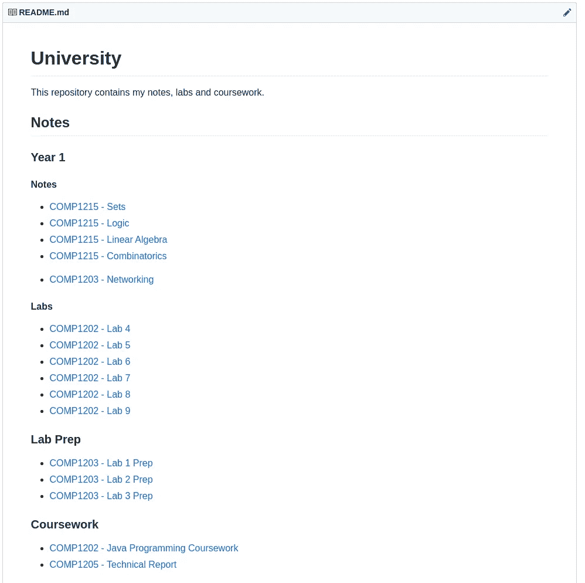

# 用乳胶做我的大学课程计算机科学笔记

> 原文：<https://betterprogramming.pub/taking-my-university-course-computer-science-notes-in-latex-7565875fdde7>

## 我如何使用带有 Linux、Vim 和 TeX Live/Pandoc 的 XPS 15 来记录高质量的笔记，这些笔记将永久保存



# 我的背景

我是英国南安普顿大学计算机科学专业的一年级学生。我不喜欢在纸上记笔记。对于我的 A-levels，我用我的 Note 8 和它的手写笔来记笔记。

我倾向于丢失我的纸质笔记或把东西洒在上面，导致我重写它们，这很快就会变得适得其反。

在笔记本电脑上写笔记让我可以随时随地访问它们。如果我忘记了什么，我也可以在五到十年后再去找他们，而不必用厚厚的文件夹保存旧的纸质笔记。我打字(每分钟 95+ wpm)比写作(每分钟大约 15)快得多。

在这学期开始的时候，我花了很多时间在互联网上，试图找到一个计算机科学学生做笔记的最佳解决方案，我想我最终找到了对我来说最好的解决方案。

# 乳胶和降价

我意识到我可以把我的笔记分成两个不同的类别；那些需要复杂的数学方程式/图形的，以及那些不需要的。

对于后者， [Markdown](https://daringfireball.net/projects/markdown/) 将是更好的选择，因为它也可以包含代码片段。然而，如果我们处理向量、更复杂的方程，或者只是想做一些文档对齐，那么 [LaTeX](https://www.latex-project.org/) 要好得多。

有许多编写 LaTeX 和 Markdown 的优秀解决方案可以为您完成所有设置，包括:

*   [引人注目的](https://notable.md)
*   [收纳盒纸](https://dropbox.com/paper)
*   欢迎留下任何其他选择的评论，我会确保将它们包括在列表中。

然而，在尝试了上述解决方案后，总是缺少一些东西；主题化、导出文件、离线支持和 LaTeX 块。

# 我的工作流程

为了用大量的数学和代数做笔记，但没有多少代码(如果有的话)，我使用 [TeX Live](https://www.tug.org/texlive/) 来编译我用 [Vim](https://www.vim.org/) 编写的 LaTeX 笔记，并使用 [Zathura](https://pwmt.org/projects/zathura/) 实时查看生成的 PDF。



在左边，你可以看到我的 [Neovim](https://neovim.io/) 编辑器设置，在右边，是 Zathura 中的 PDF 预览。

我目前用的是 [Pop！OS](https://system76.com/pop) 19.10(基于 Ubuntu)和 [GNOME](https://www.gnome.org/) 因为我发现 GNOME 3.34 和 Pop 的默认 [NVIDIA](https://www.nvidia.com/) 驱动程序和电池优化是目前我的笔记本电脑的最佳设置。

然而，具体的发行版/桌面环境在这里不应该有所不同，你应该能够在几乎任何 Linux 工作区上运行。

就减价笔记而言，我决定用 [Pandoc](https://pandoc.org/) ，它广受欢迎，简单且易于设置。


代码高亮显示是自动完成的，Neovim 中包含了许多智能标记功能，例如能够折叠部分内容和拼写检查。

您还可以制作一个自述文件，使您能够快速将笔记导航/分组到年份和模块中:



我喜欢将笔记编译成 pdf，有两个具体原因:

*   我们经常被要求打印文件，如我们的实验室准备(见上图)。
*   虽然我更喜欢在电脑上记笔记，但根据电脑笔记修改肯定没有在桌子上看着精心布置的纸质笔记方便。我只是发现当我复习纸上的笔记时，我会更有效率，所以当考试开始时，我会把这学期的笔记打印出来。


我用 Git 来备份我的笔记，并能够从任何设备上查看它们，甚至是我的手机。对于熟悉 Git 的开发人员来说，备份不可能比运行更简单:

```
git add .
git commit -m "comp1203: add ram notes"
git push
```

如果您想要在另一台电脑上同步备忘录，请使用:

```
git pull
```

通过这种方式，你永远不必依赖任何第三方笔记应用或某种云订阅。只要 GitHub 还在运行，你的笔记也会在那里。

这也使你和你的课程伙伴能够互相分享你的笔记，甚至合作并共享你的笔记。

在提交消息方面，我尽量坚持使用下面的模板，所以模块名称后面是提交类型(实验、课程、实验准备)和更改的简短描述:

```
git add Main.java
git commit -m "comp1202cw: fix part 2 unit tests"
```

*   `lab` —特定实验室的源代码
*   `cw` —课程作业
*   `prep` —实验室准备

# 安装/点文件配置

如果您还在这里，您可能想知道如何建立一个类似的环境。如果您以前使用过 Vim，并且运行的是 Linux，那么您很幸运。

对于 VS 代码用户，你可以查看[这个堆栈溢出线程](https://tex.stackexchange.com/questions/462365/how-to-use-latex-on-vs-code)而不是遵循 Vim 设置部分，但是我仍然建议你学习 Vim，它很容易使用，特别适合做笔记。

## 安装工具

首先，您需要安装以下软件:

```
sudo apt install neovim zathura zathura-pdf-poppler texlive-full git curl pandoc
```

请记住，`texlive`安装将需要一段时间，并占用几个 GB。

现在一切都安装好了，我们可以安装`vim-plug`，它将用于加载外部插件:

```
curl -fLo ~/.local/share/nvim/site/autoload/plug.vim --create-dirs [https://raw.githubusercontent.com/junegunn/vim-plug/master/plug.vim](https://raw.githubusercontent.com/junegunn/vim-plug/master/plug.vim)
```

现在你需要做的就是将配置文件移动到你的`init.vim`文件中:

```
mkdir ~/.config/nvim
cd $_
wget [https://gist.githubusercontent.com/d0minikt/c58150b034b21bdcfe9edced36e8145e/raw/7b207db3bb5cff9026b0dd856c721f7a5b1e1594/init.vim](https://gist.githubusercontent.com/d0minikt/c58150b034b21bdcfe9edced36e8145e/raw/7b207db3bb5cff9026b0dd856c721f7a5b1e1594/init.vim)
```

然后，只需运行`nvim`并安装提供的插件:

```
:PlugInstall
```

如果你想启用大填充和无行号的简单布局，使用`:Goyo`。

## 乳液

要编译 latex notes，打开任何有效的`.tex`文件并使用`\ll`来编译它并显示预览。然后，只要您保存文件，注释就会更新(`:w`)。

## 降价

要编辑降价记录，请按`F6`。每当您保存文件时，注释也应该重新编译(用`:w`)。确保通过在另一个标签中运行`zathura {{file}}.pdf`来打开 PDF。

感谢阅读！